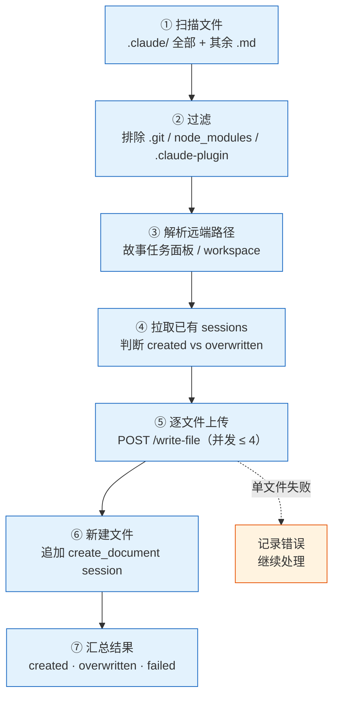
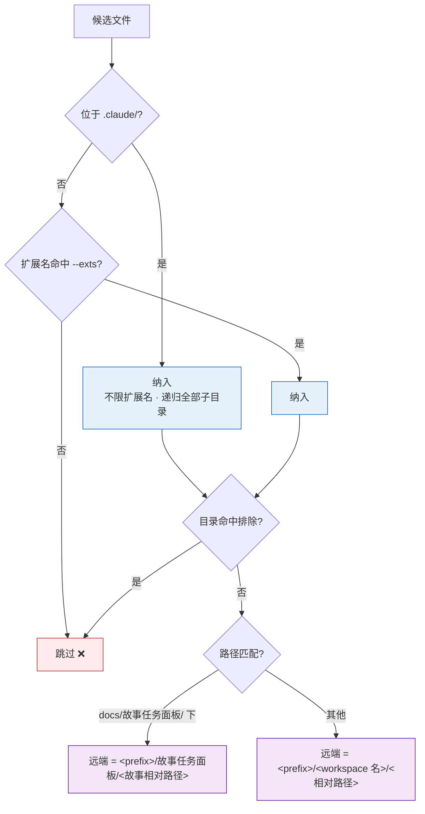
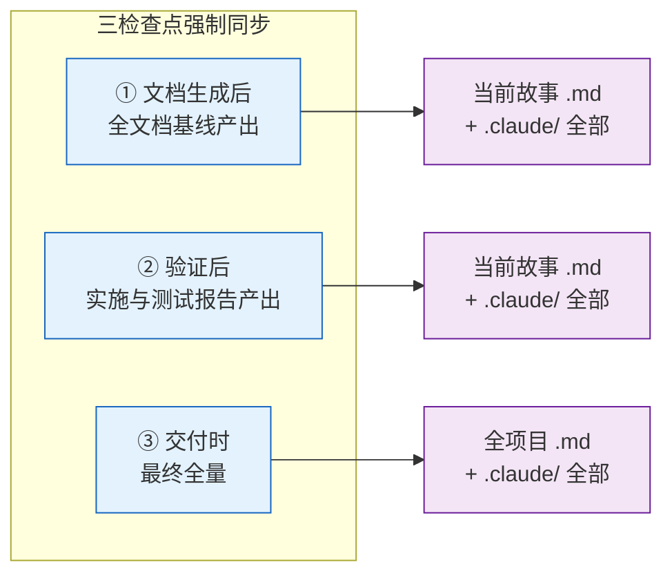
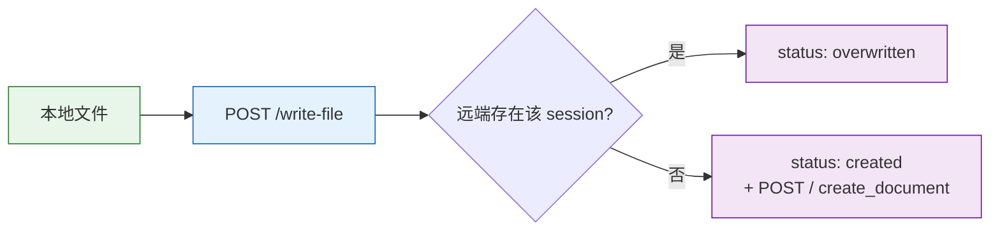
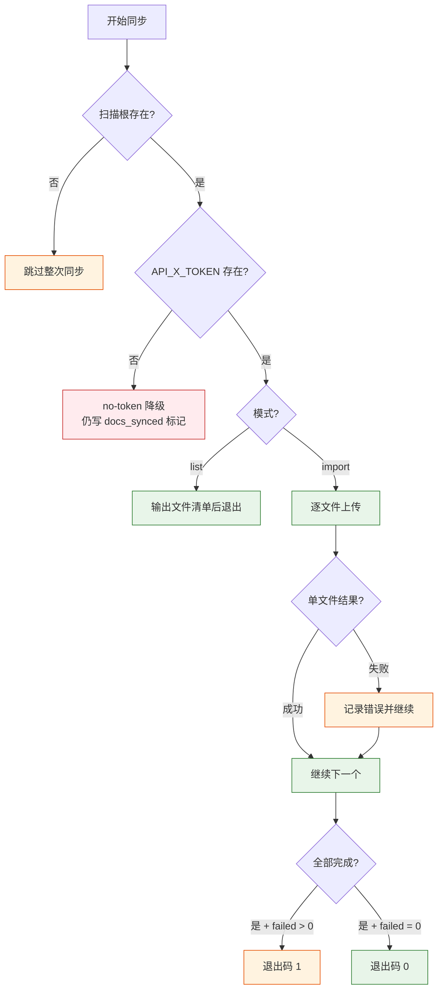
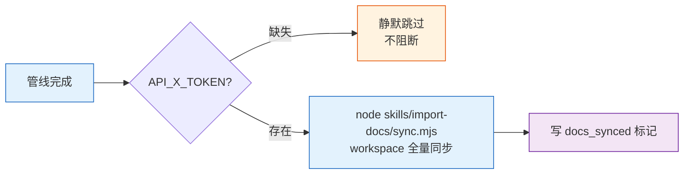
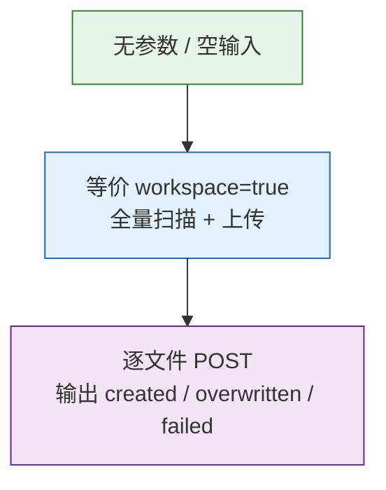

# import-docs

> **--help / -h**：执行 `node skills/import-docs/help.mjs` 输出完整帮助（含场景示例）。用户输入 `/import-docs --help` 或 `/import-docs -h` 或 `/import-docs help` 时，跳过逻辑，直接运行脚本。
>
> **可执行入口**：`node skills/import-docs/sync.mjs [options]` — 扫描 + 上传一体化。`--help` 查看选项。rui 交付管线步骤 ② 通过此脚本触发。

将 workspace 内文档批量同步到远端 API。行为规约（扫描/过滤/路径映射/API 契约）见下文，脚本是本规约的可执行实现。

## 工作流全景



| 阶段 | 动作 | 说明 |
|------|------|------|
| ① 扫描 | 从项目根递归遍历 | 不受 `.gitignore` 限制 |
| ② 过滤 | 排除 `.git` / `node_modules` / `.claude-plugin` 与显式 `--exclude` | 命中即跳过整个子树 |
| ③ 解析 | 计算本地→远端路径映射 | 路径分隔符统一为 `/`，空格替换为 `_` |
| ④ 拉取 | 远端 query sessions | 用于区分 `created` / `overwritten` |
| ⑤ 上传 | 逐文件 POST | 并发上限 4，存在覆盖、不存在新建 |
| ⑥ 新建 | 追加 `create_document` session | 仅对新增路径执行 |
| ⑦ 汇总 | 统计 created / overwritten / failed | 单文件失败不阻断 |

## 项目根定位

```
从 cwd 起逐级向上查找，遇到以下任一目录即视为项目根：
  - .git/
  - .claude/
找不到时回退为 cwd。
```

扫描根 = 显式 `--dir`（绝对路径）或项目根。

## 扫描规则



| 规则 | 说明 |
|------|------|
| `.claude/` 全量 | 不限扩展名，递归所有子目录 |
| 其他目录 | 仅扩展名命中 `--exts` 默认 `md` |
| 默认排除目录 | `.git` · `node_modules` · `.claude-plugin` |
| 用户排除 | `--exclude a,b,c` 追加排除子目录名（精确匹配，命中即整树跳过） |
| 路径规整 | 所有分隔符 → `/`，所有空白字符 → `_` |
| 故事面板路径 | 路径以 `docs/故事任务面板/` 开头时，远端 = `故事任务面板/<相对路径>`，一级标签 = 故事任务面板，去掉 `docs/` |
| workspace 标签 | 其他路径以项目根目录名（即 `workspace 名`）为一级标签 |
| **硬约束** | 一级目录标签只允许 **项目目录名称** 或 **故事任务面板**，禁止其他任何值。此约束适用于**所有调用**（rui 自动触发 · 手动 `/import-docs` · 脚本直接调用）。`prefix` 参数不得绕过，`resolveRemotePath` 结构化保证 |

## rui 强制触发

> 每次使用 rui 技能都必须触发 import-docs，这是管线完整性的硬性要求。



| 检查点 | 时机 | 范围 |
|--------|------|------|
| 文档生成后 | 全文档基线产出 | 当前故事目录 .md + .claude/ 全部 |
| 验证后 | 实施与测试报告产出 | 同上 |
| 交付时 | 最终全量 | 全项目 .md + .claude/ 全部 |

## 调用形态

> 本技能没有可执行入口，调用方按下表传入意图，执行规约定义的扫描 + 上传流程。

| 意图 | 输入 | 行为 |
|------|------|------|
| workspace 全量同步 | `workspace=true` | 项目根全量扫描 + 上传 |
| 单目录同步 | `dir=<absolute path>` | 指定目录扫描 + 上传，路径仍以项目根计算相对路径 |
| 自定义扩展名 | `exts=md,json,yaml` | 覆盖默认 `md` |
| 排除子目录 | `exclude=tmp,build` | 追加排除（与默认排除合并） |
| 远端前缀 | `prefix=a,b` | 在远端路径最前追加 `a/b/...` |
| 自定义 API | `apiUrl=https://api.example.com` | 覆盖默认 `https://api.effiy.cn` |
| 仅枚举不上传 | `mode=list` | 输出待上传文件清单，不发请求 |

| 默认值 | 取值 |
|--------|------|
| `apiUrl` | `https://api.effiy.cn` |
| `exts` | `['md']` |
| `prefix` | `[]`（空） |
| 并发度 | `4` |
| HTTP 超时 | `30s` |

## API 契约



### 通用请求头

| Header | 值 |
|--------|------|
| `Content-Type` | `application/json` |
| `Accept` | `application/json` |
| `X-Token` | `${API_X_TOKEN}`（仅来自环境变量） |

### 1. 拉取已有 sessions

```
POST <apiUrl>/
{
  "module_name": "services.database.data_service",
  "method_name": "query_documents",
  "parameters": { "cname": "sessions", "limit": 10000 }
}
```

响应中 `data.list[].file_path` 组成「已存在路径集合」。

### 2. 写文件

```
POST <apiUrl>/write-file
{
  "target_file": "<resolved remote path>",
  "content": "<utf-8 file content>",
  "is_base64": false
}
```

### 3. 读文件（pull 模式）

```
POST <apiUrl>/read-file
{
  "target_file": "<resolved remote path>"
}
```

响应中 `data.content` 或 `content` 为文件正文。

### 4. 新增 session（仅 created 路径）

```
POST <apiUrl>/
{
  "module_name": "services.database.data_service",
  "method_name": "create_document",
  "parameters": {
    "cname": "sessions",
    "data": {
      "url": "aicr-session://<timestamp>-<random>",
      "title": "<basename>",
      "file_path": "<resolved remote path>",
      "messages": [],
      "tags": [...path segments excluding basename],
      "isFavorite": false,
      "createdAt": <now ms>,
      "updatedAt": <now ms>,
      "lastAccessTime": <now ms>
    }
  }
}
```

## 错误模型



| 场景 | 处置 | 阻断? |
|------|------|-------|
| 扫描根目录不存在 | 跳过 | 否 |
| 单文件读取失败 | 记录错误，继续处理后续文件 | 否 |
| 单文件上传失败 | 记录错误，继续处理后续文件 | 否（最终退出码 1） |
| `API_X_TOKEN` 缺失 | 停止上传（`no-token` 降级） | ⚠️ 降级 |
| 网络超时 / 远端不可达 | 记录告警，不阻断管线 | 否 |
| Token 写入仓库 / 日志 / 文档 | 禁止 🚫 | P0 |
| 文件遍历 | 不受 `.gitignore` 限制 | — |

## hook 触发器

> 在 rui 管线末端被自动调用，行为等价于 workspace 全量同步。



| 触发 | 动作 | 降级 |
|------|------|------|
| rui 末端三步管线（步骤 ②） | `node skills/import-docs/sync.mjs` | `API_X_TOKEN` 缺失 → 静默跳过；网络失败 → 记录不阻断 |
| 直接调用 | `node skills/import-docs/sync.mjs workspace=true` 等 | 同上 |

## 空输入



空输入默认为 `workspace=true` 全量同步，等价于 `/import-docs workspace=true`。

## 生效标志


| 标志 | 未达标的处置 |
|------|------------|
| 扫描完整：.claude/ 全部 + 其余 .md | 补扫遗漏目录，重新执行 |
| 排除正确：.git / node_modules / .claude-plugin 已过滤 | 调整排除规则 |
| 路径映射：一级标签 ∈ {项目目录名, 故事任务面板} | 检查远端路径前缀，修正重传；禁止其他标签 |
| 上传完成：逐文件 POST 无遗漏 | 查看错误日志，补传失败文件 |
