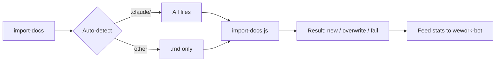

# import-docs

## 定位

文档导入 skill：自动检测导入来源 → 支持 `list` 枚举候选文件 → 执行导入 → 汇总结果供 `wework-bot` 填入真实数字。

## 何时使用

- 用户请求将文档同步/上传/发布/导入到远端
- `build-feature` 完成时的强制步骤
- 不触发的情况：仅本地 Markdown 生成/修改且用户明确不需要同步；目标仅为群通知（使用 `wework-bot`）

## 输入

| 参数 | 默认值 | 描述 |
|-----------|---------|-------------|
| `--dir` | 自动检测 | 导入目录 |
| `--exts` | 自动检测 | 逗号分隔的扩展名 |
| `--token` | 仅 `API_X_TOKEN` | **已禁用** CLI 参数，仅从系统环境变量读取 |
| `--api-url` | `https://api.effiy.cn` | API 地址 |
| `--prefix` | 空 | 远端路径前缀，逗号分隔 |
| `command` | `import` | `import` 导入文件；`list` 仅枚举 |

## 自动检测规则

- 在 `.claude` 下 → 导入 `.claude` 目录，所有文件
- 其他情况 → 导入项目根目录，仅 `.md` 文件
- 当 `--dir` 指向 `.claude` / `.cursor` 时，`exts` 默认为空（导入所有文件）

## 工作流程

1. 参数解析：从用户请求中提取目录、扩展名、前缀
2. 枚举候选（可选）：`node skills/import-docs/scripts/import-docs.js list`
3. 安全检查：回复中不展示 token
4. 执行导入：`node skills/import-docs/scripts/import-docs.js --dir docs --exts md`
5. 结果汇总：已找到文件数、新建 / 覆盖 / 失败计数
6. 返回通知摘要：`☁️ 文档同步：docs → 远端（新建 N，覆盖 N，失败 N）`

## 标准 docs 导入（由上游 skills 调用）

标准命令：`node skills/import-docs/scripts/import-docs.js --dir docs --exts md`

- 目录存在 → 执行导入，结果写入 wework-bot 通知
- 目录不存在 → 跳过，通知写入 `docs 不存在，跳过导入`
- 导入失败 → 不阻断主流程，注明失败数量
- `API_X_TOKEN` 缺失 → 记录"`API_X_TOKEN` 未检测到，可稍后手动同步"

## 约束

- 除非用户指定 `--dir` / `--exts`，否则默认自动检测
- 不得将 token 写入仓库文件、日志或文档
- 脚本会覆盖远端同路径文件
- 始终忽略 `.git`，不跟随符号链接

## 支持文件

- `rules/import-contract.md`：路径生成、去重、安全约束
- `scripts/import-docs.js`：CLI 实现
