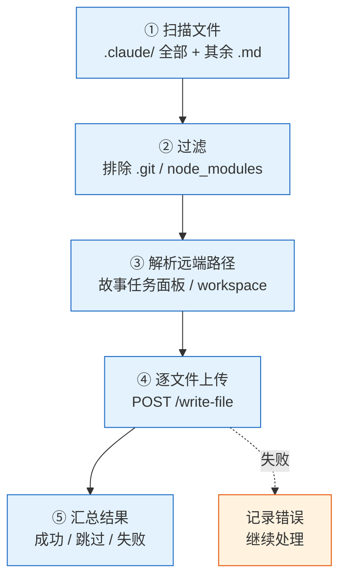
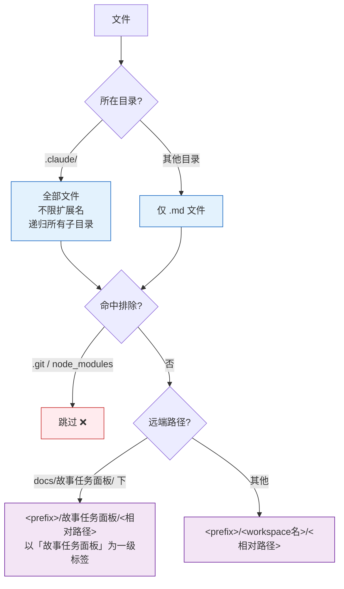
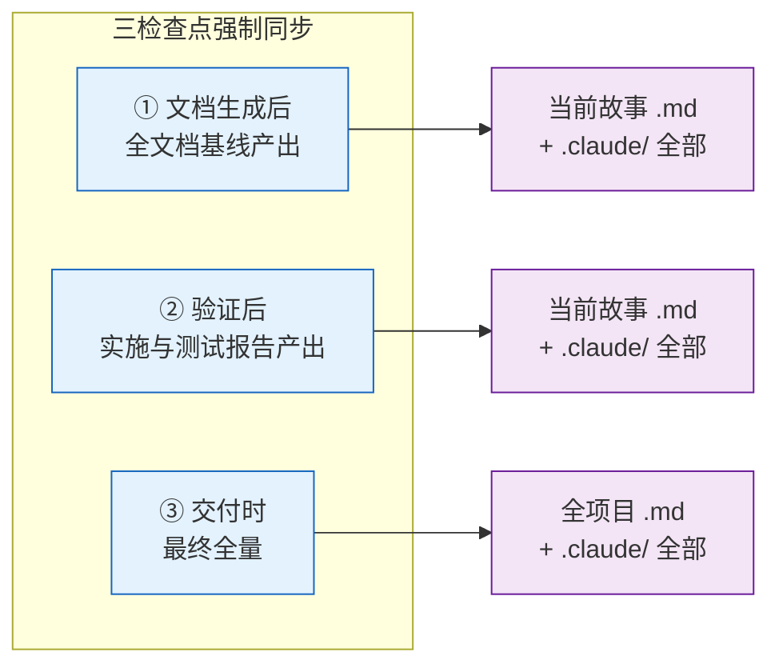
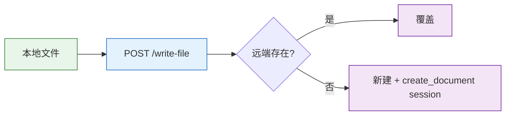
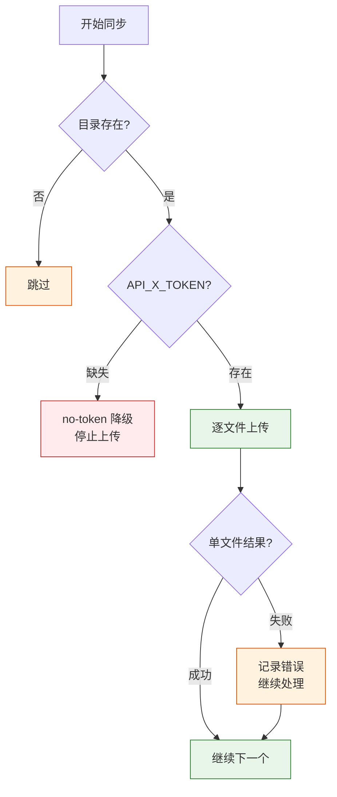
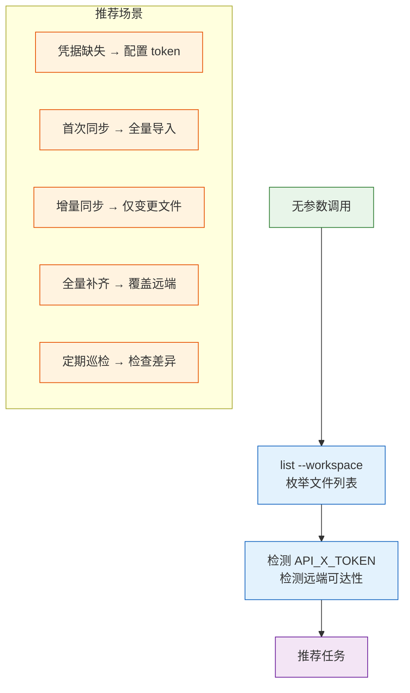
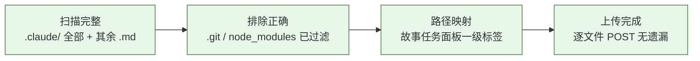

# import-docs

将 workspace 内文档批量同步到远端 API。

## 工作流全景



| 阶段 | 动作 | 说明 |
|------|------|------|
| ① 扫描 | 遍历 workspace 文件树 | 不受 .gitignore 限制 |
| ② 过滤 | 排除 .git / node_modules | 可追加 --exclude |
| ③ 解析 | 生成本地→远端路径映射 | 空格替换为 `_` |
| ④ 上传 | 逐文件 POST | 存在覆盖，不存在新建 |
| ⑤ 汇总 | 统计成功/跳过/失败 | 单文件失败不阻断 |

## 扫描规则



```
扫描范围:
  .claude/     → 全部文件（不限扩展名），递归子目录
  其余目录     → 仅 .md 文件
  排除        → .git · node_modules · --exclude 指定目录
  空格        → 替换为 _

远端路径:
  docs/故事任务面板/**  → <prefix>/故事任务面板/<相对路径>
  其他                  → <prefix>/<workspace名>/<相对路径>
```

## rui 强制触发

> 每次使用 rui 技能都必须触发 import-docs，这是管线完整性的硬性要求。



| 检查点 | 时机 | 范围 |
|--------|------|------|
| 文档生成后 | 全文档基线产出 | 当前故事目录 .md + .claude/ 全部 |
| 验证后 | 实施与测试报告产出 | 同上 |
| 交付时 | 最终全量 | 全项目 .md + .claude/ 全部 |

## 命令

```bash
# workspace 模式（rui 默认调用）
node ~/.claude/plugins/marketplaces/yry/skills/import-docs/scripts/import-docs.js --workspace

# 单目录 + 自定义扩展名
node ~/.claude/plugins/marketplaces/yry/skills/import-docs/scripts/import-docs.js --dir <path> --exts md,json,yaml

# 排除子目录
node ~/.claude/plugins/marketplaces/yry/skills/import-docs/scripts/import-docs.js --workspace --exclude tmp,build

# 仅枚举不导入
node ~/.claude/plugins/marketplaces/yry/skills/import-docs/scripts/import-docs.js list --workspace
```

| 参数 | 默认值 | 描述 |
|------|--------|------|
| `--workspace, -w` | — | workspace 扫描规则 |
| `--dir, -d <path>` | 自动检测 | 单目录导入 |
| `--exts, -e <csv>` | `md` | 扩展名过滤（逗号分隔） |
| `--exclude, -x <csv>` | — | 排除子目录 |
| `--prefix, -p <path>` | 空 | 远端路径前缀 |
| `--api-url, -a <url>` | `https://api.effiy.cn` | API 地址 |

## API 契约



逐文件 `POST /write-file`。远端已存在则覆盖，不存在则新建 + `create_document` session。

## 约束与错误处理



| 场景 | 处置 | 阻断? |
|------|------|-------|
| 目录不存在 | 跳过 | 否 |
| 单文件失败 | 记录错误，继续处理后续文件 | 否 |
| `API_X_TOKEN` 缺失 | 停止上传（`no-token` 降级） | ⚠️ 降级 |
| 网络超时 / 远端不可达 | 记录告警，不阻断管线 | 否 |
| Token 写入仓库/日志/文档 | 禁止 🚫 | P0 |
| 文件遍历 | 不受 `.gitignore` 限制 | — |

## 空输入



无参数时调用 `list --workspace` + 检测 `API_X_TOKEN` / 远端可达性 → 推荐任务，不执行导入。

## 生效标志



| 标志 | 未达标的处置 |
|------|------------|
| 扫描完整：.claude/ 全部 + 其余 .md | 补扫遗漏目录，重新执行 |
| 排除正确：.git / node_modules 已过滤 | 调整 --exclude 参数 |
| 路径映射：故事任务面板一级标签正确 | 检查远端路径前缀，修正重传 |
| 上传完成：逐文件 POST 无遗漏 | 查看错误日志，补传失败文件 |
