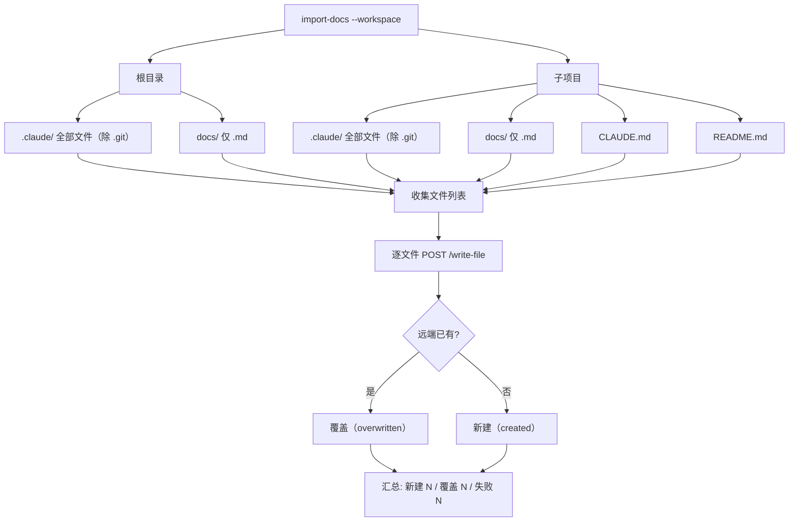
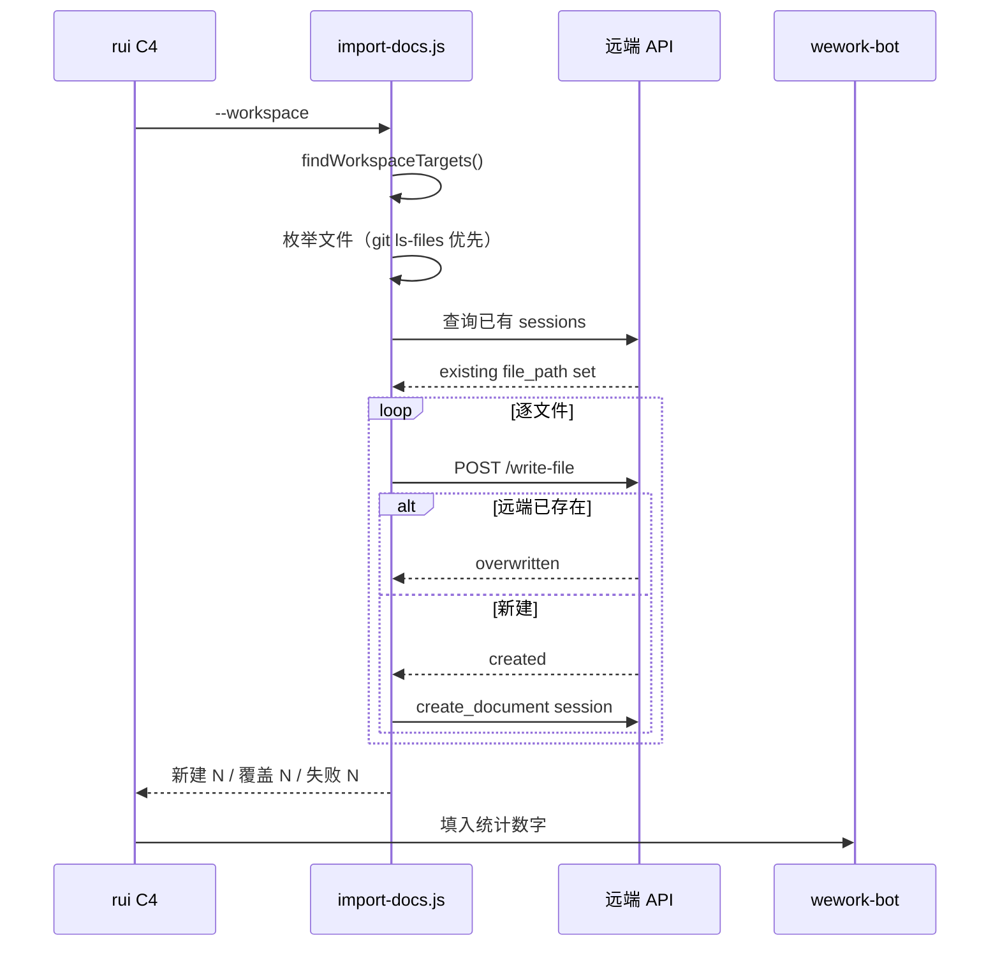

# import-docs

将 workspace 内的 `.claude/`、`docs/`、`CLAUDE.md`、`README.md` 批量同步到远端文档 API。rui C4 交付步骤 2。



---

## 工作区扫描规则

`--workspace` 模式自动检测 workspace 根目录（向上查找 `.git` 或 `.claude/` + 子项目特征），扫描以下目标：

| 层级 | 目标 | 范围 | 说明 |
|------|------|------|------|
| 根 | `.claude/` | 全部文件 | 除 `.git` 目录 |
| 根 | `docs/` | 仅 `.md` | 故事板、共享文档等 |
| 子项目 | `.claude/` | 全部文件 | 子项目级 .claude 配置，除 `.git` |
| 子项目 | `docs/` | 仅 `.md` | 子项目级文档 |
| 子项目 | `CLAUDE.md` | 单文件 | 子项目 AI 指令 |
| 子项目 | `README.md` | 单文件 | 子项目说明 |

**子项目判定**: 根目录下一级子目录，排除 `.` 开头（如 `.claude`、`.git`）、`_` 开头（如 `_archive`）、以及 `docs`（根文档目录）。

**远端路径**: `<prefix>/<workspace名>/<相对路径>`，空格替换为 `_`，目录结构与本地一致。

---

## 工作流



---

## 命令

```bash
# workspace 模式（rui 默认调用）
node skills/import-docs/scripts/import-docs.js --workspace

# 单目录模式
node skills/import-docs/scripts/import-docs.js --dir <path> [--exts md,json]

# 仅枚举（不导入）
node skills/import-docs/scripts/import-docs.js list --workspace
```

| 参数 | 默认值 | 描述 |
|------|--------|------|
| `--workspace` / `-w` | — | 按工作区扫描规则导入 |
| `--dir` / `-d` | 自动检测 | 单目录导入 |
| `--exts` / `-e` | 自动检测 | 扩展名过滤（逗号分隔） |
| `--prefix` / `-p` | 空 | 远端路径前缀 |
| `--api-url` / `-a` | `https://api.effiy.cn` | API 地址 |
| `command` | `import` | `import` 导入；`list` 仅枚举 |

**凭据**: `API_X_TOKEN` 仅从系统环境变量读取，不接受 CLI 参数或配置文件。

---

## 自动检测（非 workspace 模式）

- 当前目录在 `.claude` 下 → 导入 `.claude`，全部文件
- 其他情况 → 导入项目根目录，仅 `.md`
- `--dir` 指向 `.claude` / `.cursor` 时 → 全部文件
- 始终忽略 `.git` 和 `node_modules`，不跟随符号链接

---

## 约束

- 目录不存在 → 跳过并提示
- 单文件失败 → 记录错误，继续处理其余文件
- `failed > 0` → 非零退出
- `API_X_TOKEN` 缺失 → 停止，不尝试匿名导入（H9 降级）
- 不得将 token 写入仓库、日志或文档
- 文件遍历优先 `git ls-files`（遵循 `.gitignore`），回退到文件系统遍历

---

## 支持文件

- `scripts/import-docs.js`：CLI 实现
