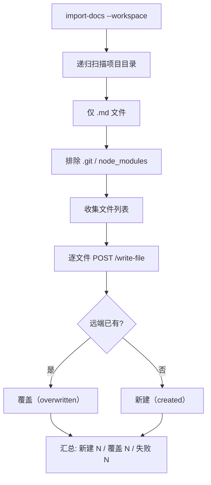
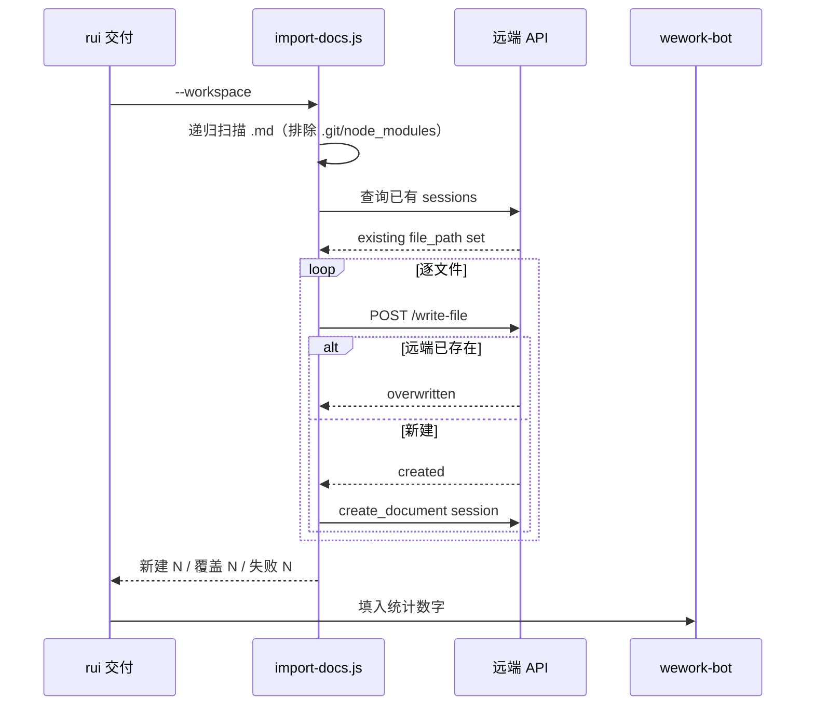

# import-docs

将 workspace 内所有 `.md` 文档（排除 `.git`、`node_modules`）批量同步到远端文档 API。rui 交付步骤 2。



---

## 扫描规则

`--workspace` 模式自动检测 workspace 根目录（向上查找 `.git` 或 `.claude/`），递归扫描项目目录下所有 `.md` 文件。

- **包含**: 项目根目录及所有子目录中的 `.md` 文件（文件系统遍历，不受 `.gitignore` 限制）
- **排除**: `.git`、`node_modules` 目录（不遍历）
- **远端路径**: `<prefix>/<workspace名>/<相对路径>`，空格替换为 `_`，目录结构与本地一致

---

## 工作流



---

## 命令

```bash
# workspace 模式（rui 默认调用）
node skills/import-docs/scripts/import-docs.js --workspace

# 单目录 + 自定义扩展名
node skills/import-docs/scripts/import-docs.js --dir <path> --exts md,json,yaml

# 排除特定子目录
node skills/import-docs/scripts/import-docs.js --workspace --exclude tmp,build

# 仅枚举（不导入）
node skills/import-docs/scripts/import-docs.js list --workspace
```

| 参数 | 默认值 | 描述 |
|------|--------|------|
| `--workspace` / `-w` | — | 按工作区扫描规则导入 |
| `--dir` / `-d` | 自动检测 | 单目录导入 |
| `--exts` / `-e` | `md` | 扩展名过滤（逗号分隔，不含点） |
| `--exclude` / `-x` | — | 排除的子目录（逗号分隔，workspace 和单目录模式均可用） |
| `--prefix` / `-p` | 空 | 远端路径前缀 |
| `--api-url` / `-a` | `https://api.effiy.cn` | API 地址 |
| `command` | `import` | `import` 导入；`list` 仅枚举 |

**凭据**: `API_X_TOKEN` 仅从系统环境变量读取，不接受 CLI 参数或配置文件。

---

## 自动检测（非 workspace 模式）

- 默认导入当前目录下所有 `.md` 文件
- 始终忽略 `.git` 和 `node_modules`，不跟随符号链接

---

## 约束

- 目录不存在 → 跳过并提示
- 单文件失败 → 记录错误，继续处理其余文件
- `failed > 0` → 非零退出
- `API_X_TOKEN` 缺失 → 停止，不尝试匿名导入（H9 降级）
- 不得将 token 写入仓库、日志或文档
- 文件遍历使用文件系统遍历，不受 `.gitignore` 限制

---

## 支持文件

- `scripts/import-docs.js`：CLI 实现
