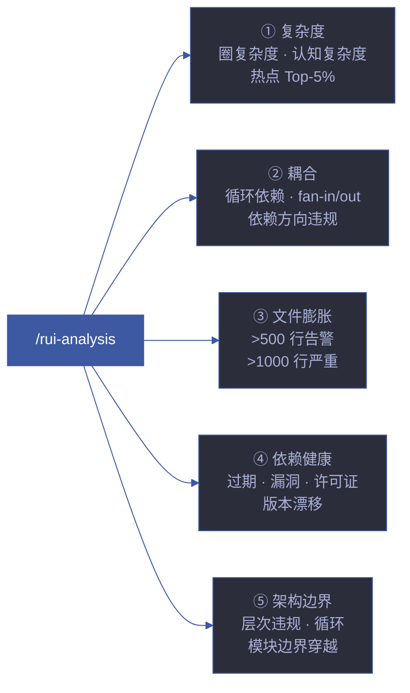
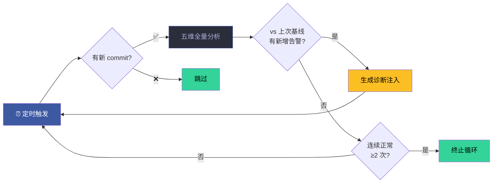

# rui-analysis

> 代码与架构静态分析。识别复杂度热点、耦合问题、文件膨胀、依赖退化和架构边界违规。
> 本技能为规约驱动（specification-only），由 implementing agent 通过 Read/Grep/Glob/Bash 执行分析。

[分析维度](#分析维度) · [命令](#命令) · [输出格式](#输出格式) · [严重级别](#严重级别) · [集成点](#集成点) · [核心规则](#核心规则) · [生效标志](#生效标志)



## 分析维度

### 1. 复杂度分析
- 圈复杂度（per-file, per-function）
- 认知复杂度（nesting depth, branching factor）
- 识别复杂度热点（top-5% 最复杂模块）

### 2. 耦合分析
- import/export 依赖图
- 循环依赖检测
- 扇入/扇出比（fan-in/fan-out ratio）
- 稳定性指标（instability = Ce / (Ca + Ce)）

### 3. 文件膨胀检测
- 超大文件（>500 lines → warning, >1000 lines → critical）
- 文件增长趋势（对比 git history）
- 职责过多的模块（god modules）

### 4. 依赖健康
- 外部依赖版本新鲜度（与 latest 对比）
- 依赖树深度（max depth from root）
- 未使用依赖检测

### 5. 架构边界检测
- 按目录结构的架构边界定义
- 跨边界依赖检测（dependency rule violations）
- 层次违规（e.g., utils/ importing from components/）

## 命令

| 命令 | 说明 |
|------|------|
| `/rui-analysis` | 全量分析，输出摘要报告 |
| `/rui-analysis complexity` | 仅复杂度分析 |
| `/rui-analysis coupling` | 仅耦合分析 |
| `/rui-analysis bloat` | 仅文件膨胀检测 |
| `/rui-analysis deps` | 仅依赖健康检查 |
| `/rui-analysis boundaries` | 仅架构边界检测 |
| `/rui-analysis --scope <path>` | 限定分析范围 |
| `/rui-analysis --format json` | JSON 输出（供管线消费） |

## 输出格式

```markdown
## rui-analysis 报告 — {YYYY-MM-DD HH:MM}

> 分析范围：{scope} | 文件数：{N} | 耗时：{duration}

### 摘要

| 维度 | 状态 | 关键发现 |
|------|------|---------|
| 复杂度 | ✅/⚠️/🚫 | {top finding} |
| 耦合 | ✅/⚠️/🚫 | {top finding} |
| 文件膨胀 | ✅/⚠️/🚫 | {top finding} |
| 依赖健康 | ✅/⚠️/🚫 | {top finding} |
| 架构边界 | ✅/⚠️/🚫 | {top finding} |

### 详情
{per-dimension detailed findings with severity, file paths, and recommendations}
```

## 严重级别

| 级别 | 标识 | 含义 | 示例 |
|------|------|------|------|
| Critical | 🚫 | 立即修复 | 循环依赖、安全漏洞依赖 |
| Warning | ⚠️ | 计划修复 | 文件 > 500 行、依赖版本过期 > 2 major |
| Info | ℹ️ | 记录观察 | 复杂度略高但可接受 |

## 集成点

| 集成场景 | 触发方 | 用途 |
|---------|--------|------|
| 自改进 D3 诊断 | self-improve agent | 复杂度增长检测 |
| 自改进 D5 诊断 | self-improve agent | 依赖退化检测 |
| 计划阶段 | planner | 文件结构映射输入 |
| 交付阶段 | reporter | 架构健康度报告 |

## 核心规则

| # | 规则 |
|---|------|
| 1 | 只读分析，不修改源码 |
| 2 | 分析结果必须有文件路径 + 行号证据 |
| 3 | JSON 输出格式稳定，供管线消费 |
| 4 | 不依赖外部 API（纯本地静态分析） |

## 生效标志

| 标志 | 验证方式 |
|------|---------|
| 五项维度全部覆盖 | 输出含 5 个维度的判定 |
| 每条发现附文件路径 | grep 输出含 file:line 格式 |
| JSON 输出可解析 | `--format json` 输出为合法 JSON |

## 支撑脚本

| 脚本 | 用途 |
|------|------|
| `scripts/extract-structure.mjs` | 基于 tree-sitter 的确定性结构提取，供 file-analyzer agent 使用 |

## 自循环

> 代码健康看门狗。Agent 可按间隔周期性扫描代码库，检测退化信号。

| 属性 | 值 |
|------|-----|
| 推荐间隔 | `0 8 * * 1,4`（周一/周四早 8 点） |
| 触发条件 | 最近 3 天有新 commit |
| 终止条件 | 连续 2 次无新增告警 / 全部维度正常 |
| 迭代动作 | 五维全量分析 → 与上次基线对比 → 有新增告警时生成 D3/D5 诊断 |
| 收敛判定 | 无新增 Critical/Warning 或已有告警均记录在案 |


