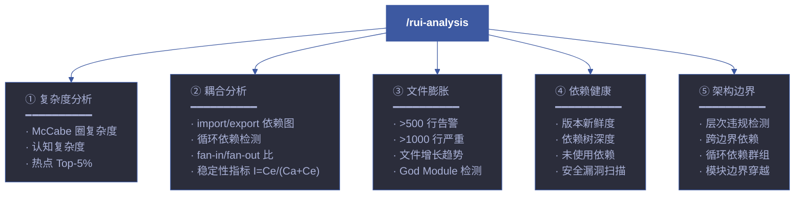
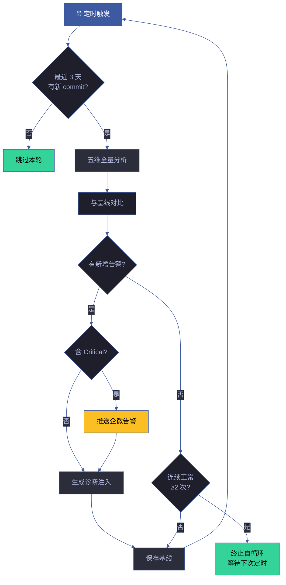
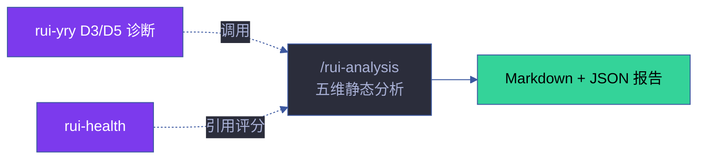

# rui-analysis

> 代码与架构静态分析。识别复杂度热点、耦合问题、文件膨胀、依赖退化和架构边界违规。
> 本技能为规约驱动（specification-only），由 implementing agent 通过 Read/Grep/Glob/Bash 执行分析。
>
> **单一职责**：代码逻辑质量分析。分析**代码本身**（复杂度、耦合方向、架构边界违规），不分析物理体积或可视化。物理体积分析和可视化 treemap 是 [rui-bundle-analyze](../rui-bundle-analyze/) 的职责。

[分析维度](#分析维度) · [分析方法论](#分析方法论) · [命令](#命令) · [输出格式](#输出格式) · [严重级别](#严重级别) · [集成点](#集成点) · [核心规则](#核心规则) · [生效标志](#生效标志) · [自循环](#自循环) · [与 rui-bundle-analyze 的分工](#与-rui-bundle-analyze-的分工)

## 分析全景



## 分析方法论

### 1. 复杂度分析

#### McCabe 圈复杂度

基于 Thomas McCabe (1976) 的图论度量：M = E − N + 2P，其中 E = 控制流边数，N = 节点数，P = 连通分量数。简化为 `分支点数 + 1`。

**计数策略**：每个 `if`/`else`/`switch`/`case`/`for`/`while`/`do`/`catch`/三元运算符/`&&`/`||` 计 1 个分支点。

| 复杂度等级 | M 范围 | 风险 | 建议 |
|-----------|--------|------|------|
| Simple | 1-5 | 低 | 健康 |
| Moderate | 6-10 | 中 | 可接受 |
| Complex | 11-20 | 高 | 考虑拆分 |
| Very Complex | 21-50 | 很高 | 需要重构 |
| Extreme | 50+ | 极高 | 必须拆分 |

**分析范围**：per-file 和 per-function 级别。对每个可识别函数计算独立 M 值，文件级 = 所有函数 M 值之和。

#### 认知复杂度

基于 SonarSource 认知复杂度模型，在圈复杂度基础上增加嵌套权重：

- 无嵌套：基本权重 1
- 每层嵌套递增：第 N 层权重 = N
- 逻辑运算符序列：连续 `&&`/`||` 每增加一个递增 1

**与圈复杂度的区别**：圈复杂度度量"有多少条路径"，认知复杂度度量"有多难理解"。两个 20 行函数 vs 一个 40 行函数，圈复杂度相同但认知复杂度不同。

#### 热点识别

1. 对每个文件/函数计算复杂度值
2. 按降序排列
3. 标记 Top-5% 为"复杂度热点"
4. 交叉分析：复杂度 × 变更频率 → 识别"腐烂热点"（高复杂度 + 高变更 = 最危险）

### 2. 耦合分析

#### 依赖图构建

```
算法：静态 import 解析 → 相对路径解析 → 有向图构建

复杂度：O(f × i) 解析，f = 可解析文件数，i = 人均 import 数
```

**解析模式**：静态 import、默认 import、副作用 import、动态 import、CommonJS require、re-export (`export { x } from`)、通配 re-export (`export * from`)、TypeScript type import。

#### 核心指标

| 指标 | 公式 | 含义 | 健康范围 |
|------|------|------|---------|
| **Fan-in (Ca)** | 入边计数 | 被多少模块依赖 | 高=核心模块，修改需谨慎 |
| **Fan-out (Ce)** | 出边计数 | 依赖多少模块 | 低=独立，高=God Module 风险 |
| **Instability (I)** | I = Ce / (Ca + Ce) | 不稳定性：0=完全稳定，1=完全不稳定 | 0.3-0.7 |
| **Abstractness (A)** | 抽象文件数 / 总文件数 | 抽象度 | 稳定包应高抽象 |
| **Distance (D)** | D = \|A + I - 1\| | 离主序列距离 | D < 0.3 |

#### 循环依赖检测

**算法**：基于 DFS 的 Johnson 变体 — 递归栈追踪 + 回溯路径记录。复杂度 O(V + E)。

1. 对有向图执行深度优先遍历
2. 维护 `visited` 集合和 `recStack` 集合（当前递归路径）
3. 遇到 `recStack` 中已存在的节点 → 记录完整环路径
4. 按环长度升序排列，输出 Top-20 个循环

#### 依赖方向分析

检查依赖方向是否符合架构分层预期：

```
✅ 合法: 上层 (Page) → 下层 (Util)
❌ 违规: 下层 (Util) → 上层 (Page)
```

| 违规类型 | 严重度 | 示例 |
|---------|--------|------|
| 相邻层反向 | 轻微 | `utils/` → `components/` (gap=1) |
| 跨层反向 | 严重 | `utils/` → `pages/` (gap>1) |
| 循环依赖 | 阻断 | A → B → C → A |

### 3. 文件膨胀检测

#### 检测规则

| 条件 | 级别 | 含义 |
|------|------|------|
| 文件 > 500 行 | ⚠️ Warning | 建议拆分为更小模块 |
| 文件 > 1000 行 | 🚫 Critical | 严重违反单一职责原则 |
| 函数 > 50 行 | ⚠️ Warning | 函数可能职责过多 |
| 函数 > 100 行 | 🚫 Critical | 几乎肯定需要拆分 |

#### God Module 检测

**God Module** = 同时满足以下条件的文件：
- 行数 > 500 或函数 > 20
- fan-out > 10（依赖过多模块）
- fan-in > 5（被多模块依赖）

God Module 是架构腐化的关键信号 — 修改风险高、理解成本高、测试困难。

#### 文件增长趋势

对比 git history 检测文件增长：

1. `git log --follow --format="%H %ai" -- <file>` 获取文件历史
2. 对比每个 commit 的文件行数
3. 计算增长率 = (当前行数 - N 天前行数) / N 天前行数
4. 标记增长率 > 50%/月的文件为"快速膨胀"

### 4. 依赖健康

#### 版本新鲜度

| 状态 | 条件 | 含义 |
|------|------|------|
| ✅ Current | 版本 = latest | 健康 |
| ⚠️ Minor Behind | 落后 1-2 个 minor | 建议更新 |
| ⚠️ Major Behind | 落后 1 个 major | 计划更新 |
| 🚫 Severely Outdated | 落后 ≥ 2 个 major | 安全风险 |

使用 `npm outdated --json` 或 `yarn outdated --json` 获取版本数据。

#### 依赖树深度

```
maxDepth = max(从根依赖到每个叶节点的边数)
```

- 深度 < 5：健康
- 深度 5-10：中等，关注关键路径
- 深度 > 10：依赖地狱风险，考虑扁平化

#### 未使用依赖检测

使用 `depcheck` 或静态 import 分析检测 `package.json` 中声明但未被 import 的依赖。

#### 安全漏洞扫描

```bash
npm audit --json
```

| 严重度 | 处置 |
|--------|------|
| Critical | 🚫 立即修复 |
| High | 🚫 本周修复 |
| Moderate | ⚠️ 计划修复 |
| Low | ℹ️ 记录观察 |

### 5. 架构边界检测

#### 边界定义

架构边界按目录结构定义：

```
skills/rui/        → 核心编排层
skills/rui-code/   → 源码实现层
skills/rui-html/   → 文档生成层
lib/               → 共享基础设施层
cdn/               → CDN 组件层
docs/              → 文档产出层
```

#### 违规检测矩阵

| 从 → 到 | 允许 | 违规条件 |
|---------|------|---------|
| 技能层 → lib/ | ✅ | — |
| 技能层 → 技能层 | ❌ | 除非通过 rui 编排器 |
| lib/ → 技能层 | ❌ | 基础设施不应依赖上层 |
| cdn/ → skills/ | ❌ | CDN 组件不应依赖技能 |
| 技能层 → cdn/ | ✅ | 技能可引用 CDN 组件 |

#### 检测算法

```
1. 扫描所有 import 语句
2. 解析 from 路径对应的目录归属
3. 查违规检测矩阵
4. 报告违规：from_file → to_file (from_layer → to_layer, severity)
```

## 命令

| 命令 | 说明 | 输出 |
|------|------|------|
| `/rui-analysis` | 全量分析，输出摘要报告 | Markdown 报告 |
| `/rui-analysis complexity` | 仅复杂度分析 | 复杂度热点排行 |
| `/rui-analysis coupling` | 仅耦合分析 | 依赖图 + 循环依赖 |
| `/rui-analysis bloat` | 仅文件膨胀检测 | 超大文件 + God Module |
| `/rui-analysis deps` | 仅依赖健康检查 | 版本漂移 + 漏洞 |
| `/rui-analysis boundaries` | 仅架构边界检测 | 违规列表 |
| `/rui-analysis --scope <path>` | 限定分析范围 | 聚焦指定目录 |
| `/rui-analysis --format json` | JSON 输出（供管线消费） | 结构化 JSON |
| `/rui-analysis --compare` | 与上次基线对比 | 变化摘要 |
| `/rui-analysis --save-baseline` | 保存为基线 | 后续对比用 |

## 输出格式

### Markdown 报告

```markdown
## rui-analysis 报告 — {YYYY-MM-DD HH:MM}

> 分析范围：{scope} | 文件数：{N} | 耗时：{duration}

### 综合评分

| 指标 | 分数 | 等级 | 趋势 |
|------|------|------|------|
| 复杂度健康度 | 85/100 | B | → 稳定 |
| 耦合健康度 | 90/100 | A | ↑ 改善 |
| 文件膨胀度 | 75/100 | B | ↓ 退化 |
| 依赖健康度 | 80/100 | B | → 稳定 |
| 架构合规度 | 95/100 | A | → 稳定 |
| **综合** | **85/100** | **B** | **→ 稳定** |

### 摘要

| 维度 | 状态 | 关键发现 |
|------|------|---------|
| 复杂度 | ✅/⚠️/🚫 | {top finding} |
| 耦合 | ✅/⚠️/🚫 | {top finding} |
| 文件膨胀 | ✅/⚠️/🚫 | {top finding} |
| 依赖健康 | ✅/⚠️/🚫 | {top finding} |
| 架构边界 | ✅/⚠️/🚫 | {top finding} |

### 详情

#### 复杂度热点 (Top-5%)
| 文件 | 圈复杂度 | 认知复杂度 | 行数 | 建议 |
|------|---------|-----------|------|------|

#### 循环依赖
| 环 | 长度 | 路径 | 严重度 |
|----|------|------|--------|

#### 超大文件
| 文件 | 行数 | 函数数 | 状态 |
|------|------|--------|------|

#### 依赖问题
| 依赖 | 当前版本 | 最新版本 | 落后 | 严重度 |
|------|---------|---------|------|--------|

#### 架构违规
| 违规 | 从 | 到 | 类型 | 严重度 |
|------|----|----|------|--------|
```

### JSON 输出

```json
{
  "meta": {
    "generatedAt": "2026-06-22 14:30:00",
    "scope": ".",
    "totalFiles": 500,
    "duration": "1.2s"
  },
  "scores": {
    "complexity": { "score": 85, "grade": "B", "trend": "stable" },
    "coupling": { "score": 90, "grade": "A", "trend": "improving" },
    "bloat": { "score": 75, "grade": "B", "trend": "declining" },
    "deps": { "score": 80, "grade": "B", "trend": "stable" },
    "boundaries": { "score": 95, "grade": "A", "trend": "stable" },
    "composite": { "score": 85, "grade": "B", "trend": "stable" }
  },
  "findings": {
    "complexityHotspots": [
      { "file": "lib/scoring.mjs", "mccabe": 45, "cognitive": 62, "lines": 320, "functions": 12 }
    ],
    "circularDeps": [
      { "cycle": ["a.mjs", "b.mjs", "a.mjs"], "length": 2, "severity": "warning" }
    ],
    "oversizedFiles": [
      { "file": "skills/rui-bundle-analyze/analyze.mjs", "lines": 2500, "functions": 85, "status": "critical" }
    ],
    "depIssues": [
      { "package": "lodash", "current": "4.17.15", "latest": "4.17.21", "behind": "2 minor", "severity": "warning" }
    ],
    "boundaryViolations": [
      { "from": "lib/fs.mjs", "to": "skills/rui-code/coder.mjs", "fromLayer": "lib", "toLayer": "skills", "severity": "critical" }
    ]
  },
  "recommendations": [
    { "priority": "P0", "category": "boundary", "file": "lib/fs.mjs", "action": "移除对 skills/ 的依赖" },
    { "priority": "P1", "category": "complexity", "file": "lib/scoring.mjs", "action": "拆分为 scoring/ 子模块" }
  ]
}
```

## 严重级别

| 级别 | 标识 | 含义 | 处置时限 | 示例 |
|------|------|------|---------|------|
| Critical | 🚫 | 立即修复 | 本迭代 | 循环依赖、安全漏洞依赖、架构边界严重违规 |
| Warning | ⚠️ | 计划修复 | 下迭代 | 文件 > 500 行、依赖版本过期 > 2 major、中度耦合 |
| Info | ℹ️ | 记录观察 | 无 | 复杂度略高但可接受、轻度过期 |

## 集成点

| 集成场景 | 触发方 | 数据流向 | 用途 |
|---------|--------|---------|------|
| **自改进 D3 诊断** | self-improve agent | 复杂度报告 → 评分卡 | 检测复杂度增长趋势，触发重构建议 |
| **自改进 D5 诊断** | self-improve agent | 依赖报告 → 退化评分 | 检测新增循环依赖、依赖版本漂移 |
| **计划阶段** | planner | 文件结构映射 + 耦合图 | 让开发者在规划前理解代码结构和风险点 |
| **交付阶段** | reporter | 架构健康度报告 | 交付时附带架构合规证明 |
| **健康检查** | rui-health | 五维评分 → 健康面板 | 复杂度/耦合/膨胀/依赖/边界纳入健康评分 |
| **CI 门禁** | CI pipeline | `--format json` → 阈值检查 | 新增 Critical 阻断、Warning 累积超阈值阻断 |
| **代码审查** | code-reviewer | 复杂度热点 + 架构违规 | 审查时重点关注标记文件 |

### 分析方法论形式化

> 五维分析共享统一的数据采集和评分框架。

#### 数据采集流水线

```
1. 文件发现 → Grep/Glob 扫描目标范围
2. 内容提取 → 逐文件读取 + 正则/启发式解析
3. 指标计算 → 各维度独立计算指标值
4. 阈值判定 → 对比预定义阈值，赋严重级别
5. 聚合评分 → 加权综合评分 + 趋势对比
```

#### 评分归一化

| 原始指标 | 归一化方法 | 输出范围 |
|---------|-----------|:---:|
| 圈复杂度 M | sigmoid(M, k=0.1, mid=10) × 100 | 0-100 |
| 文件行数 | min(100, L/10) | 0-100 |
| 循环依赖数 | max(0, 100 - C×20) | 0-100 |
| 依赖新鲜度 | 100 - days_behind × 2 | 0-100 |
| 架构违规 | 100 - violations × 10 | 0-100 |

#### 综合评分权重

```
综合 = 复杂度×0.30 + 耦合×0.25 + 膨胀×0.15 + 依赖×0.15 + 边界×0.15
```

| 权重分配理由 | 说明 |
|------------|------|
| 复杂度 30% | 直接影响 bug 密度和维护成本 |
| 耦合 25% | 影响变更影响面和架构可演化性 |
| 膨胀 15% | 间接信号，需结合其他维度 |
| 依赖 15% | 外部风险，可通过更新缓解 |
| 边界 15% | 架构约束，需人工判定辅助 |

## 核心规则

| # | 规则 | 设计理由 |
|---|------|---------|
| 1 | **只读分析**，不修改任何源码文件 | 安全第一，分析工具不应有副作用 |
| 2 | 分析结果必须有**文件路径 + 行号证据** | 可验证、可追溯、可复现 |
| 3 | JSON 输出格式**向后兼容**，字段只增不减 | 下游管线依赖稳定性 |
| 4 | 不依赖外部 API（**纯本地静态分析**） | 离线可用、无网络依赖 |
| 5 | 单文件分析失败**不阻断整体**，跳过继续 | 鲁棒性优于完整性 |
| 6 | 复杂度假定为**启发式近似**，非精确 AST 级 | 对识别重构候选足够，精度换取速度和零依赖 |

## 执行指南

> 本技能为规约驱动（specification-only），由 implementing agent 按以下指南执行分析。

### 工具链

| 分析维度 | 工具 | 命令示例 |
|---------|------|---------|
| 复杂度 | Grep 分支点计数 | `grep -cE '(if\|else\|for\|while\|switch\|catch\|\|\|\|&&)'` |
| 文件膨胀 | Bash wc | `wc -l **/*.mjs \| sort -rn \| head -20` |
| 循环依赖 | 人工追踪 import 链 | Grep `from` 语句 → 构建邻接表 → DFS 检测 |
| 依赖健康 | npm | `npm outdated --json` / `npm audit --json` |
| 架构边界 | Grep + 目录匹配 | Grep `import.*from` → 解析路径 → 查违规矩阵 |

### 执行顺序

```
1. 确定分析范围（--scope 或默认项目根）
2. 排除目录：node_modules/ .git/ dist/ build/ .memory/
3. 按维度顺序执行：复杂度 → 耦合 → 文件膨胀 → 依赖健康 → 架构边界
4. 每个维度独立评分，单维度失败不阻断其他维度
5. 汇总五维评分 → 生成报告 → 输出 Markdown 或 JSON
```

### 基线管理

```
首次运行: 保存基线 → .memory/analysis-baseline.json
后续运行: --compare → 对比当前 vs 基线 → 标注变化量和趋势
周期性: 每次自循环分析后更新基线
```


## 测试

> 五维静态分析结果的准确性验证、阈值逻辑和边界条件覆盖。

### 运行测试

```bash
npx vitest run skills/rui-analysis/tests/          # 全量运行
npx vitest skills/rui-analysis/tests/              # 监听模式
npx vitest run --coverage skills/rui-analysis/tests/  # 覆盖率报告
```

### 测试文件

| 文件 | 测试范围 | 类型 |
|------|---------|:---:|
| `tests/rui-analysis.test.mjs` | 五维分析算法、阈值判定、严重级别分类、输出格式 | 单元 |

### 测试策略

| 层级 | 范围 | 要求 |
|------|------|------|
| **算法测试** | McCabe 复杂度计算、认知复杂度嵌套权重、循环依赖检测 | 每个算法有已知输入的预期输出 |
| **阈值测试** | 严重级别边界值（如 500/1000 行边界） | 边界值 ±1 均需测试 |
| **输出格式测试** | Markdown 报告结构、JSON schema 完整性 | 向后兼容字段验证 |
| **降级测试** | 文件不可读、范围过大、无基线数据 | 每种降级路径有测试 |

### 覆盖要求

| 维度 | 最低阈值 | 目标 |
|------|:---:|:---:|
| 五维分析覆盖 | 100% | 每个维度有独立测试用例 |
| 严重级别判定 | 100% | 每个级别的边界值有测试 |
| 输出格式 | 100% | Markdown 和 JSON 两种格式 |
| 降级路径 | ≥ 80% | 每种降级情况有测试 |

## 降级策略

| 情况 | 降级行为 | 恢复方式 |
|------|---------|---------|
| 分析范围过大 | 采样分析 Top-200 文件，标注 `truncated` | 缩小范围或分批分析 |
| 文件不可读 | 跳过该文件，记录 `unreadable` | 检查文件权限 |
| 无基线数据 | 仅输出当前值，标注 `no-baseline` | 至少运行 2 次后启用趋势对比 |
| 分析超时 (>30s) | 返回部分结果，标注 `timeout` | 缩小分析范围 |
| 依赖图解析失败 | 跳过依赖分析维度，标注 `dep-parse-failed` | 检查 import 语法兼容性 |
## 规则

- [analysis-methodology.md](./rules/analysis-methodology.md) — 代码与架构静态分析的规则和方法
## 生效标志

| 标志 | 验证方式 | 预期行为 |
|------|---------|---------|
| 五项维度全部覆盖 | 输出含 5 个维度的判定 | 每维度至少 1 条发现 |
| 每条发现附文件路径 | grep 输出含 `file:line` 格式 | 可追溯至具体代码位置 |
| JSON 输出可解析 | `--format json` 输出为合法 JSON | `jq .scores.composite` 返回数字 |
| 严重级别正确分类 | 检查 Critical/Warning/Info 的触发条件 | 无漏报或误报 |
| 基线对比生效 | `--compare` 在有基线时运行 | 报告中显示变化量和趋势 |

## 支撑脚本

| 脚本 | 用途 |
|------|------|
| `scripts/extract-structure.mjs` | 基于 tree-sitter 的确定性结构提取，供 file-analyzer agent 使用 |

## 自循环

> 代码健康看门狗。Agent 可按间隔周期性扫描代码库，检测退化信号。

| 属性 | 值 |
|------|-----|
| 推荐间隔 | `0 8 * * 1,4`（周一/周四早 8 点） |
| 快速模式 | `0 */12 * * *`（每 12 小时，活跃开发期） |
| 触发条件 | 最近 3 天有新 commit（`git log --since="3 days ago" --oneline` 非空） |
| 终止条件 | 连续 2 次无新增告警 / 全部维度正常 |
| 迭代动作 | ① 五维全量分析 → ② 与上次基线对比 → ③ 有新增告警时生成 D3/D5 诊断注入 → ④ 推送通知（如有 Critical）→ ⑤ 保存基线 |
| 告警条件 | 新增复杂度热点 / 新增循环依赖 / 文件膨胀 > 20% / 新增 Critical 漏洞 / 新增架构违规 |
| 收敛判定 | 无新增 Critical/Warning 或已有告警均记录在案且无恶化 |

### 自循环工作流



### 与 rui-bundle-analyze 的分工

| 维度 | rui-analysis | rui-bundle-analyze |
|------|-------------|-------------------|
| **分析粒度** | 代码逻辑质量（复杂度、耦合） | 物理结构（体积、依赖拓扑） |
| **输出形式** | Markdown 报告 + JSON | 交互式 HTML treemap + 图谱 |
| **复杂度分析** | ✅ McCabe + 认知复杂度 | ✅ 基于正则的估算 |
| **依赖分析** | 循环依赖 + 方向违规 | 完整依赖图谱 + 传递依赖 |
| **体积分析** | 文件膨胀检测 | ✅ squarified treemap |
| **架构分析** | 边界违规检测 | 分层检测 + 包度量 (I/A/D) |
| **趋势追踪** | 基线对比 | 基线对比 + JSONL 持久化 |
| **适用场景** | 代码审查、质量门禁 | 项目结构理解、体积看门狗 |

> 本技能 `checkMode: "slash"`——无独立 CLI，由 `/rui-analysis` 在 Claude Code 会话内触发。6 字段契约与调度规则详见 [rules/loop-engineering.md](../rui/rules/loop-engineering.md)。

## 与 rui 的关系

`/rui-analysis` 是独立于 rui 编排管线的静态分析技能。由 rui-yry 自改进闭环的 D3/D5 诊断调用，也被 rui-health 引用五维评分。不参与故事管线，但被编排器的 plan（文件结构映射）和 code-reviewer（复杂度热点）阶段消费。

