# rui-bot

> **--help / -h**：执行 `node skills/rui-bot/help.mjs` 输出完整帮助（含消息格式 + 场景示例）。用户输入 `/rui-bot --help` 或 `/rui-bot -h` 或 `/rui-bot help` 时，跳过逻辑，直接运行脚本。

企业微信机器人通知。支持手动触发 + 自动触发（cron 轮询 + 健康报告定时生成 + 自循环报告汇总推送）。通过 `send.mjs` 发送通知或追加日志。

**可执行入口**: `node skills/rui-bot/send.mjs [options]` — 发送通知或健康检查。`--no-send` 仅追加日志不发 HTTP。

**单一职责**：消息推送与通知队列管理。不负责健康诊断（[rui-health](../rui-health/)），不负责自循环报告生成逻辑（委托各技能自行产出报告，rui-bot 仅负责汇总推送）。

**自动触发机制**：

| 触发方式 | 间隔 | 动作 |
|---------|------|------|
| 通知队列轮询 | 每小时 :07 | 扫描待发通知 → 批量推送 → 更新发送状态 |
| 健康报告自动生成 | 每小时 :17 | `send.mjs health --html` → `docs/健康报告/` + 更新索引 |
| 失败队列重试 | 每 30 分钟 | `send.mjs flush` — 重试 `send-failed.json` 中的失败条目 |
| 健康趋势持久化 | 每次健康检查后 | 追加 `.memory/health-trend.jsonl` |

[工作流全景](#工作流全景) · [调用形态](#调用形态) · [消息格式](#消息格式) · [消息通知列表](#消息通知列表) · [API 契约](#api-契约) · [安全](#安全) · [空输入](#空输入) · [生效标志](#生效标志)

## 工作流全景

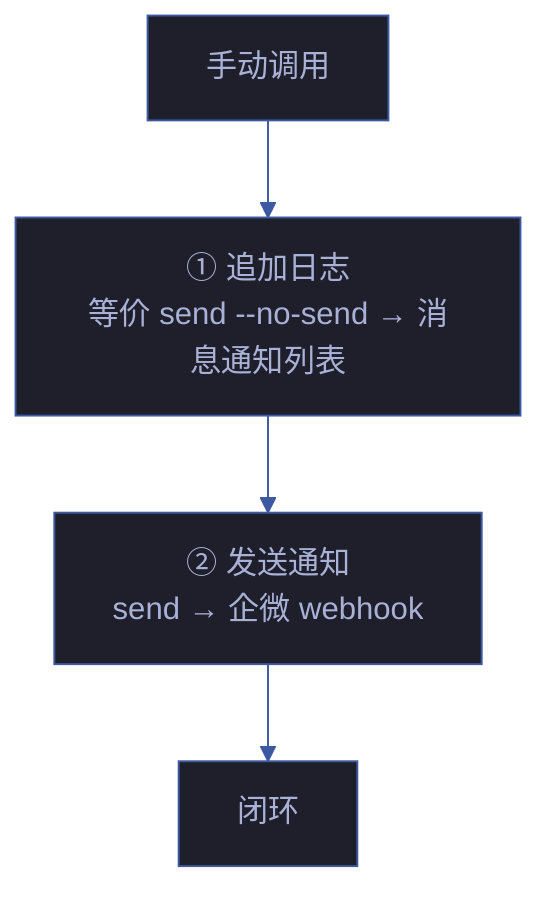

| 步骤 | 操作 | 说明 |
|------|------|------|
| ① 追加日志 | `send --no-send` 等价行为 | 写入 `消息通知列表.md`，不发 HTTP |
| ② 发送通知 | `send` 等价行为 | POST 企微 webhook |

## 调用形态

> 本技能没有可执行入口，调用方按下表传入参数，执行规约定义的发送/日志流程。

### 路由 / 内容 / 标识 / 模式

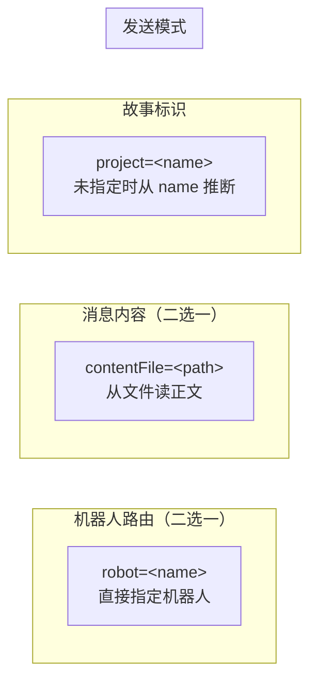

| 参数 | 描述 | 默认 / 推断 |
|------|------|---------|
| `agent=<name>` | 通过内置 agents 映射路由（推荐） | — |
| `robot=<name>` | 直接指定机器人 | — |
| `project=<name>` | 项目名，作为消息首行 `【项目名】` | 从 `name` 推断；无 `name` 时取 `basename(项目根)` |
| `name=<Project-story>` | 故事全名，分解为 `<story>/` 日志路径 | — |
| `content=<text>` | 消息正文 | — |
| `contentFile=<path>` | 从文件读正文（相对路径基于项目根） | — |
| `apiUrl=<url>` | 通知网关地址 | `WEWORK_BOT_API_URL` 或默认 `https://api.effiy.cn/wework/send-message` |
| `noSend=true` | 仅追加日志，不发送 HTTP | `false` |

| 环境变量 | 说明 |
|---------|------|
| `API_X_TOKEN` | 必填，仅从环境变量读取 |
| `WEWORK_BOT_API_URL` | 可选，覆盖默认 `api_url` |
| `<robot>.webhook_url_env` 指定的变量 | 优先于 `webhook_url` 字面量 |

### 故事名解析

```
name = "<story>"   # kebab-case 的故事名
  → 日志路径 = docs/故事任务面板/<story>/消息通知列表.md
```

### 内置配置

以下配置已内嵌于技能文档，无需外部 `config.json`：

| 配置项 | 默认值 | 覆盖方式 |
|--------|--------|---------|
| `api_url` | `https://api.effiy.cn/wework/send-message` | `WEWORK_BOT_API_URL` 环境变量或 `apiUrl` 参数 |
| `default_robot` | `general` | `robot` 参数 |
| `agents.rui` | `general` | `robot` 参数 |
| `robots.general.webhook_url` | （空） | 环境变量注入 |

机器人解析优先级：`robot` 参数 > `agents[agent]` > `default_robot`（`general`）。
webhook URL 解析优先级：环境变量 > `robots[robot].webhook_url` > 默认空值。
真实 webhook URL 应通过环境变量注入，禁止写入文档或提交仓库。

## 消息格式

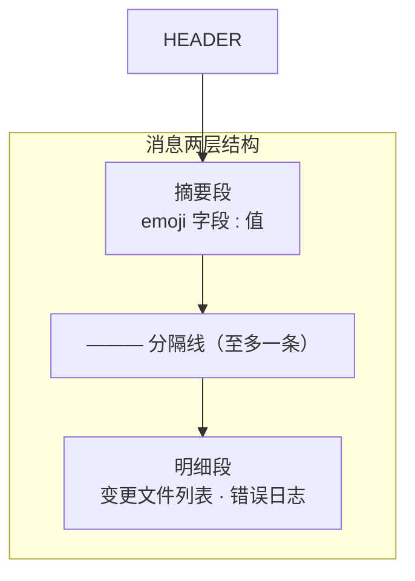

纯文本分行，emoji 前缀 + `:` 分隔。禁用 markdown。

### 必含字段（按场景）

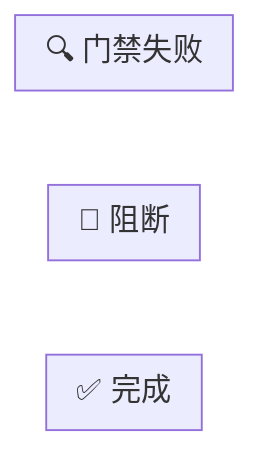

| 场景 | 必含字段 | 特有字段 |
|------|---------|---------|
| 完成 | 🤖技能 📋命令 🎯结论 📝描述 📌范围 🌐影响 📎证据 ⏱️会话 | 👉下一步 |
| 阻断 | 🤖技能 📋命令 🎯结论 📝描述 📌范围 🌐影响 📎证据 ⏱️会话 | ❌原因 🧭恢复点 |
| 门禁失败 | 🤖技能 📋命令 🎯结论 📝描述 📌范围 🌐影响 📎证据 ⏱️会话 | 🔍门禁 📊结果 |
| 进度 | 🤖技能 📋命令 🎯结论 📝描述 ⏱️会话 | 📊进度条 🔢阶段 📈完成数 |

### 进度场景 (progress)

用于管线执行中的阶段性进度通知：

```
【YiWeb】
🤖 技能: rui
📋 命令: /rui doc user-login
🎯 结论: 进行中 user-login 架构图生成阶段
📝 描述: 为登录模块生成架构图，已通过 Gate A 测试设计
📊 进度: ████████░░ 80% (4/5)
🔢 阶段: 3/5 — 架构图生成
📈 完成: 3 场景已完成 (场景-1 ✅ · 场景-2 ✅ · 场景-3 ✅)
⏱️ 会话: 2026-06-10 | 2 agents 参与
```

### 增强格式选项

| 参数 | 效果 |
|------|------|
| `--rich` | 启用富格式：进度条 + 阶段指示器 + P0 计数 + 时间统计 |
| `--verbose` | 追加诊断块：D0-D8 摘要（一行一个）+ 文件变更统计 + 测试通过/失败概要 |
| `--progress` | 快捷设置 `--status=progress`，自动计算进度百分比 |

### 格式约束

| # | 规则 | 反例 |
|---|------|------|
| 1 | 每行一个字段，emoji 后 `:` 分隔 | 同一行堆叠多个字段 |
| 2 | 分隔线仅用 `———`，至多一条 | 用 `---` 或 `***` 分隔 |
| 3 | 数字来自执行结果，禁止占位符 | `⏱️ 会话: {duration}` |
| 4 | 全文 ≤ 2000 字 | 超长错误日志全量粘贴 |
| 5 | 明细段：错误日志前 20 行，文件 > 10 个时只列统计 | 50 个文件逐行列出 |
| 6 | 首行 `【项目名】` 由发送方自动追加，正文不再重复 | 正文也以 `【项目名】` 开头 |
| 7 | `🤖 技能` 和 `📋 命令` 必须为消息前两行（首行 `【项目名】` 之后） | 技能/命令字段遗漏或位置错误 |
| 8 | `🤖 技能` 值为技能标识符（`rui` / `rui-story` / `rui-claude` / `rui-bot` / `rui-import` / `rui-npm` / `rui-html` / `rui-doc` / `rui-version` / `rui-plan` / `rui-trends` / `rui-analysis` / `self-improve`） | 使用非标准技能名 |
| 9 | `🎯 结论` status 值为 `complete` / `blocked` / `gate-fail` / `progress` | 使用未定义状态值 |
| 10 | 进度场景 (`--status=progress`) 必须含 `📊进度` `🔢阶段` `📈完成数` 三个字段 | 进度场景缺字段 |

### 示例

```
【YiWeb】
🤖 技能: rui
📋 命令: /rui doc user-login
🎯 结论: 完成 user-login 文档管线
📝 描述: 为登录模块生成故事板，覆盖密码登录、短信验证码、OAuth 三种场景
📌 范围: auth/
👉 下一步: 运行 /rui code user-login 开始编码实现
🌐 影响: docs/故事任务面板/user-login/故事任务.md
📎 证据: git log --oneline -1
⏱️ 会话: 自适应规划→策展 全流程 3.2min | 3 agents 参与

———

变更文件: docs/故事任务面板/user-login/故事任务.md (新增, 285行)
```

### 技能消息字段说明

> 每次技能调用都必须记录以下标识字段，用于消息溯源和审计。

| 字段 | 格式 | 说明 |
|------|------|------|
| 🤖 技能 | `rui` / `rui-story` / `rui-claude` / `rui-bot` / `rui-import` | 触发消息的技能名 |
| 📋 命令 | `/rui doc <name>` / `/rui-story sync` 等 | 用户执行的具体命令（含参数） |
| 🎯 结论 | 完成 / 阻断 / 门禁失败 + story + 阶段 | 管线执行结论 |
| ⏱️ 会话 | `<日期> <时间范围> \| <N> agents 参与` | 执行时间与参与角色 |

## 消息通知列表

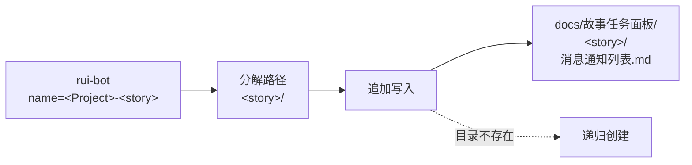

| 项目 | 说明 |
|------|------|
| 触发条件 | 指定了 `name` 时（无 `name` 时跳过日志） |
| 写入模式 | 追加（append） |
| 时间戳 | `【YYYY-MM-DD HH:mm:ss】` 单独一行作为分隔 |
| 条目格式 | 时间戳行 + 空行 + 完整正文（含首行 `【项目名】`） + 末尾换行 |
| 目录处理 | 不存在时递归创建 |
| `noSend=true` | 仍执行日志写入 |

## API 契约

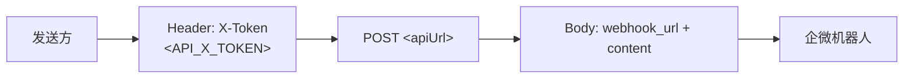

```
POST <apiUrl>
Headers:
  Content-Type: application/json
  X-Token: <API_X_TOKEN>
Body:
  { "webhook_url": "<resolved>", "content": "<message>" }

超时: 30s
成功: HTTP 200–299
失败: 非 2xx → 报告错误，调用方决定是否阻断
```

| 要素 | 来源 |
|------|------|
| `apiUrl` | 参数 > `WEWORK_BOT_API_URL` 环境变量 > `https://api.effiy.cn/wework/send-message` |
| webhook URL | 环境变量 > `robots[robot].webhook_url` > 默认空值 |
| `API_X_TOKEN` | 仅环境变量 |
| `content` | `content` 参数 > `contentFile` 文件内容（必须二选一） |

## 安全

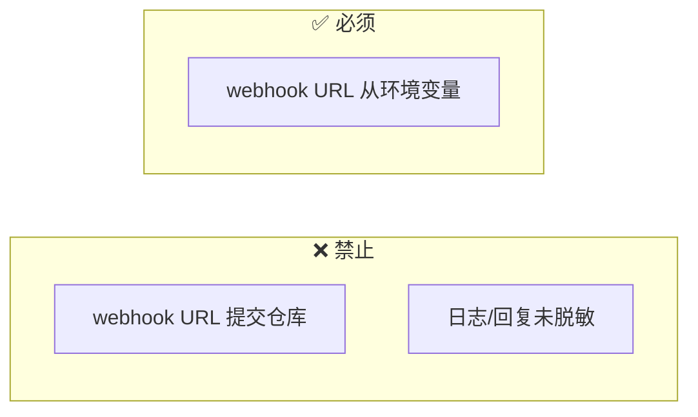

| # | 规则 | P0? |
|---|------|:---:|
| 1 | 禁止提交 token、webhook URL 到仓库 | ✅ |
| 2 | 日志和回复必须脱敏（不回显 token、webhook URL） | ✅ |
| 3 | `API_X_TOKEN` 仅从环境变量读取 | ✅ |
| 4 | webhook URL 仅从环境变量解析 | — |
| 5 | 真实 webhook URL 禁止写入文档，由环境变量注入 | — |

## 空输入

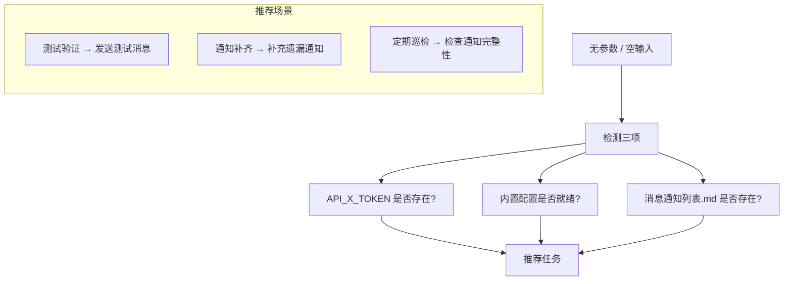

无参数时不发送消息，仅检测 `API_X_TOKEN` / 内置配置 / 故事面板 `消息通知列表.md` 并输出推荐任务。

## 测试

> 企业微信通知的消息格式合规、字段完整性、安全底线和失败队列管理。

### 运行测试

```bash
npx vitest run skills/rui-bot/tests/          # 全量运行
npx vitest skills/rui-bot/tests/              # 监听模式
npx vitest run --coverage skills/rui-bot/tests/  # 覆盖率报告
```

### 测试文件

| 文件 | 测试范围 | 类型 |
|------|---------|:---:|
| `tests/rui-bot.test.mjs` | 消息格式验证、路由解析、失败队列、安全规则 | 单元 |

### 测试策略

| 层级 | 范围 | 要求 |
|------|------|------|
| **格式测试** | 4 场景消息格式（完成/阻断/门禁/进度） | 每场景必含字段齐全 |
| **安全测试** | Token 不入库、webhook 不落盘、日志脱敏 | P0 阻断级 |
| **队列测试** | 失败入队、重试递增、dead 标记 | 状态机全覆盖 |
| **路由测试** | agent/robot 参数解析、故事名解析 | 每种路由路径有测试 |

### 覆盖要求

| 维度 | 最低阈值 | 目标 |
|------|:---:|:---:|
| 消息格式覆盖 | 100% | 4 种场景必含字段验证 |
| 安全规则覆盖 | 100% | 5 条安全规则全部有测试 |
| 失败队列状态机 | 100% | pending→retry→failed→dead 全路径 |
| 降级路径 | ≥ 80% | 每种降级情况有测试 |

## 降级策略

| 情况 | 降级行为 |
|------|---------|
| webhook URL 不可达 | 记录发送失败，不阻断管线 |
| `API_X_TOKEN` 缺失 | 静默跳过，标注 `no-token` |
| 消息超过 2000 字符 | 自动截断并追加 `…` |
| 网络超时 | 重试 1 次，仍失败则记录并跳过 |
| 内置配置缺失 | 仅使用环境变量 token 模式 |

## 失败队列与自动重试

> 发送失败的条目写入 `.claude/skills/rui-bot/send-failed.json`，由自动 cron（每 30 分钟 :03, :33）和手动 `flush` 命令重试。

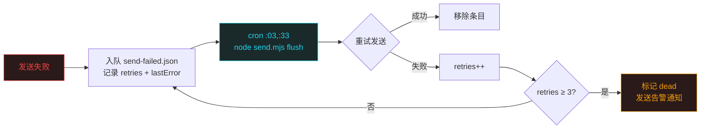

| 字段 | 说明 |
|------|------|
| `retries` | 已重试次数，达到 3 次标记 dead |
| `lastError` | 最近一次失败的错误信息 |
| `queuedAt` | 首次入队时间 |
| `dead` | true 时不再自动重试，需手动 `flush --force` |

### 队列可靠性指标

> 失败队列的运行健康度通过以下指标量化，由 `rui-health` 定期采集。

| 指标 | 公式 | 健康阈值 | 告警阈值 |
|------|------|:---:|:---:|
| **投递成功率** | sent / (sent + failed) | ≥ 95% | < 80% |
| **平均重试次数** | Σ retries / total_sent | ≤ 1.5 | > 2.5 |
| **dead 比率** | dead / total_queued | ≤ 5% | > 15% |
| **队列深度** | pending + retry_N | ≤ 10 | > 50 |
| **平均延迟** | avg(sent_at - queued_at) | ≤ 30s | > 120s |

### 投递保障策略

```
L1 即时发送: POST → 200 → sent
L2 指数退避: 失败 → 2^N 分钟后重试 → 最多 3 次
L3 降级告警: 3 次失败 → dead → 企微通知
L4 人工介入: dead 条目 → 手动 flush --force
```

## 规则

- [notification-rules.md](./rules/notification-rules.md) — 企业微信机器人通知的规则和约束
## 生效标志

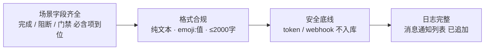

| 标志 | 未达标的处置 |
|------|------------|
| 场景字段齐全（完成/阻断/门禁失败/进度） | 补齐缺失字段，重新发送 |
| 格式合规（纯文本 · emoji:值 · ≤2000字） | 修正格式，重新发送 |
| token / webhook 不入库 | 从 git 历史清除，轮换凭据 |
| `消息通知列表` 已追加 | 补写日志条目 |

## 自循环

> 通知队列轮询 + 全局自循环报告汇总。Agent 可按间隔周期性检查待发通知并批量推送。同时汇总其他模块的自循环结果生成统一报告。

| 属性 | 值 |
|------|-----|
| 推荐间隔 | `*/5 * * * *`（每 5 分钟） |
| 触发条件 | 通知日志中有未发送条目 / 其他模块自循环有新结果 |
| 终止条件 | 队列为空 / webhook 失效 |
| 迭代动作 | 扫描通知日志 → 批量发送 → 汇总自循环报告 → 更新发送状态 |
| 收敛判定 | 所有 pending 条目已发送或标记 failed |

## 自循环报告

> 全局自循环模块（12 个）的执行结果统一汇总到 `docs/自循环报告/`，通过 rui-bot 通知用户验收。

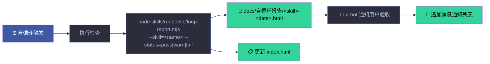

| 步骤 | 动作 | 产出 |
|------|------|------|
| ① 执行检查 | 自循环模块按间隔触发 | 检查结果（status + findings） |
| ② 生成报告 | `node skills/rui-bot/lib/loop-report.mjs` | HTML 报告 + 更新索引 |
| ③ 通知用户 | rui-bot 发送企业微信消息 | 含报告链接的验收通知 |
| ④ 追加日志 | 写入 `消息通知列表.md` | 通知记录 |

> 本技能 `checkMode: "cli"`——由 dispatcher 按 `*/5 * * * *` 自动调度（`send.mjs flush` 重试失败队列）。6 字段契约与调度规则详见 [rules/loop-engineering.md](../rui/rules/loop-engineering.md)。

## 通知场景矩阵

### 3 大通知场景

| 场景 | 触发条件 | 消息格式 | 优先级 | 重试策略 |
|------|---------|---------|:---:|---------|
| **完成通知** | 管线全部阶段通过，交付收口完成 | Rich 格式（含变更摘要、版本号、P0 统计） | Normal | 失败重试 3 次 |
| **阻断通知** | 任一阶段触发阻断标识 | Verbose 格式（含阻断标识、失败阶段、修复建议） | High | 立即发送，失败重试 5 次 |
| **门禁失败** | Gate A/B 未通过 | Rich 格式（含未通过项、轮次、修复建议） | High | 立即发送，失败重试 5 次 |

### 通知内容模板

**完成通知**：
```
✅ 管线完成 — {story_name} v{version}
━━━━━━━━━━━━━━━━━━
📋 变更摘要: {summary}
🔢 P0 统计: {p0_count} 项已清零
⏱️ 总耗时: {duration}
📄 报告: {report_url}
```

**阻断通知**：
```
🚫 管线阻断 — {story_name}
━━━━━━━━━━━━━━━━━━
⚠️ 阻断标识: {blocker_id}
📍 失败阶段: {stage}
🔧 修复建议: {suggestion}
📄 详情: {report_url}
```

### 失败队列管理

| 状态 | 含义 | 处置 |
|------|------|------|
| `pending` | 待发送 | 下次轮询时发送 |
| `retry_N` | 第 N 次重试中 | 指数退避：2^N 分钟 |
| `failed` | 重试耗尽 | 记录到 `send-failed.json` |
| `dead` | 连续 3 次失败 | 标记为 dead，人工介入 |
| `sent` | 发送成功 | 从队列移除 |

## 与 rui 的关系

`/rui-bot` 是 rui 编排管线交付阶段的通知收口。由 `/rui` 交付步骤手动触发，也由 cron 定时自动触发（通知轮询、健康报告、失败重试）。不负责健康诊断——只负责消息推送和通知队列管理。

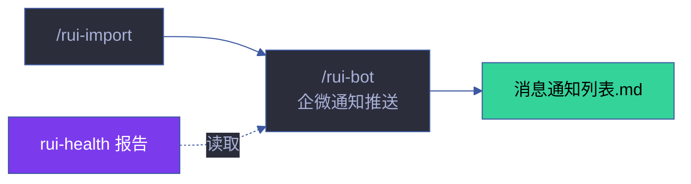
