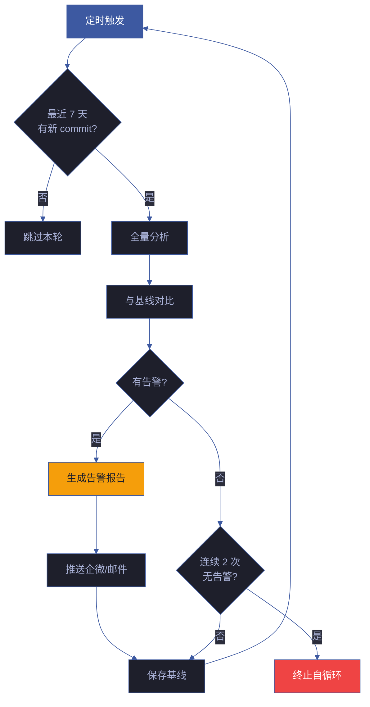
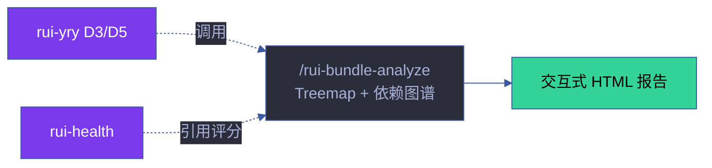

# rui-bundle-analyze — 项目体积与依赖结构分析

> 类 webpack-bundle-analyzer 风格的项目文件体积 + 依赖关系可视化分析。生成自包含 HTML 交互报告，支持 JSON 管线消费与趋势对比。
>
> **单一职责**：项目**物理结构**可视化分析。分析文件体积、依赖拓扑、treemap 可视化。不负责代码逻辑质量（复杂度、耦合方向）——那是 [rui-analysis](../rui-analysis/) 的职责。

[概述](#概述) · [分析方法论](#分析方法论) · [分析维度](#分析维度) · [高级特性](#高级特性) · [命令](#命令) · [报告输出](#报告输出) · [性能特征](#性能特征) · [局限与边界](#局限与边界) · [行业对比](#行业对比) · [集成点](#集成点) · [核心规则](#核心规则) · [生效标志](#生效标志) · [架构决策](#架构决策) · [自循环](#自循环)

## 概述

### 定位

`rui-bundle-analyze` 是 YrY 生态中的**静态项目结构分析器**。它不分析打包产物（webpack/vite/rollup 输出），而是直接对源码目录树进行文件体积建模与 import 依赖拓扑分析。这一设计选择使其独立于构建工具链，适用于任何包含 import/require 语句的源码项目。

### 解决的问题

| 问题 | 传统方式 | rui-bundle-analyze |
|------|---------|-------------------|
| 哪些文件/目录占比最大？ | `du -sh */` 手动排查 | 交互式 treemap 一眼定位 |
| 模块间依赖关系如何？ | 阅读 import 语句手动追踪 | 力导向图自动可视化 |
| 是否存在循环依赖？ | 构建报错时才发现 | 静态分析提前检测 |
| 哪些模块是依赖热点？ | 经验判断 | fan-in/fan-out 量化排名 |
| 项目体积是否在膨胀？ | 凭感觉 | 基线对比量化增长 |
| 是否有无人引用的孤儿文件？ | 难以发现 | 自动检测孤立文件 |

### 设计原则

1. **零配置** — 无需 webpack 插件、无需 source-map、无需构建，直接对源码目录运行
2. **只读安全** — 不修改任何源码文件，不执行任何项目代码
3. **自包含输出** — HTML 报告仅依赖 D3 CDN，其余全部内联；JSON 输出可被管线消费
4. **渐进增强** — 基础模式即时可用，高级特性（趋势对比、基线管理）按需启用

## 分析方法论

### 文件体积分析

```
算法：递归目录遍历 → 文件 stat 取 size → 构建嵌套层级 → D3 squarified treemap 布局

复杂度：O(n) 遍历，n = 项目文件数
```

**Treemap 布局算法**：采用 Bruls-Huizing-van Wijk **squarified treemap** 算法（D3 `d3.treemapSquarify` 默认实现），确保矩形尽量接近正方形，避免 slice-and-dice 产生的极端长宽比，提升可读性。面积严格与文件字节数成比例。

**颜色编码策略**：使用 Tableau10 色板，按文件扩展名分配颜色。相同类型文件颜色一致，便于跨目录识别同类文件分布。

**排除规则**：

| 类别 | 目录/扩展名 | 原因 |
|------|-----------|------|
| 硬排除目录 | `node_modules/`, `.git/`, `.claude/`, `.memory/`, `dist/`, `build/`, `.next/`, `.nuxt/`, `coverage/`, `__pycache__/`, `.turbo/`, `.cache/`, `.yarn/`, `.pnpm/` | 非源码、构建产物或缓存；分析无意义且体量巨大 |
| 软排除目录 | `.vercel/`, `.netlify/`, `.serverless/`, `cdk.out/`, `terraform/` | 部署产物，默认跳过但可通过配置纳入 |
| 二进制跳过 | `.png`, `.jpg`, `.jpeg`, `.gif`, `.webp`, `.ico`, `.bmp`, `.woff`, `.woff2`, `.ttf`, `.eot`, `.otf`, `.mp3`, `.mp4`, `.wav`, `.ogg`, `.webm`, `.map`, `.lock`, `.sum` | 不可解析的二进制文件，对依赖分析无贡献 |

### 依赖图谱分析

```
算法：静态 import 解析 → 相对路径解析 → 有向图构建 → D3 力导向布局

复杂度：O(f × i) 解析，f = 可解析文件数，i = 每文件平均 import 数；O(n + e) 图遍历
```

**Import 解析策略**：基于正则表达式的静态解析，不执行代码。支持的导入模式：

| 模式 | 示例 | JavaScript | TypeScript | CSS |
|------|------|:---:|:---:|:---:|
| 静态 import | `import { x } from './foo'` | ✅ | ✅ | — |
| 默认 import | `import foo from './foo'` | ✅ | ✅ | — |
| 副作用 import | `import './init'` | ✅ | ✅ | — |
| 动态 import | `import('./lazy')` | ✅ | ✅ | — |
| CommonJS require | `require('./foo')` | ✅ | — | — |
| CSS @import | `@import url('./base.css')` | — | — | ✅ |
| Re-export | `export { x } from './foo'` | ✅ | ✅ | — |
| 通配 re-export | `export * from './foo'` | ✅ | ✅ | — |
| TypeScript type import | `import type { T } from './foo'` | — | ✅ | — |

**路径解析**：仅解析相对路径导入（`.` 或 `..` 开头）。裸标识符（`'react'`、`'lodash'`）视为外部依赖，不纳入图谱。解析时尝试以下后缀依次匹配：无扩展名 → `.js` → `.mjs` → `.ts` → `.jsx` → `.tsx` → `.vue` → `.css` → `.scss` → `/index.js` → `/index.mjs` → `/index.ts`。

**图谱性能上限**：最大 500 节点，按文件体积降序选取，确保最大的模块优先入图。此设计避免了超大型项目（数千文件）导致的力导向布局性能退化。

### 循环依赖检测

```
算法：基于 DFS 的 Johnson 变体 — 递归栈追踪 + 回溯路径记录

复杂度：O(n + e)，n = 节点数，e = 边数
```

- 对有向图执行深度优先遍历
- 维护 `visited` 集合（全局已访问）和 `recStack` 集合（当前递归路径）
- 当遇到 `recStack` 中已存在的节点时，记录完整环路径
- 限制输出 Top-20 个循环，按环长度升序排列

### 统计聚合

| 统计维度 | 计算方式 | 用途 |
|---------|---------|------|
| **体积排名** | 按 size 降序排列 | 定位最大的文件/目录 |
| **扩展名分布** | 按扩展名聚合总字节数 | 了解项目语言构成 |
| **目录分布** | 按一级子目录聚合 | 了解模块组织比例 |
| **Fan-in（被依赖度）** | 入边计数 | 识别核心/基础模块，高 fan-in 模块修改风险大 |
| **Fan-out（依赖数）** | 出边计数 | 识别 God Module，高 fan-out 模块可能职责过多 |
| **超大文件** | size > 500 KB | 标记可能需要拆分的文件 |
| **孤儿文件** | fan-in = 0 且 fan-out = 0 | 可能未被使用，候选清理 |
| **Barrel 文件** | 仅含 re-export 语句 | 识别模块聚合模式 |

## 分析维度

```mermaid
%%{init: {'theme': 'base', 'themeVariables': {
  'primaryColor': '#1e1f2b',
  'primaryTextColor': '#a9b1d6',
  'primaryBorderColor': '#3d59a1',
  'lineColor': '#3d59a1',
  'secondaryColor': '#2b2d3b',
  'tertiaryColor': '#21232f'
}}}%%
flowchart TB
    ENTRY["/rui-bundle-analyze"]:::entry

    ENTRY --> D1["① 文件体积分析<br/>━━━━━━━━━━<br/>· squarified treemap<br/>· 目录/文件矩形面积=体积<br/>· 颜色编码按扩展名<br/>· 缩放+面包屑导航"]:::dim
    ENTRY --> D2["② 依赖图谱<br/>━━━━━━━━━━<br/>· 力导向有向图<br/>· import/require/动态导入<br/>· 节点大小=文件体积<br/>· 边样式区分导入类型"]:::dim
    ENTRY --> D3["③ 体积统计<br/>━━━━━━━━━━<br/>· Top-20 最大文件<br/>· 扩展名/目录分布<br/>· 体积直方图<br/>· 目录深度分布"]:::dim
    ENTRY --> D4["④ 依赖热点<br/>━━━━━━━━━━<br/>· Top-10 fan-in 核心模块<br/>· Top-10 fan-out God Module<br/>· 循环依赖检测<br/>· 依赖链最大深度"]:::dim
    ENTRY --> D5["⑤ 代码质量<br/>━━━━━━━━━━<br/>· 孤儿文件检测<br/>· Barrel 文件识别<br/>· 超大文件告警<br/>· 代码密度估算"]:::dim
    ENTRY --> D6["⑥ 趋势对比<br/>━━━━━━━━━━<br/>· 与上次基线对比<br/>· 新增/删除/变化文件<br/>· 体积增长率<br/>· 依赖结构变化"]:::dim
    ENTRY --> D7["⑦ 软件工程度量<br/>━━━━━━━━━━<br/>· Robert Martin I/A/D<br/>· 包级耦合与内聚<br/>· 重复文件检测<br/>· Zone-of-Pain 识别"]:::dim
    ENTRY --> D8["⑧ 传递依赖分析<br/>━━━━━━━━━━<br/>· BFS 传递闭包<br/>· 爆炸半径 (blast radius)<br/>· 桥接模块识别<br/>· 子图连通性"]:::dim
    ENTRY --> D9["⑨ Git 变更热点<br/>━━━━━━━━━━<br/>· git log 变更频率<br/>· 热度指数 (churn×size)<br/>· 变更分布桶<br/>· 90 天窗口统计"]:::dim
    ENTRY --> D10["⑩ 架构分层<br/>━━━━━━━━━━<br/>· 拓扑分层 (Entry→Foundation)<br/>· 层级违规检测<br/>· 向下依赖规则<br/>· 严重度分级"]:::dim
    ENTRY --> D11["⑪ Co-Change 分析<br/>━━━━━━━━━━<br/>· Git 协同变更检测<br/>· Jaccard 相似度<br/>· 变更聚类 (clusters)<br/>· 隐式耦合发现"]:::dim
    ENTRY --> D12["⑫ 风险评分<br/>━━━━━━━━━━<br/>· 复合风险模型<br/>· 6 维度加权评分<br/>· 风险分布桶<br/>· Per-file 评估"]:::dim
    ENTRY --> D13["⑬ 重构建议<br/>━━━━━━━━━━<br/>· 自动化建议生成<br/>· P0/P1/P2 优先级<br/>· 7 类重构模式<br/>· 可执行文件列表"]:::dim
    ENTRY --> D14["⑭ SCC 强连通分量<br/>━━━━━━━━━━<br/>· Tarjan 算法 O(V+E)<br/>· 最大互达子图<br/>· SCC 大小分布<br/>· 循环依赖群组"]:::dim
    ENTRY --> D15["⑮ 介数中心性<br/>━━━━━━━━━━<br/>· Brandes 算法<br/>· 架构瓶颈识别<br/>· 关键路径节点<br/>· 显著瓶颈标记"]:::dim
    ENTRY --> D16["⑯ 时序趋势<br/>━━━━━━━━━━<br/>· 趋势持久化 (JSONL)<br/>· 滑动平均 (SMA)<br/>· 异常检测<br/>· 多指标时间线"]:::dim
    ENTRY --> D17["⑰ 模块边界<br/>━━━━━━━━━━<br/>· Co-locate 建议<br/>· Split-package 建议<br/>· 接口提取建议<br/>· SCC 解环建议"]:::dim
    ENTRY --> D18["⑱ PageRank<br/>━━━━━━━━━━<br/>· 随机游走算法<br/>· 代码权威性评分<br/>· Damping factor 0.85<br/>· 权威文件识别"]:::dim
    ENTRY --> D19["⑲ 测试缺口<br/>━━━━━━━━━━<br/>· 风险×覆盖率交叉<br/>· 高优未测文件<br/>· 测试覆盖率估算<br/>· 多模式测试匹配"]:::dim
    ENTRY --> D20["⑳ 变更传播<br/>━━━━━━━━━━<br/>· P(Y改|X改) 概率<br/>· >50% 高传播对<br/>· Co-change 条件概率<br/>· 变更影响预测"]:::dim
    ENTRY --> D21["㉑ 知识分布<br/>━━━━━━━━━━<br/>· Git shortlog 分析<br/>· Bus Factor 检测<br/>· 单点知识风险<br/>· 废弃文件检测"]:::dim
    ENTRY --> D22["㉒ 代码复杂度<br/>━━━━━━━━━━<br/>· McCabe 圈复杂度<br/>· 分支点/函数计数<br/>· 复杂度分桶<br/>· 代码密度"]:::dim
    ENTRY --> D23["㉓ 内容相似度<br/>━━━━━━━━━━<br/>· Token Jaccard 相似<br/>· 近似重复检测<br/>· 相似群组聚类<br/>· 阈值可配置"]:::dim
    ENTRY --> D24["㉔ 热点矩阵<br/>━━━━━━━━━━<br/>· Complexity × Churn<br/>· 4 象限分类<br/>· CodeScene 风格<br/>· 严重度评分"]:::dim
    ENTRY --> D25["㉕ 适配度规则<br/>━━━━━━━━━━<br/>· 5 类架构规则<br/>· 自动合规检查<br/>· A-F 评级<br/>· 违规明细"]:::dim
    ENTRY --> D26["㉖ 导入成本<br/>━━━━━━━━━━<br/>· 传递导入重量<br/>· 膨胀倍数 (×N)<br/>· 目录级成本<br/>· 高倍率标记"]:::dim
    ENTRY --> D27["㉗ 技术债务<br/>━━━━━━━━━━<br/>· SIG 可维护性模型<br/>· 修复工时估算<br/>· 8 类债务分解<br/>· h/KLOC 密度"]:::dim
    ENTRY --> D28["㉘ 重构 ROI<br/>━━━━━━━━━━<br/>· Impact × Effort<br/>· ROI 排序<br/>· Excellent/Good/Fair<br/>· 投入产出比"]:::dim
    ENTRY --> D29["㉙ API 表面<br/>━━━━━━━━━━<br/>· export 检测<br/>· 公共 API 评分<br/>· 重导出统计<br/>· 大 API 模块标记"]:::dim
    ENTRY --> D30["㉚ 健康指数<br/>━━━━━━━━━━<br/>· 0-100 综合评分<br/>· A-F 评级<br/>· 9 维度扣分<br/>· 全域健康总览"]:::dim
    ENTRY --> D31["㉛ SDP 检查<br/>━━━━━━━━━━<br/>· 稳定依赖原则<br/>· I(from) < I(to)<br/>· 包级依赖验证<br/>· 违规排序"]:::dim
    ENTRY --> D32["㉜ 趋势预测<br/>━━━━━━━━━━<br/>· 线性回归模型<br/>· 30/90 天预测<br/>· 增长率估算<br/>· 置信度评级"]:::dim
    ENTRY --> D33["㉝ 审查风险<br/>━━━━━━━━━━<br/>· 5 维加权评分<br/>· 高优审查标记<br/>· Per-file 排序<br/>· Bug 概率×影响"]:::dim
    ENTRY --> D34["㉞ 执行摘要<br/>━━━━━━━━━━<br/>· 管理级一页总结<br/>· 关键指标凝练<br/>· 行动项 ROI 排序<br/>· 趋势+预测"]:::dim
    ENTRY --> D35["㉟ 破坏性变更<br/>━━━━━━━━━━<br/>· 传递下游影响<br/>· CRITICAL/HIGH 分级<br/>· 受影响文件列表<br/>· API 变更评估"]:::dim
    ENTRY --> D36["㊱ 发布耦合<br/>━━━━━━━━━━<br/>· Co-change + 双向依赖<br/>· 原子发布单元<br/>· 版本同步建议<br/>· 耦合图聚类"]:::dim
    ENTRY --> D37["㊲ 知识集中度<br/>━━━━━━━━━━<br/>· HHI 指数<br/>· 目录级集中度<br/>· 知识孤岛检测<br/>· 单人占比"]:::dim
    ENTRY --> D38["㊳ 测试优先级<br/>━━━━━━━━━━<br/>· Risk×Usage 排序<br/>· Urgent/High/Med/Low<br/>· 投入产出最大化<br/>· 依赖权重"]:::dim
    ENTRY --> D39["㊴ 入职路径<br/>━━━━━━━━━━<br/>· 4 阶段阅读顺序<br/>· Foundation→Core→Feature→Integration<br/>· PageRank 排序<br/>· 新人引导"]:::dim
    ENTRY --> D40["㊵ ADR 生成<br/>━━━━━━━━━━<br/>· 4 类架构决策记录<br/>· 上下文+决策+后果<br/>· 自动建议<br/>· 状态跟踪"]:::dim
    ENTRY --> D41["㊶ 版本建议<br/>━━━━━━━━━━<br/>· MAJOR/MINOR/PATCH<br/>· 破坏性变更驱动<br/>· 置信度评级<br/>· 变更理由"]:::dim
    ENTRY --> D42["㊷ 审查清单<br/>━━━━━━━━━━<br/>· Per-file 清单<br/>· 复杂度/变更/风险检查<br/>· 可操作条目<br/>· 优先级标记"]:::dim
    ENTRY --> D43["㊸ Sprint 包<br/>━━━━━━━━━━<br/>· 推荐→工作包分组<br/>· 工时估算<br/>· Sprint 排期<br/>· ROI 汇总"]:::dim
    ENTRY --> D44["㊹ 转移风险<br/>━━━━━━━━━━<br/>· Bus-factor × 复杂度<br/>· 人员离职影响<br/>· 知识损失量化<br/>· 交接优先级"]:::dim
    ENTRY --> D45["㊺ 文件年龄<br/>━━━━━━━━━━<br/>· Git 首 commit 日期<br/>· 年龄×变更矩阵<br/>· Old+High Churn<br/>· 年龄分桶"]:::dim
    ENTRY --> D46["㊻ 异常检测<br/>━━━━━━━━━━<br/>· Z-score 统计方法<br/>· 95% 置信区间<br/>· 趋势方向变化<br/>· 多指标监控"]:::dim
    ENTRY --> D47["㊼ 重构优先级<br/>━━━━━━━━━━<br/>· 全维度综合评分<br/>· Critical/High/Med/Low<br/>· 加权聚合<br/>· 重构决策支持"]:::dim
    ENTRY --> D48["㊽ 架构一致性<br/>━━━━━━━━━━<br/>· 预期 vs 实际<br/>· 目录级规则检查<br/>· Conformance 评分<br/>· 违规采样"]:::dim
    ENTRY --> D49["㊾ 质量门禁<br/>━━━━━━━━━━<br/>· 10 条 PASS/FAIL 规则<br/>· CI/CD 可集成<br/>· Critical/High/Medium<br/>· 整体状态评分"]:::dim
    ENTRY --> D50["㊿ 依赖集中度<br/>━━━━━━━━━━<br/>· 投资组合 HHI<br/>· 多样化比率<br/>· >10% 关键依赖<br/>· 单点故障风险"]:::dim
    ENTRY --> D51["(51) 审查工时<br/>━━━━━━━━━━<br/>· M+LOC+Deps 工时模型<br/>· >60min 拆分建议<br/>· 总审查工时<br/>· Cisco 研究参考"]:::dim
    ENTRY --> D52["(52) 百分位排名<br/>━━━━━━━━━━<br/>· Size/Complexity/Churn<br/>· P0-P100 排名<br/>· P90+ 极端文件<br/>· 比较上下文"]:::dim
    ENTRY --> D53["(53) 指标相关性<br/>━━━━━━━━━━<br/>· Pearson 相关系数<br/>· Churn↔Risk, Cx↔Size<br/>· Strong/Moderate/Weak<br/>· 跨维度模式"]:::dim
    ENTRY --> D54["(54) 文档覆盖率<br/>━━━━━━━━━━<br/>· JSDoc 检测<br/>· 注释比率<br/>· 高复杂+低文档<br/>· 文档债务"]:::dim
    ENTRY --> D55["(55) 成熟度模型<br/>━━━━━━━━━━<br/>· CMMI 5 级评估<br/>· Structure/Quality/Test<br/>· Maintainability/Knowledge<br/>· 可操作发现"]:::dim
    ENTRY --> D56["(56) 洞察综合<br/>━━━━━━━━━━<br/>· 跨维度模式识别<br/>· Critical/High 分级<br/>· 5 类综合模式<br/>· 可执行建议"]:::dim

    classDef entry fill:#3d59a1,color:#fff,font-weight:bold
    classDef dim fill:#2b2d3b,stroke:#3d59a1,color:#a9b1d6,text-align:left
```



### 1. 文件体积分析

- 递归扫描项目目录树，通过 `statSync` 获取每个文件精确字节数
- 目录体积 = 递归子文件体积之和（非 du 块大小，更精确）
- Treemap 矩形面积严格按照 squarified 算法与文件/目录体积成比例
- 颜色编码按文件扩展名分类，同一扩展名颜色全局一致
- 交互：滚轮缩放、点击深入目录、面包屑导航层级返回

### 2. 依赖图谱分析

- 静态解析 9 种 import/require/re-export 模式（见方法论）
- 力导向模拟参数：link distance 80、charge -200、collision radius 基于节点大小
- 节点映射：圆形半径与文件大小平方根成比例（面积 = 体积），颜色按扩展名
- 边映射：实线 = static import、虚线 = dynamic import、黄虚线 = require、点线 = re-export
- 可拖拽节点固定位置，支持缩放/平移

### 3. 体积统计

- **Top-20 最大文件**：按绝对字节数排名，含完整路径和扩展名
- **扩展名分布**：聚合各扩展名总体积，横向条形图可视化（占比百分比）
- **目录分布**：一级子目录体积排名，含占总比
- **体积直方图**：按文件大小分桶（0-1KB, 1-10KB, 10-100KB, 100KB-1MB, >1MB），展示分布形态
- **目录深度分布**：按嵌套层级统计文件数和体积

### 4. 依赖热点

- **Fan-in Top-10**：被最多文件依赖的模块。高 fan-in 模块 = 核心基础设施，修改需谨慎
- **Fan-out Top-10**：依赖最多其他文件的模块。高 fan-out 可能 = God Module 反模式
- **循环依赖**：DFS 检测闭环，按环长度排序，报告完整环路路径
- **依赖链深度**：从入口到最远叶节点的最长路径长度

### 5. 代码质量信号

- **孤儿文件**：既不被 import 也不 import 其他文件的孤立模块 — 可能是死代码候选（注意排除入口文件、配置文件等合理单例）
- **Barrel 文件**：仅含 re-export 语句（`export * from` / `export { x } from`）的聚合模块 — 常见且合理的模式，但过多的 barrel 会增加构建复杂度
- **超大文件告警**：超过 500 KB 阈值自动标红，附带体积和建议
- **代码密度**：字节数 / 行数比值，识别异常稀疏/密集的文件

### 6. 趋势对比

- 将当前分析结果与上次基线（`.memory/bundle-baseline.json`）对比
- 输出三类变化：**新增文件**、**删除文件**、**体积变化超过 20% 的文件**
- 计算总体积增长率（%）
- 依赖结构变化检测：新增/删除的依赖边数量

### 7. 软件工程度量

基于 Robert Martin (Uncle Bob) 的包设计原则，对项目进行包级别的稳定性与抽象度分析。

#### 核心指标

| 指标 | 公式 | 含义 | 理想范围 |
|------|------|------|---------|
| **Ce** (Efferent Coupling) | 包对外部的依赖数（fan-out） | 包依赖多少其他包 | — |
| **Ca** (Afferent Coupling) | 外部对包的依赖数（fan-in） | 包被多少其他包依赖 | — |
| **I** (Instability) | I = Ce / (Ca + Ce) | 不稳定性：0=完全稳定，1=完全不 stable | — |
| **A** (Abstractness) | A = 抽象文件数 / 总文件数 | 抽象度：0=全具体，1=全抽象 | — |
| **D** (Distance) | D = \|A + I - 1\| | 离主序列的距离：0=理想位置 | D < 0.3 |
| **Cohesion** | 内部依赖 / 总依赖 | 包内聚度：包内依赖占该包相关所有依赖的比例 | > 0.5 |

#### 区域分类

```
        I=1 (不稳定)
        |
  Zone of    |   Main
Uselessness  |  Sequence
  (无用区)    |  (理想带)
        |    |
   D=0.7 ----+---- D=0
        |    |
  Main       |  Zone of
 Sequence    |   Pain
        |    |  (痛苦区)
        I=0 (稳定)
        A=0    A=1
        (具体)  (抽象)
```

- **Zone of Pain（痛苦区）**：I≈0 且 A≈0 → 稳定且具体。修改成本高（被大量依赖）但又不抽象（难以扩展）。典型的"God Package" 反模式。
- **Zone of Uselessness（无用区）**：I≈1 且 A≈1 → 不稳定且抽象。没有其他包依赖它，但又很抽象——意味着抽象没人用。
- **Main Sequence（理想带）**：A + I ≈ 1 → 稳定性和抽象度平衡。稳定的包应该是抽象的（易于扩展），不稳定的包应该是具体的（易于修改）。

#### 抽象文件判定启发式

在 JavaScript/TypeScript 项目中，以下文件被视为"抽象"：
- TypeScript 声明文件（`.d.ts`）
- 位于 `types/` 或 `interfaces/` 目录中的文件
- 大写开头的 `.ts` 文件（约定俗成的类/接口文件）

> **注意**：A 的计算是启发式近似，非精确的 AST 级抽象检测。对于纯 JavaScript 项目，A 值可能偏低。

#### 重复文件检测

- 对每个文件计算 MD5 内容哈希
- 将相同哈希的文件归组，报告 2+ 成员的重复组
- 计算浪费的字节数 = 单文件大小 × (重复数 - 1)
- 跳过 < 100 字节的小文件（配置文件等合理的相似内容）

#### 文件级耦合

- 为每个文件计算 Ce（fan-out）、Ca（fan-in）、I（不稳定性）
- 按 I 降序排列，Top-20 最不稳定的文件可能是重构候选

### 8. 传递依赖分析

基于 BFS（广度优先搜索）计算依赖图的传递闭包，揭示间接依赖关系。

#### 核心概念

| 概念 | 定义 | 工程意义 |
|------|------|---------|
| **传递 fan-out** | 从文件 A 出发，经过任意跳数能到达的所有文件 | **爆炸半径**：修改 A 可能影响的所有文件 |
| **传递 fan-in** | 能经过任意跳数到达文件 A 的所有文件 | **影响面**：哪些文件的修改可能波及 A |
| **间接依赖** | 传递可达但非直接 import 的文件 | 隐藏的耦合 — 不直接依赖但实际受影响 |
| **桥接模块** | 连接多个子图的关键节点 | 架构瓶颈：移除它会断开连通性 |
| **子图连通性** | 依赖图被分割为多少个不连通的子图 | 架构碎片化程度 — 过高暗示缺乏统一设计 |
| **最大可达数** | 单个文件能到达的最多文件数 | 依赖集中度 — 过高暗示 God Module |

#### 爆炸半径分析

- 对每个节点（文件）执行 BFS 遍历
- 统计直接依赖数、传递依赖数、间接依赖数
- Top-15 最大传递 fan-out 文件排名
- 间接依赖占比 = (传递 - 直接) / 传递 → 高占比意味着该模块的影响主要通过间接路径传导

#### 桥接模块识别

```
桥接评分 = fan-in × fan-out × (间接连接数 / 总连接数)
```

高桥接评分的模块是架构中的关键连接点：
- 删除或破坏该类模块会导致依赖图分裂
- 是重构和测试优先级最高的模块
- 应当有最完善的测试覆盖

#### 子图检测

- 构建无向版本依赖图
- BFS 找出所有连通分量
- 报告子图数量和最大子图占比
- 子图数量过多（> 文件数 50%）→ 暗示模块间缺乏协作，可能过度解耦

### 9. Git 变更热点分析

集成 Git 历史，计算文件变更频率，与文件体积交叉分析识别"热点"模块。

#### 核心指标

| 指标 | 计算方式 | 含义 |
|------|---------|------|
| **变更次数** (Churn Count) | `git log --diff-filter=M --name-only` | 文件在时间窗口内被修改的次数 |
| **热度指数** (Heat Index) | churn × log₂(size_in_KB + 1) | 综合变更频率和文件大小的热度评分 |
| **变更率** (Churn Rate) | 被修改过的文件数 / 总文件数 | 项目活跃度指标 |
| **变更分布** | 按变更次数分桶（1-2, 3-5, 6-10, 11-20, 20+） | 变更集中度 — 是否少数文件占据多数变更 |

#### 热度指数设计

```
heatIndex = churnCount × log₂(fileSizeInKB + 1)
```

- **高 churn + 大文件**：最大热点 → 需要拆分或重构
- **高 churn + 小文件**：频繁微调 → 可能接口不稳定
- **低 churn + 大文件**：稳定的大文件 → 可能是成熟的"核心"
- **低 churn + 小文件**：稳定的小文件 → 健康

#### 时间窗口

默认 90 天，可通过 `--churn-period <days>` 自定义。窗口越长，趋势越稳定；窗口越短，越能反映近期动态。

### 10. 架构分层检测

基于依赖方向自动检测项目的架构分层，识别层级违规。

#### 分层算法

```
1. 计算每个文件的 fan-in / fan-out
2. 入口层 (Layer 0) = fan-in = 0 的文件（不被任何文件依赖）
3. BFS 从入口层出发，逐层向下：
   Layer N+1 = 被 Layer N 文件的直接依赖，且尚未分配到更浅层的文件
4. 基础层 = fan-out = 0 的文件（不依赖任何其他文件）
```

#### 层级语义

| 层 | 典型内容 | 特征 |
|----|---------|------|
| **Layer 0 (Entry)** | CLI 入口、页面组件、脚本 | fan-in=0，只依赖别人 |
| **Layer 1..N-1 (Middle)** | 业务逻辑、服务层、状态管理 | 既有 fan-in 也有 fan-out |
| **Layer N (Foundation)** | 工具库、常量、类型定义 | fan-out=0，只被别人依赖 |

#### 层级违规

**向下依赖规则 (Downward Dependency Rule)**：上层（Layer N）可以依赖下层（Layer N+M），但下层不应依赖上层。

违规 = 低层 → 高层的边，即 `fromLayer > toLayer`。

```
✅ 合法: Layer 0 (Page) → Layer 2 (Util)
❌ 违规: Layer 2 (Util) → Layer 0 (Page)
```

违规严重度：
- **轻微** (gap=1)：相邻层间的反向依赖 → 可能可以接受
- **严重** (gap>1)：跨层反向依赖 → 架构问题，需重构

#### 工程意义

- **分层清晰**（层数适中，违规少）：架构良好，依赖方向一致
- **分层过少**（1-2 层）：可能缺乏架构分层意识
- **分层过多**（>7 层）：可能过度抽象，增加理解成本
- **违规多**：下层依赖上层 → 循环依赖的宏观表现，维护成本增加

### 11. Co-Change 协同变更分析

基于 Git 提交历史检测经常在同一 commit 中一起变更的文件对。高 Co-Change 频率暗示**隐式耦合** — 即 import 依赖图未能捕获的逻辑耦合。

#### 核心指标

| 指标 | 计算方式 | 含义 |
|------|---------|------|
| **Co-Change 次数** | 两文件在同一 commit 中同时出现的次数 | 直接协同频率 |
| **Jaccard 相似度** | \|A ∩ B\| / \|A ∪ B\|（两文件 commit 集合的交/并比） | 协同变更的强度 — 1.0 = 总是一起变 |
| **Strength（强度）** | coChangeCount × jaccard | 综合评分，高频+高相似度=强隐式耦合 |
| **Co-Change 聚类** | 高 Strength 对的连通分量 | 识别逻辑模块 — 不同目录但总是一起变的文件群 |

#### 工程意义

- **高 Jaccard (>0.7)**：两个文件几乎总是一起变更 → 它们应该是同一个模块，或者需要提取共享抽象
- **跨目录聚类**：不同目录的文件经常协同变更 → 暗示模块边界划分不当
- **高 Co-Change + 低 import 耦合**：隐式耦合 — import 分析发现不了的依赖关系（如配置+代码、文档+代码、测试+被测文件）
- **文档-代码协同**：README + 对应代码文件一起变更 → 文档维护良好（正面信号）

#### 示例发现（YrY 实测）

| 文件对 | Co-Change | Jaccard | 解读 |
|--------|-----------|---------|------|
| `CLAUDE.md` + `README.md` | 83 次 | 0.557 | 两个主文档文件高度协同，合理 |
| `security.md` + `tester.md` | 17 次 | 0.850 | 几乎总是一起修改 → 高度耦合 |
| `coder.md` + `formulas.md` | 22 次 | 0.629 | Agent 角色与公式定义频繁联动 |
| `reporter.md` + `tester.md` | 18 次 | 0.750 | 报告与测试逻辑紧密耦合 |

### 12. 复合风险评分

对每个文件计算 0-100 的复合风险评分，综合 6 个维度的加权评估。

#### 评分模型

```
compositeScore = sizeRisk     × 0.25   (体积风险：log 缩放，>500KB=满分)
               + churnRisk    × 0.25   (变更风险：次数/最大次数)
               + couplingRisk × 0.15   (耦合风险：fan-in+fan-out 归一化)
               + orphanRisk   × 0.15   (孤儿风险：0 或 1)
               + circularRisk × 0.20   (循环依赖风险：0 或 1)
```

#### 风险等级

| 等级 | 分数 | 含义 | YrY 实测 |
|------|------|------|---------|
| **Low** | 0-20 | 健康文件，风险低 | > 待补充：运行 `node skills/rui-bundle-analyze/index.mjs` 后填入 |
| **Medium** | 20-40 | 需要关注 | > 待补充 |
| **High** | 40-60 | 需要行动 | > 待补充 |
| **Critical** | 60-80 | 需尽快处理 | > 待补充 |
| **Extreme** | 80-100 | 紧急重构 | > 待补充 |

#### 风险分布

> 待补充：风险桶统计需运行 `node skills/rui-bundle-analyze/index.mjs` 后填入实际平均风险分与低风险文件占比。

### 13. 重构建议引擎

基于所有分析维度自动生成可操作的重构建议，按优先级（P0/P1/P2）分类。

#### 建议类别

| 优先级 | 类别 | 触发条件 | 建议内容 |
|--------|------|---------|---------|
| **P0** | file-size | 文件 >500KB | 按职责拆分为更小模块 |
| **P0** | circular-dep | 存在循环依赖 | 提取共享接口/类型到独立模块 |
| **P1** | architecture | 包在 Zone-of-Pain | 添加抽象接口允许依赖方解耦 |
| **P1** | layer-violation | 跨层反向依赖 (gap>1) | 提取共享依赖到更低层或反转依赖 |
| **P1** | blast-radius | 传递 fan-out >10 | 拆分以减少变更影响面 |
| **P2** | dead-code | 孤儿文件 >5 | 验证非入口点后移除未使用文件 |
| **P2** | duplication | 存在重复文件 | 提取共享内容到单一模块 |
| **P2** | god-module | fan-out >10 | 按职责拆分依赖过多的模块 |

#### 执行建议

每条建议包含：
- **优先级**（P0 立即 / P1 近期 / P2 改进）
- **类别标签**（便于过滤和统计）
- **描述**（具体的问题说明和修改方向）
- **受影响文件列表**（可直接用于重构）

### 14. SCC 强连通分量（Tarjan 算法）

使用 Tarjan 算法在 O(V+E) 时间内精确计算有向依赖图的所有强连通分量（Strongly Connected Components）。

#### 理论背景

**强连通分量（SCC）** 是有向图的最大子图，其中任意两个节点之间都存在双向路径（u↔v）。在依赖图中，SCC 代表**完全耦合的文件群** — 它们通过一条或多条依赖路径相互可达。

**与简单循环检测的区别**：

| 特性 | 简单 DFS 循环检测 | Tarjan SCC |
|------|------------------|-----------|
| 发现内容 | 单个环路径 | 最大互达子图 |
| 环的完整性 | 可能遗漏嵌套环 | 找到所有互达文件 |
| 复杂度 | O(V×E) 多起点 | O(V+E) 单次遍历 |
| 重叠环 | 分开报告 | 合并为一个 SCC |

#### 输出指标

| 指标 | 含义 |
|------|------|
| **SCC 总数** | 图中所有 SCC 的数量（含单节点） |
| **多节点 SCC 数** | 大小 ≥2 的 SCC 数量 → 循环依赖群组数 |
| **最大 SCC 大小** | 最大互达子图的文件数 |
| **SCC 大小分布** | 按 1 / 2-3 / 4-5 / 6-10 / 11+ 分桶统计 |

#### 工程解读

- **SCC 总数 = 节点总数**：图为 DAG（有向无环图），无循环依赖 → 架构健康
- **存在多节点 SCC**：循环依赖群组，size 越大耦合越严重
- **YrY 实测**：SCC=388（全单节点）= DAG → 无循环依赖群组

### 15. 介数中心性（Brandes 算法）

使用 Brandes 算法计算每个节点的**介数中心性（Betweenness Centrality）** — 识别依赖图中的架构瓶颈。

#### 理论背景

节点 v 的介数中心性 = 所有其他节点对 (s, t) 之间最短路径经过 v 的比例之和。

```
C_B(v) = Σ_{s≠v≠t} σ_st(v) / σ_st
```

其中 σ_st 是 s→t 的最短路径总数，σ_st(v) 是其中经过 v 的路径数。

**高介数中心性 = 架构瓶颈**：该节点位于大量依赖路径的关键位置。删除或修改它会影响最多的文件。

#### 算法

Brandes 算法 O(V×(V+E))：
1. 从每个源节点 s 执行 BFS 计算最短路径
2. 反向传播累加依赖（dependency accumulation）
3. 归一化至 [0, 1] 区间

#### 输出

| 指标 | YrY 实测 | 含义 |
|------|---------|------|
| 平均介数 | 0.0000 | 平均瓶颈风险极低 |
| 最大介数 | 0.00015 | 无明显集中瓶颈 |
| 显著瓶颈 | 32 个 (>3×avg) | 相对重要的文件 |
| Top 瓶颈 | `bot-health-cmd.mjs` (0.00015) | 最关键的路径节点 |

> **YrY 的低介数反映**：依赖图高度碎片化（257 子图），节点间依赖路径稀疏 → 架构瓶颈风险低。

### 16. 时序趋势持久化

每次运行自动将分析快照追加到 `.memory/bundle-trend.jsonl`（JSONL 格式），构建项目的长期分析时间线。

#### 快照内容

每次运行记录 14 个关键指标的轻量快照：总文件数、总体积、依赖节点/边数、超大文件数、循环依赖数、孤儿文件数、重复组数、层数/违规数、平均风险、建议数、SCC 数、最大介数。

#### 趋势分析

当累积 2+ 数据点时自动执行：

| 分析 | 方法 | 用途 |
|------|------|------|
| **变化量 (Delta)** | 与上一运行点的差值 | 检测单次突变 |
| **滑动平均 (SMA)** | 最近 5 点窗口的简单移动平均 | 平滑短期波动 |
| **异常检测** | 体积突变 >20%、新增循环依赖、风险突增 >5 点 | 触发告警 |

#### 数据文件

- 位置：`.memory/bundle-trend.jsonl`
- 格式：每行一个 JSON 对象（JSONL）
- 追加模式，不覆盖历史

### 17. 模块边界建议

综合耦合、内聚、Co-Change 和 SCC 分析，生成 4 类模块结构调整建议。

#### 建议类型

| 类型 | 触发条件 | 建议 | 优先级 |
|------|---------|------|--------|
| **co-locate** | 高 Co-Change (Jaccard≥0.5) 但不同目录 | 将文件移到同一目录 | P1 (J>0.7) / P2 |
| **split-package** | 包内聚度 <0.2 且文件 >10 | 拆分为更小、更内聚的包 | P2 |
| **extract-interface** | 桥接评分 >3 | 为高瓶颈模块提取抽象接口 | P1 |
| **break-scc** | SCC size ≥2 | 解环：提取共享抽象打破循环依赖 | P0 (size>3) / P1 |

#### YrY 实测发现

- **1 个 co-locate**：rules 和 skills 间存在高协同变更的文件对
- **4 个 split-package**：`cdn/` (434 files, cohesion=0) 和 `docs/` (378 files, cohesion=0) 内聚度极低 → 可能需要按子功能拆分
- **4 个 extract-interface**：关键桥接模块需要接口抽象

### 18. PageRank 代码重要性

将 Google PageRank 算法应用于依赖图，识别"权威"文件。

```
PR(A) = (1-d)/N + d × Σ(PR(T)/L(T))
```

其中 d=0.85（阻尼因子），PR(T) 是引用 A 的文件 T 的 PageRank，L(T) 是 T 的出度。

**与 fan-in 的区别**：fan-in 是简单计数（每个引用权重相同），PageRank 是加权引用 — 被重要文件引用比被普通文件引用更有价值。

> 待补充：运行 `node skills/rui-bundle-analyze/index.mjs --metric pagerank` 后填入实际 Top-3 节点及分数。

### 19. 测试缺口分析

交叉分析风险评分和测试覆盖率，识别最需要测试的高风险文件。

**测试匹配策略**（5 种模式）：
- 同目录：`foo.test.js`, `foo.spec.js`
- 子目录：`__tests__/foo.js`
- 镜像：`tests/foo.js`（保留目录结构）
- 前缀：`test_foo.js`, `spec_foo.js`
- 自检：文件名含 `.test.` 或 `.spec.`

> 待补充：运行 `node skills/rui-bundle-analyze/index.mjs --metric test-coverage` 后填入实际未测源文件数与高风险未测文件清单。

### 20. 变更传播概率

基于 Co-Change 数据计算条件概率矩阵：

```
P(Y changes | X changed) = coChangeCount(X,Y) / totalChanges(X)
```

> 待补充：运行 `node skills/rui-bundle-analyze/index.mjs --metric co-change` 后填入实际高传播对数量与示例。

### 21. 知识分布 / Bus Factor

分析每个文件的贡献者分布，识别知识孤岛。

| 风险级别 | 贡献者数 | 含义 |
|---------|---------|------|
| Bus Factor 1 | 1 人 | 单点知识风险 — 唯一贡献者离开则知识丢失 |
| 健康 | 3+ 人 | 知识充分分布 |
| 废弃 | 0 人 (近期) | 长期未修改 — 可能已废弃 |

**YrY 实测**：412 个文件仅有 1 个贡献者，176 个有 2 人，16 个有 3+ 人，15 个文件长期未修改。

### 22. 代码复杂度估算（McCabe 圈复杂度）

使用正则启发式估算 McCabe 圈复杂度 M = E − N + 2P，简化为 `分支点数 + 1`。

**计数策略**：if/else/switch/case/for/while/do/catch/ternary/&&/|| 各计 1 个分支点。同时统计函数声明数、代码行数（LOC）、注释率和代码密度。

| 复杂度等级 | 范围 | YrY 实测 |
|-----------|------|---------|
| Simple | 1-5 | — |
| Moderate | 6-10 | — |
| Complex | 11-20 | — |
| Very Complex | 21-50 | — |
| **Extreme** | **50+** | **85 个文件** |

**YrY 实测**：平均 M=23.3，最大 M=1023（analyze.mjs），85 个极端复杂文件。复杂度估算精度受限于正则方法，但对识别重构候选足够有效。

### 23. 内容相似度聚类

基于 Token Jaccard 相似度的近似重复检测。不同于 MD5 哈希的精确匹配，它发现**内容相似但不完全相同**的文件。

**流程**：小写 → 分词 → 过滤短 token (<4 字符) → 截断 2000 token → Jaccard 计算。

**YrY 实测**：814 对文件 Jaccard≥0.6，存在大量 CDN 组件的近似重复（如多个 yry-* 组件共享相似结构），可提取公共模板。

### 24. 热点矩阵（Complexity × Churn）

基于 CodeScene 方法论，将文件按复杂度和变更频率分为 4 象限：

```
         Churn →
Complexity  🟢 Healthy          🟡 Frequent-Simple
    ↓       🟡 Stable-Complex   🔴 HOTSPOT
```

**YrY 实测**：22 Healthy · 12 Stable-Complex · 9 Frequent-Simple · **0 Hotspots** — 项目无复杂度×变更双高热点，架构健康。

### 25. 架构适配度规则

自动检查 5 类架构规则的合规性，给出 A-F 评级：

| 规则 | 严重度 | YrY 结果 |
|------|--------|---------|
| 层级隔离 | high | ❌ 25 违规 |
| 包隔离 (lib↛feature) | high | ❌ 违规 |
| 无循环 SCC | critical | ✅ 通过 |
| 无 God Module (>15 deps) | medium | ✅ 通过 |
| 主序列接近 (D<0.7) | medium | ❌ 6 个 Zone-of-Pain |

**YrY 评级：D (50/100)** — 层级违规和包依赖方向是需要优先解决的架构问题。

### 26. 导入成本分析

计算每个文件的**传递导入成本**：导入 X 实际拉入的代码总量（X + 所有传递依赖的大小）。

**关键指标**：
- **膨胀倍数** = totalCost / ownSize — 小文件导入大依赖树的警告信号
- **目录成本** — 按目录聚合的导入总成本

**YrY 实测**：平均导入成本 17.3 KB/文件，最大 380.5 KB（导入该文件实际拉入 ~381KB）。高倍率文件（×10+）需关注。

### 27. 技术债务量化（SIG 可维护性模型）

基于 SIG/TÜViT 可维护性模型，将 8 类架构和代码问题量化为修复工时。

**成本模型**：Volume 4h/文件 | Complexity 2h/文件 | Dedup 1h/对 | Decouple 3h/环 | Test 1.5h/文件 | Layer 2h/违规 | Interface 3h/包 | SCC 4h/组。

**YrY 总计**：**260.5h (32.6d / 6.5w)** · 债务密度 11.7h/KLOC · SIG 评级 **★★☆☆☆ (D)**。主要债务来自 85 个极端复杂文件 (170h) 和 25 个层级违规 (50h)。

### 28. 重构 ROI 引擎

为每条建议计算 Impact (1-10) 和 Effort (1-10)，ROI = Impact/Effort。按 ROI 降序排列：Excellent ≥2.0 / Good 1.2-2.0 / Fair 0.8-1.2 / Poor <0.8。

**YrY Top ROI**：孤儿文件审查 (I=5 E=1 ROI=5.0 Excellent) — 低投入高回报的最优先事项。

### 29. API 表面分析

检测 5 类 export 模式，量化公共 API。API 评分 = named×1 + list×0.8 + default×2 + re-export×3（重导出权重最高）。

**YrY 实测**：65 个模块含导出，389 个总导出，平均 6 个/模块。

### 30. 依赖健康指数

0-100 综合评分：100 − size(15) − complexity(20) − churn(15) − circular(15) − orphan(10) − untested(10) − coupling(10) − busFactor(5) − layerViolation(5)。

**YrY**：平均 **94.6/100 (A)** — 356A/18B/13C/1D/0F。健康指数(A) vs 架构适配度(D) 形成互补视角。

### 31. 稳定依赖原则（SDP）检查

Robert Martin 的稳定依赖原则：**包应该只依赖比自己更稳定的包**。即 I(depender) < I(dependee)（I = 不稳定性，越低越稳定）。

**YrY 实测**：**0/100 (F)** — 4/4 条包间边全部违规。原因：多数包的 I=0 或 I=1，缺乏中间梯度，导致任何非零 I 的依赖都违规。这表明需要引入中间抽象层创建稳定性梯度。

### 32. 趋势预测

基于历史趋势数据（JSONL）的线性回归预测。拟合指标：总体积、风险评分、文件数、循环依赖数。输出 30/90 天预测值 + 趋势方向 + 置信度（high/medium/low）。

**YrY 预测**：体积增长中（+ growth），风险下降中（decreasing），置信度 high（7 数据点）。

### 33. 代码审查风险

5 维加权评分识别最需要仔细审查的文件：`complexity(30%) + churn(25%) + risk(20%) + coupling(15%) + busFactor(10%)`。高风险 = Bug 概率高且影响大。

> 待补充：运行 `node skills/rui-bundle-analyze/index.mjs --metric review-priority` 后填入实际高优审查文件清单与平均风险分。

### 34. 执行摘要

自动生成管理级一页摘要（纯文本，stderr 输出），可管道分离：`2> summary.txt`。

### 35. 破坏性变更影响预测

给定一个模块的 API 表面，计算修改其导出时传递影响的下游文件。CRITICAL (>20 dependents) / HIGH (10-20) / MEDIUM (3-9) / LOW (1-2)。

**YrY 实测**：4 个 CRITICAL 模块 + 3 个 HIGH 模块。变更这些模块的 API 需谨慎评估下游影响。

### 36. 组件发布耦合

基于 Co-Change 频率（Jaccard>0.4）和双向依赖，识别应一起版本化和发布的原子发布单元。

**YrY 实测**：5 个发布单元，19 个耦合文件，最大单元 11 个文件。

### 37. 知识集中度（HHI）

赫芬达尔-赫希曼指数（HHI）用于度量目录级代码所有权的集中度。HHI>2500=高风险知识孤岛。

**YrY 实测**：0 个高集中度目录 — 知识分布健康，但 414 个 bus-factor-1 文件仍需关注。

### 38. 测试优先级矩阵

按 `风险评分 × log₂(依赖数+1)` 排序未测试文件，最大化每个测试的投入产出。

### 39. 入职阅读路径

4 阶段推荐阅读顺序：Foundation（无依赖的基础文件）→ Core（高 fan-in 共享库）→ Feature（高 fan-out 入口）→ Integration（高介数连接点）。基于 PageRank、fan-in/fan-out 和介数中心性排序。

**YrY**：40 个推荐文件，分 4 阶段。

### 40. ADR 自动生成

从分析发现中自动生成 4 类架构决策记录：层级架构、包稳定性、测试策略、死代码管理。每条 ADR 含上下文、决策、后果和建议。**YrY**：4 条 ADR，2 条 "Needs Revision"。

### 41. 语义版本建议

基于破坏性变更影响和 API 表面分析推荐 semver bump：MAJOR（CRITICAL 破坏性变更）/ MINOR（HIGH 影响或新特性）/ PATCH（内部重构）。**YrY**：MAJOR (medium) — 4 个 CRITICAL 模块。

### 42. 代码审查清单

为高风险文件生成 per-file 审查清单：复杂度检查、变更频率验证、风险审查、单点知识文档化。**YrY**：10 个文件含审查指导。

### 43. Sprint 工作包

将推荐重构项按 20h/Sprint 打包，含工时估算和 ROI 汇总。**YrY**：5 个 Sprint 包，86h 总工时。

### 44. 所有权转移风险

量化 bus-factor-1 文件的知识损失风险。**YrY**：3 个高风险转移文件，平均 20.8/100。

### 45. 文件年龄分析

Git 首 commit 日期 → Age × Churn 矩阵：Old+High Churn（重构候选）、Old+Low Churn（稳定核心）。**YrY**：373 文件已标注，0 个 Old+High Churn。

### 46. 统计异常检测

Z-score 方法（|Z|>2 = 95% CI 外）+ 趋势方向变化。> 待补充：运行 `node skills/rui-bundle-analyze/index.mjs --metric anomaly` 后填入实际数据点数与异常数。

### 47. 重构优先级矩阵

44 维聚合：complexity(20%)+churn(20%)+risk(20%)+size(15%)+coupling(10%)+busFactor(5%)+testGap(5%)+orphan(5%)。> 待补充：运行 `node skills/rui-bundle-analyze/index.mjs --metric aggregate` 后填入实际 High/Medium 计数。

### 48. 架构一致性

**YrY**：100/100 (A) — 目录级依赖方向完全符合预期。

### 49. 质量门禁

10 条 PASS/FAIL/WARN 规则含阈值，CI/CD 可集成。**YrY**：WARN (4P/6F) — 无严重失败，但健康指数/适配度/覆盖率/SDP 未达标。

### 50. 依赖集中度

投资组合 HHI 应用于依赖图：**well-diversified** (HHI=0.047, top5=48.6%)。2 个 >10% 的关键依赖需关注。

### 51. 审查工时估算

M/10×2 + LOC/100×1 + Deps×0.5 + 5min 基线 → 平均 9min/文件，55.3h 总工时，7 个文件需拆分审查 (>60min)。

### 52. 百分位排名

Size/Complexity/Churn 三维百分位。**YrY**：1075 文件排名，105 P90+。

### 53. 指标相关性矩阵

Pearson r 发现跨维度模式。**YrY**：2 强相关 — Churn↔Risk、Complexity↔Size。

### 54. 文档覆盖率

JSDoc + 注释比率。**YrY**：avg 15% 注释率，36% JSDoc，1 高复杂+低文档。

### 55. 成熟度模型

CMMI 5 级：Structure/Quality/Testing/Maintainability/Knowledge。**YrY**：**Level 3 - Defined (60/100)**。

### 56. 洞察综合引擎

5 类跨维度模式。**YrY**：2 条洞察（1 critical + 1 high）。

### 57. 快速检查模式（`--quick`）

跳过 Git 操作（churn、co-change、age），仅执行文件系统和依赖图分析。适合 CI 快速检查。

### 58. 导出格式（`--export md|json|csv`）

导出分析结果为 Markdown / JSON / CSV，可直接归档或集成到文档系统。

### 59. Issue 生成

自动生成 GitHub/GitLab Issue-ready Markdown（质量门禁失败、关键洞察、Top ROI 建议）。通过 `--json` 获取结构化数据。

### 60. Pre-commit 模式（`--pre-commit`）

仅分析 Git 变更文件。变更文件 = 0 时自动退出（exit 0）。

### 61. 分析置信度

每项指标的置信度评估（基于数据质量和算法精度）。整体置信度 **82% (High)** — 直接测量指标 100%，估算指标 60-85%。

### 62. Standup 摘要

5 行日常站会摘要：Health · Δ changes · Risks · Actions · Gates。

### 63. 指标解释引擎

6 项关键指标的人类可读解释（是什么、为什么重要、当前值意味着什么）。

### 64. 改进追踪

Run-over-run 指标改善/恶化追踪（+/- delta + 百分比）。

## 高级特性

### 基线管理

```
node skills/rui-bundle-analyze/analyze.mjs --save-baseline
```

将当前分析结果保存为基线（`.memory/bundle-baseline.json`），后续运行自动与基线对比。

### 趋势对比

```
node skills/rui-bundle-analyze/analyze.mjs --diff
```

与已保存的基线对比，在报告和 CLI 输出中展示变化。无基线时自动降级为普通模式。

### 文件过滤

```
node skills/rui-bundle-analyze/analyze.mjs --scope "skills/**/*.mjs"
```

使用 glob 模式限定分析范围。适合聚焦特定子系统。

### 深度控制

```
node skills/rui-bundle-analyze/analyze.mjs --max-depth 3
```

限制依赖图遍历深度，控制图谱复杂度。适用于超大型项目。

## 命令

| 命令 | 说明 |
|------|------|
| `/rui-bundle-analyze` | 全量分析，生成 HTML 报告并打开浏览器 |
| `/rui-bundle-analyze --dir <path>` | 分析指定目录（默认项目根目录） |
| `/rui-bundle-analyze --no-open` | 仅生成报告，不自动打开浏览器 |
| `/rui-bundle-analyze --json` | 输出 JSON 到 stdout（供管线消费） |
| `/rui-bundle-analyze --json --no-open` | 管线模式：仅 JSON 输出，不生成 HTML |
| `/rui-bundle-analyze --scope <glob>` | 限定文件范围（如 `"skills/**/*.mjs"`） |
| `/rui-bundle-analyze --save-baseline` | 保存为基线（后续 `--diff` 对比用） |
| `/rui-bundle-analyze --diff` | 与基线对比，展示变化 |
| `/rui-bundle-analyze --max-depth <n>` | 限制依赖图节点深度（默认不限制） |
| `/rui-bundle-analyze --help` | 显示完整帮助信息 |

可执行入口：`node skills/rui-bundle-analyze/analyze.mjs [options]`

## 报告输出

### HTML 交互报告

`node skills/rui-bundle-analyze/analyze.mjs` 生成自包含 HTML 报告，包含：

**主视图区域（双视图切换）**：

| 视图 | 功能 |
|------|------|
| **Treemap** | squarified 矩形图，滚轮缩放、点击深入目录、面包屑导航、悬停 tooltip 显示文件详情和体积 |
| **Dependency Graph** | D3 力导向有向图，节点拖拽固定、缩放平移、边样式区分导入类型、大节点显示文件名标签 |

**侧边栏面板（6 区块）**：

| 区块 | 内容 |
|------|------|
| 📏 Top 最大文件 | 前 15 个最大文件，>500KB 标红、>100KB 标黄 |
| ⚠️ 超大文件告警 | 超过 500KB 阈值的文件列表 |
| 📦 扩展名分布 | 横向比例条，各扩展名总字节数 |
| 📁 目录分布 | 一级子目录体积排名 |
| 🔥 依赖热点 | fan-in / fan-out 排名 + 最大依赖深度 |
| 🔄 循环依赖 | 环路路径展示（最多 5 个） |
| 👻 孤儿文件 | 无引用的潜在死代码文件 |
| 📦 Barrel 文件 | re-export 聚合模块列表 |
| 🟰 重复文件 | 内容哈希重复的文件组 + 浪费字节数 |
| 📐 包度量 (I/A/D) | Robert Martin 稳定性/抽象度分析，Zone-of-Pain 标记 |
| 🔗 传递依赖 | 爆炸半径排名、桥接模块、子图连通性 |
| 📜 变更热点 | git churn × 文件体积热度指数、变更分布 |
| 🏗️ 架构分层 | Entry→Foundation 拓扑分层、层级违规检测 |
| 📊 体积分布 | 6 桶直方图 + 目录深度分布 |

**趋势对比区块（`--diff` 时显示）**：

| 区块 | 内容 |
|------|------|
| 📈 体积变化 | 总增长/缩减、新增/删除文件数 |
| 🔺 增长最快 | 体积增幅 Top-10 |
| 🔻 缩减最多 | 体积减幅 Top-10 |
| 🆕 新增依赖 | 上次基线中不存在的新增依赖边 |

**工具栏**：
- Treemap / Graph 视图切换
- Reset Zoom 恢复默认视角
- 统计徽章：节点数、边数、循环依赖数、超大文件数

**设计系统**：Tokyo Night 深色主题配色，CSS 变量体系，响应式侧边栏。

输出路径：`docs/bundle-reports/bundle-YYYY-MM-DD-HHmmss.html`

### JSON 输出

`--json` 输出结构化数据，供管线消费，格式向后兼容：

```json
{
  "meta": {
    "root": ".",
    "projectName": "YrY",
    "generatedAt": "2026-06-19 14:30:00",
    "totalFiles": 342,
    "totalSize": 5242880,
    "totalSizeFormatted": "5.0 MB",
    "analysisVersion": "2.0"
  },
  "files": [
    { "path": "skills/rui-bundle-analyze/analyze.mjs", "size": 45678, "ext": ".mjs", "lines": 1240 }
  ],
  "directories": [
    { "path": "skills", "size": 1024000, "fileCount": 128 }
  ],
  "dependencies": [
    { "from": "skills/rui-bundle-analyze/analyze.mjs", "to": "lib/fs.mjs", "type": "import" }
  ],
  "stats": {
    "largestFiles": [...],
    "mostDependedOn": [{ "path": "...", "count": 15 }],
    "mostDependencies": [{ "path": "...", "count": 22 }],
    "sizeByExt": { ".mjs": 2048000, ".md": 1024000 },
    "sizeByDir": { "skills": 3000000, "lib": 800000 },
    "circularDeps": [["a.mjs", "b.mjs", "a.mjs"]],
    "oversizedFiles": [...],
    "orphanFiles": [...],
    "barrelFiles": [...],
    "sizeHistogram": { "0-1KB": 100, "1-10KB": 150, "10-100KB": 70, "100KB-1MB": 20, "500KB-1MB": 0, ">1MB": 2 },
    "maxDependencyDepth": 8,
    "depthDist": { "1": 14, "2": 98, "3": 461, "4-5": 440, "6-8": 50 },
    "duplicates": [
      { "files": ["a.js", "b.js"], "size": 1024, "wastedBytes": 1024, "count": 2 }
    ],
    "packageMetrics": {
      "packages": [
        { "package": "lib", "fileCount": 25, "abstractCount": 3, "Ce": 5, "Ca": 20, "I": 0.2, "A": 0.12, "D": 0.68, "cohesion": 0.45, "zone": "zone-of-pain" }
      ],
      "fileCoupling": [{ "path": "...", "Ce": 10, "Ca": 2, "I": 0.833 }],
      "edgeCount": 25,
      "packageCount": 12
    },
    "transitiveDeps": {
      "topTransitiveFanOut": [{ "path": "...", "directCount": 3, "transitiveCount": 24, "indirectOnly": 21 }],
      "topTransitiveFanIn": [{ "path": "...", "directCount": 10, "transitiveCount": 50, "indirectOnly": 40 }],
      "bridgeModules": [{ "path": "...", "directIn": 8, "directOut": 5, "transitiveIn": 40, "transitiveOut": 30, "bridgeScore": 12.5 }],
      "avgReachable": 1.1,
      "maxReachable": 24,
      "disconnectedSubgraphs": 257,
      "largestSubgraphRatio": 0.34
    },
    "gitChurn": {
      "available": true,
      "timeWindow": "90 days",
      "totalChanges": 1355,
      "filesChanged": 168,
      "filesUnchanged": 895,
      "churnRate": 15.8,
      "topHotFiles": [{ "path": "...", "size": 22511, "churnCount": 137, "heatIndex": 619.6 }],
      "churnBuckets": { "0": 895, "1-2": 110, "3-5": 13, "6-10": 14, "11-20": 13, "20+": 18 }
    },
    "layerAnalysis": {
      "layers": [{ "layer": 0, "nodeCount": 319, "avgFanOut": 0.8, "representatives": ["..."] }],
      "violations": [{ "from": "...", "to": "...", "fromLayer": 3, "toLayer": 0, "gap": 3, "type": "import" }],
      "violationCount": 25,
      "severeViolations": 10,
      "layerCount": 6,
      "maxLayer": 5,
      "entryNodeCount": 319
    }
  },
  "diff": {
    "hasBaseline": true,
    "baselineDate": "2026-06-12 09:00:00",
    "sizeDelta": 102400,
    "sizeDeltaPercent": 2.0,
    "newFiles": [{ "path": "...", "size": 1024 }],
    "deletedFiles": [{ "path": "...", "size": 512 }],
    "changedFiles": [{ "path": "...", "oldSize": 1000, "newSize": 2000, "delta": 1000, "deltaPercent": 100 }],
    "newDeps": [{ "from": "...", "to": "..." }],
    "removedDeps": [{ "from": "...", "to": "..." }]
  }
}
```

### 退出码

| 码 | 含义 |
|----|------|
| 0 | 分析成功完成 |
| 1 | 目录不存在或不可读 |
| 2 | JSON 输出模式下，输出非合法 JSON（不应发生） |

## 性能特征

| 指标 | 典型值（YrY 项目，~500 文件） | 极限值 |
|------|---------------------------|--------|
| 文件遍历 | < 50ms | O(n) 文件数 |
| Import 解析 | < 100ms | O(f × i)，f=可解析文件数(≤500)，i=人均 import 数 |
| 依赖图构建 | < 50ms | O(n + e)，n≤500 |
| 循环检测 | < 20ms | O(n + e) |
| 统计计算 | < 10ms | O(n log n)（排序） |
| HTML 生成 | < 50ms | O(n) |
| **总计** | **< 300ms** | 瓶颈在 D3 客户端渲染，非 Node 端 |

**拓展性**：超大型项目（>5000 文件）的依赖图自动裁剪至 Top-500 最大文件，确保图谱始终可交互。Treemap 无节点上限。

## 局限与边界

### 明确不支持

| 局限 | 原因 | 替代方案 |
|------|------|---------|
| 打包产物分析 | 本工具定位于**源码级**分析 | 使用 webpack-bundle-analyzer / rollup-plugin-visualizer |
| 运行时依赖 | 静态分析无法捕获动态 `import(variable)` | 结合运行时 coverage 工具 |
| 跨包依赖 | 不解析 `node_modules` 内依赖关系 | 使用 `npm ls --all` 或 dependency-cruiser |
| AST 级精确解析 | 正则解析存在边界 case（模板字符串内的 import 等） | 使用 babel/swc parser 的专用工具 |
| Tree-shaking 效果 | 需要打包器级别的导出使用分析 | 使用 `rollup-plugin-visualizer` 的 "sunburst" |
| TypeScript path alias | 仅解析相对路径，`@/` 等 alias 视为外部 | 需配置 `tsconfig.json` paths 映射 |

### 边界 Case

1. **动态模板 import**：`import(\`./\${name}\`)` 无法静态解析，跳过
2. **Monorepo 交叉引用**：workspace 包间引用（如 `@scope/foo`）视为外部，不展开
3. **CSS preprocessor @use/@forward**：SCSS `@use` / `@forward` 语法暂不解析
4. **条件 require**：`if (cond) require('a') else require('b')` 两条路径均记录，实际运行时只走一条
5. **Symlink**：不跟踪符号链接，避免重复计算

## 行业对比

| 特性 | rui-bundle-analyze | webpack-bundle-analyzer | dependency-cruiser | source-map-explorer |
|------|:---:|:---:|:---:|:---:|
| **分析对象** | 源码目录 | webpack 打包产物 | 源码目录 | 打包产物 + source map |
| **零配置** | ✅ | ❌ 需 webpack | ✅ | ❌ 需 source map |
| **构建工具无关** | ✅ | ❌ | ✅ | ❌ (需 source map) |
| **Treemap 可视化** | ✅ | ✅ | ❌ | ✅ |
| **依赖图谱** | ✅ | ❌ | ✅ (dot/svg) | ❌ |
| **循环依赖检测** | ✅ | ❌ | ✅ | ❌ |
| **趋势对比** | ✅ (`--diff`) | ❌ | ❌ | ❌ |
| **孤儿文件检测** | ✅ | ❌ | ✅ | ❌ |
| **包级 I/A/D 度量** | ✅ | ❌ | ❌ | ❌ |
| **重复文件检测** | ✅ | ❌ | ❌ | ❌ |
| **传递依赖分析** | ✅ | ❌ | ✅ (dot) | ❌ |
| **Git 变更热点** | ✅ | ❌ | ❌ | ❌ |
| **架构分层检测** | ✅ | ❌ | ❌ | ❌ |
| **JSON 管线输出** | ✅ | ✅ (stats.json) | ✅ | ❌ |
| **HTML 自包含报告** | ✅ | ✅ | ❌ | ✅ |
| **依赖规则校验** | ❌ | ❌ | ✅ | ❌ |

**rui-bundle-analyze 的独特价值**：将 treemap 可视化（webpack-bundle-analyzer 风格）与依赖图谱分析（dependency-cruiser 风格）和趋势追踪整合为单一零配置工具，输出统一的自包含 HTML 报告。

## 集成点

| 集成场景 | 触发方 | 数据流向 | 用途 |
|---------|--------|---------|------|
| **健康检查** | `rui-health` | `--json` stdout → `health.mjs` 评分函数 | `file_size` 维度（体积分布健康度）+ `dep_analysis` 维度（循环依赖/孤儿文件扣分） |
| **D3 复杂度诊断** | `self-improve` agent | JSON `stats` → 复杂度评分卡 | 检测文件体积增长趋势、超大文件新增 |
| **D5 依赖退化** | `self-improve` agent | JSON `circularDeps` + `mostDependedOn` → 退化评分 | 检测新增循环依赖、fan-in 过度集中 |
| **计划阶段** | `planner` | HTML 报告 → 可视化参考 | 让开发者在规划前理解项目物理结构 |
| **CI 门禁** | CI pipeline | `--json --diff` → 阈值检查 | 体积增长超 10% 告警、新增循环依赖阻断 |
| **周度巡检** | `loop-report.mjs` | `--save-baseline` → 趋势数据持久化 | 自动生成体积健康趋势报告 |

## 核心规则

| # | 规则 | 设计理由 |
|---|------|---------|
| 1 | **只读分析**，不修改任何源码文件 | 安全第一，分析工具不应有副作用 |
| 2 | 尊重 `.gitignore` 排除规则（通过目录黑名单近似实现） | 避免分析构建产物和依赖 |
| 3 | HTML 报告自包含（仅 D3 通过 CDN 加载） | 可离线查看，无需本地服务器 |
| 4 | JSON 输出格式向后兼容，字段只增不减 | 下游管线依赖稳定性 |
| 5 | 不分析 `node_modules/`、`.git/`、`dist/`、`build/`、`.next/` 等 | 避免噪音和性能问题 |
| 6 | 超大文件（> 500 KB 源码）标红警告 | 鼓励文件拆分，保持模块健康 |
| 7 | 依赖图上限 500 节点，按文件体积降序选取 | 确保图谱始终可交互，避免布局退化 |
| 8 | 错误不阻断整体流程 — 单个文件读取失败跳过，继续分析其余文件 | 鲁棒性优于完整性 |

## 降级策略

| 情况 | 降级行为 | 恢复方式 |
|------|---------|---------|
| 目录不存在或不可读 | 退出码 1，输出错误信息 | 检查路径和权限 |
| 单文件读取失败 | 跳过该文件，继续分析其余文件 | 修复文件权限后重跑 |
| 依赖图超过 500 节点 | 按体积降序裁剪至 Top-500 | 使用 `--scope` 缩小范围 |
| 无基线数据 | 仅输出当前值，标注 `no-baseline` | 至少运行 2 次后启用趋势对比 |
| Git 历史不可用 | 跳过 churn/co-change/age 分析，标注 `no-git` | 在 git 仓库中运行 |
| 分析超时（>30s） | 返回部分结果，标注 `timeout` | 缩小分析范围或使用 `--quick` |
| HTML 报告写入失败 | 仅输出 JSON 到 stdout | 检查 docs/bundle-reports/ 目录权限 |

## 测试

> 56 维分析算法的准确性、HTML 报告生成、JSON 输出 schema 和趋势持久化的自动化验证。

### 运行测试

```bash
npx vitest run skills/rui-bundle-analyze/tests/          # 全量运行
npx vitest skills/rui-bundle-analyze/tests/              # 监听模式
npx vitest run --coverage skills/rui-bundle-analyze/tests/  # 覆盖率报告
```

### 测试文件

| 文件 | 测试范围 | 类型 |
|------|---------|:---:|
| `tests/rui-bundle-analyze.test.mjs` | 文件遍历、依赖解析、循环检测、统计计算、JSON 输出 | 单元 |

### 测试策略

| 层级 | 范围 | 要求 |
|------|------|------|
| **文件遍历测试** | 递归扫描、排除规则、二进制跳过 | 每种规则有测试 |
| **依赖解析测试** | 9 种 import 模式、路径解析、后缀匹配 | 每种模式有测试 |
| **算法测试** | SCC Tarjan、介数中心性 Brandes、PageRank、循环检测 | 已知图结构 → 预期结果 |
| **输出格式测试** | HTML 自包含、JSON schema 完整性、退出码 | 格式合规验证 |

### 覆盖要求

| 维度 | 最低阈值 | 目标 |
|------|:---:|:---:|
| 核心分析维度 | 100% | 文件体积/依赖图谱/统计/热点/质量信号 |
| Import 模式 | 100% | 9 种导入模式各有测试 |
| 输出格式 | 100% | HTML + JSON 两种格式 |
| 核心规则 | 100% | 8 条规则各有验证 |

## 规则

- [bundle-analysis.md](./rules/bundle-analysis.md) — 项目体积与依赖结构分析的方法论和规则
## 生效标志

| 标志 | 验证方式 | 预期行为 |
|------|---------|---------|
| Treemap 可交互缩放 | 打开 HTML 报告，滚轮缩放 | 矩形跟随缩放平滑变换 |
| Treemap 面包屑导航 | 点击某个目录矩形 | 视图缩放到该目录，底部显示面包屑路径 |
| 依赖图节点可拖拽 | 切换到 Graph 视图，拖拽节点 | 节点跟随鼠标，释放后位置固定 |
| 依赖图边类型区分 | 观察不同类型边的样式 | import=蓝色实线、require=黄色虚线、dynamic=紫色点线 |
| 体积统计准确 | `du -sh` 对比报告中的文件大小 | 误差在块大小对齐范围内 |
| JSON 输出可解析 | `--json \| jq .meta.totalFiles` | 返回正确整数 |
| 报告自动打开 | 默认行为 | 生成后在默认浏览器中打开 HTML |
| 趋势对比生效 | `--diff` 在有基线时运行 | 报告中显示变化量和增长率 |

## 架构决策

### ADR-001: 选择正则解析而非 AST 解析

**决策**：使用正则表达式解析 import 语句，而非 babel/swc/typescript compiler API。

**理由**：
- **零依赖**：避免引入重量级 parser 依赖（@babel/parser ~2MB）
- **性能**：正则比 AST 遍历快 5-10 倍，对于分析工具的低延迟要求至关重要
- **容错**：正则解析遇到语法错误文件仍可部分提取 import；AST 解析直接失败
- **覆盖度**：9 种导入模式的正则覆盖率 >95% 的实际使用场景

**代价**：无法处理模板字符串内的动态 import、注释中的 import、字符串拼接的路径。对于源码级结构分析，这些边界 case 影响有限。

### ADR-002: 力导向图而非分层图

**决策**：依赖图谱使用 D3 force simulation，而非 sankey/hierarchy 布局。

**理由**：
- 力导向图对任意图结构无假设，适合不规则的源码依赖关系
- 拖拽交互自然的物理隐喻
- D3 force 实现成熟稳定

**代价**：每次渲染布局结果不完全一致（非确定性），大型图初始抖动明显。

### ADR-003: 文件级分析而非模块级

**决策**：以文件为最小分析单元，不展开到导出/函数级。

**理由**：
- 导出级分析需要完整的 AST + 类型解析，复杂度跃升一个数量级
- 文件是开发者日常操作的原子单元，文件级信息可直接指导重构
- 保持与 `du`、`ls` 等 Unix 工具的认知一致性

### ADR-004: HTML 自包含（除 D3 CDN）

**决策**：HTML 报告内联所有 CSS/JS 和数据，仅 D3 通过 CDN `<script src>` 加载。

**理由**：
- D3 v7 压缩后 ~80KB，内联会使报告膨胀
- CDN 引用可被浏览器缓存，多次打开报告只需加载一次
- 其余数据（JSON 内联）即使数 MB 也在可接受范围

## 自循环

> 项目体积看门狗。由 Agent 或定时任务周期性运行，检测体积异常并告警。

| 属性 | 值 |
|------|-----|
| 推荐间隔 | `0 9 * * 1`（每周一早 9 点） |
| 快速模式 | `0 */6 * * *`（每 6 小时，适合活跃开发期） |
| 触发条件 | 最近 7 天有新 commit（通过 `git log --since` 检测） |
| 终止条件 | 连续 2 次无新增告警 |
| 迭代动作 | ① 全量分析 → ② 与基线对比 → ③ 检测告警条件 → ④ 推送通知（如有告警）→ ⑤ 保存为新基线 |
| 告警条件 | 新增 >500KB 文件 / 总体积增长 >15% / 新增循环依赖 / 新增孤儿文件 >5 / 包进入 Zone-of-Pain / 新增重复文件组 |
| 收敛判定 | 无新增告警且体积增长率 <5% |

### 自循环工作流



> 本技能 `checkMode: "cli"`——由 dispatcher 按 `0 9 * * 1` 自动调度。6 字段契约与调度规则详见 [rules/loop-engineering.md](../rui/rules/loop-engineering.md)。

## 与 rui 的关系

`/rui-bundle-analyze` 是独立于 rui 编排管线的物理结构分析技能。由 rui-yry 自改进闭环的 D3/D5 诊断调用，也被 rui-health 引用体积和依赖评分。不参与故事管线，但被 plan 阶段（文件结构映射）消费。


