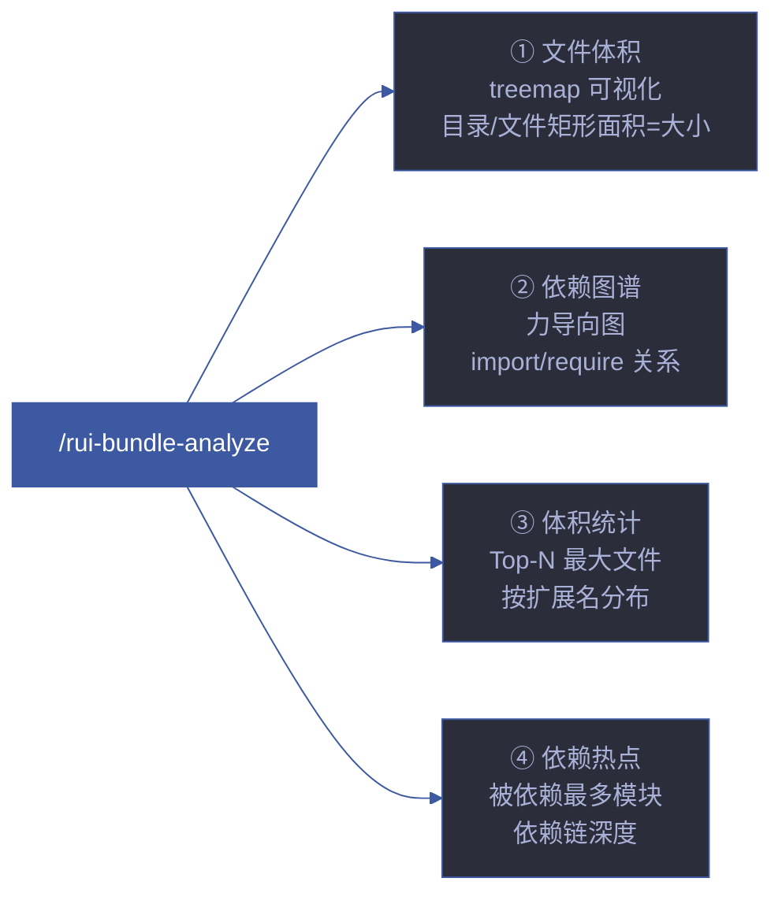

# rui-bundle-analyze — 文件体积与依赖分析

> 类 webpack-bundle-analyzer 风格的项目文件体积 + 依赖关系可视化分析。生成自包含 HTML 交互报告。

[命令](#命令) · [分析维度](#分析维度) · [报告输出](#报告输出) · [集成点](#集成点) · [核心规则](#核心规则) · [生效标志](#生效标志)

## 命令

| 命令 | 说明 |
|------|------|
| `/rui-bundle-analyze` | 全量分析，生成 HTML 报告并在浏览器打开 |
| `/rui-bundle-analyze --dir <path>` | 分析指定目录（默认项目根） |
| `/rui-bundle-analyze --no-open` | 仅生成报告，不打开浏览器 |
| `/rui-bundle-analyze --json` | 输出 JSON 数据（供管线消费） |
| `/rui-bundle-analyze --help` | 显示帮助信息 |

可执行入口：`node skills/rui-bundle-analyze/analyze.mjs [options]`

## 分析维度



### 1. 文件体积分析

- 递归扫描项目目录，计算每个文件的体积
- 目录体积 = 所有子文件体积之和
- Treemap 矩形面积与文件/目录体积成比例
- 颜色编码按文件扩展名区分

### 2. 依赖图谱分析

- 解析 `import` / `require` 语句构建有向依赖图
- 力导向布局展示模块间依赖关系
- 节点大小 = 文件体积，边 = 依赖关系
- 支持的文件类型：`.js` `.mjs` `.jsx` `.ts` `.tsx` `.vue` `.svelte` `.css` `.scss` `.less`

### 3. 体积统计

- Top-20 最大文件列表
- 按扩展名的体积分布
- 按目录的体积分布
- 总文件数、总行数（估算）

### 4. 依赖热点

- Top-10 被依赖最多模块（fan-in）
- Top-10 依赖最多模块（fan-out）
- 循环依赖检测
- 依赖链最大深度

## 报告输出

### HTML 交互报告

`node skills/rui-bundle-analyze/analyze.mjs` 生成自包含 HTML 报告，包含：

- **Treemap 视图** — 类 webpack-bundle-analyzer 的缩放 treemap，鼠标悬停显示文件详情
- **依赖图谱视图** — 力导向依赖关系图，可拖拽节点
- **统计面板** — 文件体积排名、扩展名分布、依赖热点
- **双视图切换** — Treemap / Graph 一键切换

输出路径：`docs/bundle-reports/bundle-YYYY-MM-DD-HHmmss.html`

### JSON 输出

`--json` 输出结构化数据，供管线消费：

```json
{
  "meta": { "root": "...", "generatedAt": "...", "totalFiles": N, "totalSize": N },
  "files": [{ "path": "...", "size": N, "ext": "..." }],
  "directories": [{ "path": "...", "size": N, "fileCount": N }],
  "dependencies": [{ "from": "...", "to": "...", "type": "import|require|dynamic" }],
  "stats": {
    "largestFiles": [...],
    "mostDependedOn": [...],
    "sizeByExt": {...},
    "circularDeps": [...]
  }
}
```

## 集成点

| 集成场景 | 触发方 | 用途 |
|---------|--------|------|
| 健康检查 | rui-health | `file_size` + `dep_analysis` 维度评分 |
| 自改进 D3 诊断 | self-improve agent | 复杂度增长检测 |
| 自改进 D5 诊断 | self-improve agent | 依赖退化检测 |
| 计划阶段 | planner | 项目结构可视化输入 |

## 核心规则

| # | 规则 |
|---|------|
| 1 | 只读分析，不修改源码 |
| 2 | 尊重 `.gitignore` 排除规则 |
| 3 | HTML 报告自包含（CDN 引用 D3 除外） |
| 4 | JSON 输出格式稳定，供管线消费 |
| 5 | 不分析 `node_modules/`、`.git/`、`dist/`、`build/`、`.next/` |
| 6 | 超大文件（> 500 KB 源码）标红警告 |

## 生效标志

| 标志 | 验证方式 |
|------|---------|
| Treemap 可交互缩放 | 打开 HTML 报告，滚轮缩放正常 |
| 依赖图节点可拖拽 | 打开 HTML 报告，拖拽节点正常 |
| 体积统计准确 | `du -sh` 对比报告中的目录体积 |
| JSON 输出可解析 | `--json` 输出为合法 JSON |
| 报告自动打开 | 默认行为在浏览器中打开 HTML |

## 自循环

> 项目体积看门狗。Agent 可按间隔周期性分析，检测体积膨胀。

| 属性 | 值 |
|------|-----|
| 推荐间隔 | `0 9 * * 1`（每周一早 9 点） |
| 触发条件 | 最近 7 天有新 commit |
| 终止条件 | 连续 2 次无新增告警 |
| 迭代动作 | 全量分析 → 与上次基线对比 → 有新增超大文件时告警 |
| 收敛判定 | 无新增 > 500KB 源码文件或超大文件已记录在案 |
