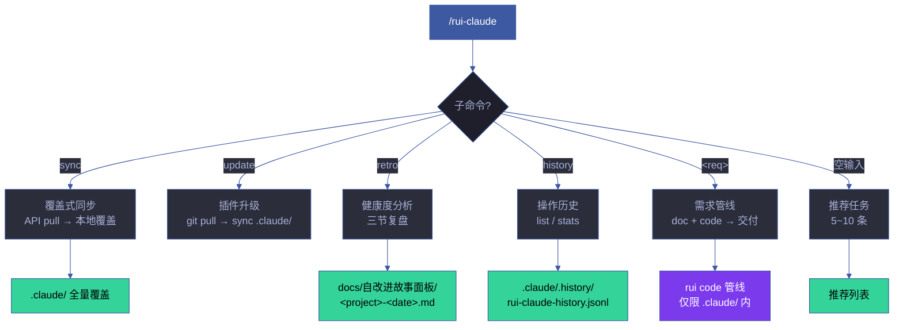
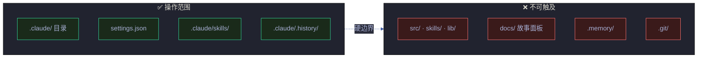
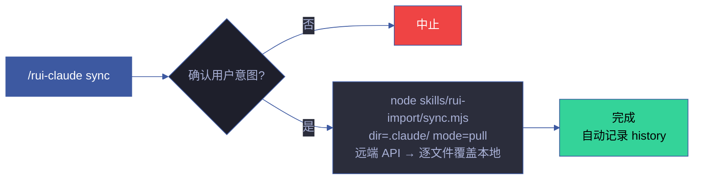
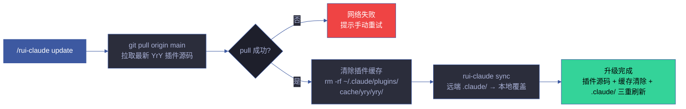
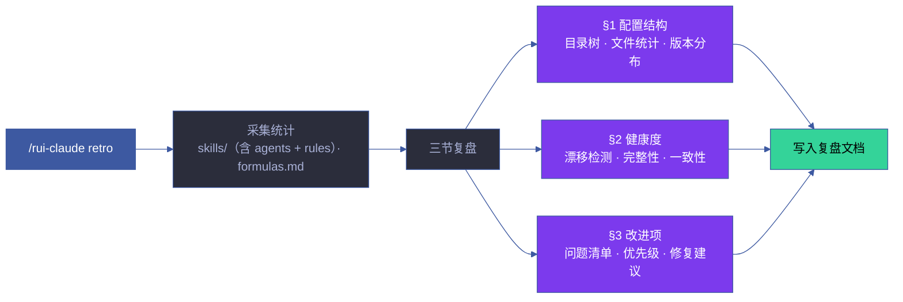
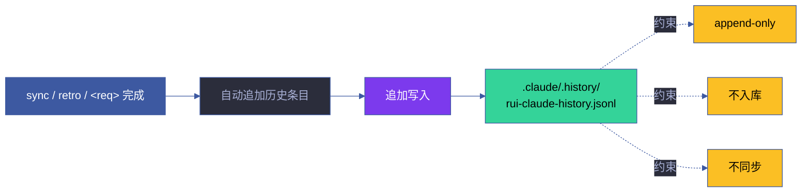
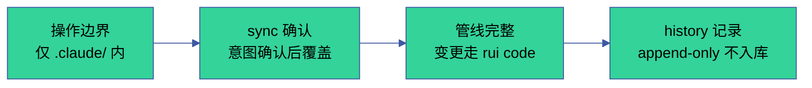
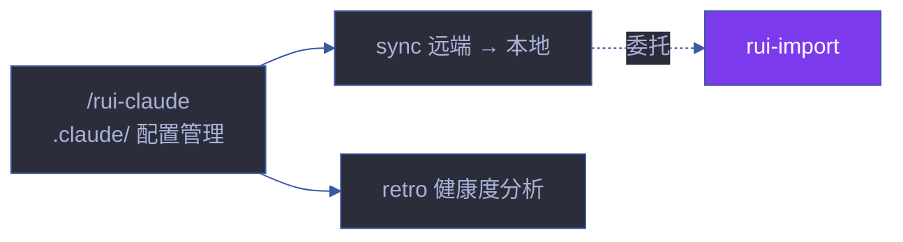

# rui-claude

> **--help / -h**：执行 `node skills/rui-claude/help.mjs` 输出完整帮助（含命令族全景 + 使用场景）。用户输入 `/rui-claude --help` 或 `/rui-claude -h` 或 `/rui-claude help` 时，跳过逻辑，直接运行脚本。

作用范围：当前项目的 `.claude/` 目录。sync / retro 均以 `.claude/` 为操作边界。

**单一职责**：`.claude/` 配置管理。同步远端配置、健康度分析、操作历史。不可触及 `.claude/` 之外的任何文件（硬边界）。不负责技能开发（那是各技能自身 SKILL.md 的职责）。

[命令族全景](#命令族全景) · [操作边界](#操作边界) · [sync](#sync) · [update](#update) · [retro](#retro) · [history](#history) · [需求管线](#需求管线) · [核心规则](#核心规则) · [降级策略](#降级策略) · [生效标志](#生效标志) · [自循环](#自循环)

## 命令族全景



| 命令 | 流程 | 产出 | 类型 |
|------|------|------|:---:|
| `/rui-claude sync` | 查询远端 API → 逐文件 pull 覆盖本地 | `.claude/` 全量覆盖 | 写入 |
| `/rui-claude update` | git pull 最新 YrY 插件 → 清除旧版本缓存 → sync 远端 .claude/ | 插件升级 + 缓存清除 + `.claude/` 刷新 | 写入 |
| `/rui-claude retro` | 分析 .claude/ 结构健康度 → 三节复盘 | `docs/自改进故事面板/<date>.md` | 只读 |
| `/rui-claude history` | 查看操作历史：`list [--limit N]` / `stats [--json]` | 终端输出 | 只读 |
| `/rui-claude 需求` | 需求解析→故事拆分→逐故事 doc+code 管线→交付 | `.claude/` 内文件变更 | 写入 |
| `/rui-claude` | 按 5 层管线评分推荐 5~10 条任务 | 推荐列表 | 只读 |

## 操作边界



## sync — 覆盖式同步



| 项目 | 说明 |
|------|------|
| 数据源 | 远端 API（`api.effiy.cn`），查询 sessions 集合中 `tags[0]=<workspace> && tags[1]=.claude` 的记录 |
| 行为 | 覆盖式更新，逐文件从远端 pull 覆盖本地 `.claude/`，保留嵌套目录结构 |
| 前置条件 | `API_X_TOKEN` 环境变量已配置 |
| 委托 | 完全委托 `rui-import`（`dir=.claude/ mode=pull`），不自行实现同步逻辑 |
| 冲突处理 | 远端优先，本地修改将被覆盖。有本地修改时提示用户先备份 |
| 完成后 | 自动记录 history |

## update — 插件升级 + 缓存清除 + 配置同步



| 项目 | 说明 |
|------|------|
| 触发方式 | `/rui-claude update`，一键升级 YrY 插件并同步 .claude/ 配置 |
| 步骤 1 | `git pull origin main` — 拉取最新 YrY 插件源码到本地 |
| 步骤 2 | 清除插件缓存 — 删除 `~/.claude/plugins/cache/yry/yry/` 下所有旧版本目录 |
| 步骤 3 | 委托 `rui-claude sync` — 从远端 API 覆盖同步最新 .claude/ 目录 |
| 前置条件 | 当前分支为 main，网络可达 origin + api.effiy.cn，`API_X_TOKEN` 已配置 |
| 降级 | git pull 失败时中止并提示手动重试；sync 失败时遵循 sync 自身的降级策略 |

## retro — 健康度分析



| 项目 | 说明 |
|------|------|
| 触发方式 | `/rui-claude retro [--name <story>] [--json]` |
| 输入 | 本地 `.claude/` 目录的 `skills/`（含 agents + rules）· `formulas.md` 等结构 |
| 网络 | 纯本地分析，不连远端 |
| 产出 | `docs/自改进故事面板/<date>.md`（三节：§1 配置结构 · §2 健康度 · §3 改进项） |

### 健康度指标

| 指标 | 检测方式 | 健康阈值 |
|------|---------|---------|
| 版本一致性 | 对比本地 vs 远端版本号 | 一致 = 健康 |
| 配置漂移 | 对比上次快照 | 无变更 = 健康 |
| 文件完整性 | 检查必选文件存在性 | 全部存在 = 健康 |
| 技能有效性 | 检查 SKILL.md frontmatter | 全部有效 = 健康 |

## history — 操作历史



| 子命令 | 说明 |
|--------|------|
| `list [--limit N]` | 列出最近 N 条操作记录 |
| `stats [--json]` | 操作统计摘要（按类型/日期聚合） |

## 需求管线

> `/rui-claude <需求>` 走完整的 rui code 管线，但操作范围限定在 `.claude/` 内。

```
流程:
  1. 需求解析（pm）→ 故事拆分
  2. 分支隔离 → feat/<name>
  3. doc 阶段 → 生成故事文档
  4. code 阶段 → Gate A → 逐模块 → Gate B
  5. 交付收口 → 日志 → 同步 → 通知
```

## 核心规则

| # | 规则 | 违反标识 | 设计理由 |
|---|------|---------|---------|
| 1 | 操作范围仅限 `.claude/`，不得触及外部文件 | — | 配置隔离 |
| 2 | 对 `.claude/` 的代码修改必须通过 rui code 管线 | `skip-gate-a` | 质量门禁一致 |
| 3 | 必须在 `feat/<name>` 分支 | `no-checkout` | 分支隔离 |
| 4 | 禁止自动合并 | `auto-merge` | 合并需人工审查 |
| 5 | sync 覆盖式更新，执行前确认意图 | — | 防止意外覆盖 |
| 6 | 空输入只推荐不执行 | — | 安全第一 |
| 7 | 禁止自动 commit/push | — | 变更需人工确认 |
| 8 | history 文件 append-only，不入库，不同步 | — | 操作审计 |

详见 [rules/rui-claude.md](./rules/rui-claude.md)。

## 规则

- [rui-claude.md](./rules/rui-claude.md) — .claude/ 配置管理的操作约束和规则

## 测试

> .claude/ 配置管理的操作边界、sync/update/retro 流程和健康度指标的自动化验证。

### 运行测试

```bash
npx vitest run skills/rui-claude/tests/          # 全量运行
npx vitest skills/rui-claude/tests/              # 监听模式
npx vitest run --coverage skills/rui-claude/tests/  # 覆盖率报告
```

### 测试文件

| 文件 | 测试范围 | 类型 |
|------|---------|:---:|
| `tests/rui-claude.test.mjs` | 命令路由、操作边界、sync 流程、健康度检查 | 单元 |

### 测试策略

| 层级 | 范围 | 要求 |
|------|------|------|
| **操作边界测试** | .claude/ 硬边界、外部文件拒绝 | 边界内外路径覆盖 |
| **sync 流程测试** | 覆盖式同步、冲突处理、意图确认 | 每种路径有测试 |
| **健康度测试** | 版本一致性、配置漂移、文件完整性、技能有效性 | 4 项指标各有测试 |
| **history 测试** | append-only、不入库、不同步 | 约束条件验证 |

### 覆盖要求

| 维度 | 最低阈值 | 目标 |
|------|:---:|:---:|
| 命令覆盖 | 100% | 6 个子命令各有测试 |
| 操作边界 | 100% | 允许/禁止路径全覆盖 |
| 核心规则 | 100% | 8 条规则各有验证 |
| 降级路径 | ≥ 80% | 每种降级情况有测试 |

## 降级策略

| 情况 | 降级行为 | 恢复方式 |
|------|---------|---------|
| 远程配置不可达 | 记录告警，继续使用本地配置 | 网络恢复后重试 |
| sync 冲突（本地+远程均有修改） | 提示用户手动选择保留策略 | 用户选择后重新执行 |
| health 检查发现配置漂移 | 输出差异报告，建议 sync | 执行 sync |
| 本地 .claude/ 目录缺失 | 标记为首次初始化，建议 sync | 执行 sync |
| 版本不一致 | 建议执行 `/rui-version --up` | 执行版本升级 |
| API_X_TOKEN 缺失 | 降级为本地模式，只读操作可用 | 配置环境变量 |

## 生效标志



| 标志 | 未达标的处置 |
|------|------------|
| 操作仅限 `.claude/` 目录 | 撤销外部变更 |
| sync 前确认用户意图 | 补确认后重新执行 |
| 变更走 rui code 管线 | 切分支重走管线 |
| history 仅本地不入库 | 从 git 暂存区移除 history 文件 |

## 自循环

> 配置健康持续监控。Agent 可按间隔周期性检查 .claude/ 目录健康度。

| 属性 | 值 |
|------|-----|
| 推荐间隔 | `0 10 * * *`（每天早 10 点） |
| 触发条件 | 最近 24 小时有远程配置更新 |
| 终止条件 | 连续 3 次检查无漂移 |
| 迭代动作 | ① health 全量检查 → ② 对比上次快照 → ③ 有漂移时建议 sync → ④ 生成健康报告 |
| 告警条件 | 配置漂移 / 版本不一致 / 文件缺失 |
| 收敛判定 | 无配置漂移 + 版本一致 |

> 本技能 `checkMode: "slash"`——无独立 CLI，由 `/rui-claude` 在 Claude Code 会话内触发。6 字段契约与调度规则详见 [rules/loop-engineering.md](../rui/rules/loop-engineering.md)。

## 与 rui 的关系

`/rui-claude` 是独立于 rui 编排管线的配置管理技能。操作范围严格限定在 `.claude/` 目录内（硬边界）。不参与故事管线（init → doc → plan → code → update → yry），但通过 sync 委托 rui-import 同步远端配置。

