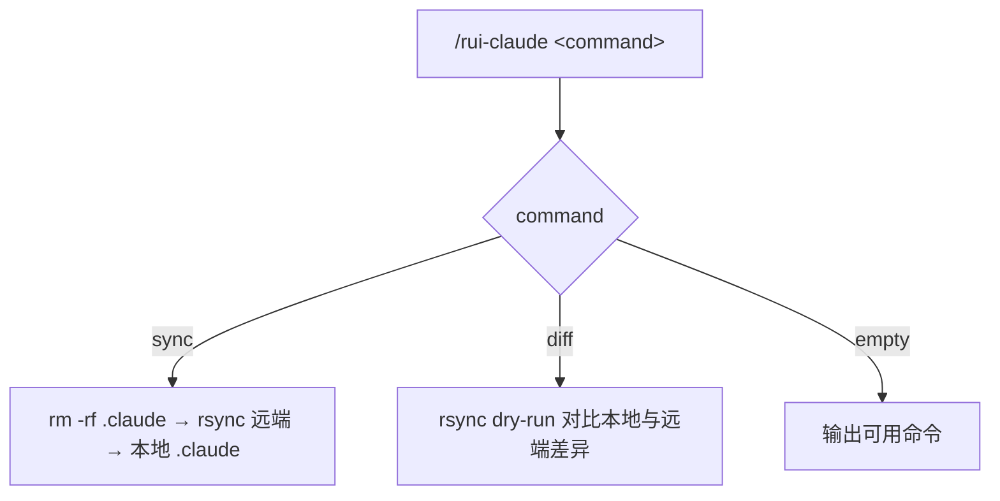
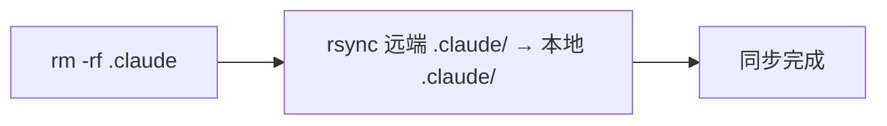

# rui-claude

---

## 命令概览

| 命令 | 流程 |
|------|------|
| `/rui-claude sync` | 删除本地 `.claude` → 从远端 rsync 拉取最新配置 |
| `/rui-claude diff` | 对比本地 `.claude` 与远端差异（dry-run） |
| `/rui-claude`（空输入） | 输出可用命令帮助 |

---

## /rui-claude sync

从远端服务器同步最新 `.claude` 配置到本地项目。覆盖式更新：先删除本地 `.claude` 目录，再 rsync 拉取。

| Step | 操作 | 命令 |
|------|------|------|
| 1 | 删除本地 `.claude` | `rm -rf .claude` |
| 2 | rsync 远端到本地 `.claude` | `rsync -avz --exclude '.git' root@www.effiy.cn:/home/claude/YiKnowledge/static/${PROJECT}/.claude/ ./.claude/` |

> **前置条件**：本机 SSH key 已授权访问 `root@www.effiy.cn`。
>
> `${PROJECT}` 为当前项目根目录名（`basename "$PWD"`），如 `YrY`。执行时自动替换。

---

## /rui-claude diff

对比本地 `.claude` 与远端差异，不做实际同步。

| Step | 操作 | 命令 |
|------|------|------|
| 1 | rsync dry-run 对比 | `rsync -avz --dry-run --exclude '.git' root@www.effiy.cn:/home/claude/YiKnowledge/static/${PROJECT}/.claude/ ./.claude/` |

> 输出远端相对于本地的差异文件列表。`>` 标记的文件为远端有更新。

---

## 安全约束

- SSH key 授权由系统管理员配置，本 skill 不管理凭据
- 远端地址中 `${PROJECT}` 为当前项目根目录名，执行时自动解析
