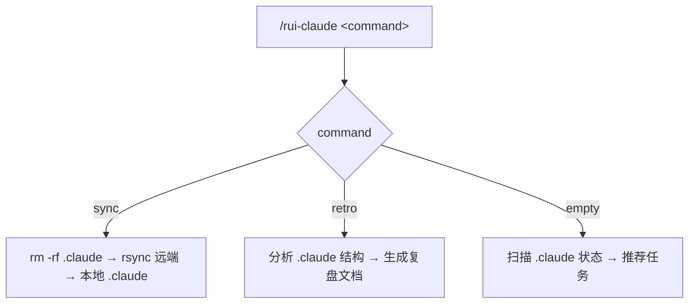
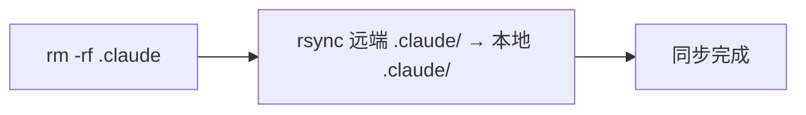
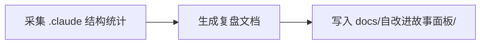

# rui-claude



---

## 命令概览

| 命令 | 流程 |
|------|------|
| `/rui-claude sync` | 删除本地 `.claude` → 从远端 rsync 拉取最新配置 |
| `/rui-claude retro` | 分析 `.claude` 结构健康度，生成复盘文档到 `docs/自改进故事面板/` |
| `/rui-claude`（空输入） | 扫描 .claude 状态 → 推荐可执行任务 |

---

## /rui-claude sync

从远端服务器同步最新 `.claude` 配置到本地项目。覆盖式更新：先删除本地 `.claude` 目录，再 rsync 拉取。



| Step | 操作 | 命令 |
|------|------|------|
| 1 | 删除本地 `.claude` | `rm -rf .claude` |
| 2 | rsync 远端到本地 `.claude` | `rsync -avz --exclude '.git' root@www.effiy.cn:/home/claude/YiKnowledge/static/${PROJECT}/.claude/ ./.claude/` |

> **前置条件**：本机 SSH key 已授权访问 `root@www.effiy.cn`。
>
> `${PROJECT}` 为当前项目根目录名（`basename "$PWD"`），如 `YrY`。执行时自动替换。

---

## /rui-claude retro

分析当前项目 `.claude/` 目录结构，生成配置复盘文档。



| Step | 操作 | 命令 |
|------|------|------|
| 1 | 采集 .claude/ 目录结构 | `node skills/rui-claude/scripts/retro.js` 遍历 agents/rules/templates/skills 统计 |
| 2 | 生成复盘文档 | 按 §1 配置结构 §2 健康度 §3 改进项 三段结构输出 md |
| 3 | 保存文档 | 写入 `${REPO_ROOT}/docs/自改进故事面板/${PROJECT}-${date}.md` |

> **参数：** `--name <story>` 关联故事名，`--json` 输出 JSON 到 stdout。
>
> 复盘聚焦 `.claude` 配置本身，不涉及执行记忆或项目代码分析。

---

## /rui-claude（空输入）

当 `/rui-claude` 无参数时，扫描根项目下**所有子项目**的 `.claude/` 状态，每个子项目独立分析，推荐 5~10 条可执行任务。

### 扫描规则

扫描 `${REPO_ROOT}/` 下所有一级子目录（排除 `docs/`、`effiy.cn/` 等非项目目录），每个子项目独立采集：

| 扫描源 | 提取信息 |
|--------|---------|
| `<project>/.claude/` 是否存在 | 判定是否需要首次同步 |
| `<project>/.claude/agents/`、`rules/`、`templates/`、`skills/` | 各子目录文件数、缺失项 |
| `<project>/.claude/CLAUDE.md`、`.mcp.json` | 关键根文件存在性 |
| `docs/自改进故事面板/<project>-*.md` | 各项目已有复盘文档及最新日期 |

### 推荐分类

| 类型 | 触发条件 | 推荐命令 |
|------|---------|---------|
| 首次同步 | `.claude/` 不存在 | `cd <project> && /rui-claude sync` |
| 配置复盘 | `.claude/` 存在且无复盘记录 | `cd <project> && /rui-claude retro` |
| 增量复盘 | `.claude/` 存在但复盘过期（>7 天） | `cd <project> && /rui-claude retro` |
| 结构补齐 | 缺少关键子目录或文件（如 agents/、CLAUDE.md） | 指出缺失项，建议 sync |
| 健康巡检 | 配置完整且有近期复盘 | 标记为健康，跳过 |

### 输出格式

各子项目独立推荐，按优先级排列：

```
🧭 rui-claude 任务推荐（共扫描 N 个项目）

## <project-1>
   ✅ .claude/ 存在 | agents: 6 | rules: 4 | retro: 2026-05-09
   → 健康，无需操作

## <project-2>
   ⚠️ .claude/ 存在 | agents: 0 | rules: 2 | retro: 无
   1. [结构补齐] agents/ 为空，建议 cd <project-2> && /rui-claude sync
   2. [配置复盘] 无复盘记录，建议 cd <project-2> && /rui-claude retro

## <project-3>
   ❌ .claude/ 不存在
   1. [首次同步] cd <project-3> && /rui-claude sync
```

> 每个子项目的 `.claude` 互相独立，复盘文档以 `<project>-<date>.md` 区分。

---

## 核心规则

1. **操作范围仅限 `.claude/`**：不得触及根目录的 `.claude/`，不得触及 `.claude/` 以外文件
2. **分支隔离**：禁止直接修改 `.claude/` 下内容，所有改动必须从 main 拉取 `feat/<name>` 分支进行
3. **禁止自动合并**：功能分支不得自动合并到 main，合并操作一律由开发者手动执行
4. **sync 覆盖式更新**：先删除本地 `.claude` 再 rsync，执行前需确认
5. **retro 纯本地分析**：不连接远端，仅分析本地 `.claude/` 结构
6. **retro 输出到根项目**：文档写入 `docs/自改进故事面板/<project>-<date>.md`
7. **空输入只推荐不执行**：扫描状态后推荐任务，不触发管线
8. **不管理凭据**：SSH key 由系统管理员配置

详见 [`rules/rui-claude.md`](../../rules/rui-claude.md)。

---

## 安全约束

- SSH key 授权由系统管理员配置，本 skill 不管理凭据
- 远端地址中 `${PROJECT}` 为当前项目根目录名，执行时自动解析
