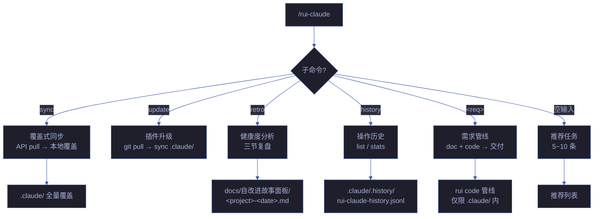
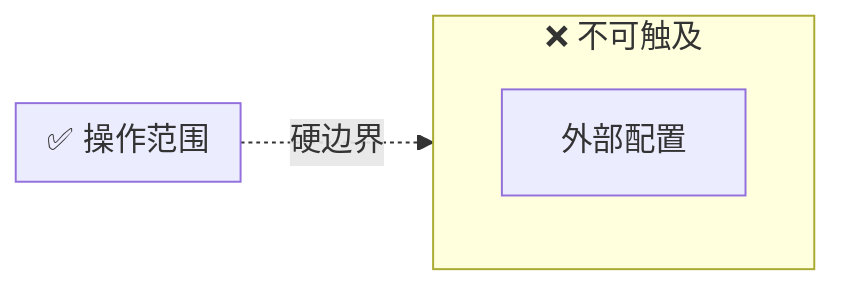
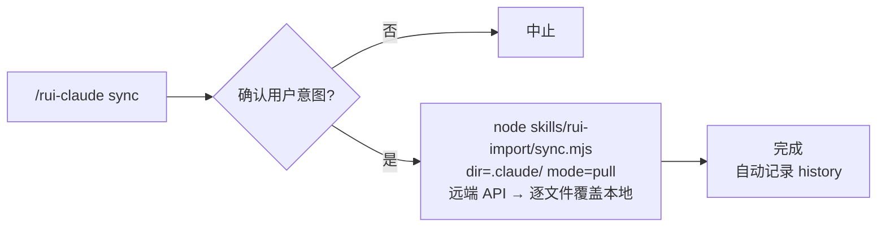
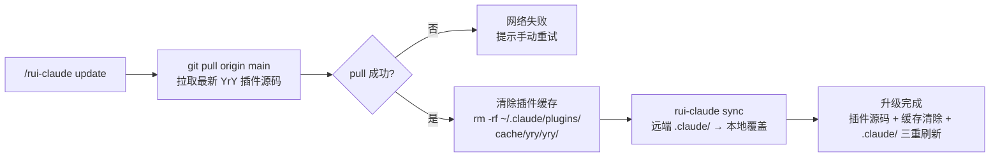
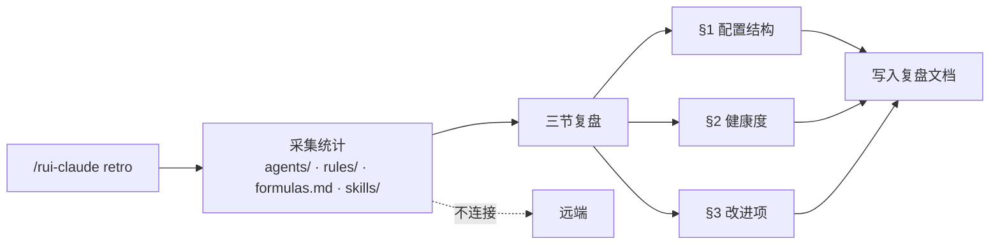
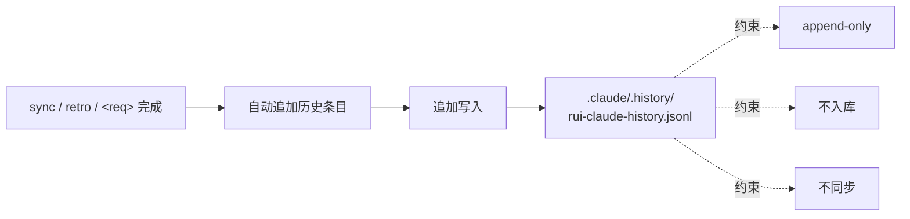
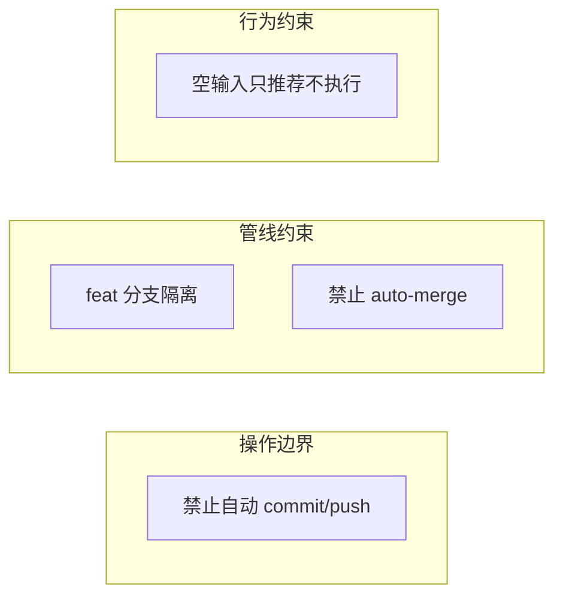
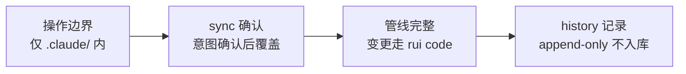

# rui-claude

> **--help / -h**：执行 `node skills/rui-claude/help.mjs` 输出完整帮助（含命令族全景 + 使用场景）。用户输入 `/rui-claude --help` 或 `/rui-claude -h` 或 `/rui-claude help` 时，跳过逻辑，直接运行脚本。

作用范围：当前项目的 `.claude/` 目录。sync / retro 均以 `.claude/` 为操作边界。

[命令族全景](#命令族全景) · [操作边界](#操作边界) · [sync](#sync) · [update](#update) · [retro](#retro) · [history](#history) · [核心规则](#核心规则) · [参考模式](#参考模式) · [生效标志](#生效标志)

> **`version --up` 已迁移至 [`/rui-version --up`](../rui-version/SKILL.md)。**

## 命令族全景

| 命令 | 流程 | 产出 |
|------|------|------|
| `/rui-claude sync` | 查询远端 API → 逐文件 pull 覆盖本地 | `.claude/` 全量覆盖 |
| `/rui-claude update` | git pull 最新 YrY 插件 → 清除旧版本缓存 → sync 远端 .claude/ | 插件升级 + 缓存清除 + `.claude/` 刷新 |
| `/rui-claude update-version` | **已废弃** → 使用 [`/rui-version --up`](../rui-version/SKILL.md#version---up) | 版本收敛升级（已迁移至 rui-version） |
| `/rui-claude retro` | 分析 .claude/ 结构健康度 → 三节复盘 | `docs/自改进故事面板/<date>.md` |
| `/rui-claude history` | 查看操作历史：`list [--limit N]` / `stats [--json]` | 终端输出 |
| `/rui-claude 需求` | 需求解析→故事拆分→逐故事 doc+code 管线→交付 | `.claude/` 内文件变更 |
| `/rui-claude` | 按 5 层管线评分推荐 5~10 条任务 | 推荐列表 |

## 操作边界

## sync — 覆盖式同步

| 项目 | 说明 |
|------|------|
| 数据源 | 远端 API（`api.effiy.cn`），查询 sessions 集合中 `tags[0]=<workspace> && tags[1]=.claude` 的记录 |
| 行为 | 覆盖式更新，逐文件从远端 pull 覆盖本地 `.claude/`，保留嵌套目录结构 |
| 前置条件 | `API_X_TOKEN` 环境变量已配置 |
| 委托 | 完全委托 `rui-import`（`dir=.claude/ mode=pull`），不自行实现同步逻辑 |
| 完成后 | 自动记录 history |

## update — 插件升级 + 缓存清除 + 配置同步

| 项目 | 说明 |
|------|------|
| 触发方式 | `/rui-claude update`，一键升级 YrY 插件并同步 .claude/ 配置 |
| 步骤 1 | `git pull origin main` — 拉取最新 YrY 插件源码到本地 |
| 步骤 2 | 清除插件缓存 — 删除 `~/.claude/plugins/cache/yry/yry/` 下所有旧版本目录，确保下次加载从最新源码重建缓存 |
| 步骤 3 | 委托 `rui-claude sync` — 从远端 API 覆盖同步最新 .claude/ 目录 |
| 前置条件 | 当前分支为 main，网络可达 origin + api.effiy.cn，`API_X_TOKEN` 已配置 |
| 降级 | git pull 失败时中止并提示手动重试；sync 失败时遵循 sync 自身的降级策略 |
| 完成后 | 自动记录 history |

## update-version — 已废弃

> **此命令已迁移至 [`/rui-version --up`](../rui-version/SKILL.md#version---up)。**
> 请使用 `/rui version --up` 或 `/rui-version --up` 执行版本收敛升级。
> 功能完全等价：合并分支 → 判定版本 → 更新 4 文件 → commit → push → tag。

| 项目 | 说明 |
|------|------|
| 触发方式 | `/rui-claude retro [--name <story>] [--json]` |
| 输入 | 本地 `.claude/` 目录的 `agents/` · `rules/` · `skills/` · `formulas.md` 等结构 |
| 网络 | 纯本地分析，不连远端 |
| 产出 | `docs/自改进故事面板/<date>.md`（三节：§1 配置结构 · §2 健康度 · §3 改进项） |

## history — 操作历史

| 子命令 | 说明 |
|--------|------|
| `list [--limit N]` | 列出最近 N 条操作记录 |
| `stats [--json]` | 操作统计摘要 |

## 核心规则

| # | 规则 | 违反标识 |
|---|------|---------|
| 1 | 操作范围仅限 `.claude/`，不得触及外部文件 | — |
| 2 | 对 `.claude/` 的代码修改必须通过 rui code 管线 | `skip-gate-a` |
| 3 | 必须在 `feat/<name>` 分支 | `no-checkout` |
| 4 | 禁止自动合并 | `auto-merge` |
| 5 | sync 覆盖式更新，执行前确认意图 | — |
| 6 | 空输入只推荐不执行 | — |
| 7 | 禁止自动 commit/push | — |

详见 [rules/rui-claude.md](../../rules/rui-claude.md)。

## 参考模式

| 命令 | 参考要点 |
|------|---------|
| sync | 远端 API 查询 + 文件下载模式 |
| update | git pull + 清除插件缓存 + sync 级联操作，三重刷新 |
| retro | 健康度指标、行为纪律审查 |
| 需求管线 | 安全约束、验证门禁、仅限 `.claude/` 边界 |
| 趋势跟踪 | `.claude/` 配置演进方向、新兴工具采纳 |

## 降级策略

| 情况 | 降级行为 |
|------|---------|
| 远程配置不可达 | 记录告警，继续使用本地配置 |
| sync 冲突（本地+远程均有修改） | 提示用户手动选择保留策略 |
| health 检查发现配置漂移 | 输出差异报告，建议 sync |
| 本地 .claude/ 目录缺失 | 标记为首次初始化，建议 sync |
| 版本不一致 | 建议执行 `/rui-version --up` |

## 生效标志

| 标志 | 未达标的处置 |
|------|------------|
| 操作仅限 `.claude/` 目录 | 撤销外部变更 |
| sync 前确认用户意图 | 补确认后重新执行 |
| 变更走 rui code 管线 | 切分支重走管线 |
| history 仅本地不入库 | 从 git 暂存区移除 history 文件 |

## 自循环

> 配置健康持续监控。Agent 可按间隔周期性检查 .claude/ 目录健康度。

| 属性 | 值 |
|------|-----|
| 推荐间隔 | `0 10 * * *`（每天早 10 点） |
| 触发条件 | 最近 24 小时有远程配置更新 |
| 终止条件 | 连续 3 次检查无漂移 |
| 迭代动作 | health 全量检查 → 对比上次快照 → 有漂移时建议 sync |
| 收敛判定 | 无配置漂移 + 版本一致 |
