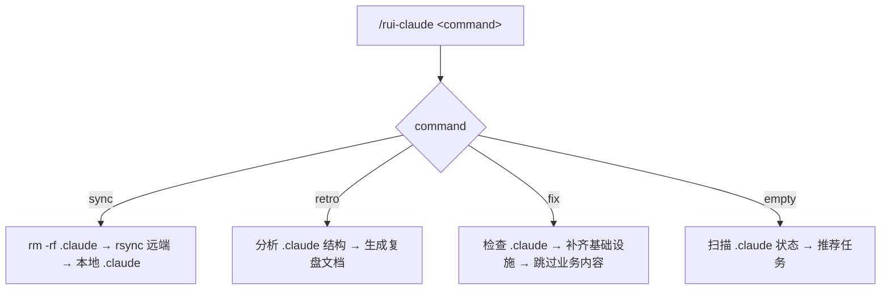
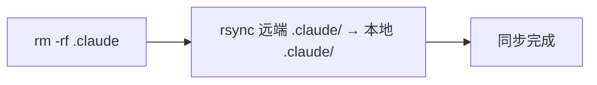
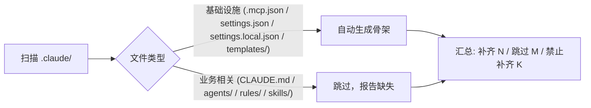

# rui-claude



---

## 命令概览

| 命令 | 流程 |
|------|------|
| `/rui-claude sync` | 删除本地 `.claude` → 从远端 rsync 拉取最新配置 |
| `/rui-claude retro` | 分析 `.claude` 结构健康度，生成复盘文档到 `docs/自改进故事面板/` |
| `/rui-claude fix` | 检查 `.claude` 缺失项 → 补齐基础设施 → 跳过业务内容 |
| `/rui-claude`（空输入） | 扫描 .claude 状态 → 推荐可执行任务 |

---

## /rui-claude sync

从远端服务器同步最新 `.claude` 配置到本地项目。覆盖式更新：先删除本地 `.claude` 目录，再 rsync 拉取。



| Step | 操作 | 命令 |
|------|------|------|
| 1 | 删除本地 `.claude` | `rm -rf .claude` |
| 2 | rsync 远端到本地 `.claude` | `rsync -avz --exclude '.git' root@www.effiy.cn:/home/claude/YiKnowledge/static/${PROJECT}/.claude/ ./.claude/` |

> **前置条件**：本机 SSH key 已授权访问 `root@www.effiy.cn`。
>
> `${PROJECT}` 为当前项目根目录名（`basename "$PWD"`），如 `YrY`。执行时自动替换。

---

## /rui-claude retro

分析当前项目 `.claude/` 目录结构，生成配置复盘文档。


| Step | 操作 | 命令 |
|------|------|------|
| 1 | 采集 .claude/ 目录结构 | `node skills/rui-claude/scripts/retro.js` 遍历 agents/rules/templates/skills 统计 |
| 2 | 生成复盘文档 | 按 §1 配置结构 §2 健康度 §3 改进项 三段结构输出 md |
| 3 | 保存文档 | 写入 `${REPO_ROOT}/docs/自改进故事面板/${PROJECT}-${date}.md` |

> **参数：** `--name <story>` 关联故事名，`--json` 输出 JSON 到 stdout。
>
> 复盘聚焦 `.claude` 配置本身，不涉及执行记忆或项目代码分析。

---

## /rui-claude fix

检查 `.claude/` 目录缺失项，自动补齐基础设施文件，跳过业务相关文件。



| Step | 操作 | 命令 |
|------|------|------|
| 1 | 检查并补齐基础设施 | `node skills/rui-claude/scripts/fix.js` |
| 2 | 输出补齐报告 | 补齐/跳过/禁止 三类统计 |

### 补齐范围

| 类型 | 文件/目录 | 操作 | 原因 |
|------|----------|------|------|
| 基础设施 | `.mcp.json` | 写入 `{"mcpServers": {}}` | MCP 配置骨架，与业务无关 |
| 基础设施 | `settings.json` | 写入 `{"permissions": {}}` | 权限配置骨架，与业务无关 |
| 基础设施 | `settings.local.json` | 写入 `{}` | 本地覆盖骨架，与业务无关 |
| 基础设施 | `templates/` | 创建空目录 | 目录结构，与业务无关 |

### 禁止补齐（仅报告缺失）

| 类型 | 文件/目录 | 原因 |
|------|----------|------|
| 业务 | `CLAUDE.md` | 包含项目哲学、原则、行为准则 |
| 业务 | `agents/*.md` | Agent 角色定义与决策边界 |
| 业务 | `rules/*.md` | 管线规则与约束 |
| 业务 | `skills/` | Skill 定义与实现 |

> **参数：** `--dry-run` 仅检查不写入，`--json` 输出 JSON。
>
> 业务相关文件缺失时，应通过 `/rui init`（基线生成）或 `/rui-claude sync`（从远端拉取）获取，不可自动生成空壳。

### 输出示例

```
🔧 rui-claude fix: YrY

已补齐（2 项）：
  ✅ 创建: .mcp.json
  ✅ 创建: settings.json

跳过（1 项）：
  ⏭️  templates/ — 已存在

禁止补齐 — 业务相关内容（6 项）：
  🚫 CLAUDE.md — 文件缺失
  🚫 agents/AGENT.md — 文件缺失
  🚫 rules/code-pipeline.md — 文件缺失
  ...
```

---

## /rui-claude（空输入）

当 `/rui-claude` 无参数时，扫描已有 `.claude/` 的所有子项目，推荐 5~10 条可执行任务。

### 推荐生成规则

扫描根项目 `${REPO_ROOT}/` 下所有存在 `.claude/` 的子目录，综合生成推荐：

| 扫描源 | 提取信息 |
|--------|---------|
| `<project>/.claude/agents/` | Agent 数量、角色覆盖 |
| `<project>/.claude/rules/` | 规则文件数、约束覆盖 |
| `<project>/.claude/templates/` | 模板文件数 |
| `<project>/.claude/skills/` | 技能文件数 |
| `<project>/.claude/CLAUDE.md` | 存在性、行数 |
| `<project>/.claude/.mcp.json` | 是否存在 |
| `docs/自改进故事面板/<project>-*.md` | 复盘历史 |

### 推荐分类

| 类型 | 说明 | 示例 |
|------|------|------|
| 首次复盘 | 有 .claude/ 但无复盘记录 | `cd <project> && /rui-claude retro` |
| 增量复盘 | 复盘过期 >7 天 | `cd <project> && /rui-claude retro` |
| 基础设施补齐 | .mcp.json / settings.json 缺失 | `cd <project> && /rui-claude fix` |
| 配置补齐 | agents/rules/skills 为空或 CLAUDE.md 缺失 | `cd <project> && /rui-claude sync` |
| 结构优化 | 某子目录文件数异常（过多/过少） | 手动审查并精简 |
| 定期巡检 | 近期有复盘、配置完整 | 标记为健康 |

### 输出格式

```
🧭 rui-claude 任务推荐（共 N 条）

<project-1>:
1. [首次复盘] cd <project-1> && /rui-claude retro
   理由: .claude/ 存在但无复盘记录 | 来源: docs/自改进故事面板/

<project-2>:
2. [增量复盘] cd <project-2> && /rui-claude retro
   理由: 上次复盘 12 天前 | 来源: docs/自改进故事面板/<project-2>-2026-04-27.md

3. [基础设施补齐] cd <project-2> && /rui-claude fix
   理由: .mcp.json 缺失 | 来源: .claude/ 结构检查

4. [配置补齐] cd <project-2> && /rui-claude sync
   理由: agents/ 为空 | 来源: .claude/ 结构检查

...
```

> 按项目分组，每个子项目的 `.claude` 互相独立推荐。

---

## 核心规则

1. **操作范围仅限 `.claude/`**：不得触及根目录的 `.claude/`，不得触及 `.claude/` 以外文件
2. **分支隔离**：禁止直接修改 `.claude/` 下内容，所有改动必须从 main 拉取 `feat/<name>` 分支进行
3. **禁止自动合并**：功能分支不得自动合并到 main，合并操作一律由开发者手动执行
4. **sync 覆盖式更新**：先删除本地 `.claude` 再 rsync，执行前需确认
5. **retro 纯本地分析**：不连接远端，仅分析本地 `.claude/` 结构
6. **retro 输出到根项目**：文档写入 `docs/自改进故事面板/<project>-<date>.md`
7. **fix 只补齐基础设施**：仅生成 `.mcp.json`、`settings.json`、`settings.local.json`、`templates/` 空目录；禁止生成 CLAUDE.md、agents/、rules/、skills/ 等业务文件
8. **空输入只推荐不执行**：扫描状态后推荐任务，不触发管线
9. **不管理凭据**：SSH key 由系统管理员配置

详见 [`rules/rui-claude.md`](../../rules/rui-claude.md)。

---

## 安全约束

- SSH key 授权由系统管理员配置，本 skill 不管理凭据
- 远端地址中 `${PROJECT}` 为当前项目根目录名，执行时自动解析
