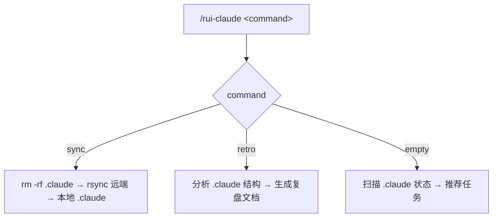
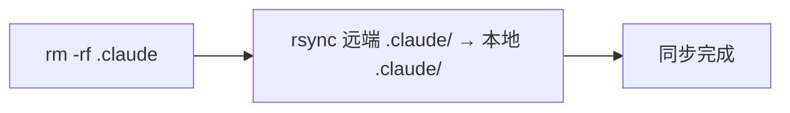
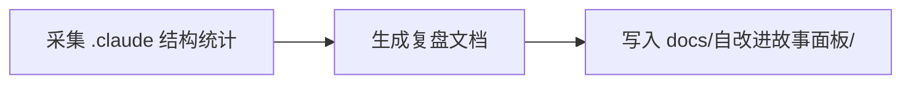

# rui-claude



---

## 命令概览

| 命令 | 流程 |
|------|------|
| `/rui-claude sync` | 删除本地 `.claude` → 从远端 rsync 拉取最新配置 |
| `/rui-claude retro` | 分析 `.claude` 结构健康度，生成复盘文档到 `docs/自改进故事面板/` |
| `/rui-claude`（空输入） | 扫描 .claude 状态 → 推荐可执行任务 |

---

## /rui-claude sync

从远端服务器同步最新 `.claude` 配置到本地项目。覆盖式更新：先删除本地 `.claude` 目录，再 rsync 拉取。



| Step | 操作 | 命令 |
|------|------|------|
| 1 | 删除本地 `.claude` | `rm -rf .claude` |
| 2 | rsync 远端到本地 `.claude` | `rsync -avz --exclude '.git' root@www.effiy.cn:/home/claude/YiKnowledge/static/${PROJECT}/.claude/ ./.claude/` |

> **前置条件**：本机 SSH key 已授权访问 `root@www.effiy.cn`。
>
> `${PROJECT}` 为当前项目根目录名（`basename "$PWD"`），如 `YrY`。执行时自动替换。

---

## /rui-claude retro

分析当前项目 `.claude/` 目录结构，生成配置复盘文档。



| Step | 操作 | 命令 |
|------|------|------|
| 1 | 采集 .claude/ 目录结构 | `node skills/rui-claude/scripts/retro.js` 遍历 agents/rules/templates/skills 统计 |
| 2 | 生成复盘文档 | 按 §1 配置结构 §2 健康度 §3 改进项 三段结构输出 md |
| 3 | 保存文档 | 写入 `${REPO_ROOT}/docs/自改进故事面板/${PROJECT}-${date}.md` |

> **参数：** `--name <story>` 关联故事名，`--json` 输出 JSON 到 stdout。
>
> 复盘聚焦 `.claude` 配置本身，不涉及执行记忆或项目代码分析。

---

## /rui-claude（空输入）

当 `/rui-claude` 无参数时，扫描 `.claude/` 目录状态，推荐 3~5 条可执行任务。

### 扫描规则

| 扫描源 | 提取信息 |
|--------|---------|
| `.claude/` 目录是否存在 | 判定是否需要首次同步 |
| `.claude/agents/`、`rules/`、`templates/`、`skills/` | 各子目录文件数、缺失项 |
| `.claude/CLAUDE.md`、`.mcp.json` | 关键根文件存在性 |
| `docs/自改进故事面板/` | 已有复盘文档及最新日期 |

### 推荐分类

| 类型 | 触发条件 | 推荐命令 |
|------|---------|---------|
| 首次同步 | `.claude/` 不存在 | `/rui-claude sync` |
| 配置复盘 | `.claude/` 存在且近期未复盘 | `/rui-claude retro [--name <story>]` |
| 结构补齐 | 缺少关键子目录或文件 | 指出缺失项，建议 sync 或手动创建 |
| 定期检查 | 配置完整 | `/rui-claude retro` 生成最新复盘 |

### 输出格式

```
🧭 rui-claude 任务推荐（<project>）

1. [首次同步] /rui-claude sync
   理由: .claude/ 不存在 | 来源: 目录检查

2. [配置复盘] /rui-claude retro
   理由: 上次复盘 7 天前 | 来源: docs/自改进故事面板/

3. [结构补齐] /rui-claude sync
   理由: agents/ 目录缺失 | 来源: .claude/ 结构检查
```

---

## 核心规则

1. **操作范围仅限 `.claude/`**：不得触及根目录或 `.claude/` 以外文件
2. **sync 覆盖式更新**：先删除本地 `.claude` 再 rsync，执行前需确认
3. **retro 纯本地分析**：不连接远端，仅分析本地 `.claude/` 结构
4. **retro 输出到根项目**：文档写入 `docs/自改进故事面板/<project>-<date>.md`
5. **空输入只推荐不执行**：扫描状态后推荐任务，不触发管线
6. **不管理凭据**：SSH key 由系统管理员配置

详见 [`rules/rui-claude.md`](../../rules/rui-claude.md)。

---

## 安全约束

- SSH key 授权由系统管理员配置，本 skill 不管理凭据
- 远端地址中 `${PROJECT}` 为当前项目根目录名，执行时自动解析
