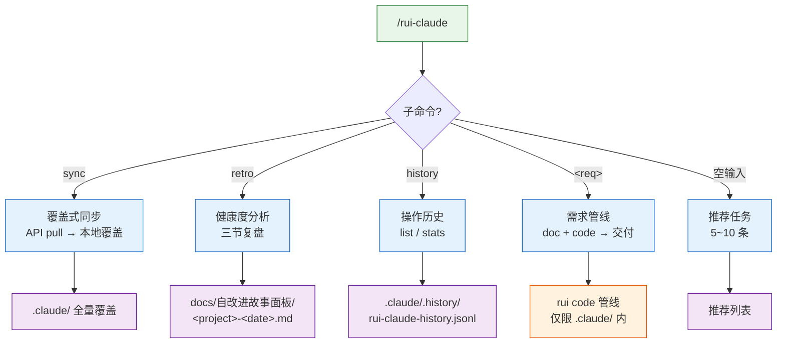
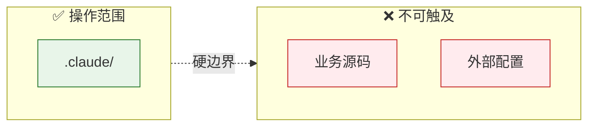
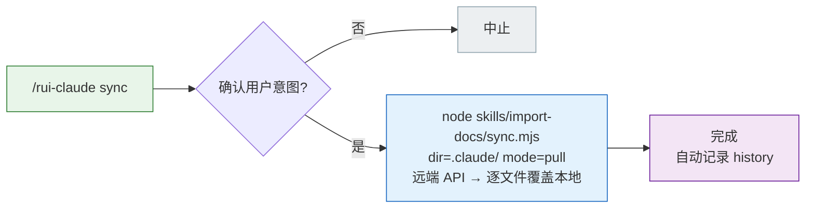
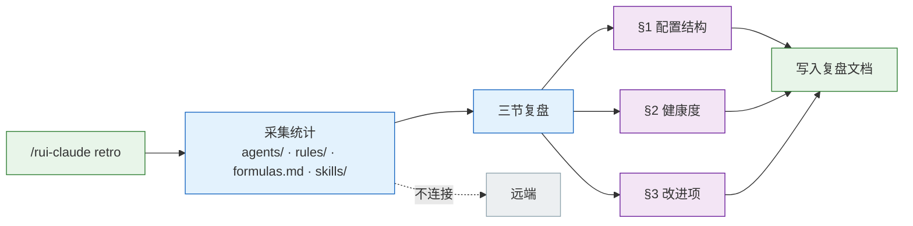
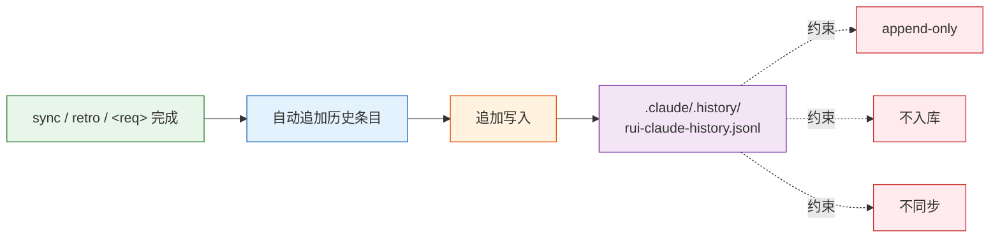
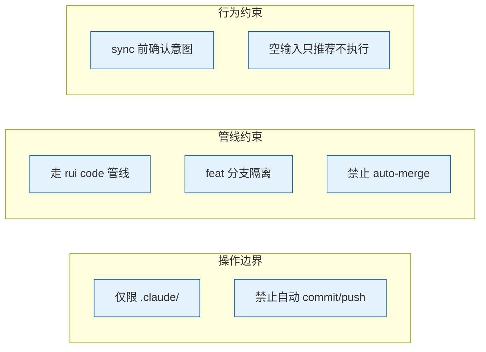
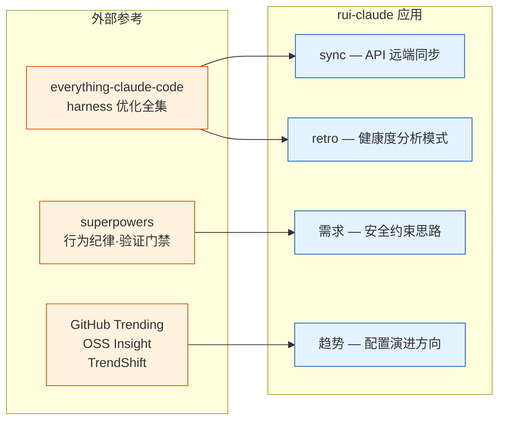
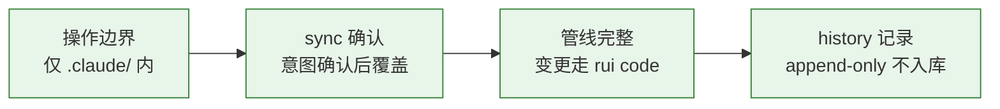

# rui-claude

> **--help / -h / help — 本地脚本，零网络请求**
>
> 用户输入含 `--help`、`-h` 或 `help` 时，**无条件执行以下操作**：
> 1. 运行 `node skills/rui-claude/help.mjs`，将输出原样展示给用户
> 2. 立即停止，不得执行任何其他逻辑
> 3. 禁止：API 调用 · 网络请求 · 读取远端数据 · sync/retro/管线处理 · Agent 调度

作用范围：当前项目的 `.claude/` 目录。sync / retro 均以 `.claude/` 为操作边界。

## 命令族全景

| 命令 | 流程 | 产出 |
|------|------|------|
| `/rui-claude sync` | 查询远端 API → 逐文件 pull 覆盖本地 | `.claude/` 全量覆盖 |
| `/rui-claude retro` | 分析 .claude/ 结构健康度 → 三节复盘 | `docs/自改进故事面板/<date>.md` |
| `/rui-claude history` | 查看操作历史：`list [--limit N]` / `stats [--json]` | 终端输出 |
| `/rui-claude 需求` | 需求解析→故事拆分→逐故事 doc+code 管线→交付 | `.claude/` 内文件变更 |
| `/rui-claude` | 按 5 层管线评分推荐 5~10 条任务 | 推荐列表 |

## 操作边界

## sync — 覆盖式同步

| 项目 | 说明 |
|------|------|
| 数据源 | 远端 API（`api.effiy.cn`），查询 sessions 集合中 `tags[0]=<workspace> && tags[1]=.claude` 的记录 |
| 行为 | 覆盖式更新，逐文件从远端 pull 覆盖本地 `.claude/`，保留嵌套目录结构 |
| 前置条件 | `API_X_TOKEN` 环境变量已配置 |
| 委托 | 完全委托 `import-docs`（`dir=.claude/ mode=pull`），不自行实现同步逻辑 |
| 完成后 | 自动记录 history |

## retro — 健康度分析

| 项目 | 说明 |
|------|------|
| 触发方式 | `/rui-claude retro [--name <story>] [--json]` |
| 输入 | 本地 `.claude/` 目录的 `agents/` · `rules/` · `skills/` · `formulas.md` 等结构 |
| 网络 | 纯本地分析，不连远端 |
| 产出 | `docs/自改进故事面板/<date>.md`（三节：§1 配置结构 · §2 健康度 · §3 改进项） |

## history — 操作历史

| 子命令 | 说明 |
|--------|------|
| `list [--limit N]` | 列出最近 N 条操作记录 |
| `stats [--json]` | 操作统计摘要 |

## 核心规则

| # | 规则 | 违反标识 |
|---|------|---------|
| 1 | 操作范围仅限 `.claude/`，不得触及外部文件 | — |
| 2 | 对 `.claude/` 的代码修改必须通过 rui code 管线 | `skip-gate-a` |
| 3 | 必须在 `feat/<name>` 分支 | `no-checkout` |
| 4 | 禁止自动合并 | `auto-merge` |
| 5 | sync 覆盖式更新，执行前确认意图 | — |
| 6 | 空输入只推荐不执行 | — |
| 7 | 禁止自动 commit/push | — |

详见 [rules/rui-claude.md](../../rules/rui-claude.md)。

## 外部参考

> `.claude/` 配置管理、技能组织、安全约束思路参考以下资源。

| 命令 | 参考资源 | 汲取要点 |
|------|---------|---------|
| sync | import-docs | 远端 API 查询 + 文件下载模式 |
| retro | everything-claude-code · superpowers | 健康度指标、行为纪律审查 |
| 需求管线 | superpowers | 安全约束、验证门禁、仅限 `.claude/` 边界 |
| 趋势跟踪 | GitHub Trending · OSS Insight · TrendShift | `.claude/` 配置演进方向、新兴工具采纳 |

## 生效标志

| 标志 | 未达标的处置 |
|------|------------|
| 操作仅限 `.claude/` 目录 | 撤销外部变更 |
| sync 前确认用户意图 | 补确认后重新执行 |
| 变更走 rui code 管线 | 切分支重走管线 |
| history 仅本地不入库 | 从 git 暂存区移除 history 文件 |
