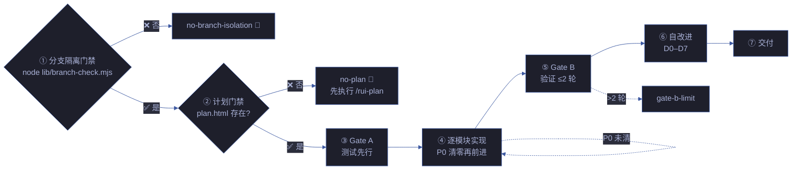

# rui-code

> 源码改动唯一入口。分支隔离强制门禁 → Gate A 测试先行 → 逐模块 P0 清零 → Gate B ≤2 轮 → 自改进 D0–D7 → 交付。
>
> `/rui code <name>`（通过 rui 编排器调用）或 `/rui-code <name>`



## 管线阶段

| 阶段 | 操作 | Agent | 阻断标识 |
|------|------|-------|---------|
| ① 分支隔离 | `node lib/branch-check.mjs --story=<name> --mode=write` | — | `no-branch-isolation` |
| ② 计划门禁 | 验证 plan.html + 计划清单.html 存在且无占位符 | planner | `no-plan` / `plan-placeholder` |
| ③ Gate A | 测试设计存在且完整（场景 §1） | tester | `skip-gate-a` |
| ④ 逐模块实现 | 每模块编码 → 自审查 P0 清零 → 下一模块 | coder | P0 未清零 |
| ⑤ Gate B | 五步验证 ≤ 2 轮 | tester + reporter | `gate-b-limit` |
| ⑥ 自改进 | D0–D7 诊断 + 提案生成 | self-improve | `no-metrics`（降级） |
| ⑦ 交付 | rui-import → rui-bot（手动触发） | — | `delivery-incomplete` |

## 核心规则

| # | 规则 | 阻断标识 |
|---|------|---------|
| 0 | 任何 Edit/Write 前先运行 `node lib/branch-check.mjs --story=<name> --mode=write` | `no-branch-isolation` |
| 1 | 源码改动唯一入口 `/rui code` | — |
| 2 | 功能分支从 main 创建 | `bad-branch` |
| 3 | 改源码前已切到 `feat/<name>` | `no-checkout` |
| 4 | 禁止自动合并功能分支到 main | `auto-merge` |
| 5 | P0 清零方进下一模块 | — |
| 6 | 影响链未闭合不声称闭合 | `chain-broken` |
| 7 | 不创建设计文档外的文件 | — |

## 产出

| 文件 | 阶段 | Agent |
|------|------|-------|
| 场景-N-<slug>.md §2 实施报告 | 实现 | coder |
| 场景-N-<slug>.md §3 测试报告 | 验证 | tester + reporter |
| 场景-N-<slug>.md §4 自改进 | 自改进 | self-improve |
| 知识图谱.json（更新） | 实现 | coder |
| 源码变更 + 测试 | 实现 | coder |

## 端到端

> `/rui <需求>` = `/rui doc <需求>` → `/rui code <name>`，无中断一气呵成。

## code --from-doc

> 从已有文档反推，只读源码补全缺失文档章节（§2/§3/§4），不覆盖已有内容。

```
步骤 1: 分支隔离门禁（只读模式，仍需验证分支）
步骤 2: 定位 docs/故事任务面板/<name>/ 下已有场景文档
步骤 3: 检测缺失章节：§2 实施报告 / §3 测试报告 / §4 自改进
步骤 4: 只读扫描源码（Grep/Glob），提取对应证据
步骤 5: 补全缺失章节，已有内容原封不动
步骤 6: 证据标 Level B + 源码路径引用
```

| 约束 | 说明 |
|------|------|
| 只读源码 | 不修改任何源文件 |
| 不覆盖已有 | 已有章节内容保留，仅追加缺失 |
| 证据溯源 | 每个断言附文件路径 + 行号 |
| 分支隔离 | 需在 `feat/<name>` 上执行 |

**与 rui-doc --from-code 的边界**：`rui-doc --from-code` 从源码反推生成完整文档基线（§0–§4）；`rui-code --from-doc` 从已有文档补充缺失的实施/测试/自改进章节。前者创建新文档，后者补充已有文档的缺口。两者都只读源码，不修改代码。

## 参数

| 参数 | 必需 | 说明 |
|------|------|------|
| `<name>` | 是 | 故事名（kebab-case） |
| `--from-doc` | 否 | 从已有文档反推补全缺失章节 |

## 降级策略

| 情况 | 降级行为 |
|------|---------|
| 分支隔离验证失败 | `no-branch-isolation` 阻断，切分支后重试 |
| 计划门禁不通过 | `no-plan` 阻断，先执行 `/rui-plan` |
| Gate A 测试设计不完整 | `skip-gate-a` 阻断，补测试设计 |
| P0 未清零 | 退回 coder 修复，不清零不进下一模块 |
| Gate B > 2 轮 | `gate-b-limit` 阻断，质疑架构设计 |
| 自改进数据不足 | `no-metrics` 降级，不阻断交付 |

## 生效标志

| 标志 | 验证方式 |
|------|---------|
| 分支隔离通过 | `node lib/branch-check.mjs` exit 0 |
| 每模块 P0 审查留痕 | 实施报告 §2 P0 审查表 |
| 影响链闭合 | 二级传递可复核 |
| Gate B ≤ 2 轮 | 验证轮次计数 |
| 自改进诊断完整 | §4 含 D0–D7 诊断 |
