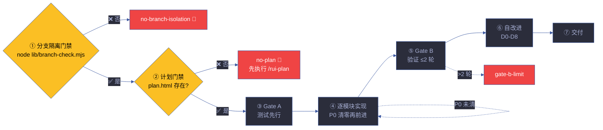
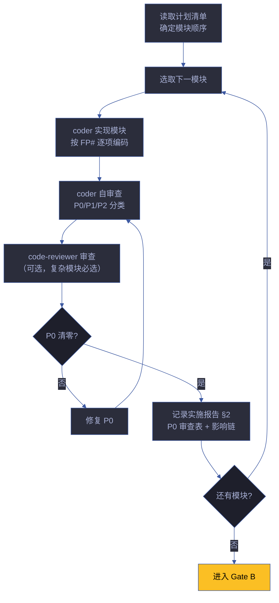
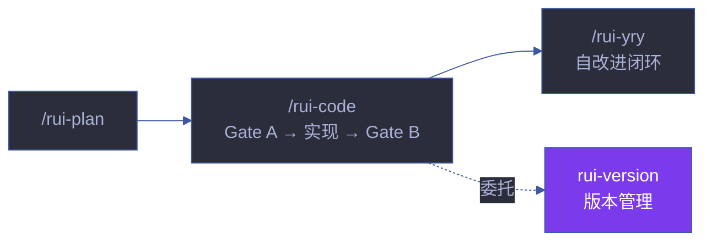

# rui-code

> 源码改动唯一入口。分支隔离强制门禁 → Gate A 测试先行 → 逐模块 P0 清零 → Gate B ≤2 轮 → 自改进 D0-D8 → 交付。
>
> `/rui code <name>`（通过 rui 编排器调用）或 `/rui-code <name>`
>
> **单一职责**：源码实现管线。不负责文档生成（[rui-doc](../rui-doc/)），不负责计划生成（[rui-plan](../rui-plan/)），不负责版本管理（[rui-version](../rui-version/)），不负责自改进编排（[rui-yry](../rui-yry/)）。

[管线全景](#管线全景) · [管线阶段](#管线阶段) · [Gate A 详解](#gate-a-详解) · [逐模块实现](#逐模块实现) · [Gate B 详解](#gate-b-详解) · [code --from-doc](#code---from-doc) · [核心规则](#核心规则) · [降级策略](#降级策略) · [生效标志](#生效标志)

## 管线全景



## 管线阶段

| 阶段 | 操作 | Agent | 输入 | 输出 | 阻断标识 |
|------|------|-------|------|------|---------|
| ① 分支隔离 | `node lib/branch-check.mjs --story=<name> --mode=write` | — | 故事名 | 通过/阻断 | `no-branch-isolation` |
| ② 计划门禁 | 验证 plan.html + 计划清单.html 存在且无占位符 | planner | 故事目录 | 通过/阻断 | `no-plan` / `plan-placeholder` |
| ③ Gate A | 测试设计存在且完整（场景 §1 AC 可执行） | tester | 场景文档 | 测试设计就绪 | `skip-gate-a` |
| ④ 逐模块实现 | 每模块编码 → 自审查 P0 清零 → 下一模块 | coder + reviewer | 任务清单 | 源码变更 + 审查记录 | P0 未清零 |
| ⑤ Gate B | 五步验证 ≤ 2 轮 | tester + reporter | 源码变更 | 验证报告 | `gate-b-limit` |
| ⑥ 自改进 | D0-D8 诊断 + 提案生成 | self-improve | 执行记录 | 诊断报告 + 提案 | `no-metrics`（降级） |
| ⑦ 交付 | rui-import → rui-bot（手动触发） | — | 故事目录 | 同步 + 通知 | `delivery-incomplete` |

## Gate A 详解

> 编码前的强制性阻断点。测试设计不存在或未就绪 → 编码不得开始。

### 检查清单

| 检查项 | 要求 | 验证方式 | 不通过处置 |
|--------|------|---------|-----------|
| 测试设计文档存在 | 场景 §1 含 AC 章节 | 文件存在 + 章节非空 | 退回 tester 补测试设计 |
| AC 可执行 | 每条 AC 可被客观验证 | 人工审查 AC 措辞 | 改写模糊 AC |
| 覆盖完整 | AC 覆盖所有 FP# | FP# ↔ AC 映射表 | 补缺失 AC |
| 测试数据就绪 | 测试所需 mock/fixture 已定义 | 检查测试数据文件 | 补测试数据 |
| 边界条件覆盖 | 正常/异常/边界三种情况均有 AC | AC 分类统计 | 补边界 AC |

### 唯一例外

单行 CSS 属性调整、文案修正（不涉及逻辑）可跳过 Gate A。但需在实施报告中标注 `skip-gate-a: css-trivial` 或 `skip-gate-a: text-trivial`。

### 阻断流程

```
Gate A 不通过:
  → 输出 skip-gate-a 阻断标识
  → 列出未通过的检查项
  → tester 补全测试设计
  → 重新提交 Gate A 审查
  → 通过后方可进入编码阶段
```

## 逐模块实现

> 每个模块独立编码、审查、P0 清零，前一模块 P0 未清零不进下一模块。

### 模块实现流程



### P0/P1/P2 分类

| 级别 | 含义 | 处置 | 示例 |
|------|------|------|------|
| **P0** | 阻塞发布，必须修复 | 当前模块修复后方可前进 | 安全漏洞、功能缺失、测试失败 |
| **P1** | 当轮修复 | 当前故事内修复 | 代码异味、性能退化、文档缺失 |
| **P2** | 记录不阻断 | 记录到技术债务，后续处理 | 优化建议、重构候选 |

### 影响链追踪

每一步变更必须追踪影响链：

```
1. 列出变更点（文件 + 行号）
2. 选择搜索词（函数名/类名/导出名）
3. 全项目搜索（Grep 覆盖所有引用）
4. 二级传递（引用者的引用者）
5. 标注处置（已更新/无需更新/需人工确认）
```

未闭合 = `chain-broken` 阻断。

### 审查维度

| 维度 | code-reviewer 检查点 |
|------|---------------------|
| **正确性** | 逻辑正确、边界处理、错误处理 |
| **安全性** | 输入校验、注入防护、认证授权 |
| **范式** | 无 class/extends、无 export default、无空 catch |
| **设计** | SRP 单一职责、DRY 无重复、YAGNI 无过度设计 |
| **可测试性** | 依赖可注入、纯函数优先、副作用隔离 |
| **性能** | 无 N+1 查询、无不必要循环、合理缓存 |

## Gate B 详解

> 编码后的闭合验证。五步检查，修复 > 2 轮 → 阻断。

### 五步验证

| 步骤 | 操作 | 执行者 | 输出 |
|------|------|--------|------|
| ① 环境快照 | `git diff --stat` + `node --version` + 依赖版本 | tester | 环境快照记录 |
| ② 静态预检 | lint + type-check + arch-check | tester | 预检报告 |
| ③ 设计对齐 | 对比 plan.html 与实现，检查偏差 | tester + architect | 对齐报告 |
| ④ 单次执行 | 运行测试套件，记录结果 | tester | 测试报告 |
| ⑤ 三报告 | 交叉验证：实施报告 §2 ↔ 测试报告 §3 ↔ 自改进 §4 | reporter | 一致性报告 |

### 轮次管理

| 轮次 | 行为 | 限制 |
|------|------|------|
| 第 1 轮 | 全量验证，记录所有发现 | — |
| 第 2 轮 | 修复第 1 轮发现 + 回归验证 | 仅修复，不新增功能 |
| 第 3 轮 | 触发 `gate-b-limit` 阻断 | 质疑架构设计，需人工介入 |

### 阻断后的处置

```
gate-b-limit 阻断:
  → 输出完整验证记录（含 3 轮发现）
  → 标注架构风险点
  → 建议：退回设计阶段 / 拆分故事 / 简化实现
  → 人工决策后重新进入管线
```

### 典型 Gate A/B 执行示例

> 以下展示 `user-login` 故事中 `FP-2 验证码发送` 模块的完整 Gate A→B 流程。

```
Module: FP-2 验证码发送 (预计 3 个文件)

Gate A — 测试设计审查:
  ✅ 测试设计文档存在: 场景-1-正常登录流程/index.md §1
  ✅ 6 条 AC 可执行: 发送成功 · 手机号格式错误 · 频控限制 · 服务商超时 · 验证码过期 · 重发逻辑
  ✅ FP-2 覆盖完整: AC-2.1 ~ AC-2.6 映射表
  ✅ 测试数据就绪: mock/sms-provider.mjs · fixtures/phone-numbers.json
  ⚠️ 边界条件: 补充验证码长度边界 (4 位最小 → 追加 AC-2.7)
  → 补充后通过 ✅

逐模块实现:
  coder: 实现 src/auth/sms-service.mjs (核心发送逻辑)
  coder: 实现 src/auth/rate-limiter.mjs (频控中间件)
  coder: 实现 src/auth/verify-code.mjs (验证码校验)
  自审查:
    P0: 0 项 (无安全漏洞/功能缺失)
    P1: 1 项 (sms-service.mjs:45 缺少超时处理) → 修复
    P2: 2 项 (建议提取常量 · 建议添加 JSDoc) → 记录
  code-reviewer: 审查通过 ✅

Gate B — 第 1 轮:
  ① 环境快照: Node 20.11.0 · vitest 1.2.0 · Redis 7.0
  ② 静态预检: lint ✅ · type-check ✅ · arch-check A级 ✅
  ③ 设计对齐: plan.html 3 任务 vs 实现 3 文件 → 匹配 ✅
  ④ 单次执行: 12/12 测试通过 (覆盖率 94%)
  ⑤ 三报告: §2 实施报告 ↔ §3 测试报告 ↔ §4 自改进 → 一致 ✅
  → Gate B 通过 ✅ (1 轮)

产出:
  src/auth/sms-service.mjs (新增)
  src/auth/rate-limiter.mjs (新增)
  src/auth/verify-code.mjs (新增)
  tests/auth/sms.test.mjs (新增, 12 用例)
  场景-1-正常登录流程/index.md §2 实施报告 (更新)
  → 进入下一模块: FP-3 验证登录
```

## 产出

| 文件 | 阶段 | Agent | 内容 |
|------|------|-------|------|
| 场景-N-<slug>.md §2 实施报告 | 实现 | coder | P0 审查表、影响链、代码变更摘要 |
| 场景-N-<slug>.md §3 测试报告 | 验证 | tester + reporter | 测试结果、Gate B 裁决、环境快照 |
| 场景-N-<slug>.md §4 自改进 | 自改进 | self-improve | D0-D8 诊断、改进提案、效果评估 |
| 知识图谱.json（更新） | 实现 | coder | 新增节点和边、实现关系 |
| 源码变更 + 测试 | 实现 | coder | 功能代码 + 单元测试 + 集成测试 |

## code --from-doc

> 从已有文档反推，只读源码补全缺失文档章节（§2/§3/§4），不覆盖已有内容。

```
步骤 1: 分支隔离门禁（只读模式，仍需验证分支）
步骤 2: 定位 docs/故事任务面板/<name>/ 下已有场景文档
步骤 3: 检测缺失章节：§2 实施报告 / §3 测试报告 / §4 自改进
步骤 4: 只读扫描源码（Grep/Glob），提取对应证据
步骤 5: 补全缺失章节，已有内容原封不动
步骤 6: 证据标 Level B + 源码路径引用
```

| 约束 | 说明 |
|------|------|
| 只读源码 | 不修改任何源文件 |
| 不覆盖已有 | 已有章节内容保留，仅追加缺失 |
| 证据溯源 | 每个断言附文件路径 + 行号 |
| 分支隔离 | 需在 `feat/<name>` 上执行 |

**与 rui-doc --from-code 的边界**：`rui-doc --from-code` 从源码反推生成完整文档基线（§0–§4）；`rui-code --from-doc` 从已有文档补充缺失的实施/测试/自改进章节。前者创建新文档，后者补充已有文档的缺口。两者都只读源码，不修改代码。

## 端到端

> `/rui <需求>` = `/rui doc <需求>` → `/rui code <name>`，无中断一气呵成。

## 参数

| 参数 | 必需 | 说明 |
|------|------|------|
| `<name>` | 是 | 故事名（kebab-case） |
| `--from-doc` | 否 | 从已有文档反推补全缺失章节 |

## 核心规则

| # | 规则 | 阻断标识 | 设计理由 |
|---|------|---------|---------|
| 0 | 任何 Edit/Write 前先运行 `node lib/branch-check.mjs --story=<name> --mode=write` | `no-branch-isolation` | 分支隔离不可绕过 |
| 1 | 源码改动唯一入口 `/rui code` | — | 所有代码变更可追溯 |
| 2 | 功能分支从 main 创建 | `bad-branch` | 避免分支污染 |
| 3 | 改源码前已切到 `feat/<name>` | `no-checkout` | 防止误写入 |
| 4 | 禁止自动合并功能分支到 main | `auto-merge` | 合并需人工审查 |
| 5 | P0 清零方进下一模块 | — | 质量门禁不妥协 |
| 6 | 影响链未闭合不声称闭合 | `chain-broken` | 变更影响可追溯 |
| 7 | 不创建设计文档外的文件 | — | 文件创建有规可循 |

## 测试

> 源码实现管线的 Gate A/B 测试先行机制、测试设计完整性和回归验证。

### 运行测试

```bash
npx vitest run skills/rui-code/tests/          # 全量运行
npx vitest skills/rui-code/tests/              # 监听模式
npx vitest run --coverage skills/rui-code/tests/  # 覆盖率报告
```

### 测试文件

| 文件 | 测试范围 | 类型 |
|------|---------|:---:|
| `tests/rui-code.test.mjs` | 管线阶段流程、Gate A/B 门禁逻辑、逐模块 P0 清零 | 单元 |

### 测试策略

| 层级 | 范围 | 要求 |
|------|------|------|
| **Gate A 测试** | 测试设计完整性、AC 可执行性、覆盖完整性 | 每次编码前必须通过 |
| **单元测试** | 逐模块实现的功能正确性 | 每个 FP# 须有对应测试 |
| **Gate B 测试** | 五步验证：环境快照、静态预检、设计对齐、单次执行、三报告交叉验证 | 编码后 ≤ 2 轮 |
| **回归测试** | 影响链覆盖的所有引用点 | 二级传递全部验证 |

### 覆盖要求

| 维度 | 最低阈值 | 目标 |
|------|:---:|:---:|
| FP# 功能点覆盖 | 100% | 每个 FP# 有对应测试用例 |
| 分支覆盖 | ≥ 80% | 每个分支路径至少一个测试 |
| 边界条件覆盖 | ≥ 90% | 正常/异常/边界三种情况均有测试 |
| 影响链覆盖 | 100% | 每个变更点的二级传递有验证 |

### 测试编写规范

- 测试文件与源文件同目录或 `tests/` 子目录
- 使用 `describe`/`it` 结构，测试描述使用中文
- 每个测试用例对应一个 AC 或 FP#
- 测试数据使用 fixture 文件，不硬编码

### Gate A 测试设计检查清单

| 检查项 | 验证方式 | 不通过处置 |
|--------|---------|-----------|
| 测试设计文档存在 | 场景 §1 含 AC 章节 | 退回 tester 补测试设计 |
| AC 可执行 | 每条 AC 可被客观验证 | 改写模糊 AC |
| 覆盖完整 | AC 覆盖所有 FP# | 补缺失 AC |
| 测试数据就绪 | mock/fixture 已定义 | 补测试数据 |
| 边界条件覆盖 | 正常/异常/边界三种情况均有 AC | 补边界 AC |

## 降级策略

| 情况 | 降级行为 | 恢复方式 |
|------|---------|---------|
| 分支隔离验证失败 | `no-branch-isolation` 阻断 | 切到 `feat/<name>` 分支后重试 |
| 计划门禁不通过 | `no-plan` 阻断 | 先执行 `/rui-plan` |
| Gate A 测试设计不完整 | `skip-gate-a` 阻断 | 补全测试设计后重新提交 |
| P0 未清零 | 退回 coder 修复 | 修复 P0 后重新审查 |
| Gate B > 2 轮 | `gate-b-limit` 阻断 | 质疑架构，人工决策 |
| 自改进数据不足 | `no-metrics` 降级，不阻断交付 | 下次执行时补充数据 |

## 规则

- [code-paradigm.md](./rules/code-paradigm.md) — 模块范式 · 函数范式 · 错误处理 · 导入 · 常量，含正反例
- [code-pipeline-techniques.md](./rules/code-pipeline-techniques.md) — 贯穿管线各阶段的实战技术模式
- [code-pipeline.md](./rules/code-pipeline.md) — 源码实现管线的完整流程和规则
## 生效标志


| 标志 | 验证方式 | 未达标的处置 |
|------|---------|------------|
| 分支隔离通过 | `node lib/branch-check.mjs` exit 0 | 切分支后重试 |
| Gate A 测试设计完整 | AC 覆盖所有 FP# + 边界条件 | 补测试设计 |
| 每模块 P0 审查留痕 | 实施报告 §2 P0 审查表 | 补审查记录 |
| 影响链闭合 | 二级传递可复核 | 补影响链追踪 |
| Gate B ≤ 2 轮 | 验证轮次计数 | 质疑架构设计 |
| 自改进诊断完整 | §4 含 D0-D8 诊断 | 补充诊断 |

## 自循环

> 代码质量看门狗。Agent 可按间隔检测活跃故事的代码健康度。

| 属性 | 值 |
|------|-----|
| 推荐间隔 | `0 8 * * 1-5`（工作日早 8 点） |
| 触发条件 | 有活跃 `feat/*` 分支且有未提交变更 |
| 终止条件 | 所有 feat 分支已合并或关闭 |
| 迭代动作 | ① 扫描活跃 feat 分支 → ② 检查 P0 清零状态 → ③ 检查 Gate B 轮次 → ④ 检查影响链闭合 → ⑤ 有异常时生成诊断 |
| 告警条件 | P0 未清零 > 24h / Gate B 卡在第 2 轮 / 影响链未闭合 |
| 收敛判定 | 所有活跃分支 P0 清零 + Gate B 通过 |

> 本技能 `checkMode: "slash"`——无独立 CLI，由 `/rui-code` 在 Claude Code 会话内触发。6 字段契约与调度规则详见 [rules/loop-engineering.md](../rui/rules/loop-engineering.md)。

## 与 rui 的关系

`/rui-code` 是 rui 编排管线第四阶段（计划 → 实现）。由 `/rui code <name>` 路由触发。源码改动的唯一入口——所有代码变更必须通过此管线。

