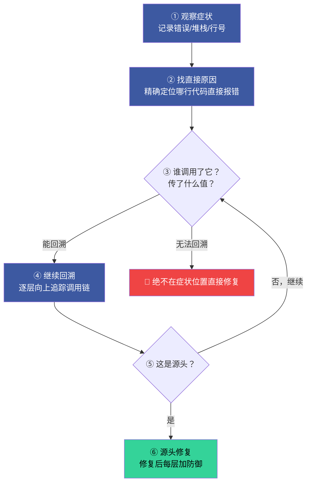
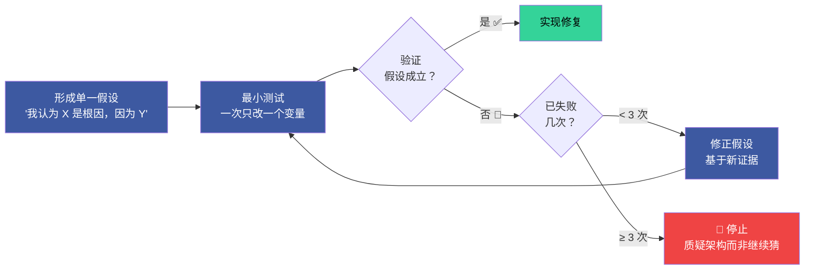
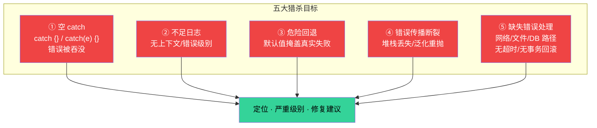
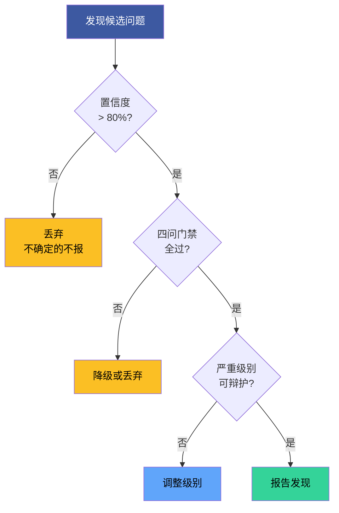

---
paths:
  - "skills/rui-code/**"
  - "skills/rui-code/SKILL.md"
description: "代码实现管线支撑技术与模式"
---

# code-pipeline-techniques

> 贯穿管线各阶段的实战技术模式。每项对应一条 Iron Law。
>
> 主文档：[code-pipeline.md](code-pipeline.md)

[① 根因追溯](#①-根因追溯) · [② 纵深防御](#②-纵深防御) · [③ 条件等待](#③-条件等待) · [④ 验证门禁](#④-验证门禁) · [⑤ 反馈回路](#⑤-反馈回路) · [⑥ 深度模块](#⑥-深度模块) · [⑦ 垂直切片](#⑦-垂直切片) · [⑧ 研究优先开发](#⑧-研究优先开发) · [⑨ 静默失败猎杀](#⑨-静默失败猎杀) · [⑩ 置信度过滤](#⑩-置信度过滤)

### ① 根因追溯

**Iron Law: NO FIX WITHOUT ROOT CAUSE FIRST**

Bug 常深埋在调用栈中。修复错误出现的位置是治症状。必须向后追溯调用链直到找到原始触发点，然后在源头修复。

| 步骤 | 动作 |
|------|------|
| 1. 观察症状 | 记录错误信息、堆栈、行号 |
| 2. 找直接原因 | 精确定位哪行代码直接导致错误 |
| 3. 追溯调用链 | 逐层问"谁调用了这个？传了什么值？" |
| 4. 找到源头 | 确认原始触发点 |
| 5. 源头修复 | 在源头修，再往下每层加防御 |

**五层回溯流程（实战扩展）**：



| 回溯层 | 关键问题 | 插桩方法 |
|--------|---------|---------|
| L0 症状 | 什么错误？在哪出现？ | 日志/堆栈 |
| L1 直接因 | 哪行代码直接导致？传入了什么值？ | Read 源码 |
| L2 调用者 | 谁调用了它？参数来源？ | `new Error().stack` |
| L3 数据源 | 参数在哪创建/修改？ | Grep 搜索赋值点 |
| L4 初始化 | 初始值从哪来？何时设置？ | 构造函数/工厂方法 |
| L5 触发点 | 哪个测试/入口触发整条链？ | 二分定位 |

**诊断插桩模式**：

在无法手动追溯时，用 `new Error().stack` 在关键节点打印调用栈：

```typescript
async function suspectFunction(directory: string) {
  const stack = new Error().stack;
  console.error('DEBUG suspectFunction:', {
    directory,
    cwd: process.cwd(),
    env: process.env.NODE_ENV,
    stack,
  });
}
```

- **测试中用 `console.error()`** — logger 可能在测试中被抑制
- **操作前插桩** — 在危险操作前记录，而非失败后
- **捕获上下文** — 目录、cwd、环境变量、时间戳

**二分定位污染源**：逐个运行测试文件，在第一个污染源处停止。

**实战示例**：5 层回溯定位 `git init` 错误目录

| 层 | 发现 | 结论 |
|----|------|------|
| L0 症状 | `.git` 出现在源码目录 `packages/core/` | 异常 |
| L1 直接因 | `git init` 在 `process.cwd()` 中运行 | `cwd` 参数为空 |
| L2 调用者 | `WorktreeManager` 收到空 `projectDir` | 参数传递链路 |
| L3 调用者 | `Session.create()` 传入空字符串 | 上游未校验 |
| L4 根因 | 测试在 `beforeEach` 之前访问 `context.tempDir` | 顶级变量初始化为空 |
| L5 修复 | `tempDir` 改为 getter，提前访问即抛错 | 源头修复 + 4 层防御 |

> **关键原则**：绝不在症状位置直接修复。追溯调用链直到找到原始触发点。

### ② 纵深防御

**Iron Law: VALIDATE AT EVERY LAYER, NOT JUST ONE**

修复了由无效数据导致的 bug 后，单处校验不够——那层可被不同代码路径、mock 或重构绕过。在数据通过的每一层都加校验。


| 层 | 用途 | 可被绕过的场景 |
|----|------|-------------|
| L1 入口校验 | API 边界拒绝明显无效输入 | 不同入口路径、内部调用 |
| L2 业务逻辑 | 确保数据对操作有意义 | mock 绕过、测试直接调用 |
| L3 环境守卫 | 阻止特定上下文的危险操作 | 环境变量差异、CI vs 本地 |
| L4 诊断检测 | 捕获上下文用于取证 | 日志级别被抑制 |

全部四层都必要。**不在单层校验后停止。** "单点校验够了"是合理化。

### ③ 条件等待

**Iron Law: WAIT FOR CONDITIONS, NOT FOR GUESSES**

用 `waitFor(() => condition)` 替代 `setTimeout(50)`。等待真正关心的条件，而非猜测需要多久。

| 场景 | 模式 |
|------|------|
| 等待事件 | `waitFor(() => events.find(e => e.type === 'DONE'))` |
| 等待状态 | `waitFor(() => machine.state === 'ready')` |
| 等待计数 | `waitFor(() => items.length >= 5)` |
| 等待文件 | `waitFor(() => fs.existsSync(path))` |

| 反模式 | 为什么错 | 正确做法 |
|--------|---------|---------|
| `setTimeout(check, 1)` | 空耗 CPU | 轮询间隔 10ms |
| 无超时的循环等待 | 条件永不满足 = 永久阻塞 | 必须有超时 + 清晰错误消息 |
| 循环前缓存 getter 值 | 循环内用的总是旧值 | getter 放循环内每次取最新 |
| `setTimeout(50)` 猜测时机 | 快机器侥幸通过，CI 失败 | `waitFor(() => condition)` |
| `sleep(500)` "确保异步完成" | 不知道真实完成了没 | 等待具体的完成信号 |

### ④ 验证门禁

**Iron Law: NO COMPLETION CLAIMS WITHOUT FRESH VERIFICATION EVIDENCE**

声称完成前：IDENTIFY（什么命令证明）→ RUN（执行完整命令）→ READ（读完整输出）→ VERIFY（输出确认声称？）→ ONLY THEN 声称。

| 声称 | 需要 | 不充分 |
|------|------|--------|
| 测试通过 | 测试命令输出：0 失败 | "上次运行"、"应该通过" |
| Bug 修复 | 测原始症状：通过 | 代码改了、假定修好了 |
| 回归测试有效 | Red-Green 周期验证 | 测试通过一次 |

**审查报告前门禁（四问）**：

| # | 问题 | 答"否"或"不确定"的处置 |
|---|------|----------------------|
| 1 | 能引用确切行号？ | 降级或丢弃 |
| 2 | 能描述具体失败模式？ | 你在模式匹配，不在审查 |
| 3 | 读过周围上下文？ | 补读上下文后重判 |
| 4 | 严重级别可辩护？ | 降级到匹配级别 |

**CRITICAL/HIGH 额外要求**：必须提供 ① 确切代码片段 + 行号 ② 具体失败场景 ③ 解释为什么现有守卫没有捕获它。

**零发现是可接受且被期望的结果。** 干净的审查是有效的审查。

**常见误报（跳过，除非有本代码库具体证据）**：

| 误报模式 | 为什么跳过 |
|---------|-----------|
| "考虑加错误处理" 但调用者/框架已有处理 | Express 错误中间件、React 错误边界 |
| "缺少输入校验" 但函数是内部的、调用者已校验 | 至少追踪一个调用者再标记 |
| "魔法数字" 用于公知常量 | `200`、`404`、`1000`ms、`60`、`24`、`1024` |
| "函数太长" 用于穷举 switch/配置对象/测试表 | 长度≠复杂度 |
| "缺少 JSDoc" 在自描述的单用途内部 helper 上 | 名称和签名已经说明了全部 |
| "可能空指针" 前一行的类型缩窄已在作用域内 | 追踪类型流 |

### ⑤ 反馈回路

**Iron Law: NO DIAGNOSIS WITHOUT A FEEDBACK LOOP FIRST**

修复 bug 前先构建快速、确定、可自动运行的通过/失败信号。有回路 = bug 90% 已定位。无回路 = 猜。

构建顺序：失败测试 → curl/HTTP → CLI+fixture → headless 浏览器 → 回放 trace → harness → fuzz → 二分 → 差分 → HITL。

**假设-测试-验证循环**：



| 规则 | 说明 |
|------|------|
| 单一假设 | "我认为 X 是根因，因为 Y"——不含糊 |
| 最小测试 | 一次只改一个变量 |
| 3 次失败 | 修复失败 ≥ 3 次 → 停止。质疑架构 |
| 验证后继续 | 假设验证通过才写正式修复代码 |

> **3 次修复失败 = 架构问题，非调试问题。**

### ⑥ 深度模块

**Iron Law: NO ABSTRACTION WITHOUT A SECOND CALLER**

> 好模块 = 接口小 + 实现深 = 高杠杆。

| 概念 | 定义 | 信号 |
|------|------|------|
| **模块** | 有接口与实现的任何东西（函数/类/包/切片） | — |
| **接口** | 调用者需知的一切：签名、类型、不变式、错误模式、顺序 | 不止类型签名 |
| **深度** | 接口后面的行为量 / 接口复杂度 | 杠杆 |
| **浅模块** | 接口几乎和实现一样复杂 | 透传、多余的 getter、拆分太细的纯函数 |
| **删除测试** | 删除模块——复杂度消失还是回到 N 个调用方 | 透传 = 该删 |
| **接缝** | 不改原地就能改行为的地方 | 测试的天然切入点 |

优先做深模块。加一个抽象却没有第二个调用方，是浅模块。

### ⑦ 垂直切片

**Iron Law: ONE TEST → ONE IMPLEMENTATION PER CYCLE**

```
❌ 水平：RED(test1,test2,test3) → GREEN(impl1,impl2,impl3)
✅ 垂直：RED(test1) → GREEN(impl1), RED(test2) → GREEN(impl2), ...
```

一次一个测试 → 一次一个实现。每个 cycle 利用上一个 cycle 学到的东西。

## 技术集成

| 技术 | 适用阶段 |
|------|---------|
| 根因追溯 | P0 修复 · 验证 |
| 纵深防御 | P0 修复 · 安全约束 |
| 条件等待 | 测试编写 |
| 验证门禁 | 实现 · 验证 · 交付 |
| 反馈回路 | 诊断 · 调试 |
| 深度模块 | 架构设计 · 逐模块实现 |
| 垂直切片 | 测试 · TDD |
| 研究优先 | 影响分析 · 架构设计 |
| 静默失败猎杀 | 验证 · 代码审查 · 安全审计 |
| 置信度过滤 | 代码审查 · 验证清单 |

| 技术 | 服务 Iron Law |
|------|-------------|
| 根因追溯 | #2 NO FIX WITHOUT ROOT CAUSE FIRST |
| 纵深防御 | #2 每层校验让 bug 结构上不可复现 |
| 条件等待 | #1 等待条件而非猜测 = 验证信号 |
| 验证门禁 | #1 NO COMPLETION CLAIMS WITHOUT FRESH EVIDENCE |
| 反馈回路 | #2 有回路 = 定位，无回路 = 猜 |
| 深度模块 | #3 深模块让 P0 更容易清零 |
| 垂直切片 | #3 一次一个实现 = 每次 P0 清零 |
| 研究优先 | #2 猜 = 浪费上下文，查 = 建立事实基线 |
| 静默失败猎杀 | #1 不被注意的错误仍在产生错误结果 |
| 置信度过滤 | #3 噪声淹没信号，精确的报告才帮助 P0 清零 |

### ⑧ 研究优先开发

**Iron Law: NO ACTION WITHOUT FACTS FIRST**

> 涉及不熟悉模块、外部依赖、或 API 变更时：先 Read/Grep/Glob 建立事实基线，再行动。猜 = 浪费上下文。

| 步骤 | 动作 | 工具 |
|------|------|------|
| 1. 定位 | 确定需要理解的范围 | 项目结构 + 模块边界 |
| 2. 阅读 | 通读相关源码/配置/规约 | Read |
| 3. 搜索 | 全项目搜索关键符号/引用 | Grep |
| 4. 映射 | 画出模块关系图 | mermaid |
| 5. 行动 | 基于事实基线执行变更 | — |

适用触发：影响分析 · 架构设计 · 不熟悉模块的 P0 修复 · 第三方 API 集成。

### ⑨ 静默失败猎杀

**Iron Law: NO COMPLETION CLAIMS WITHOUT FRESH VERIFICATION EVIDENCE**

> 静默失败 = 不抛错、不打日志、悄悄产生错误结果的代码路径。必须主动猎杀。



| 猎杀目标 | 识别模式 | 修复方向 |
|---------|---------|---------|
| ① 空 catch | `catch {}` / 错误被转为 `null` 或 `[]` 无上下文 | 至少记录错误上下文；判断是否应向上传播 |
| ② 不足日志 | 日志无足够上下文、级别错误、记完即忘 | 添加：操作名、参数摘要、时间戳、调用栈 |
| ③ 危险回退 | `.catch(() => [])` / 默认值让下游 bug 更难排查 | 区分"预期可恢复"和"应暴露的错误" |
| ④ 传播断裂 | 丢失原始堆栈、`throw new Error('failed')` 泛化、缺失 `await` | 保留原始错误链（`cause`）、异步路径加超时 |
| ⑤ 缺失处理 | 网络/文件/DB 操作无超时、无事务回滚 | 加超时、事务性操作加回滚 |

**猎杀命令**（按语言调整）：

```bash
# 空 catch 块
grep -rn "catch\s*{" --include="*.ts" --include="*.js" --include="*.py" --include="*.go"

# 危险回退模式
grep -rn "\.catch.*\[\]" --include="*.ts" --include="*.js"

# 无超时 fetch/axios
grep -rn "fetch(" --include="*.ts" --include="*.js" | grep -v "timeout\|signal"
```

| 代码 | 问题 | 为什么是静默失败 |
|------|------|----------------|
| `catch {}` | 空 catch | 错误被完全吞没 |
| `.catch(() => [])` | 危险回退 | 网络/解析错误被转为空数组 |
| `try { await fetch(url) } catch { return null }` | 空 catch + 转 null | 网络故障/超时/DNS 错误全部消失 |
| `console.log('error:', e)` 后继续执行 | 不足日志 | 日志可能在输出中被淹没 |
| `throw new Error('failed')` 丢失原始 `cause` | 传播断裂 | 根因和调用栈信息永久丢失 |

### ⑩ 置信度过滤

**Iron Law: NO P0 LEFT UNCLEARED BEFORE NEXT MODULE**

> 审查发现不是越多越好。噪声淹没信号，信任被侵蚀。只报告你确信的问题。



| 过滤器 | 规则 |
|--------|------|
| **置信度阈值** | > 80% 确信是真实问题才报告 |
| **跳过风格偏好** | 除非违反项目明确约定的规范 |
| **跳过未改代码** | 除非是 CRITICAL 安全问题 |
| **合并相似问题** | "5 个函数缺失错误处理" = 1 条发现 |
| **优先真正危害** | 可导致 bug/安全漏洞/数据丢失的排最前 |
| **零发现 = 有效审查** | 不要为了证明审查存在而制造发现 |

**制造发现的 6 种形式（识别并拒绝）**：

| 制造形式 | 示例 |
|---------|------|
| 填充挑剔 | "变量名可以更好"（但当前名称已自描述） |
| 推测建议 | "考虑使用 X 模式"（无具体问题驱动） |
| 假想边界 | "极端情况可能出问题"（举不出触发输入） |
| 安全剧场 | `Math.random()` 用于动画被标记为安全风险 |
| 模糊发现 | "auth 层某处可能..."（说不出确切文件和行号） |
| 凑数发现 | 审查不找出点什么显得没干活 |

> **审查者的首要失败模式是制造噪声，而非遗漏发现。** 信任来自精确，不来自数量。
