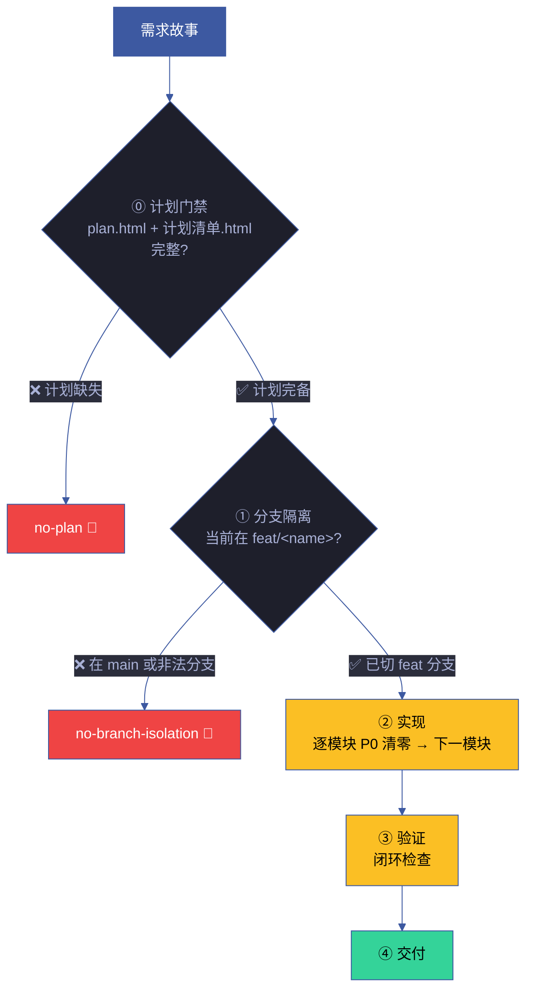
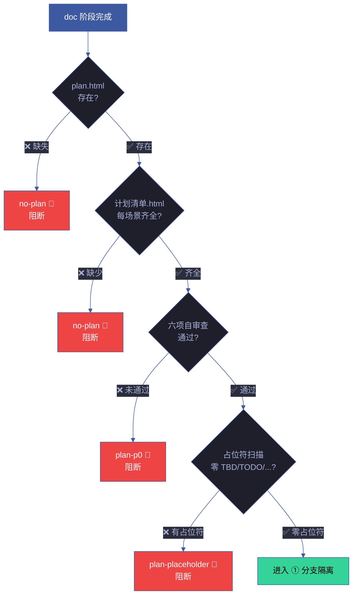
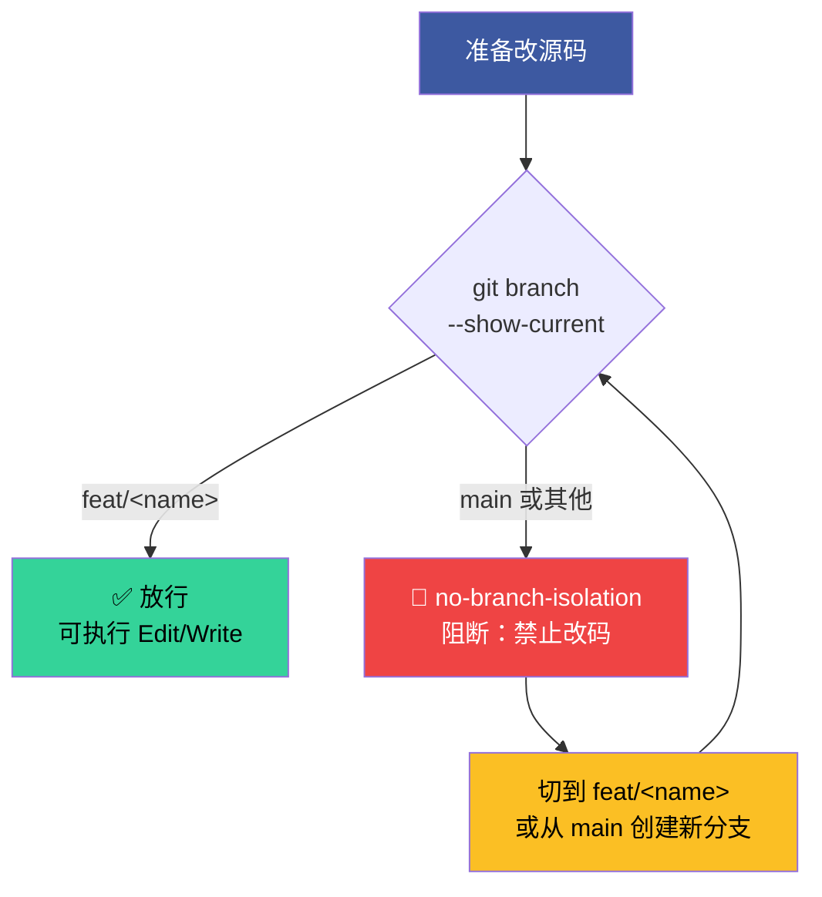
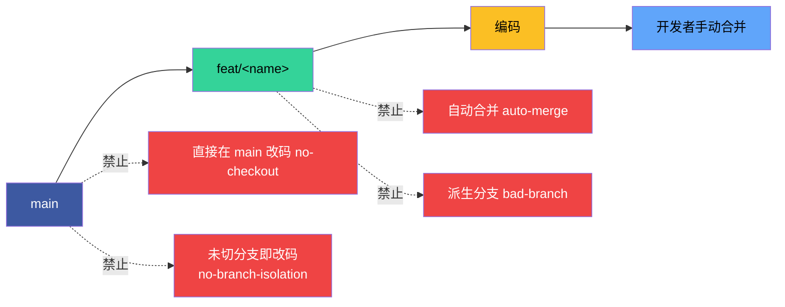
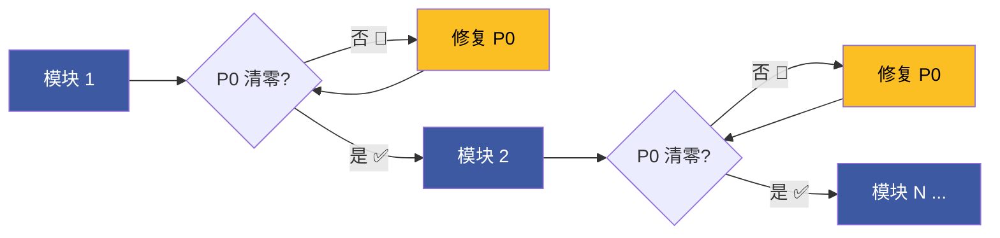
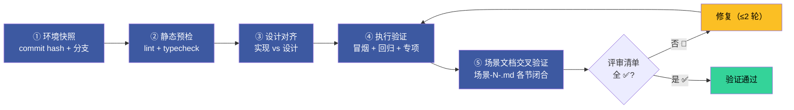
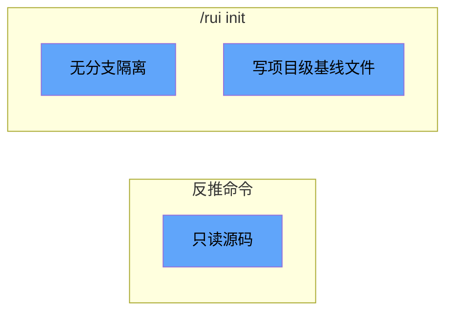
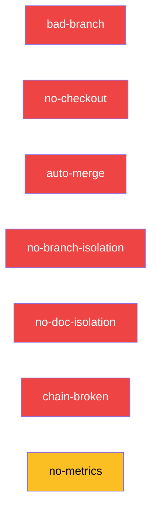

---
paths:
  - "**/*.{js,ts,jsx,tsx,vue,py,go,rs,java,rb,php}"
---

# code-pipeline

> 源码改动只走 `/rui code`，分支独立、实现逐模块清零、验证闭环。
>
> **Iron Law — 违反字母即是违反精神：**
> - P0 不清零不进下一模块
> - 修复 ≤ 2 轮。3+ 轮 = 架构问题，质疑模式

[管线全景](#管线全景) · [① 分支隔离](#①-分支隔离--强制门禁) · [② 实现](#②-实现--逐模块清零) · [③ 验证](#③-验证--闭环) · [产出收口](#产出收口) · [例外](#例外) · [阻断标识汇总](#阻断标识汇总) · [生效标志](#生效标志) · [支撑技术](code-pipeline-techniques.md)

## Red Flags — 暂停并回到 Iron Law

- "这个模块改动太小，跳过自审查"
- "影响链看起来闭合了，不用 grep 了"
- "修复 3 轮了但这次肯定对"
- "分支创建应该是自动的，我手动改就行"
- "实现完成再补分支隔离"
- "这次改动很小，直接在 main 改就行"
- "先改代码再切分支，反正还没 commit"
- "当前在 main 上，但只改一行不需要切分支"
- "doc 阶段只写文档不改源码，不需要切分支"
- "文档写入不是'源码改动'，分支隔离管不着文档"
- "先写文档再切分支，doc 不涉及编译不会出错"
- "用本地缓存/记忆文件存状态，跨分支共享绕过隔离"
- "catch 块留空就行，错误不重要"
- "日志打了就行，不用管级别和上下文"
- "给个默认值兜底，不用处理错误"
- "审查发现太多怕影响进度，降级几个"
- "找不到确切行号但模式看起来有问题"
- "零发现显得没干活，找几个小问题凑数"

**以上任何一个 = 停止。** 详细技术模式见 [code-pipeline-techniques.md](code-pipeline-techniques.md)。

## 管线全景



| 阶段 | 核心动作 | 阻断标识 | 例外 |
|------|---------|---------|------|
| ⓪ 计划门禁 | plan.html + 计划清单.html 完整，六项自审查通过 | `no-plan` / `plan-p0` / `plan-placeholder` | `/rui init` 基线建立 |
| ① 分支隔离 | **强制门禁**：改码前必须已切到 `feat/<name>`，否则阻断 | `bad-branch` / `no-checkout` / `auto-merge` / `no-branch-isolation` | 反推命令只读不写 |
| ② 实现 | 每模块 P0 清零后进下一模块 | `chain-broken` | — |
| ③ 验证 | 闭环验证，修复 ≤ 2 轮 | — | — |
| ④ 交付 | 文档同步 + 通知，见 delivery-gate | — | — |

## ⓪ 计划门禁 — 无计划不实现

> **进入 code 阶段前，故事级 plan.html 和全部场景的 计划清单.html 必须完整。零占位符，六项自审查通过。**
>
> 计划由 planner agent 在 doc 阶段完成后生成。详情见 [plan-execution.md](../../rui-plan/rules/plan-execution.md)。



| # | 规则 | 违反标识 |
|---|------|---------|
| P1 | code 阶段前 plan.html 必须存在 | `no-plan` |
| P2 | 每场景必须有 计划清单.html | `no-plan` |
| P3 | 六项自审查清单全部通过 | `plan-p0` |
| P4 | 计划中零占位符（TBD / TODO / ... / implement later） | `plan-placeholder` |

## ① 分支隔离 — 强制门禁

> **任何 rui 管线写入操作（doc 写文档、code 改源码、update 增删文件），必须先验证当前分支为 `feat/<name>`。未通过此门禁，禁止任何 Edit/Write 操作。**
>
> 唯一例外：`/rui init` 写入 CLAUDE.md / README.md 等项目级基线文件，不走故事分支。
>
> **确定性执行**: `node lib/branch-check.mjs --story=<name> --mode=write` — feat 分支不存在则从 main 创建，不在则切换，祖先校验。Agent 手动检查为兜底。





| # | 规则 | 违反标识 |
|---|------|---------|
| 1 | 功能分支必须从 `main` 创建，命名 `feat/<name>` | `bad-branch` |
| 2 | 改动源码前必须已切到该分支 | `no-checkout` |
| 3 | 功能分支禁止自动合并到主干，git 操作由开发者手动执行 | `auto-merge` |
| 4 | 源码修改唯一入口是 `/rui code` 管线，反推命令只读不写 | — |
| 5 | **任何 Edit/Write 操作源码前，必须先验证 `git branch --show-current` 输出为 `feat/<name>`** | `no-branch-isolation` |
| 6 | 在 `main` 或非 `feat/` 前缀分支上执行 Edit/Write → 立即阻断 | `no-branch-isolation` |
| 7 | 记忆/缓存系统（`.memory/`、本地状态文件等）禁止跨分支共享管线状态，不得用于绕过或削弱分支隔离 | `cache-leak` |

**门禁执行者**：coder Agent、任何执行源码修改的 Agent。
**验证命令**：`git branch --show-current`
**阻断恢复**：创建/切换到 `feat/<name>` 分支后重新执行。

## ② 实现 — 逐模块清零



| # | 规则 | 违反标识 |
|---|------|---------|
| 8 | 逐模块编码：每模块完成后审查，P0 不清零不进下一模块 | — |
| 9 | 影响链未闭合不声称闭合 | `chain-broken` |
| 10 | 不创建设计文档外的文件；fix 模式预检仅查目标文件存在 | — |
| 11 | P0 = 阻塞发布必修；P1 = 当轮修复；P2 = 记录不阻断 | — |

## ③ 验证 — 闭环



| # | 规则 | 违反标识 |
|---|------|---------|
| 12 | 五步验证：环境快照 → 静态预检 → 设计对齐 → 执行验证 → 场景文档交叉验证 | — |
| 13 | 场景文档各节交叉引用闭合，评审清单全 ✅ 方过 | — |
| 14 | 修复 ≤ 2 轮，超过阻断 | — |

## 产出收口

```
templates/故事任务/                   ← 模板（参考）
故事任务面板/<Story>/                  ← 实例
├── 故事任务.md                       ← §1 Story · §2 范围边界 · §3 AC · §4 风险与假设
├── plan.html                         ← 故事级计划总览（自包含 HTML+SVG，含任务依赖图）
├── 知识图谱.html                      ← 故事级知识图谱（cytoscape.js 交互式图表）
├── 场景-1-<slug>/
│   ├── index.md                       ← §0 技术评审 · §1 测试设计 · §2 实施报告 · §3 测试报告 · §4 自改进
│   ├── 架构图.html                     ← 架构图（自包含深色主题 HTML+SVG）
│   ├── 知识图谱.html                   ← 场景级知识图谱
│   ├── 测试面板.html                   ← 测试仪表盘
│   ├── 演示.html                       ← 交互演示
│   ├── 审查.html                       ← 代码审查
│   └── 计划清单.html                   ← 场景级任务清单（自包含 HTML+SVG，含可勾选步骤）
├── 场景-2-<slug>/
│   └── ...
└── 知识图谱.json                      ← 结构化知识表示（v2.0.0 schema）
```

> 模板参考：`templates/故事任务/`。场景文档按 场景-N-<slug>/index.md 命名（N 从 1 开始），架构图等资源文件放入同目录。

| # | 规则 |
|---|------|
| 16 | 关键产出限定在故事目录或对应参考文档目录，目录命名见 doc-generation.md |

## 例外



| 场景 | 跳过 | 保留 |
|------|------|------|
| 反推命令（`--from-code` / `--from-doc`） | 验证 | 分支隔离 + 只读 |
| `/rui init` | 分支隔离 | 验证 + 触发 |

## 阻断标识汇总



| 标识 | 触发条件 | 阻断? |
|------|---------|-------|
| `no-plan` | code 阶段前 plan.html 或任一 计划清单.html 不存在 | ✅ 阻断 |
| `plan-p0` | 计划六项自审查未通过 | ✅ 阻断 |
| `plan-placeholder` | 计划中含 TBD / TODO / ... / implement later | ✅ 阻断 |
| `bad-branch` | 分支非从 main 创建或混入非本故事代码 | ✅ 阻断 |
| `no-checkout` | 未切换故事分支即写入/改码 | ✅ 阻断 |
| `auto-merge` | 功能分支被自动合并到 main | ✅ 阻断 |
| `no-branch-isolation` | `git branch --show-current` 非 `feat/<name>` 时执行 Edit/Write | ✅ 阻断 |
| `no-doc-isolation` | doc/update 阶段在非 `feat/<name>` 分支写入故事文档 | ✅ 阻断 |
| `chain-broken` | 影响链未闭合 | ✅ 阻断 |
| `no-metrics` | self-improve 数据采集失败 | ⚠️ 降级不阻断 |

## 生效标志


| 标志 | 未达标的处置 |
|------|------------|
| 当前分支为 `feat/<name>`（`no-branch-isolation`） | 创建/切换到 `feat/<name>` 分支，禁止在 main 上改码 |
| 分支命名合规 | 重建分支，从 main 重新拉出 |
| P0 全模块清零，无 `chain-broken` | 退回 coder 修复 P0 |
| 验证五步全 ✅，修复 ≤ 2 轮 | 退回 coder 修复，超 2 轮阻断 |
| 场景文档闭合无矛盾 | 交叉验证修正 |

## 支撑技术

> 10 项贯穿管线各阶段的实战技术模式，详见 **[code-pipeline-techniques.md](code-pipeline-techniques.md)**。

| 技术 | 适用阶段 | 服务 Iron Law |
|------|---------|-------------|
| ① 根因追溯 | P0 修复 · 验证 | NO FIX WITHOUT ROOT CAUSE FIRST |
| ② 纵深防御 | P0 修复 · 安全约束 | 每层校验让 bug 结构上不可复现 |
| ③ 条件等待 | 测试编写 | 等待条件而非猜测 = 验证信号 |
| ④ 验证门禁 | 实现 · 验证 · 交付 | NO COMPLETION CLAIMS WITHOUT FRESH EVIDENCE |
| ⑤ 反馈回路 | 诊断 · 调试 | 有回路 = 定位，无回路 = 猜 |
| ⑥ 深度模块 | 架构设计 · 逐模块实现 | 深模块让 P0 更容易清零 |
| ⑦ 垂直切片 | 测试 · TDD | 一次一个实现 = 每次 P0 清零 |
| ⑧ 研究优先开发 | 影响分析 · 架构设计 | 猜 = 浪费上下文，查 = 建立事实基线 |
| ⑨ 静默失败猎杀 | 验证 · 代码审查 · 安全审计 | 不被注意的错误仍在产生错误结果 |
| ⑩ 置信度过滤 | 代码审查 · 验证清单 | 噪声淹没信号，精确的报告才帮助 P0 清零 |

## 管线阶段耗时基线

> 各阶段的预期耗时范围，用于 D5 诊断（阶段耗时异常检测）。

| 阶段 | 典型耗时 | 告警阈值 | 异常信号 |
|------|:---:|:---:|------|
| ⓪ 计划门禁 | < 30s | > 2min | 计划生成卡住 |
| ① 分支隔离 | < 5s | > 30s | 分支创建失败 |
| ② Gate A | 1-5min | > 10min | 测试设计审查过慢 |
| ③ 逐模块实现 | 按模块规模 | > 30min/模块 | 模块过大需拆分 |
| ④ Gate B | 2-10min | > 20min | 修复轮次过多 |
| ⑤ 自改进 | 1-5min | > 10min | 数据采集异常 |
| ⑥ 交付 | < 2min | > 5min | 网络超时 |

### 阶段耗时异常诊断

| 异常 | 诊断 | 建议 |
|------|------|------|
| Gate A 耗时 > 10min | D4 流程退化：测试设计过于复杂 | 简化 AC，拆分场景 |
| 单模块 > 30min | D3 复杂度增长：模块过大 | 按 FP# 拆分模块 |
| Gate B > 20min | D4 流程退化：修复轮次过多 | 质疑架构设计 |
| 总耗时 > 2h | D5 依赖退化：Agent 协作瓶颈 | 检查 Agent 交接信号 |
