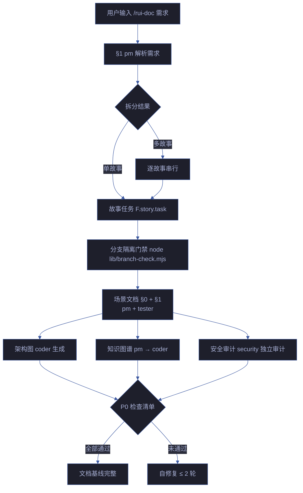

# rui-doc

> 需求到文档基线的完整管线。pm 拆需求为故事 → coder 补齐设计文档。全程只读源码，多故事串行。
>
> **写故事文档也走分支隔离。** doc 阶段写入 `docs/故事任务面板/<name>/` 下的文档，这些写入操作必须在 `feat/<name>` 分支上执行，与 code 阶段同门禁。
>
> `/rui doc <需求>`（通过 rui 编排器调用）或 `/rui-doc <需求>`
> 需求支持文本 / `@` 引用本地文件 / URL

[主流程](#主流程) · [doc --from-code](#doc---from-code) · [doc --from-local](#doc---from-local) · [生效标志](#生效标志)

## 主流程

### 文档基线产出

| 文件 | 阶段 | Agent | 必选 |
|------|------|-------|:---:|
| 故事任务.md | 文档生成 | pm | ✓ |
| 场景-N-<slug>.md (§0 + §1) | 文档生成 | pm + tester | ✓ (≥2) |
| 场景-N-<slug>.html | 文档生成 | coder | ✓ |
| 知识图谱.json + .html | 文档生成 | pm → coder | ✓ |
| 安全审计 | 文档生成 | security | ✓ |

### 约束

| # | 规则 | 阻断标识 |
|---|------|---------|
| 1 | 只读源码，不修改 | P0 |
| 2 | 写入必须在 `feat/<name>` 分支 | `no-doc-isolation` |
| 3 | 语言边界：故事任务/场景文档禁止技术术语 | `doc-p0` |
| 4 | 每个断言有来源引用或证据路径 | `chain-broken` |
| 5 | 逐故事串行，前一完成再进下一 | `chain-broken` |
| 6 | node lib/branch-check.mjs 验证 | `no-doc-isolation` |
| 7 | 每文档含 mermaid 图，不可纯文本 | `doc-p0` |

## doc --from-code

> 存量代码库的文档生成入口。req 空时 pm 扫描推荐列表；req 有值时从源码反推完整故事文档。全程只读。
>
> `/rui-doc --from-code [需求]`

### req 为空 — 推荐引路

1. **detect** — 判定项目类型（frontend / backend / fullstack / unknown）
2. **scan** — `node lib/recommend.mjs --root . --type <detected> --format json`
3. **evaluate** — PM 按 ranking.md 5 层框架评分排序
4. **present** — 输出故事任务推荐
5. **wait** — 等待用户选择后进入生成阶段

### req 有值 — 直接生成

| 步骤 | 操作 | 阻断 |
|------|------|------|
| §1.1 解析 | 解析 name 为 kebab-case | `no-parse` |
| §1.2 冲突检测 | 目标目录已存在 → 拒绝覆盖 | 引导 /rui-update |
| §1.3 分支隔离 | 验证 feat/<name> 分支 | `no-doc-isolation` |
| §1.4 源码定位 | 按 name 匹配源文件 | `no-source` |
| §1.5 只读提取 | 提取结构/接口/依赖/状态/安全 | `chain-broken` |
| §2 逐文档生成 | pm → coder → security | `doc-p0` |

### 反推证据等级

| 能确定的 | 不能确定的 |
|---------|-----------|
| 接口契约、组件签名、依赖关系 → Level A（附源码路径） | 业务意图、设计决策 → Level C（标注「待补充」） |
| 安全信号 → Level B（附代码模式） | 性能目标、容量规划 → Level C |

## doc --from-local

> 从已有本地故事文档补全缺失文档基线。全程只读已有，不覆盖。
>
> `/rui-doc --from-local <name>`

前置条件：至少 1 份基线文档存在。目录空或仅场景文档/知识图谱存在 → 引导 `--from-code`。

按依赖链顺序生成缺失文档：
1. 故事任务.md（缺失时）
2. 场景-N-<slug>.md（缺失时）
3. 场景-N-<slug>.html（缺失时）
4. 知识图谱.json + .html（缺失时）
5. 安全审计（缺失时）

## 生效标志

| 标志 | 验证方式 |
|------|---------|
| 文档基线文件全部生成 | ls docs/故事任务面板/<name>/ |
| 分支隔离通过 | git branch --show-current == feat/<name> |
| 语言边界扫描通过 | 无技术术语污染 |
| P0 检查清单全通过 | 逐项验证 |

## 自循环

> 文档新鲜度检查。Agent 可按间隔检测源码变更并提示文档更新。

| 属性 | 值 |
|------|-----|
| 推荐间隔 | `0 8 * * 1-5`（工作日早 8 点） |
| 触发条件 | 源码目录有新 commit 但对应故事文档未更新 |
| 终止条件 | 所有故事文档与源码同步 |
| 迭代动作 | 扫描故事面板 → 对比文档日期与源码 commit 日期 → 列出过期文档 |
| 收敛判定 | 无过期文档（全部 mtime ≥ 最后相关 commit 时间） |
