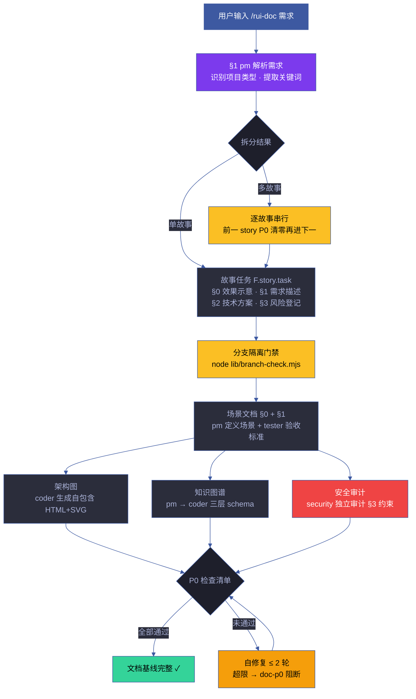
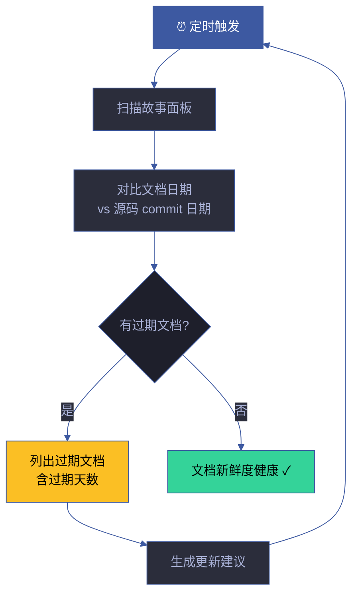
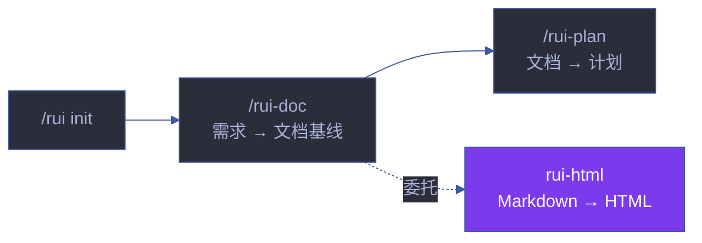

# rui-doc

> 需求到文档基线的完整管线。pm 拆需求为故事 → coder 补齐设计文档。全程只读源码，多故事串行。
>
> **写故事文档也走分支隔离。** doc 阶段写入 `docs/故事任务面板/<name>/` 下的文档，这些写入操作必须在 `feat/<name>` 分支上执行，与 code 阶段同门禁。
>
> `/rui doc <需求>`（通过 rui 编排器调用）或 `/rui-doc <需求>`
> 需求支持文本 / `@` 引用本地文件 / URL
>
> **单一职责**：需求 → Markdown 文档基线。不负责 HTML 生成（[rui-html](../rui-html/)），不负责代码实现（[rui-code](../rui-code/)），不负责计划生成（[rui-plan](../rui-plan/)）。

[主流程](#主流程) · [文档公式](#文档公式) · [doc --from-code](#doc---from-code) · [doc --from-local](#doc---from-local) · [质量门禁](#质量门禁) · [生效标志](#生效标志) · [自循环](#自循环)

## 主流程



### 文档基线产出

| 文件 | 阶段 | Agent | 必选 | 公式 |
|------|------|-------|:---:|------|
| 故事任务.md | 文档生成 | pm | ✓ | F.story.task |
| 场景-N-<slug>.md (§0 + §1) | 文档生成 | pm + tester | ✓ (≥2) | F.story.scene |
| 场景-N-<slug>.html | 文档生成 | coder | ✓ | F.supp.html |
| 知识图谱.json + .html | 文档生成 | pm → coder | ✓ | F.story.knowledge-graph |
| 安全审计 | 文档生成 | security | ✓ | F.supp.security |

## 文档公式

> 文档产出遵循 [formulas.md](../rui/formulas.md) 规约。公式定义 what，模板定义 how — 本系统只用公式。

### 通用元素

| 公式 | 含义 | 位置 |
|------|------|------|
| F.meta | 元数据块：项目名、版本、日期、Agent、证据等级 | 每个文档头部 |
| F.toc | 目录导航：锚点链接 + 层级缩进 | 故事任务.md 开头 |
| F.nav | 面包屑导航：首页 > 故事面板 > 故事名 > 场景 | 每个文档 |
| F.evidence | 证据标注：A(已验证)/B(可推导)/C(待补充)/D(幻觉) | 每个断言 |

### 故事主线公式

| 公式 | 含义 | 必选章节 |
|------|------|---------|
| F.story.task | 故事任务文档 | §0 效果示意(mermaid) · §1 需求描述 · §2 技术方案 · §3 风险登记 · §4 任务拆分 |
| F.story.scene | 场景文档 | §0 场景目标(mermaid) · §1 验收标准(AC) |
| F.story.knowledge-graph | 知识图谱 | story → scene → source 三层 schema |

### 补充文档公式

| 公式 | 含义 | 触发条件 |
|------|------|---------|
| F.supp.plan | 实施计划 | 文档基线完成后 |
| F.supp.arch | 架构图 | 涉及架构变更时 |
| F.supp.security | 安全审计 | 涉及用户输入/认证/授权时 |
| F.supp.test | 测试设计 | Gate A 前 |

### 证据等级

| 等级 | 标识 | 含义 | 示例 |
|------|------|------|------|
| **A** | 已验证 | 附源码路径或运行输出 | `src/auth.ts:42 — verifyToken()` |
| **B** | 可推导 | 附推导链 | `从 package.json deps 推断使用 Express` |
| **C** | 待补充 | 标注缺失 | `[待补充] 性能目标需产品确认` |
| **D** | 幻觉 | 视为错误 | 禁止出现 |

### 约束

| # | 规则 | 阻断标识 | 设计理由 |
|---|------|---------|---------|
| 1 | 只读源码，不修改 | P0 | 文档阶段不改变代码行为 |
| 2 | 写入必须在 `feat/<name>` 分支 | `no-doc-isolation` | 分支隔离不可绕过 |
| 3 | 语言边界：故事任务/场景文档禁止技术术语 | `doc-p0` | 故事面向业务，技术术语在 §2 |
| 4 | 每个断言有来源引用或证据路径 | `chain-broken` | 可追溯、可验证 |
| 5 | 逐故事串行，前一完成再进下一 | `chain-broken` | 避免上下文污染 |
| 6 | `node lib/branch-check.mjs` 验证 | `no-doc-isolation` | 强制门禁 |
| 7 | 每文档含 mermaid 图，不可纯文本 | `doc-p0` | 表达优先：图→文本→表 |
| 8 | 文档 ≤ 2 轮自修复，超限阻断 | `doc-p0` | 防止无限循环 |

## doc --from-code

> 存量代码库的文档生成入口。req 空时 pm 扫描推荐列表；req 有值时从源码反推完整故事文档。全程只读。
>
> `/rui-doc --from-code [需求]`

### req 为空 — 推荐引路

1. **detect** — 判定项目类型（frontend / backend / fullstack / unknown）
2. **scan** — `node lib/recommend.mjs --root . --type <detected> --format json`
3. **evaluate** — PM 按 [ranking.md](../rui/ranking.md) 5 层框架评分排序
4. **present** — 输出故事任务推荐（含优先级、预估工作量、依赖关系）
5. **wait** — 等待用户选择后进入生成阶段

### req 有值 — 直接生成

| 步骤 | 操作 | 阻断 | 说明 |
|------|------|------|------|
| §1.1 解析 | 解析 name 为 kebab-case | `no-parse` | 中文 → 拼音，英文 → kebab |
| §1.2 冲突检测 | 目标目录已存在 → 拒绝覆盖 | 引导 /rui-update | 保护已有文档 |
| §1.3 分支隔离 | 验证 feat/<name> 分支 | `no-doc-isolation` | 强制门禁 |
| §1.4 源码定位 | 按 name 匹配源文件 | `no-source` | Glob 搜索 + 启发式匹配 |
| §1.5 只读提取 | 提取结构/接口/依赖/状态/安全 | `chain-broken` | 只读，不修改源码 |
| §2 逐文档生成 | pm → coder → security | `doc-p0` | 按公式逐文档生成 |

### 反推证据等级

| 能确定的 (Level A/B) | 不能确定的 (Level C) |
|---------|-----------|
| 接口契约、组件签名、依赖关系 → Level A（附源码路径） | 业务意图、设计决策 → Level C（标注「待补充」） |
| 安全信号 → Level B（附代码模式） | 性能目标、容量规划 → Level C |
| 目录结构、文件组织 → Level A | 历史决策上下文 → Level C |

### 源码反推方法论

> `--from-code` 从源码结构反推文档的启发式规则。

#### 模块边界识别

```
1. 入口点识别 — 有 export 且 fan-in > 0 的文件 = 模块入口
2. 内部实现 — 仅被同目录文件 import 的文件 = 模块内部
3. 共享库 — 被 ≥ 3 个不同目录 import 的文件 = 共享基础设施
4. 边界接口 — 目录下 index 文件或 barrel export = 模块公共 API
```

#### 架构模式推断

| 目录结构模式 | 推断架构 | 信号 |
|------------|---------|------|
| `src/pages/` + `src/components/` | 前端 SPA | 页面组件分离 |
| `src/routes/` + `src/controllers/` + `src/models/` | MVC 后端 | 经典三层 |
| `packages/*/src/` | Monorepo | 多包 workspace |
| `skills/*/SKILL.md` | 插件系统 | YrY meta 项目 |

#### 反推置信度

| 反推内容 | 置信度 | 原因 |
|---------|:---:|------|
| 接口签名 | 高 | 静态代码可直接提取 |
| 数据模型 | 高 | 类型定义/interface 可提取 |
| 依赖关系 | 高 | import 图可精确构建 |
| 业务流程 | 中 | 需推断调用顺序 |
| 设计意图 | 低 | 无法从代码反推 WHY |

### 典型文档生成示例

> 以下展示 `/rui-doc "用户登录模块支持手机验证码登录"` 的完整执行流程。

```
§1 pm 解析需求:
  项目类型: fullstack (前端 React + 后端 Express)
  关键词: 登录 · 手机 · 验证码 · 短信
  故事拆分: 单故事 → user-login

§2 分支隔离:
  node lib/branch-check.mjs --story=user-login --mode=write → ✅
  git checkout -b feat/user-login

§3 生成故事任务.md:
  §0 效果示意: mermaid 流程图 (用户→输入手机号→获取验证码→验证→登录)
  §1 需求描述: 3 个 FP# (FP-1 手机号输入 · FP-2 验证码发送 · FP-3 验证登录)
  §2 技术方案: 短信服务商选型 · 验证码存储 (Redis) · 接口设计
  §3 风险登记: 短信成本 · 验证码泄漏 · 频控策略

§4 生成场景文档 (≥2 场景):
  场景-1-正常登录流程/index.md:
    §0 效果示意: mermaid 时序图 (前端→API→短信服务→Redis→前端)
    §1 验收标准: 8 条 AC (正常 4 条 · 边界 3 条 · 异常 1 条)
  场景-2-异常与边界/index.md:
    §0 效果示意: mermaid 状态图 (超时·频控·错误码)
    §1 验收标准: 6 条 AC

§5 生成知识图谱:
  知识图谱.json: 3 层 schema (story→scene→source)
  知识图谱.html: Cytoscape.js 交互可视化

§6 安全审计:
  输入校验: 手机号格式 + 验证码长度
  频控: 同一手机号 60s 内仅发送 1 次
  存储: 验证码 Redis TTL 5 分钟

§7 P0 检查:
  ✅ F.meta 含项目名/版本/日期
  ✅ §0 含 mermaid 效果示意
  ✅ 每场景 ≥ 2 条 AC
  ✅ 风险登记 ≥ 3 项
  ✅ 无技术术语污染业务文档
  ✅ 分支隔离通过

产出: docs/故事任务面板/user-login/
  ├── 故事任务.md
  ├── 场景-1-正常登录流程/index.md
  ├── 场景-2-异常与边界/index.md
  ├── 知识图谱.json
  └── 知识图谱.html
```

## doc --from-local

> 从已有本地故事文档补全缺失文档基线。全程只读已有，不覆盖。
>
> `/rui-doc --from-local <name>`

### 前置条件

| 条件 | 满足时 | 不满足时 |
|------|--------|---------|
| 至少 1 份基线文档存在 | 继续补全 | 引导 `--from-code` |
| 目录仅含场景文档 | 继续补全故事任务 | — |
| 目录仅含知识图谱 | 引导 `--from-code` | 知识图谱不足以反推 |

### 补全顺序

按依赖链顺序生成缺失文档：

1. 故事任务.md（缺失时）— 从已有场景文档反推
2. 场景-N-<slug>.md（缺失时）— 从故事任务拆分
3. 场景-N-<slug>.html（缺失时）— 从 markdown 生成
4. 知识图谱.json + .html（缺失时）— 从故事+场景聚合
5. 安全审计（缺失时）— 从场景文档提取安全信号

## 质量门禁

### P0 检查清单

| 检查项 | 验证方式 | 失败处置 |
|--------|---------|---------|
| F.meta 完整 | 含项目名、版本、日期、Agent、证据等级 | 补全元数据 |
| §0 含 mermaid 效果示意 | 源码含 mermaid 代码块 | 生成 mermaid 图 |
| 每场景 ≥ 2 条 AC | 计数验收标准条目 | 补充 AC |
| 风险登记 ≥ 3 项 | 计数风险条目 | 补充风险 |
| 无技术术语污染 | 扫描业务文档中的技术术语 | 替换为业务语言 |
| 证据等级无 D 级 | 扫描 D 级标注 | 删除或降级为 C |
| 分支隔离通过 | `git branch --show-current` | 切到 feat 分支 |

### 自修复策略

```
自修复 ≤ 2 轮:
  第 1 轮: 自动修复可自动修复的 P0（格式、元数据、mermaid）
  第 2 轮: 尝试修复剩余的 P0（补充缺失内容）
  超限: 输出 doc-p0 阻断，列出无法自动修复的项，等待人工介入
```

## 降级策略

| 情况 | 降级行为 | 恢复方式 |
|------|---------|---------|
| 需求无法解析 | 输出 `no-parse` 阻断，提示重新描述 | 用户重新描述需求 |
| 源码无法定位 | 输出 `no-source` 阻断，列出搜索尝试 | 手动指定源文件路径 |
| 文档 P0 不通过 | 自修复 ≤ 2 轮，超限输出 `doc-p0` 阻断 | 人工修复 P0 后重跑 |
| 分支隔离失败 | 输出 `no-doc-isolation` 阻断 | 切到 `feat/<name>` 分支 |
| 目标目录已存在 | 拒绝覆盖，引导 `/rui-update` | 使用 rui-update 增量更新 |
| `--from-code` 无源码 | 仅输出 Level C 标注，不阻断 | 人工补充业务意图 |

## 测试

> 文档生成管线的公式合规、P0 检查清单、分支隔离和证据等级的自动化验证。

### 运行测试

```bash
npx vitest run skills/rui-doc/tests/          # 全量运行
npx vitest skills/rui-doc/tests/              # 监听模式
npx vitest run --coverage skills/rui-doc/tests/  # 覆盖率报告
```

### 测试文件

| 文件 | 测试范围 | 类型 |
|------|---------|:---:|
| `tests/rui-doc.test.mjs` | 文档生成流程、公式验证、P0 检查、证据等级 | 单元 |

### 测试策略

| 层级 | 范围 | 要求 |
|------|------|------|
| **公式合规测试** | F.meta/F.toc/F.nav/F.evidence 完整性 | 每公式有验证测试 |
| **P0 检查测试** | 7 项检查清单每项的正反例 | 通过/不通过双路径 |
| **证据等级测试** | A/B/C/D 四级判定、D 级拒绝 | 四级各有测试 |
| **模式测试** | 默认模式、--from-code、--from-local | 三种模式各有测试 |

### 覆盖要求

| 维度 | 最低阈值 | 目标 |
|------|:---:|:---:|
| 文档公式 | 100% | 10 个公式各有验证 |
| P0 检查清单 | 100% | 7 项检查各有测试 |
| 三种模式 | 100% | 默认/--from-code/--from-local |
| 核心规则 | 100% | 8 条规则各有验证 |

## 规则

- [doc-pipeline.md](./rules/doc-pipeline.md) — 需求到文档基线的生成规则
## 生效标志


| 标志 | 验证方式 | 未达标的处置 |
|------|---------|------------|
| 文档基线文件全部生成 | `ls docs/故事任务面板/<name>/` | 按补全顺序生成缺失文件 |
| 分支隔离通过 | `git branch --show-current` == `feat/<name>` | 切到 feat 分支 |
| 公式合规 | 检查 F.meta/F.toc/F.nav/F.evidence | 补全缺失公式元素 |
| 语言边界扫描通过 | 无技术术语污染 | 替换为业务语言 |
| P0 检查清单全通过 | 逐项验证 | 自修复 ≤ 2 轮 |

## 自循环

> 文档新鲜度检查。Agent 可按间隔检测源码变更并提示文档更新。

| 属性 | 值 |
|------|-----|
| 推荐间隔 | `0 8 * * 1-5`（工作日早 8 点） |
| 触发条件 | 源码目录有新 commit 但对应故事文档未更新 |
| 终止条件 | 所有故事文档与源码同步 |
| 迭代动作 | ① 扫描故事面板 → ② 对比文档 mtime 与源码最后 commit 时间 → ③ 列出过期文档 → ④ 生成更新建议 |
| 告警条件 | 文档 mtime < 源码最后 commit 时间 > 7 天 |
| 收敛判定 | 无过期文档（全部 mtime ≥ 最后相关 commit 时间） |

### 自循环工作流



> 本技能 `checkMode: "slash"`——无独立 CLI，由 `/rui-doc` 在 Claude Code 会话内触发。6 字段契约与调度规则详见 [rules/loop-engineering.md](../rui/rules/loop-engineering.md)。

## 与 rui 的关系

`/rui-doc` 是 rui 编排管线第二阶段（需求 → 文档基线）。由 `/rui doc <需求>` 路由触发。产出文档基线后，编排器自动进入 `/rui plan` 阶段。

