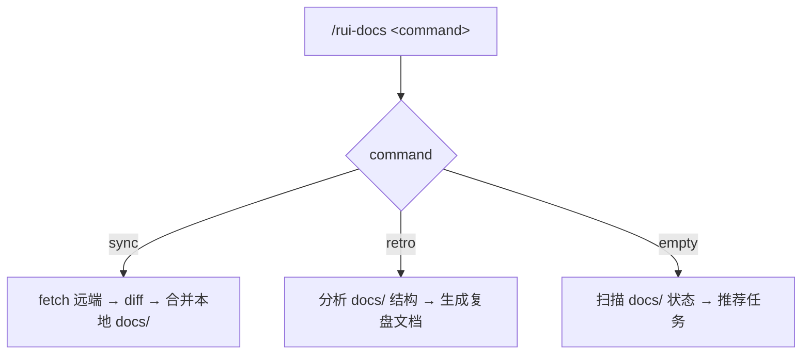
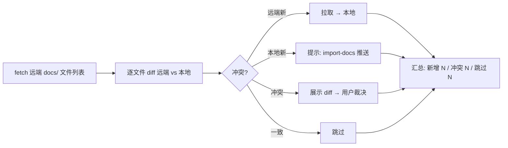

# rui-docs



---

## 命令概览

| 命令 | 流程 |
|------|------|
| `/rui-docs sync` | 从远端 API 拉取最新文档，diff 对比后合并到本地 `docs/` |
| `/rui-docs retro` | 分析 `docs/` 结构健康度，生成复盘文档到 `docs/自改进故事面板/` |
| `/rui-docs`（空输入） | 扫描 docs/ 状态 → 推荐可执行任务 |

---

## /rui-docs sync

从远端文档 API 拉取最新内容，与本地 `docs/` 做 diff 对比，逐文件确认后合并。为避免覆盖本地未推送内容，先 diff 再逐文件决策。



| Step | 操作 | 命令 |
|------|------|------|
| 1 | 获取远端文件列表 | `node skills/rui-docs/scripts/sync.js fetch` |
| 2 | 逐文件 diff | `node skills/rui-docs/scripts/sync.js diff` |
| 3 | 应用合并 | `node skills/rui-docs/scripts/sync.js apply` |

> **前置条件**：`API_X_TOKEN` 已设置。依赖远端 API（`https://api.effiy.cn`）的 `/read-file` 接口。
>
> sync 是增量合并，不会删除本地文件。远端有而本地无的才新增，冲突文件需用户手动裁决。

---

## /rui-docs retro

分析当前项目 `docs/` 目录结构，生成文档健康度复盘报告。


| Step | 操作 | 命令 |
|------|------|------|
| 1 | 采集 docs/ 目录结构 | `node skills/rui-docs/scripts/retro.js` 遍历子目录统计 |
| 2 | 生成复盘文档 | 按 §1 文档结构 §2 健康度 §3 改进项 三段结构输出 md |
| 3 | 保存文档 | 写入 `${REPO_ROOT}/docs/自改进故事面板/${PROJECT}-docs-${date}.md` |

> **参数：** `--name <story>` 关联故事名，`--json` 输出 JSON 到 stdout。
>
> 复盘聚焦 `docs/` 目录本身：文档数量、分类覆盖、陈旧度、模板合规度。不涉及 `.claude` 配置或代码。

### 复盘指标

| 维度 | 检测项 | 健康阈值 |
|------|--------|---------|
| 数量 | 各子目录文件数 | 不为空 |
| 时效 | 最近修改时间 | ≤14 天 |
| 覆盖 | 故事文档 / 技术评审 / 实施报告 三类齐全 | 每类 ≥1 |
| 格式 | 含 frontmatter 比例 | ≥80% |
| 关联 | 文档间交叉引用断裂率 | ≤10% |

---

## /rui-docs（空输入）

当 `/rui-docs` 无参数时，扫描已有 `docs/` 的所有文件，推荐 5~10 条可执行任务。

### 推荐生成规则

扫描根项目 `${REPO_ROOT}/` 下所有存在 `docs/` 的子目录，综合生成推荐：

| 扫描源 | 提取信息 |
|--------|---------|
| `docs/故事任务/` | Story 任务文档数、完成率 |
| `docs/技术评审/` | 技术评审文档数 |
| `docs/实施报告/` | 实施报告文档数 |
| `docs/自改进故事面板/` | 复盘文档数、最后复盘日期 |
| 各 `.md` 文件的 `mtime` | 陈旧度（>14 天未更新） |
| 各 `.md` 文件的 `frontmatter` | 元数据完整度 |

### 推荐分类

| 类型 | 说明 | 示例 |
|------|------|------|
| 文档同步 | 远端有新内容或本地未推送 | `cd <project> && /rui-docs sync` |
| 首次复盘 | 有 docs/ 但无复盘记录 | `cd <project> && /rui-docs retro` |
| 增量复盘 | 复盘过期 >7 天 | `cd <project> && /rui-docs retro` |
| 陈旧文档 | 某文档 >14 天未更新 | 手动审查或归档 |
| 格式补齐 | frontmatter 缺失比例 >20% | 批量补齐 frontmatter |
| 断裂链接 | 交叉引用指向不存在的文件 | 修复或删除死链 |
| 定期巡检 | 近期有复盘、文档健康 | 标记为健康 |

### 输出格式

```
📚 rui-docs 任务推荐（共 N 条）

<project-1>:
1. [文档同步] cd <project-1> && /rui-docs sync
   理由: 远端有新文档未拉取 | 来源: API 文件列表 diff

2. [陈旧文档] 审查 docs/故事任务/old-story.md
   理由: 23 天未更新 | 来源: mtime 扫描

<project-2>:
3. [首次复盘] cd <project-2> && /rui-docs retro
   理由: docs/ 存在但无复盘记录 | 来源: docs/自改进故事面板/

4. [断裂链接] 修复 3 处死链
   理由: 交叉引用指向不存在的文件 | 来源: link-check 扫描

...
```

> 按项目分组，每个子项目的 `docs/` 互相独立推荐。

---

## 核心规则

1. **操作范围仅限 `docs/`**：不得触及 `.claude/`、代码文件或其他目录
2. **分支隔离**：禁止直接修改 `docs/` 下内容，所有改动必须从 main 拉取 `feat/<name>` 分支进行
3. **禁止自动合并**：功能分支不得自动合并到 main，合并操作一律由开发者手动执行
4. **sync 增量合并**：远端拉取是增量合并，不删除本地文件；冲突文件需用户裁决
5. **retro 纯本地分析**：不连接远端，仅分析本地 `docs/` 结构
6. **retro 输出到根项目**：文档写入 `<project>/docs/自改进故事面板/<project>-docs-<date>.md`
7. **空输入只推荐不执行**：扫描状态后推荐任务，不触发管线
8. **不管理凭据**：API_X_TOKEN 由系统环境变量提供

详见 [`rules/rui-docs.md`](../../rules/rui-docs.md)。

---

## 安全约束

- `API_X_TOKEN` 仅从系统环境变量读取，不接受 CLI 参数或配置文件
- sync 操作需用户确认，不自动覆盖本地修改
- 远端地址为 `https://api.effiy.cn`，不可配置为其他地址

---

## 支持文件

- `scripts/sync.js`：远端同步 CLI
- `scripts/retro.js`：文档健康度分析 CLI
