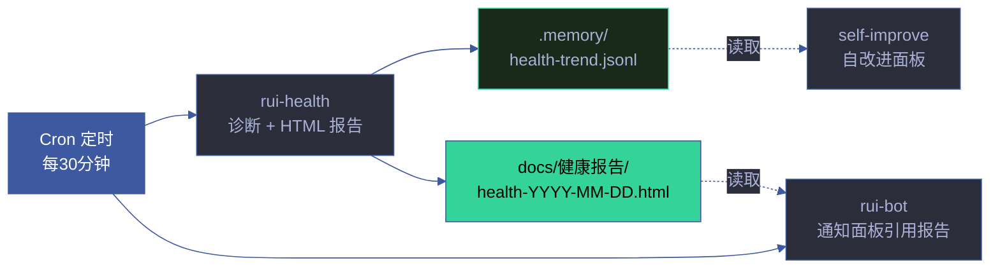
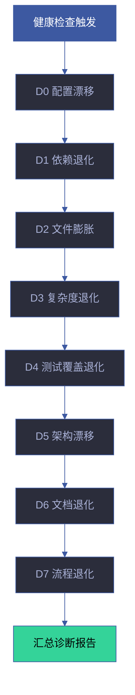
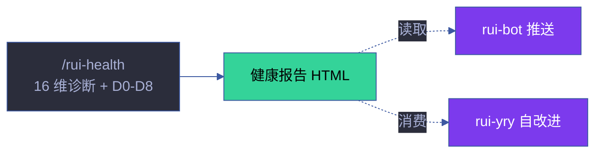

# rui-health — 系统健康诊断

> 从 rui-bot 按 SRP 拆分。rui-bot 管消息推送，rui-health 管健康诊断。两者通过报告文件解耦。
>
> **单一职责**：项目健康度量化评分与趋势监控。**D0-D8 诊断引擎的权威定义源**（触发条件、评分逻辑、修复建议）。其他技能（rui-yry、rui-analysis）引用此引擎，不重复定义。

[触发](#触发) · [诊断维度](#诊断维度) · [评分算法](#评分算法) · [D0-D8 诊断引擎](#d0-d8-诊断引擎) · [报告格式](#报告格式) · [数据流](#数据流) · [约束](#约束) · [与 rui-bot 的关系](#与-rui-bot-的关系) · [自循环](#自循环)

## 触发



## 诊断维度

> 9 核心维度 + 7 工程成熟度维度。权重定义在 `lib/constants.mjs` → `HEALTH_DIM_WEIGHTS`。

### 核心维度 (9)

| 维度 | 权重 | 检查内容 | 数据源 | 评分逻辑 |
|------|:---:|---------|--------|---------|
| **token** | 15 | `API_X_TOKEN` 环境变量存在性 + 格式合法性 | `process.env` | 存在=100，不存在=0 |
| **config** | 10 | rui-bot `config.json` 存在性、结构完整性、必填字段 | 文件系统 | 存在且完整=100，缺失=0，不完整=50 |
| **robots** | 10 | Webhook URL 配置、格式验证、可达性探测 | 配置文件 + HTTP | 配置且可达=100，仅配置=50，缺失=0 |
| **api** | 15 | API 端点可达性、响应时间、错误率 | HTTP 探测 | P95 < 2s=100，< 5s=75，< 10s=50，超时=0 |
| **reports** | 10 | 报告目录存在性、文件新鲜度（24h 内） | 文件系统 | 24h 内有新报告=100，7d 内=50，>7d=0 |
| **format** | 10 | 消息格式合规（Rich/Verbose 模板完整性） | 模板文件 | 模板完整=100，部分缺失=50，全部缺失=0 |
| **diagnostics** | 10 | D0-D8 诊断引擎状态、触发率、误报率 | 诊断日志 | 0 触发=100，1-2=75，3-4=50，5+=25 |
| **git** | 10 | 未提交文件数、未推送 commit 数、分支状态 | git 命令 | 干净=100，≤3 未提交=75，≤10=50，>10=0 |
| **security** | 10 | 密钥扫描（无 .env 未追踪）、敏感模式检测 | 文件扫描 | 无发现=100，发现低危=50，发现高危=0 |

### 工程成熟度维度 (7)

| 维度 | 权重 | 检查内容 | 评分逻辑 |
|------|:---:|---------|---------|
| **em_testing** | 10 | 测试框架存在性 + 用例数 + 覆盖率 | 有框架+用例=100，仅有框架=50，无=0 |
| **em_types** | 15 | TypeScript strict 模式 / JSDoc 类型覆盖 | strict=100，tsconfig=75，JSDoc=50，无=0 |
| **em_linting** | 15 | ESLint + Prettier + EditorConfig 存在性 | 三者齐全=100，缺一=66，缺二=33，全无=0 |
| **em_cicd** | 15 | CI/CD 管线配置文件存在性 | 有配置=100，无=0 |
| **em_docs** | 15 | README + CLAUDE.md + docs/ 完整性 | 三者齐全=100，缺一=66，缺二=33，全无=0 |
| **em_deps** | 10 | Lockfile 存在 + 版本脚本 + 无高危 CVE | 全部满足=100，缺 lockfile=50，有 CVE 扣分 |
| **em_git** | 10 | .gitignore + .gitattributes + PR 模板 | 三者齐全=100，缺一=66，缺二=33，全无=0 |

## 评分算法

### 综合评分公式

```
综合分 = 核心加权分 × 0.5 + 工程成熟度加权分 × 0.5

核心加权分 = Σ(核心维度得分 × 权重) / Σ(核心维度权重)
工程成熟度加权分 = Σ(工程维度得分 × 权重) / Σ(工程维度权重)
```

### 评级阈值

| 等级 | 分数 | 标签 | 含义 | 建议动作 |
|------|:---:|------|------|---------|
| **A** | ≥ 90 | 优秀 | 系统健康，无需干预 | 维持现状 |
| **B** | ≥ 75 | 良好 | 基本健康，有改进空间 | 关注低分维度 |
| **C** | ≥ 60 | 一般 | 存在风险，需要关注 | 制定改进计划 |
| **D** | < 60 | 需关注 | 存在严重问题 | 立即修复 P0 项 |

### 趋势计算

基于 `.memory/health-trend.jsonl` 历史数据：

1. **线性回归**：对最近 7 个数据点拟合趋势线
2. **斜率方向**：slope > 0.5/周 → rising（改善），slope < -0.5/周 → falling（退化），否则 stable
3. **置信度**：R² ≥ 0.7 → high，≥ 0.4 → medium，< 0.4 → low
4. **预测**：基于趋势线外推 7 天后的评分

### 告警触发

| 条件 | 级别 | 通知 |
|------|------|------|
| 综合分 < 60 | Critical | 企微 @all |
| 综合分下降 > 10 分/周 | Critical | 企微 @all |
| 任一核心维度 = 0 | Warning | 企微通知 |
| 连续 3 次下降 | Warning | 企微通知 |
| 新增 D0-D8 诊断触发 | Info | 仅记录 |

### 评分可靠性评估

> 综合评分受数据采集频率和维度波动影响。通过可靠性指标量化评分可信度。

| 指标 | 计算方式 | 健康阈值 | 含义 |
|------|---------|:---:|------|
| **变异系数 (CV)** | σ / μ | < 0.15 | 评分波动程度，越低越稳定 |
| **置信区间 (95%)** | μ ± 1.96σ | 宽度 < 10 | 评分真实值范围 |
| **数据充分性** | 历史数据点数 | ≥ 7 | 趋势分析的最小样本量 |
| **维度完整性** | 已评分维度 / 总维度 | ≥ 90% | 缺失维度会降低综合分可信度 |

### 评分校准策略

```
1. 基线建立 — 首次 7 次检查建立统计基线 (μ, σ)
2. 异常检测 — 基于 modified Z-score 检测离群值
3. 趋势确认 — 连续 3 次同方向变化 = 确认趋势
4. 阈值自适应 — 每 30 天根据历史分布重新校准告警阈值
```

## D0-D8 诊断引擎

### 诊断层级

| 诊断 | 名称 | 检测内容 | 触发条件 |
|------|------|---------|---------|
| **D0** | 配置漂移 | 配置文件与基线不一致 | config hash 变更 |
| **D1** | 依赖退化 | 依赖版本过期或冲突 | 落后 ≥ 2 major |
| **D2** | 文件膨胀 | 项目体积超阈值增长 | 体积增长 > 20% |
| **D3** | 复杂度退化 | 圈复杂度热点新增 | 新增 Extreme 文件 |
| **D4** | 测试覆盖退化 | 测试覆盖率下降 | 覆盖率下降 > 5% |
| **D5** | 架构漂移 | 架构违规新增 | 新增边界违规 |
| **D6** | 文档退化 | 文档过期或缺失 | 文档 mtime < 源码 commit |
| **D7** | 流程退化 | 管线纪律违反 | 跳过 Gate A/B 或分支隔离 |

### 诊断工作流



### 诊断输出

每个触发的诊断输出：
- 诊断名称和级别
- 触发条件的具体数据
- 影响评估（影响的维度和严重度）
- 修复建议（可操作的具体步骤）
- 关联的自改进提案（如有）

## 报告格式

### HTML 报告

`node skills/rui-health/health.mjs --html` 生成自包含 HTML 报告，包含：

| 区块 | 内容 |
|------|------|
| **综合评分卡片** | 分数 + 等级 + 趋势箭头 + 7 天预测 |
| **核心维度详情** | 9 维度评分条 + 状态指示 + 建议措施 |
| **工程成熟度详情** | 7 维度评分条 + 改进建议 |
| **D0-D8 诊断清单** | 触发状态 + 严重度 + 修复建议 |
| **趋势迷你图** | 最近 7 次评分的折线图 |
| **机器人就绪状态** | rui-bot 配置状态 + 通知队列状态 |
| **执行记忆统计** | 最近执行记录摘要 |

输出路径：`docs/健康报告/health-YYYY-MM-DD.html`

### 趋势持久化

每次诊断自动追加到 `.memory/health-trend.jsonl`：

```json
{
  "timestamp": "2026-06-22T14:30:00.000Z",
  "composite": 85,
  "grade": "B",
  "dimensions": {
    "token": 100, "config": 100, "robots": 100,
    "api": 95, "reports": 100, "format": 100,
    "diagnostics": 70, "git": 40, "security": 100
  },
  "engineering": {
    "em_testing": 60, "em_types": 100, "em_linting": 100,
    "em_cicd": 0, "em_docs": 100, "em_deps": 100, "em_git": 100
  },
  "triggeredDiags": ["D2", "D5"],
  "gitBranch": "main",
  "gitUncommitted": 3
}
```

### 企微通知

`node skills/rui-health/health.mjs --notify` 委托 rui-bot 发送健康通知（通过报告文件路径，非直接调用）。

## 数据流

```
Cron 触发 rui-health
  → 运行 16 维度诊断
  → 触发 D0-D8 诊断引擎
  → 计算综合评分 + 趋势
  → 生成 HTML 报告 → docs/健康报告/
  → 追加 health-trend.jsonl
  → (可选) 委托 rui-bot 发送企微通知
  → 通知面板 (docs/index.html) 读取 HTML 索引展示
  → 自改进面板 读取 JSONL 趋势数据做深度分析
```

## 约束

| # | 规则 | 反例 |
|---|------|------|
| 1 | 权重从 `lib/constants.mjs` 导入，不自定义 | send.mjs 和 health-report.mjs 各维护一份权重 |
| 2 | 诊断结果必须可追溯（文件路径 + 行号） | "config 看起来没问题" |
| 3 | HTML 报告自包含（CDN 引用除外） | 报告依赖本地文件 |
| 4 | 不直接发送企微消息（委托 rui-bot） | health.mjs 内联 HTTP POST 逻辑 |
| 5 | 趋势数据追加写入，不覆盖 | 每次重写整个 JSONL 文件 |
| 6 | 16 维度全覆盖，不可跳过维度 | 仅检查部分维度即报告 |

## 生效标志

| 标志 | 验证方式 | 预期行为 |
|------|---------|---------|
| 16 维度全部覆盖 | 输出含核心 9 维 + 工程 7 维的评分 | 每维度有评分和状态 |
| D0-D8 诊断引擎就绪 | 每项诊断有触发条件 + 修复建议 | 诊断可独立触发 |
| HTML 报告自包含 | 浏览器打开无资源 404 | 仅 D3 通过 CDN 加载 |
| 趋势持久化 | `.memory/health-trend.jsonl` 含本轮条目 | JSONL 格式合法 |
| 企微通知委托 | 通知通过 rui-bot 发送，非直接 HTTP | health.mjs 不含 webhook 逻辑 |
| 权重统一来源 | 评分权重从 `lib/constants.mjs` 导入 | 无自定义权重 |

## 测试

> 16 维度评分算法、D0-D8 诊断触发条件、趋势计算和告警阈值的自动化验证。

### 运行测试

```bash
npx vitest run skills/rui-health/tests/          # 全量运行
npx vitest skills/rui-health/tests/              # 监听模式
npx vitest run --coverage skills/rui-health/tests/  # 覆盖率报告
```

### 测试文件

| 文件 | 测试范围 | 类型 |
|------|---------|:---:|
| `tests/rui-health.test.mjs` | 评分算法、诊断触发、趋势计算、告警规则 | 单元 |

### 测试策略

| 层级 | 范围 | 要求 |
|------|------|------|
| **评分算法测试** | 核心 9 维 + 工程 7 维加权计算 | 已知输入 → 预期分数 |
| **诊断触发测试** | D0-D8 每个诊断的触发/不触发边界 | 边界值 ±1 均需测试 |
| **趋势计算测试** | 线性回归、滑动平均、异常检测 | 已知数据序列 → 预期趋势 |
| **告警规则测试** | 综合分 < 60、单维度归零、连续下降 | 每种告警条件有测试 |

### 覆盖要求

| 维度 | 最低阈值 | 目标 |
|------|:---:|:---:|
| 16 维度覆盖 | 100% | 每个维度有独立评分测试 |
| D0-D8 诊断覆盖 | 100% | 每个诊断触发/不触发双路径 |
| 评级阈值 | 100% | A/B/C/D 四级边界值测试 |
| 告警规则 | 100% | 5 种告警条件各有测试 |

## 降级策略

| 情况 | 降级行为 | 恢复方式 |
|------|---------|---------|
| 趋势文件不可写 | 仅输出评分，不追加趋势 | 检查 .memory/ 目录权限 |
| 报告目录不可写 | 仅输出到 stdout，不生成 HTML | 检查 docs/健康报告/ 目录权限 |
| API_X_TOKEN 缺失 | 评分降级，标注 `no-token` | 配置环境变量后重跑 |
| config.json 缺失 | 部分维度使用默认值 | 运行 rui-bot 初始化配置 |
| 诊断引擎异常 | 跳过触发诊断，标注 `diag-error` | 检查诊断引擎日志 |
## 规则

- [health-scoring.md](./rules/health-scoring.md) — 评分算法和诊断规则

## 与 rui-bot 的关系

```
rui-health (本技能)          rui-bot
┌─────────────────┐      ┌─────────────────┐
│ 16 维度诊断      │      │ 消息发送          │
│ D0-D8 诊断引擎   │      │ 日志追加          │
│ HTML 报告生成    │      │ 失败队列管理      │
│ 趋势持久化       │      │ 自循环报告聚合    │
│ 评分计算         │      │ 通知队列轮询      │
└────────┬────────┘      └────────┬────────┘
         │                        │
         └──报告文件路径──→ 企微通知
           (解耦边界)
```

- **rui-health** 不直接调用 rui-bot 的函数，只产出报告文件
- **rui-bot** 的 `send.mjs health` 命令通过读取 rui-health 的报告文件来构建通知
- 迁移路径：`send.mjs` 中 `cmdHealth()` 函数 → 逐步迁移到 `skills/rui-health/health.mjs`

## 自循环

> 健康看门狗。定时运行诊断，持续追踪项目健康度。

| 属性 | 值 |
|------|-----|
| 推荐间隔 | `*/30 * * * *`（每 30 分钟） |
| 触发条件 | 始终触发（定时任务） |
| 终止条件 | 手动停止 |
| 迭代动作 | ① 16 维诊断 → ② D0-D8 引擎 → ③ 评分 + 趋势 → ④ HTML 报告 → ⑤ JSONL 持久化 → ⑥ (可选) 企微通知 |
| 告警条件 | 综合分 < 60 / 单维度归零 / 连续 3 次下降 / 新增诊断触发 |
| 收敛判定 | 不收敛（持续监控） |

> 本技能 `checkMode: "cli"`——由 dispatcher 按 `*/30 * * * *` 自动调度（`send.mjs health --html`）。6 字段契约与调度规则详见 [rules/loop-engineering.md](../rui/rules/loop-engineering.md)。

## 与 rui 的关系

`/rui-health` 是独立于 rui 编排管线的持续监控技能。由 cron 定时触发（每 30 分钟），产出健康报告供 rui-bot 推送和 rui-yry 自改进消费。D0-D8 诊断引擎是权威定义源，其他技能引用此引擎。

