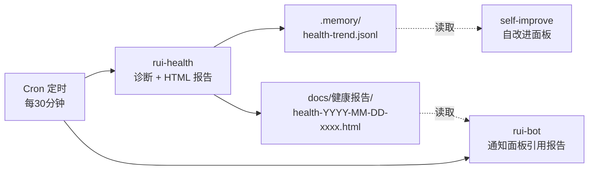

# rui-health — 系统健康诊断

> 从 rui-bot 按 SRP 拆分。rui-bot 管消息推送，rui-health 管健康诊断。两者通过报告文件解耦。

[触发](#触发) · [诊断维度](#诊断维度) · [报告格式](#报告格式) · [数据流](#数据流) · [约束](#约束) · [与 rui-bot 的关系](#与-rui-bot-的关系)

## 触发



## 诊断维度

> 9 核心维度 + 7 工程成熟度维度。权重定义在 `lib/constants.mjs` → `HEALTH_DIM_WEIGHTS`。

### 核心维度 (9)

| 维度 | 权重 | 检查内容 |
|------|:---:|---------|
| token | 15 | API_X_TOKEN 环境变量存在性 |
| config | 10 | rui-bot config.json 存在性和结构 |
| robots | 10 | Webhook URL 配置 |
| api | 15 | API 端点可达性 |
| reports | 10 | 报告目录新鲜度 |
| format | 10 | 消息格式合规 |
| diagnostics | 10 | D0-D7 诊断引擎状态 |
| git | 10 | 未提交文件数、分支状态 |
| security | 10 | 密钥扫描、未追踪 .env |

### 工程成熟度维度 (7)

| 维度 | 权重 | 检查内容 |
|------|:---:|---------|
| em_testing | 10 | 测试框架 + 用例数 |
| em_types | 15 | TypeScript strict / JS |
| em_linting | 15 | ESLint/Prettier/EditorConfig |
| em_cicd | 15 | CI/CD 管线 |
| em_docs | 15 | README/CLAUDE.md/docs/ 完整性 |
| em_deps | 10 | Lockfile、版本脚本 |
| em_git | 10 | .gitignore/.gitattributes/PR 模板 |

### 评分

- 综合分 = 核心加权分 × 0.5 + 工程成熟度加权分 × 0.5
- **A 级** ≥ 90 · **B 级** ≥ 75 · **C 级** ≥ 60 · **D 级** < 60

## 报告格式

### HTML 报告

`node skills/rui-health/health.mjs --html` 生成自包含 HTML 报告，包含：
- 综合评分卡片（分数 + 等级 + 趋势）
- 9 核心维度详细评分（含建议措施）
- 7 工程成熟度维度评分
- D0-D7 诊断触发清单
- 机器人就绪状态
- 执行记忆统计

输出路径：`docs/健康报告/health-YYYY-MM-DD-xxxxxx.html`

### 趋势持久化

每次诊断自动追加到 `.memory/health-trend.jsonl`：
```json
{"timestamp":"...","composite":85,"grade":"B","dimensions":{...},"triggeredDiags":["D2","D5"],"gitBranch":"main","gitUncommitted":3}
```

### 企微通知

`node skills/rui-health/health.mjs --notify` 委托 rui-bot 发送健康通知（通过报告文件路径，非直接调用）。

## 数据流

```
Cron 触发 rui-health
  → 运行 16 维度诊断
  → 生成 HTML 报告 → docs/健康报告/
  → 追加 health-trend.jsonl
  → (可选) 委托 rui-bot 发送企微通知
  → 通知面板 (docs/index.html) 读取 HTML 索引展示
  → 自改进面板 读取 JSONL 趋势数据做深度分析
```

## 约束

| # | 规则 | 反例 |
|---|------|------|
| 1 | 权重从 `lib/constants.mjs` 导入，不自定义 | send.mjs 和 health-report.mjs 各维护一份权重 |
| 2 | 诊断结果必须可追溯（文件路径 + 行号） | "config 看起来没问题" |
| 3 | HTML 报告自包含（CDN 引用除外） | 报告依赖本地文件 |
| 4 | 不直接发送企微消息（委托 rui-bot） | health.mjs 内联 HTTP POST 逻辑 |
| 5 | 趋势数据追加写入，不覆盖 | 每次重写整个 JSONL 文件 |

## 与 rui-bot 的关系

```
rui-health (本技能)          rui-bot
┌─────────────────┐      ┌─────────────────┐
│ 16 维度诊断      │      │ 消息发送          │
│ HTML 报告生成    │      │ 日志追加          │
│ 趋势持久化       │      │ 失败队列管理      │
│                 │      │ 自循环报告聚合    │
│                 │      │ 通知队列轮询      │
└────────┬────────┘      └────────┬────────┘
         │                        │
         └──报告文件路径──→ 企微通知
           (解耦边界)
```

- **rui-health** 不直接调用 rui-bot 的函数，只产出报告文件
- **rui-bot** 的 `send.mjs health` 命令通过读取 rui-health 的报告文件来构建通知
- 迁移路径：`send.mjs` 中 `cmdHealth()` 函数 → 逐步迁移到 `skills/rui-health/health.mjs`
