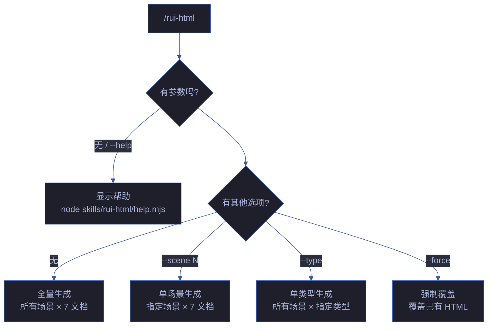
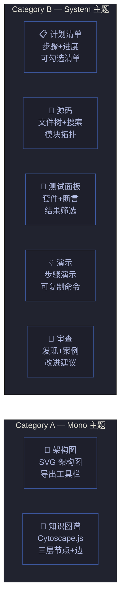
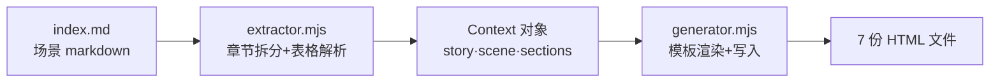
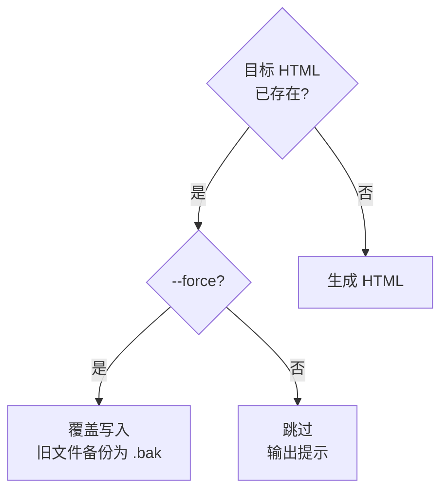
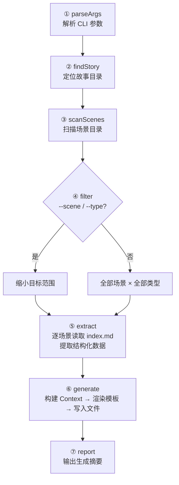
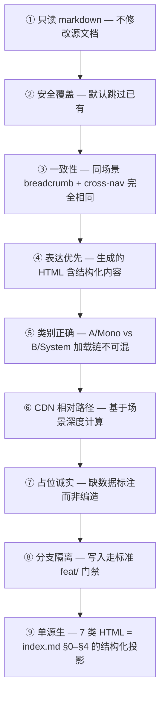

# rui-html

> 故事场景 HTML 文档生成器：读取故事 markdown 文档 → 按参考模板生成 7 类标准 HTML 文件。确保跨文档一致性（面包屑、导航、CDN 资源、配色）。
>
> **--help / -h**：执行 `node skills/rui-html/help.mjs` 输出完整帮助。用户输入 `/rui-html --help` 或 `/rui-html -h` 或 `/rui-html help` 时，跳过管线逻辑，直接运行脚本。
>
> 模板参考源：`docs/故事任务面板/yry-self-test/场景-1-init后全量自检/` 下的 7 份 HTML 文件。

<a id="iron-law"></a>
## 铁律

```
EACH SCENE'S 7 HTML DOCS MUST BE GENERATED FROM ITS index.md — NO INDEPENDENT AUTHORING
```

场景目录下 7 类 HTML（计划清单/架构图/知识图谱/源码/测试面板/演示/审查）的**唯一数据源**是对应场景的 `index.md`。HTML 不可独立创作；`index.md` 任一章节变更后必须重跑 `/rui-html <story> --force` 覆盖。

| 铁律 | 含义 | 违反信号 | 处置 |
|------|------|---------|------|
| **单源生** | 7 类 HTML = `index.md` §0–§4 的结构化投影 | HTML 出现 `index.md` 不存在的事实；`index.md` 更新后 HTML 未变；模板里硬编码场景专有名词 | 删除虚构内容，回归模板通用壳，跑 `--force` 重生 |

> 本约束在 [rules/doc-generation.md §⑨ 单源生](../../rules/doc-generation.md#single-source) 中以强制规则形式记录；本 SKILL.md 与之等价。

[命令族全景](#命令族全景) · [7 文档全景](#7-文档全景) · [数据源](#数据源) · [操作边界](#操作边界) · [/rui-html](#rui-html) · [模板系统](#模板系统) · [核心规则](#核心规则) · [生效标志](#effectiveness)

## 命令族全景



| 命令 | 类型 | 数据源 | 作用 |
|------|------|--------|------|
| `/rui-html <story>` | 写入 | 本地 index.md | 为故事的所有场景生成全部 7 类 HTML 文档 |
| `/rui-html <story> --scene N` | 写入 | 本地 index.md | 仅为第 N 个场景生成 7 类 HTML |
| `/rui-html <story> --type <name>` | 写入 | 本地 index.md | 为所有场景生成指定类型的 HTML |
| `/rui-html <story> --force` | 写入 | 本地 index.md | 强制覆盖已有 HTML 文件 |
| `/rui-html --help` | 只读 | — | 显示帮助信息 |

`<story>` 为 `docs/故事任务面板/` 下的目录名（kebab-case）。`<name>` 为 7 类文档名之一（如 `架构图`、`测试面板`）。

## 7 文档全景



| # | 文档 | 类别 | 主题 | CDN | 关键数据源 |
|---|------|:---:|------|-----|-----------|
| 1 | 计划清单.html | B | System | shared.css + theme.css + yry-checklist.css | §2 实施报告 |
| 2 | 架构图.html | A | Mono | fonts.css + shared.css + theme-mono.css | §0 技术评审 mermaid 图 |
| 3 | 知识图谱.html | A | Mono | fonts.css + shared.css + theme-mono.css + Cytoscape.js | 知识图谱.json |
| 4 | 源码.html | B | System | shared.css + theme.css | §2 产物清单 |
| 5 | 测试面板.html | B | System | shared.css + theme.css | §1 测试设计 + §3 测试报告 |
| 6 | 演示.html | B | System | shared.css + theme.css | §0 效果示意 + §2 架构决策 |
| 7 | 审查.html | B | System | shared.css + theme.css | §4 自改进 |

## 数据源

> **唯一数据源：本地 markdown 文档。** 读取 `docs/故事任务面板/<story>/场景-N-<slug>/index.md`，按 §0–§4 章节提取结构化数据。不调用远端 API。



### 提取策略

| 章节 | 提取内容 | 方法 |
|------|---------|------|
| 元数据 | 版本号、日期、场景标题 | 解析第一行标题 + 元数据行 |
| §0 技术评审 | mermaid 图、模块表、基线溯源表、安全考量表 | mermaid 块提取 + 表格解析 |
| §1 测试设计 | TC-N 正常用例、TC-B 边界用例、Gate A 交接 | 表格解析 |
| §2 实施报告 | 产物清单、架构决策、关键发现 | 表格解析 + 列表解析 |
| §3 测试报告 | 测试摘要、分套件结果、门禁判定 | 表格解析 |
| §4 自改进 | D0–D7 诊断、改进建议 | 表格解析 + 列表解析 |

### 占位符处理

章节内容为「文档生成阶段填充」或空时，生成带样式的占位块：`<div class="placeholder">数据待填充 — 运行 /rui code 生成</div>`。

## 操作边界



| 操作 | 允许 | 条件 |
|------|:---:|------|
| 读取 index.md | ✅ | 始终 |
| 读取 故事任务.md | ✅ | 始终 |
| 写入新 HTML | ✅ | 目标文件不存在 |
| 覆盖已有 HTML | ⚠️ | 需 `--force` |
| 删除已有 HTML | ❌ | 永不 |
| 修改 index.md | ❌ | 永不（只读） |
| 调用远端 API | ❌ | 永不 |

## /rui-html

> 主命令：读取故事 markdown → 提取结构化数据 → 按模板生成 HTML。

### 执行流程



### 分步说明

| 步骤 | 操作 | 输入 | 输出 | 阻断条件 |
|------|------|------|------|---------|
| ① parseArgs | 解析 CLI 参数 | process.argv | { storyName, scene, type, force } | 缺少 storyName 且非 --help |
| ② findStory | 定位故事目录 | storyName | storyDir 绝对路径 | 目录不存在 |
| ③ scanScenes | 扫描场景子目录 | storyDir | 场景目录名列表 | 无场景目录（警告，不阻断） |
| ④ filter | 按 --scene / --type 筛选 | 选项 + 场景列表 | 目标文件列表 | — |
| ⑤ extract | 读取 index.md 提取数据 | 场景目录路径 | 结构化 Context 对象 | index.md 不存在 |
| ⑥ generate | 渲染模板写入文件 | Context + 模板 | HTML 文件 | 写入权限不足 |
| ⑦ report | 输出生成摘要 | 生成结果 | 终端输出 | — |

### 约束

| 约束 | 规则 |
|------|------|
| 只读 markdown | 不修改 index.md 或 故事任务.md |
| 安全覆盖 | 已有文件默认跳过；--force 备份后覆盖 |
| 分支隔离 | 生成操作在 `docs/故事任务面板/` 下写入，走标准分支隔离 |
| 表达优先 | 生成的 HTML 必须含图/表/结构化内容，不可纯文本占位 |
| 一致性 | 同一场景 7 份 HTML 共享 breadcrumb + cross-nav |

## 模板系统

### 类别与 CDN 加载链

| 类别 | 文档 | CSS 加载顺序 | JS |
|------|------|-------------|-----|
| A — Mono | 架构图、知识图谱 | fonts.css → shared.css → theme-mono.css | shared.js |
| B — System | 计划清单、源码、测试面板、演示、审查 | shared.css → theme.css | shared.js |

### Token 变量

所有模板共享以下 token，由 generator 统一替换：

| Token | 来源 | 示例 |
|-------|------|------|
| `{{STORY_NAME}}` | CLI / 目录名 | `yry-self-test` |
| `{{STORY_TITLE}}` | 故事任务.md 或推断 | `自主测试方案` |
| `{{SCENE_NUM}}` | 目录名 | `1` |
| `{{SCENE_SLUG}}` | 目录名 | `init后全量自检` |
| `{{SCENE_TITLE}}` | index.md 首行标题 | `初始化后全量自检` |
| `{{PAGE_TITLE}}` | 模板常量 | `init后全量自检 · 计划清单` |
| `{{VERSION}}` | index.md 元数据行 | `1.1.0` |
| `{{DATE}}` | 当前日期 | `2026-06-09` |
| `{{CDN_DEPTH}}` | 场景深度计算 | `../../../../` |
| `{{BREADCRUMB}}` | 生成 | HTML 片段 |
| `{{CROSS_NAV}}` | 生成 | HTML 片段 |
| `{{HEAD_BLOCK}}` | 类别决定 | `<head>` 完整片段 |
| `{{CSS_VARS}}` | 类别决定 | `:root { ... }` |
| `{{CONTENT}}` | index.md 提取 | 页面主体 HTML |

## 核心规则



| # | 规则 | 违反处理 |
|---|------|---------|
| 1 | 只读 markdown，不修改源文档 | P0 — 撤销修改 |
| 2 | 已有 HTML 默认跳过，需 `--force` 覆盖 | 提示用户使用 --force |
| 3 | 同场景 7 文件 breadcrumb + cross-nav 完全相同 | 重新生成不一致文件 |
| 4 | 内容区不可纯文本占位，必须含结构化元素 | 补充数据或标注缺失 |
| 5 | Category A 用 Mono 主题，B 用 System 主题 | 重新按正确类别生成 |
| 6 | CDN 路径基于场景目录深度计算 | 检查链接可达性 |
| 7 | 缺数据时标注而非编造 | P0 — 替换编造内容 |
| 8 | 写入操作走分支隔离 | `no-branch-isolation` 阻断 |
| 9 | 7 类 HTML 唯一数据源 = 对应场景 `index.md`；不可独立创作；`index.md` 变更后必须 `--force` 重生 | 删除虚构内容，跑 `/rui-html <story> --force` |

## 生效标志

| 信号 | 含义 |
|------|------|
| `node skills/rui-html/rui-html.mjs --help` 正常输出 | 可执行脚本就绪 |
| 生成后 `ls 场景-1-*/` 列出 7 份 HTML | 全量生成成功 |
| 浏览器打开生成的 HTML，CDN 资源正常加载 | 路径计算正确 |
| 同场景 7 文件 breadcrumb 完全一致 | 一致性保证生效 |
| `--force` 覆盖前生成 `.bak` 备份 | 安全覆盖生效 |
| 7 份 HTML 内的场景特异性内容（标题/版本/模块名/表格/mermaid）均能在 `index.md` 中找到来源 | 单源生原则生效 |
| `index.md` mtime ≥ 对应 HTML mtime 时，自动触发 `--force` 覆盖 | 变更即重生链路生效 |

## 与 rui 的关系

`/rui-html` 是 `/rui doc` 的补充工具。`/rui doc` 生成 markdown 文档基线（故事任务.md + 场景-N-<slug>.md），`/rui-html` 基于这些 markdown 生成配套的 7 份 HTML 可视化文档。两者配合形成完整的文档产出：


## 自循环

> 文档变更自动重新生成。Agent 可按间隔检测 markdown 源文件变更并重新生成 HTML。

| 属性 | 值 |
|------|-----|
| 推荐间隔 | `*/30 * * * *`（每 30 分钟） |
| 触发条件 | 场景目录下 .md 文件的 mtime 晚于对应 .html |
| 终止条件 | 所有 HTML 均为最新 |
| 迭代动作 | 扫描故事面板 → 对比 .md vs .html mtime → 重新生成过期 HTML |
| 收敛判定 | 所有场景 HTML 比对应 markdown 更新 |
