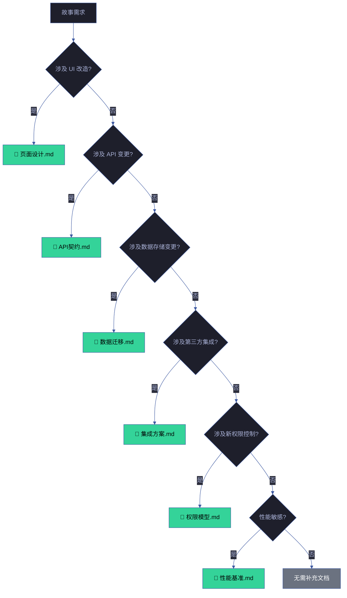
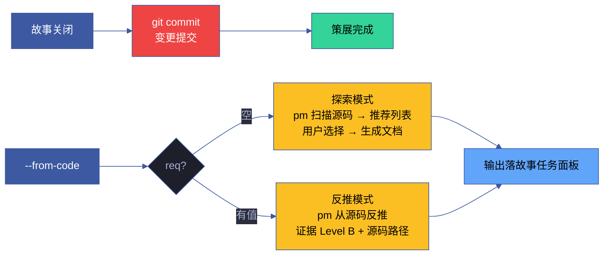

---
paths:
  - "skills/rui-html/**"
  - "skills/rui-html/SKILL.md"
description: "文档生成生命周期与阶段规则"
---

# doc-generation-lifecycle

> 补充文档触发 · 策展 · 例外 · 生效标志。主文档：[doc-generation.md](doc-generation.md)

[补充文档](#supplementary) · [策展](#curation) · [文档更新触发](#文档更新触发) · [例外](#exceptions) · [生效标志](#effectiveness)

## 补充文档

### 触发决策树

### 补充文档详情

| 触发条件 | 生成文档 | 主导 | 必含内容 | 验证方式 |
|---------|---------|------|---------|---------|
| UI 改造 | 页面设计.md | pm | 页面布局、组件树、交互流程、状态管理 | 与实现一致 |
| API 变更 | API契约.md | pm | 端点定义、请求/响应格式、错误码、鉴权方式 | 与代码签名一致 |
| 数据存储变更 | 数据迁移.md | pm | Schema 变更、迁移步骤、回滚方案、数据校验 | 迁移脚本可执行 |
| 第三方集成 | 集成方案.md | pm | 集成架构、认证方式、数据映射、错误处理 | 集成测试通过 |
| 新权限控制 | 权限模型.md | pm | 角色定义、权限矩阵、访问控制规则 | 权限测试覆盖 |
| 性能敏感 | 性能基准.md | pm | 性能目标、测量方法、基准数据、退化阈值 | 基准测试通过 |

### 补充文档生成时机

| 时机 | 触发 | 文档类型 |
|------|------|---------|
| doc 阶段（需求分析） | pm 识别需要补充文档 | 全部补充文档 |
| code 阶段（实现中） | coder 发现设计遗漏 | 补充或更新已有 |
| review 阶段（审查中） | reviewer 发现文档缺失 | 标记缺失，退回 pm |

## 策展

### 策展流程

### 策展规则

| # | 规则 | 说明 | 违反处置 |
|---|------|------|---------|
| 10 | 策展阶段必须 git commit | 故事关闭但变更未提交 → 违规 | 阻断，执行 commit |
| 11a | `--from-code` req 空：探索模式 | pm 扫描源码推荐列表，用户选择后生成 | — |
| 11b | `--from-code` req 有值：反推模式 | 证据 Level B，标注源码路径，缺口标 `> 待补充` | — |
| 12 | 策展前验证文档完整性 | 必含元素全部存在、无 TBD/TODO | 退回补全 |
| 13 | 策展前验证知识图谱一致性 | FP# 全覆盖、无悬挂边、stats 一致 | 退回修正 |

## 文档更新触发

### 自动触发

| 触发条件 | 动作 | 频率 |
|---------|------|------|
| 源码 commit 但文档未更新 | 触发文档新鲜度检查 | 每次健康检查 |
| 文档 mtime < 源码 commit > 7 天 | 标记为过期文档 | 每次健康检查 |
| 架构变更（新增/删除 Skill） | 触发架构文档更新 | 变更时 |
| 版本号升级 | 触发全部文档版本行更新 | 版本升级时 |

### 手动触发

| 命令 | 用途 |
|------|------|
| `/rui doc --from-code` | 从源码反推完整文档基线 |
| `/rui doc --from-local <name>` | 补全已有故事的缺失文档 |
| `/rui update <name> [ctx]` | 增量更新已有文档 |
| `/rui-html <story> --force` | 重新生成 HTML 可视化文档 |

## 例外

| 场景 | 处理 | 影响 |
|------|------|------|
| T1 级变更（措辞/格式） | 跳过影响分析与架构设计，仅刷新变更章节 | 减少流程开销 |
| 反推命令（`--from-code`） | 只读源码，不触发验证阶段 | 证据 Level B |
| 纯文档变更（`--no-code`） | 跳过代码管线，仅刷新文档 | 不触发 Gate A/B |
| 首次 init（`/rui init`） | 全量生成，不检查已有文档新鲜度 | 建立基线 |

## 生效标志

| 标志 | 验证方式 | 未达标的处置 |
|------|---------|------------|
| 版头齐 | F.meta/F.toc/F.nav 字段可验证，链接可闭合 | 补元数据，修正不一致字段，补失效链接 |
| 表达优先 | 架构/流程/关系有 mermaid，图→文本→表 | 文字改图，列表改表，补齐 mermaid |
| 目录清 | `<name>/` 合规，文件在正确位置 | 移动文件到正确目录 |
| 证据足 | 无 Level D 内容，C 级已标注 | 删 D 级内容，补 C 标注或查证升级 |
| 产出聚 | 文件按阶段创建，不提前 | 删除提前创建的文件 |
| 策展完成 | git commit 已提交 | 执行 git commit |
| 基线溯源 | §0 基线溯源表完整且链接有效 | 补基线溯源表 |
| 无魔数 | 裸数值已提取为命名常量，硬编码已语义化 | 代码提取常量，文档改写语义描述 |
| 效果证 | §0 有效果示意，§2 有截图+可操作验证步骤 | 补效果图，补 curl/操作步骤 |
| 单源生 | 7 类 HTML 内容可溯源至 `index.md`，无独立创作 | 删除 HTML 中的虚构内容，跑 `--force` 覆盖 |