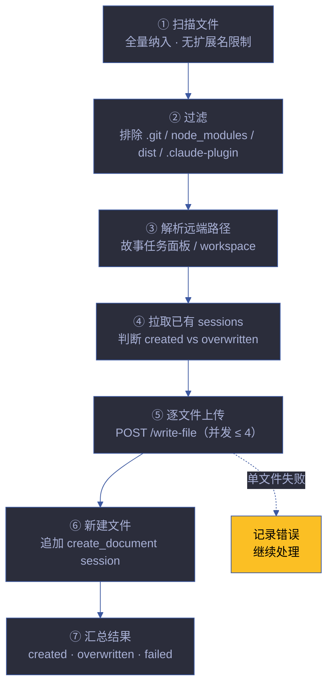
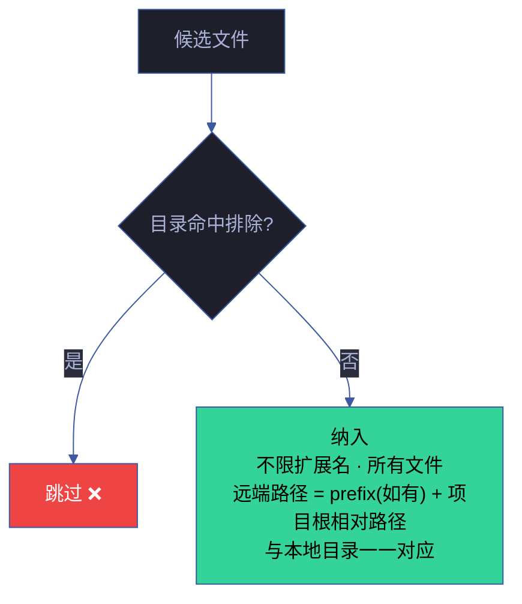
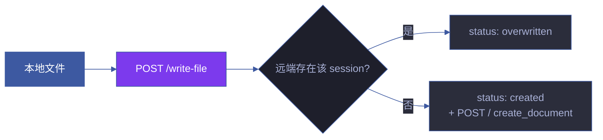
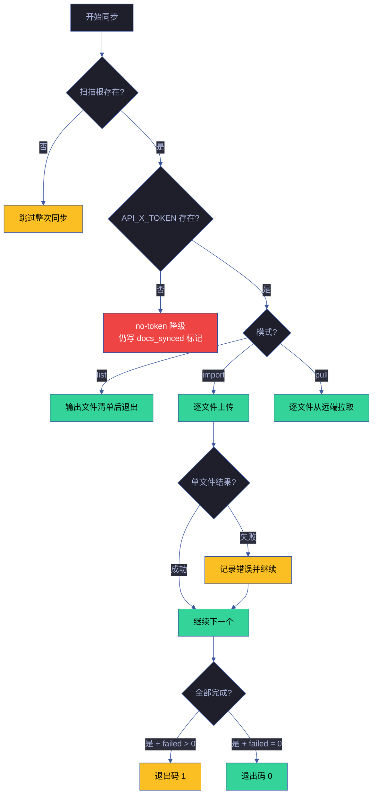
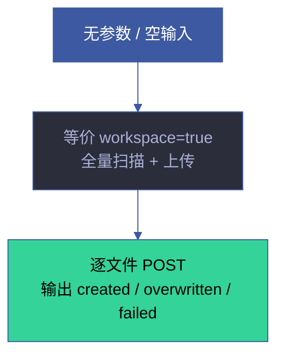
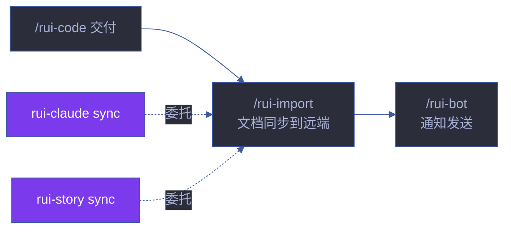

# rui-import

> **--help / -h**：执行 `node skills/rui-import/help.mjs` 输出完整帮助（含场景示例）。用户输入 `/rui-import --help` 或 `/rui-import -h` 或 `/rui-import help` 时，跳过逻辑，直接运行脚本。
>
> **可执行入口**：`node skills/rui-import/sync.mjs [options]` — 扫描 + 上传一体化。`--help` 查看选项。rui 交付管线步骤 ② 通过此脚本触发。

将 workspace 内文档批量同步到远端 API。行为规约（扫描/过滤/路径映射/API 契约）见下文，脚本是本规约的可执行实现。

**单一职责**：本地 ↔ 远端文档同步。不负责文档内容生成（[rui-doc](../rui-doc/) · [rui-html](../rui-html/)），不负责消息推送（[rui-bot](../rui-bot/)）。

[工作流全景](#工作流全景) · [项目根定位](#项目根定位) · [扫描规则](#扫描规则) · [调用形态](#调用形态) · [API 契约](#api-契约) · [错误模型](#错误模型) · [性能特征](#性能特征) · [空输入](#空输入) · [生效标志](#生效标志) · [自循环](#自循环)

## 工作流全景



| 阶段 | 动作 | 说明 | 失败处置 |
|------|------|------|---------|
| ① 扫描 | 从项目根递归遍历 | 不受 `.gitignore` 限制 | 目录不存在 → 跳过 |
| ② 过滤 | 排除 `.git` / `node_modules` / `dist` / `.claude-plugin` 与显式 `--exclude` | 命中即跳过整个子树 | — |
| ③ 解析 | 计算本地→远端路径映射 | 路径分隔符统一为 `/`，空格替换为 `_` | — |
| ④ 拉取 | 远端 query sessions | 用于区分 `created` / `overwritten` | 网络失败 → 全部视为 created |
| ⑤ 上传 | 逐文件 POST | 并发上限 4，存在覆盖、不存在新建 | 单文件失败 → 记录继续 |
| ⑥ 新建 | 追加 `create_document` session | 仅对新增路径执行 | 失败 → 记录告警 |
| ⑦ 汇总 | 统计 created / overwritten / failed | 单文件失败不阻断 | — |

## 项目根定位

```
从 cwd 起逐级向上查找，遇到以下任一目录即视为项目根：
  - .git/
  - .claude/
找不到时回退为 cwd。
```

扫描根 = 显式 `--dir`（绝对路径）或项目根。

## 扫描规则



| 规则 | 说明 |
|------|------|
| 全量纳入 | 不限扩展名，所有文件均上传（递归全部子目录） |
| 默认排除目录 | `.git` · `node_modules` · `dist` · `.claude-plugin` |
| 用户排除 | `--exclude a,b,c` 追加排除子目录名（精确匹配，命中即整树跳过） |
| 路径规整 | 所有分隔符 → `/`，所有空白字符 → `_` |
| 路径映射 | 远端路径 = `prefix`（如有）+ 项目根相对路径。与本地目录结构一一对应，不跳过、不前置、不重命名 |

## 调用形态

> `node skills/rui-import/sync.mjs [options]` — 批量同步。

| 意图 | 输入 | 行为 |
|------|------|------|
| workspace 全量同步（兜底） | `node skills/rui-import/sync.mjs` | 项目根全量扫描 + 上传 |
| 单目录同步 | `dir=<absolute path>` | 指定目录扫描 + 上传，路径仍以项目根计算相对路径 |
| 排除子目录 | `exclude=tmp,build` | 追加排除（与默认排除合并） |
| 远端前缀 | `prefix=a,b` | 在远端路径最前追加 `a/b/...` |
| 自定义 API | `apiUrl=https://api.example.com` | 覆盖默认 `https://api.effiy.cn` |
| 仅枚举不上传 | `mode=list` | 输出待上传文件清单，不发请求 |
| Pull 模式 | `mode=pull` | 从远端拉取覆盖本地（用于 rui-claude sync） |

| 默认值 | 取值 |
|--------|------|
| `apiUrl` | `https://api.effiy.cn` |
| `prefix` | `[]`（空） |
| 并发度 | `4` |
| HTTP 超时 | `30s` |

## API 契约



### 通用请求头

| Header | 值 | 说明 |
|--------|------|------|
| `Content-Type` | `application/json` | 请求体格式 |
| `Accept` | `application/json` | 响应格式 |
| `X-Token` | `${API_X_TOKEN}` | 仅来自环境变量，禁止硬编码 |

### 1. 拉取已有 sessions

```
POST <apiUrl>/
{
  "module_name": "services.database.data_service",
  "method_name": "query_documents",
  "parameters": { "cname": "sessions" }
}
```

单次查询，返回全部 sessions。响应中 `data.list[].file_path` 组成「已存在路径集合」。

### 2. 写文件

```
POST <apiUrl>/write-file
{
  "target_file": "<resolved remote path>",
  "content": "<utf-8 file content>",
  "is_base64": false,
  "overwrite": true
}
```

### 3. 读文件（pull 模式）

```
POST <apiUrl>/read-file
{
  "target_file": "<resolved remote path>"
}
```

### 4. 新增 session

```
POST <apiUrl>/
{
  "module_name": "services.database.data_service",
  "method_name": "create_document",
  "parameters": {
    "cname": "sessions",
    "data": {
      "url": "aicr-session://<timestamp>-<random>",
      "title": "<basename>",
      "file_path": "<resolved remote path>",
      "messages": [],
      "tags": [...path segments excluding basename],
      "isFavorite": false,
      "createdAt": <now ms>,
      "updatedAt": <now ms>,
      "lastAccessTime": <now ms>
    }
  }
}
```

### 5. 更新 session

```
POST <apiUrl>/
{
  "module_name": "services.database.data_service",
  "method_name": "update_document",
  "parameters": {
    "cname": "sessions",
    "doc_id": "<existing _id>",
    "data": { "updatedAt": <now ms>, "lastAccessTime": <now ms> }
  }
}
```

## 错误模型



| 场景 | 处置 | 阻断? | 恢复方式 |
|------|------|:---:|---------|
| 扫描根目录不存在 | 跳过 | 否 | 检查路径 |
| 单文件读取失败 | 记录错误，继续处理后续文件 | 否 | 修复文件权限 |
| 单文件上传失败 | 记录错误，继续处理后续文件 | 否（最终退出码 1） | 下次覆盖重试 |
| `API_X_TOKEN` 缺失 | 停止上传（`no-token` 降级） | ⚠️ 降级 | 配置环境变量 |
| 网络超时 / 远端不可达 | 记录告警，不阻断管线 | 否 | 下次重试 |
| Token 写入仓库 / 日志 / 文档 | 禁止 🚫 | P0 | 立即清理 |

## 性能特征

| 操作 | 典型耗时 | 瓶颈 |
|------|---------|------|
| 文件扫描（500 文件） | < 100ms | 文件系统 I/O |
| 远端 session 查询 | 500ms–2s | 网络延迟 |
| 单文件上传 | 200ms–1s/文件 | 网络带宽 |
| 全量同步（500 文件） | 2–5min | 并发度限制（4） |
| Pull 模式全量 | 1–3min | 网络带宽 |

**优化策略**：
- 并发度 4，平衡吞吐量和服务器压力
- 30s 超时，避免单文件阻塞整体
- 大文件（> 1MB）自动跳过，记录告警

### 冲突解决策略

> 远端优先（remote-wins）为默认策略。冲突场景和处置如下。

| 冲突场景 | 检测方式 | 处置 | 数据安全 |
|---------|---------|------|---------|
| 远端有新版本 | `updatedAt` > 本地 mtime | 远端覆盖本地（pull 模式） | 本地修改前先 pull |
| 本地有新版本 | 本地 mtime > 远端 `updatedAt` | 上传覆盖远端（push 模式） | 远端旧版本被覆盖 |
| 双方均有修改 | 本地 mtime 和远端 `updatedAt` 均 > 上次同步时间 | **告警**，标注 `conflict`，跳过 | 不丢失数据 |
| 本地新增文件 | 远端无对应 session | 创建新 session | 无冲突 |
| 远端删除文件 | 远端 session 消失 | 本地保留，标注 `orphan` | 不自动删除本地 |

### 增量同步策略

```
1. 拉取远端 sessions 列表 → 构建 { file_path: updatedAt } 映射
2. 扫描本地文件 → 对比远端 mtime
3. 本地更新 → 上传 (overwritten)
4. 本地新增 → 创建 (created)
5. 远端独有 → 跳过 (由 pull 模式处理)
6. 双方一致 → 跳过 (unchanged)
```

## 空输入



空输入默认为 `workspace=true` 全量同步，等价于 `/rui-import workspace=true`。

## 降级策略

| 情况 | 降级行为 | 恢复方式 |
|------|---------|---------|
| `API_X_TOKEN` 缺失 | 停止上传，标注 `no-token` 降级 | 配置环境变量后重试 |
| 远端 API 不可达 | 记录告警，不阻断管线 | 下次重试 |
| 单文件上传失败 | 记录错误，继续处理后续文件 | 下次覆盖重试 |
| 扫描根目录不存在 | 跳过整次同步 | 检查路径后重试 |
| 网络超时 | 记录告警，继续处理 | 检查网络后重试 |
| 大文件（>1MB） | 自动跳过，记录告警 | 手动上传或压缩 |

## 测试

> 文档同步的扫描规则、路径映射、API 契约和错误处理模型的自动化验证。

### 运行测试

```bash
npx vitest run skills/rui-import/tests/          # 全量运行
npx vitest skills/rui-import/tests/              # 监听模式
npx vitest run --coverage skills/rui-import/tests/  # 覆盖率报告
```

### 测试文件

| 文件 | 测试范围 | 类型 |
|------|---------|:---:|
| `tests/rui-import.test.mjs` | 扫描过滤、路径映射、API 契约、错误处理、并发控制 | 单元 |

### 测试策略

| 层级 | 范围 | 要求 |
|------|------|------|
| **扫描规则测试** | 全量纳入、排除目录、路径规整 | 每种规则有测试 |
| **路径映射测试** | 远端路径 = prefix + 相对路径 | 各层级路径正确性 |
| **API 契约测试** | write-file/read-file/query_documents/create_document | mock API 响应 |
| **错误模型测试** | 单文件失败不阻断、token 缺失降级、网络超时 | 每种错误路径有测试 |

### 覆盖要求

| 维度 | 最低阈值 | 目标 |
|------|:---:|:---:|
| 扫描/过滤规则 | 100% | 全量纳入 + 排除目录 |
| API 契约 | 100% | 5 个 API 端点各有测试 |
| 错误模型 | 100% | 6 种错误场景全覆盖 |
| 模式覆盖 | 100% | import/list/pull 三种模式 |

## 规则

- [sync-rules.md](./rules/sync-rules.md) — 文档同步到远端 API 的规则和约束
## 生效标志


| 标志 | 未达标的处置 |
|------|------------|
| 扫描完整：全量纳入 · 无扩展名限制 | 补扫遗漏目录，重新执行 |
| 排除正确：.git / node_modules / dist / .claude-plugin 已过滤 | 调整排除规则 |
| 路径映射：远端路径 = prefix(如有) + 项目根相对路径，与本地一一对应 | 检查 resolveRemotePath 实现 |
| 上传完成：逐文件 POST 无遗漏 | 查看错误日志，补传失败文件 |

## 自循环

> 持续文档同步。Agent 可按间隔周期性检测本地变更并自动推送到远端。

| 属性 | 值 |
|------|-----|
| 推荐间隔 | `*/30 * * * *`（每 30 分钟） |
| 触发条件 | 本地文档目录有变更（git diff --stat docs/ 非空） |
| 终止条件 | `API_X_TOKEN` 失效 / 手动停止 |
| 迭代动作 | ① `workspace=true` 全量扫描 → ② 对比远端 session → ③ 增量上传 → ④ 输出同步摘要 |
| 告警条件 | failed > 0 或 no-token 降级 |
| 收敛判定 | `created=0` 且 `failed=0`（全部同步） |

> 本技能 `checkMode: "cli"`——由 dispatcher 按 `*/30 * * * *` 自动调度。6 字段契约与调度规则详见 [rules/loop-engineering.md](../rui/rules/loop-engineering.md)。

## 与 rui 的关系

`/rui-import` 是 rui 编排管线交付阶段的文档同步收口。由 `/rui` 交付步骤手动触发，也被 rui-claude sync 和 rui-story sync 委托。不负责文档内容生成——只负责本地 ↔ 远端传输。

