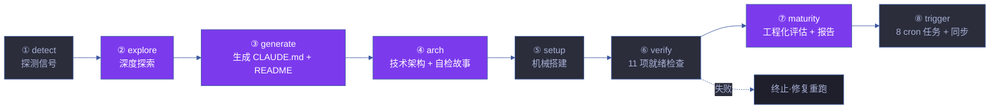
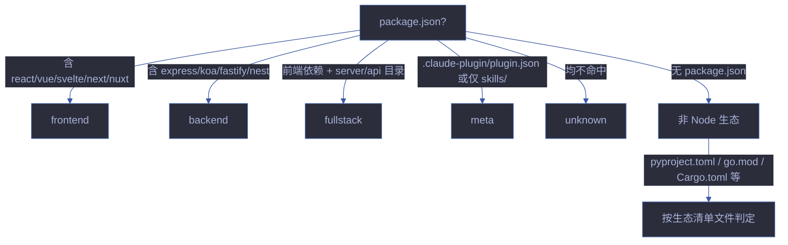
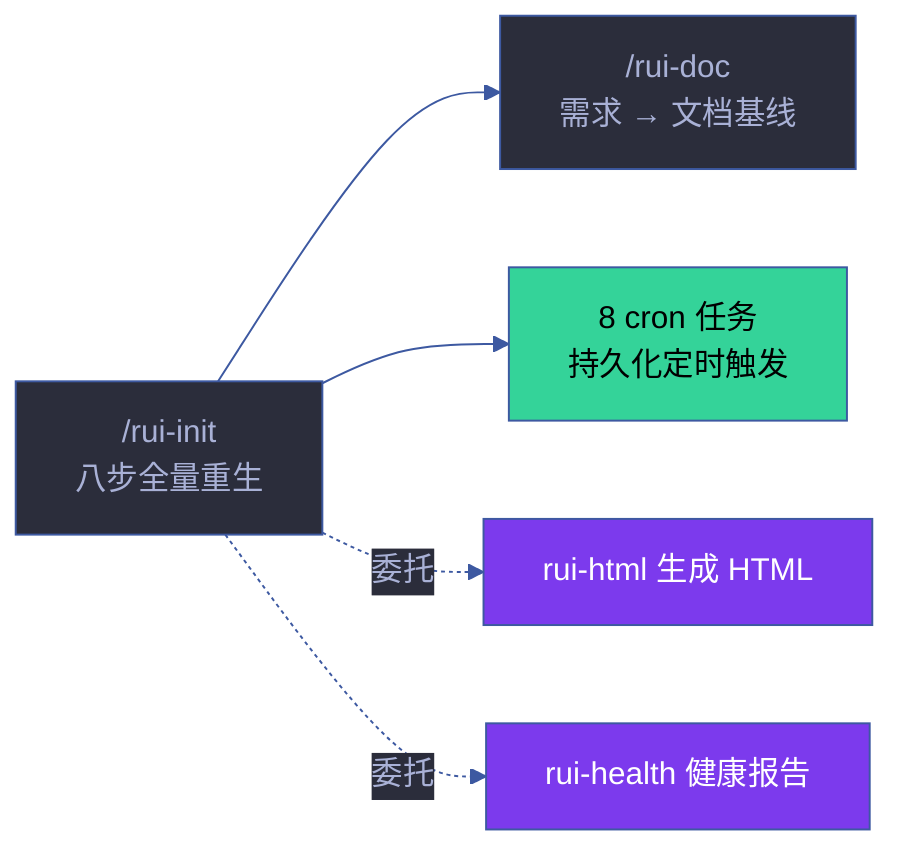

# rui-init

> 八步：探 → 察 → 生 → 架 → 搭 → 验 → 估 → 触。可重复运行，每次全量重生。CLAUDE.md 的 `<!-- rui:project-start -->` / `<!-- rui:project-end -->` 标记段每次覆盖，段外保留。
>
> `/rui init`（通过 rui 编排器调用）或 `/rui-init`
>
> **单一职责**：项目首次初始化与重生。不负责增量更新（[rui-update](../rui-update/)），不负责日常代码实现（[rui-code](../rui-code/)），不负责自改进闭环（[rui-yry](../rui-yry/)）。

[全景](#全景) · [1. detect](#1-detect--探测信号) · [2. explore](#2-explore--深度探索) · [3. generate](#3-generate--生成内容) · [4. arch](#4-arch--补齐技术架构故事--自主测试方案) · [5. setup](#5-setup--机械搭建) · [6. verify](#6-verify--11-项就绪检查--工程化门禁) · [7. maturity](#7-maturity--工程化程度评估--报告生成) · [8. trigger](#8-trigger--自动触发) · [产物](#产物) · [生效标志](#生效标志)

## 全景



| 步骤 | 名称 | 类型 | 输入 | 输出 | 可重复 |
|------|------|------|------|------|:---:|
| ① detect | 探测信号 | 机械 | 文件系统 | profile 事实基线 | ✓ |
| ② explore | 深度探索 | LLM | profile + 源码 | 模块地图 + 架构理解 | ✓ |
| ③ generate | 生成内容 | LLM | profile + 探索发现 | CLAUDE.md + README.md | ✓ (标记段覆盖) |
| ④ arch | 架构故事 | LLM | 模块地图 + 基线文档 | arch + self-test 故事目录 | ✓ (全量重生) |
| ⑤ setup | 机械搭建 | 机械 | 项目根 | config + .init-memory | ✓ |
| ⑥ verify | 就绪检查 | 机械 | 全部产物 | 通过/失败 | ✓ |
| ⑦ maturity | 工程化评估 | LLM+机械 | detect 数据 | 评分 + 健康报告 + 自循环报告 | ✓ |
| ⑧ trigger | 自动触发 | 机械 | 验证通过 | 8 cron 任务 + 同步 + 通知 | ✓ |

## 1. detect — 探测信号

抽取 profile 为后续阶段提供事实基线：

- **项目身份** — 仓库目录名 → 分支前缀；故事目录名纯语义 kebab-case，文档名不加项目前缀
- **项目类型** — 关键目录与配置文件 → frontend / backend / fullstack / meta / unknown（判定见下图）
- **项目清单** — 按生态文件抽取依赖 + 构建/测试命令 + 框架版本
- **安全面** — 源码关键词扫描：用户输入 / API / 存储 / 认证 / 第三方
- **测试框架** — 依赖 + 配置文件 → vitest / jest / pytest / go-test / cargo-test
- **架构模式** — 项目结构 → single / monorepo / microservice / plugin

### 项目类型判定



### 安全面扫描

| 扫描维度 | 关键词/模式 | 判定 |
|---------|-----------|------|
| 用户输入 | `req.body`, `req.query`, `req.params`, `input`, `form` | 存在用户输入点 |
| API 端点 | `app.get`, `app.post`, `router.`, `@Get`, `@Post` | 存在 API 端点 |
| 数据存储 | `mongoose`, `sequelize`, `prisma`, `redis`, `fs.write` | 存在数据持久化 |
| 认证 | `jwt`, `passport`, `oauth`, `auth`, `session`, `token` | 存在认证机制 |
| 第三方 | `fetch`, `axios`, `http.request`, `got` | 存在外部调用 |

## 2. explore — 深度探索

阅读核心源码，理解架构模式、代码规范、安全面。验证并补充 profile 判断。

**抽取模块地图**：识别项目内所有模块（skills/（含 agents + rules）等），记录每个模块的：

| 字段 | 说明 | 示例 |
|------|------|------|
| 模块名 | 目录名或逻辑名 | `rui-code` |
| 入口文件 | 主要入口 | `skills/rui-code/SKILL.md` |
| 核心依赖 | 依赖的其他模块 | `lib/branch-check.mjs`, `lib/constants.mjs` |
| 下游消费者 | 哪些模块依赖此模块 | `rui` (编排器) |
| 职责 | 单一职责描述 | 源码实现管线 |
| Agent | 关联的 Agent 角色 | `coder`, `tester` |

## 3. generate — 生成内容

基于 profile + 探索发现直接编写文件：

- `CLAUDE.md` — 项目画像 + 执行准则 + 退化对策 + 项目约束（含 `rui:project-start/end` 标记）+ 自约束
- `README.md` — 系统视图 + 命令流 + 快速开始 + 项目结构 + [领域语言段](../../README.md#领域语言)（术语定义 + 关系 + 示例对话 + 歧义标记）

### CLAUDE.md 结构

| 段 | 内容 | 标记 |
|----|------|------|
| 基础信念 | 信模型 · 惜注意 · 验现实 | 固定，手动维护 |
| 铁律 | 四条不可妥协规则 | 固定，手动维护 |
| 项目画像 | 项目名/类型/版本/架构/生态/自托管 | `<!-- rui:project-start -->` 标记内 |
| 项目约束 | 不可妥协底线 + 退化对策 + 自约束 | `<!-- rui:project-start -->` 标记内 |
| 引导 | 文档导航表 | `<!-- rui:project-start -->` 标记内 |

## 4. arch — 补齐技术架构故事 + 自主测试方案

> 自主生成两个故事目录：
> - `docs/故事任务面板/<project>-arch/` — 系统架构知识固化
> - `docs/故事任务面板/<project>-self-test/` — 项目自主测试方案
>
> 基于 explore 阶段抽取的模块地图、项目拓扑事实和基线文档（CLAUDE.md / README.md）自主构建。

### 4a. 技术架构故事 (`<project>-arch`)

通过委托 [`rui-doc`](../rui-doc/SKILL.md) 生成 markdown 文档基线，委托 [`rui-html`](../rui-html/SKILL.md) 生成可视化 HTML，不自行实现生成逻辑：

| # | 文档 | Agent | 内容 |
|---|------|-------|------|
| 1 | 故事任务.md | pm | 系统架构知识固化 + 模块地图两大 Story，含 FP/AC/SC/风险 |
| 2 | 场景-N-\<slug\>/index.md | pm + coder + tester + security | ≥5 个架构参考场景（模块定位/数据流追踪/新人上手/依赖变更影响/信任边界与安全面），每场景自包含 §0-§4 全生命周期 |
| 3 | 场景-N-\<slug\>/*.html (×7) | coder | **每场景必须 7 个 HTML**：计划清单.html / 架构图.html / 知识图谱.html / 源码.html / 测试面板.html / 演示.html / 审查.html |
| 4 | 知识图谱.json | pm → coder | 模块+数据流+拓扑层次的结构化知识表示 |
| 5 | 知识图谱.html | coder | 故事级知识图谱可视化 |
| 6 | 演示/index.html | coder | 故事级演示中心，含各场景入口卡片 + 管线全景 + 快速命令 |

### 4b. 自主测试方案 (`<project>-self-test`)

基于基线文档自主构建项目自检策略：

| # | 文档 | Agent | 内容 |
|---|------|-------|------|
| 1 | 故事任务.md | pm | 项目自检体系两大 Story：管线健康自检 + 文档基线完整性校验 |
| 2 | 场景-N-\<slug\>/index.md | pm + coder + tester + security | ≥6 个自检场景（init 后全量自检/commit 前增量自检/文档→代码一致性校验/安全面回归自检/跨故事集成回归自检/第三方框架与服务自检） |
| 3 | 场景-N-\<slug\>/*.html (×7) | coder | **每场景必须 7 个 HTML** |
| 4 | 知识图谱.json | pm → coder | 自检项结构化知识表示 |
| 5 | 知识图谱.html | coder | 故事级知识图谱可视化 |
| 6 | 演示/index.html | coder | 故事级演示中心 |

> **每场景 7 HTML 完整性约束**：arch 和 self-test 每个场景目录必须包含全部 7 个 HTML 文件。任一场景缺失任一 HTML 文件视为 verify 失败。HTML 文件从 index.md 的 §0-§4 各节派生：
> - 计划清单.html ← §0 + §1 + §2 + §4
> - 架构图.html ← §0 效果示意 Mermaid 图
> - 知识图谱.html ← §0 图谱定位 + 知识图谱.json
> - 源码.html ← §2 产物清单 + 架构决策
> - 测试面板.html ← §1 测试设计 + §3 测试报告
> - 演示.html ← §0 效果示意 + §2 关键发现
> - 审查.html ← §4 自改进 + D0-D8 诊断

**故事命名**：`<project>-arch`、`<project>-self-test`（如项目名 `YrY` → `yry-arch`、`yry-self-test`）。

## 5. setup — 机械搭建

- 创建 `docs/故事任务面板/`（如已由 arch 步骤创建则跳过）
- 生成 `.claude/skills/rui-bot/config.json`（schema 见 [rui-bot SKILL.md](../rui-bot/SKILL.md#内置配置)）
- 写入 `docs/故事任务面板/.init-memory.json`

## 6. verify — 11 项就绪检查 + 工程化门禁

任一失败即终止：

| # | 检查项 | 验证方式 | 失败处置 |
|---|--------|---------|---------|
| 1 | CLAUDE.md 含 `rui:project-start` 标记 + 项目名 | `grep "rui:project-start" CLAUDE.md` | 补标记段 |
| 2 | README.md 含项目名 | `grep` 项目名 | 补项目名 |
| 3 | README.md 含 `## 领域语言` + ≥3 术语 | `grep` + 计数 | 补领域语言段 |
| 4 | `docs/故事任务面板/` 目录存在 | `test -d` | 创建目录 |
| 5 | `<project>-arch/` 含故事任务.md + KG + 演示 | `test -f` × 3 | 补缺失文件 |
| 6 | `<project>-arch/` 每场景含 index.md + 7 HTML | 逐场景检查 | 补缺失 HTML |
| 7 | `<project>-self-test/` 含故事任务.md + KG + 演示 | `test -f` × 3 | 补缺失文件 |
| 8 | `<project>-self-test/` 每场景含 index.md + 7 HTML | 逐场景检查 | 补缺失 HTML |
| 9 | arch 场景数 ≥5，self-test 场景数 ≥6 | 计数 | 补场景 |
| 10 | `.claude/skills/rui-bot/config.json` 存在 | `test -f` | 生成 config |
| 11 | 工程化成熟度已评估 + 报告已生成 | `test -f` 报告文件 | 执行 §7 |

## 7. maturity — 工程化程度评估 + 报告生成

> **此步骤不可跳过。** 每次 init 必须评估项目工程化成熟度并生成健康报告与自循环报告。

### 7a. 工程化维度采集

| 维度 | 探测方式 | 满分 | 评分标准 |
|------|---------|:---:|---------|
| 测试体系 | 依赖 + 配置文件 + 测试用例数 | 20 | 有框架+用例≥10→20；有框架无用例→10；无框架→0 |
| 类型安全 | TypeScript/Flow/typing 文件存在 | 15 | TS 严格模式→15；有 TS 但宽松→10；纯 JS→0 |
| 代码规范 | ESLint/Prettier/.editorconfig 配置 | 15 | 有配置+CI 强制→15；有配置→10；无→0 |
| CI/CD | GitHub Actions/Jenkins/.gitlab-ci 等 | 15 | 有管线+自动化→15；有管线→10；无→0 |
| 文档完整 | README + CLAUDE.md + API 文档 | 15 | 3+文档齐全→15；1-2文档→8；无→0 |
| 依赖管理 | lockfile + 版本策略 + 审计 | 10 | lockfile+定期审计→10；有 lockfile→5；无→0 |
| Git 纪律 | 分支策略 + commit 规范 + PR 模板 | 10 | 全部具备→10；部分→5；无→0 |

### 7b. 综合评分

- 各维度加权求和得出工程化成熟度分数（满分 100）
- 评级：A ≥ 85、B ≥ 70、C ≥ 55、D < 55
- 识别低于 60% 的维度作为改进建议

### 7c. 生成健康报告（强制）

```
node skills/rui-bot/send.mjs health --html
```

### 7d. 生成自循环报告（强制）

```
node skills/rui-bot/lib/loop-report.mjs --skill=rui-init --status=<pass|warn> ...
```

## 8. trigger — 自动触发

验证 + 工程化评估通过后**自动执行**。此步骤必须实际创建 cron 任务（调用 CronCreate），不可仅记录在规约中。

### 8a. 启动自循环任务

自循环采用**单一 dispatcher 架构**——不注册 9 个独立 cron 任务，而是注册一个每 5 分钟运行 `lib/loop/dispatcher.mjs` 的 durable cron 任务。Dispatcher 读取 `lib/loop/registry.mjs` 的 `getCronEligibleSkills()`，按 `intervalCron` + lastRun 判断哪些技能到期，运行 checkScript，并根据退出码调用 `loop-report.mjs` 生成 pass/fail 报告。

**注册命令**：

```
CronCreate({
  cron: "3-59/5 * * * *",
  prompt: "运行自循环调度器：`node lib/loop/dispatcher.mjs`",
  recurring: true,
  durable: true
})
```

**checkMode 三种模式**（详见 [rules/loop-engineering.md](../rui/rules/loop-engineering.md#checkmode-三种模式)）：

| 模式 | 含义 | dispatcher 处理 | 数量 |
|------|------|:---:|:---:|
| `cli` | 有独立 node/npx 入口，可无人值守 | ✅ 运行 checkScript | 9 |
| `slash` | 纯规约技能，需 `/rui-xxx` 在 Claude Code 会话内触发 | ❌ 跳过 | 8 |
| `manual` | 编排器/按需触发 | ❌ 跳过 | 3 |

**dispatcher 处理的 9 个 cli 技能**（实际以注册表为准）：

| 技能 | intervalCron | checkScript |
|------|------|--------|
| rui-trends | `0 9 * * 1` | `node skills/rui-trends/rui-trends.mjs` |
| rui-import | `*/30 * * * *` | `node skills/rui-import/sync.mjs workspace=true` |
| rui-story | `*/5 * * * *` | `node skills/rui-story/rui-story.mjs overview` |
| rui-bot | `*/5 * * * *` | `node skills/rui-bot/send.mjs flush` |
| rui-npm | `0 8 * * 1` | `node skills/rui-npm/rui-npm.mjs` |
| rui-html | `*/30 * * * *` | `node skills/rui-html/rui-html.mjs` |
| rui-bundle-analyze | `0 9 * * 1` | `node skills/rui-bundle-analyze/analyze.mjs` |
| rui-health | `*/30 * * * *` | `node skills/rui-bot/send.mjs health --html` |
| rui-skills | `0 9 * * 1` | `npx skills check` |

**不进入 dispatcher 的技能**（`checkMode: "slash"` 或 `"manual"`）：

| 技能 | checkMode | 原因 | 触发方式 |
|------|:---:|------|---------|
| rui-analysis · rui-claude · rui-doc · rui-version · rui-plan · rui-code · rui-update · rui-reporter | `slash` | 纯规约技能，无 CLI 入口 | `/rui-xxx` 在 Claude Code 会话内触发 |
| self-improve · rui-yry · rui-init | `manual` | 编排器，不可无人值守 | `/rui yry` 或 `/rui-init` 手动 |
| rui-config | `manual`（virtual） | 配置文件别名，由 rui-claude 覆盖 | 不单独触发 |

注册流程详见 [rules/loop-engineering.md](../rui/rules/loop-engineering.md#新技能注册流程)。

### 8b. 同步文档到远端

`node skills/rui-import/sync.mjs workspace=true`（缺 token 跳过，网络失败告警不阻断）

### 8c. 发送完成通知

`node skills/rui-bot/send.mjs --story=<project>-self-test --status=complete --rich`

## 产物

| 文件 | 生成方式 | 重复运行 |
|------|---------|---------|
| `CLAUDE.md` | `rui:project-*` 标记内全量重生，段外保留 | 标记段覆盖 |
| `README.md` | 全量重生，领域语言段增量补充 | 增量 |
| `docs/故事任务面板/<project>-arch/` | 全量重生 | 覆盖 |
| `docs/故事任务面板/<project>-self-test/` | 全量重生 | 覆盖 |
| `.claude/skills/rui-bot/config.json` | 覆盖 | 覆盖 |
| `docs/故事任务面板/.init-memory.json` | 覆盖 | 覆盖 |
| `docs/健康报告/health-<date>-<ts>.html` | 新增 | 新增 |
| `docs/自循环报告/rui-init-<date>-<ts>.html` | 新增 | 新增 |

## 降级策略

| 情况 | 降级行为 | 恢复方式 |
|------|---------|---------|
| 项目类型无法判定 | 标记 `unknown`，继续执行 | 人工指定项目类型 |
| 源码无法读取 | 跳过该文件，标注 `unreadable` | 检查文件权限 |
| arch 场景数不足 | 标注警告，生成最小场景集 | 手动补充场景 |
| 网络不可达（sync 步骤） | 跳过远端同步，标注 `no-network` | 网络恢复后手动 sync |
| `API_X_TOKEN` 缺失 | 跳过需要认证的步骤，标注 `no-token` | 配置环境变量后重试 |
| 验证失败 | 终止，列出失败项 + 修复建议 | 修复失败项后重跑 |
| cron 任务创建失败 | 输出手动创建命令，不阻断 | 手动创建 cron 任务 |

## 测试

> 项目初始化的八步管线、11 项就绪检查、工程化评估和 cron 任务创建的自动化验证。

### 运行测试

```bash
npx vitest run skills/rui-init/tests/          # 全量运行
npx vitest skills/rui-init/tests/              # 监听模式
npx vitest run --coverage skills/rui-init/tests/  # 覆盖率报告
```

### 测试文件

| 文件 | 测试范围 | 类型 |
|------|---------|:---:|
| `tests/rui-init.test.mjs` | 八步管线流程、就绪检查、项目类型判定、安全面扫描 | 单元 |

### 测试策略

| 层级 | 范围 | 要求 |
|------|------|------|
| **探测测试** | 项目类型判定、安全面扫描、架构模式识别 | 每种类型有测试 |
| **生成测试** | CLAUDE.md 标记段、README.md 领域语言段 | 标记段覆盖逻辑 |
| **就绪检查测试** | 11 项检查每项的正反例 | 通过/不通过双路径 |
| **工程化评估测试** | 7 维度评分计算、评级阈值 | 边界值测试 |

### 覆盖要求

| 维度 | 最低阈值 | 目标 |
|------|:---:|:---:|
| 八步管线 | 100% | 每步有对应测试 |
| 11 项就绪检查 | 100% | 每项检查有正反例 |
| 项目类型判定 | 100% | 5 种类型各有测试 |
| 工程化评估 | 100% | 7 维度评分各有测试 |

## 规则

- [init-pipeline.md](./rules/init-pipeline.md) — 项目初始化的六步管线规则
## 生效标志

| 标志 | 验证方式 | 预期行为 |
|------|---------|---------|
| CLAUDE.md 含标记段 + 项目名 | `grep rui:project-start CLAUDE.md` | 含项目名和版本 |
| 11 项就绪检查全部通过 | 逐项验证 | 零失败 |
| 工程化成熟度已评估 + 报告已生成 | `ls docs/健康报告/` 和 `docs/自循环报告/rui-init-*` | 报告文件存在 |
| arch 和 self-test 故事目录存在且文档基线完整 | `ls docs/故事任务面板/<project>-*/` | 含全部 7 HTML |
| 8 个 cron 任务已创建 | 检查 `.claude/scheduled_tasks.json` | 8 个任务全部写入 |
| 远端同步已执行 | 检查同步日志 | 同步成功或降级跳过 |

## 与 rui 的关系

`/rui-init` 是 rui 编排管线的起点——项目首次初始化。由 `/rui init` 路由触发。八步全量重生，产出 CLAUDE.md、README.md、arch 和 self-test 故事目录。后续所有管线阶段（doc → plan → code → update → yry）依赖 init 产出的基线。

