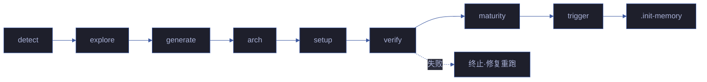
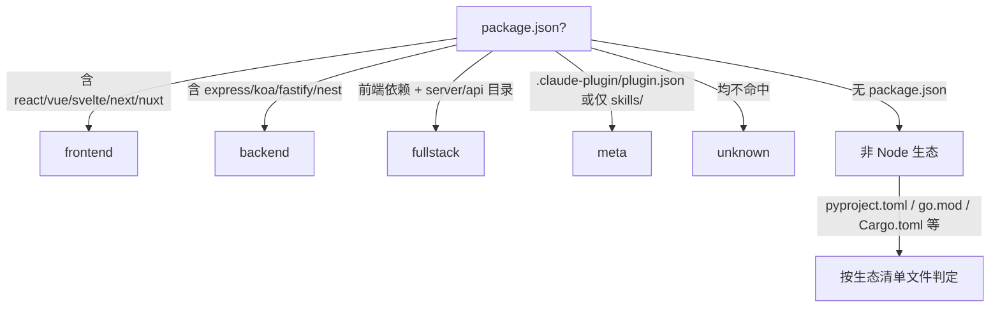

# rui-init

> 六步：探 → 察 → 生 → 架 → 搭 → 验 → 触。可重复运行，每次全量重生。CLAUDE.md 的 `<!-- rui:project-start -->` / `<!-- rui:project-end -->` 标记段每次覆盖，段外保留。
>
> `/rui init`（通过 rui 编排器调用）或 `/rui-init`



## 1. detect — 探测信号

抽取 profile 为后续阶段提供事实基线：

- **项目身份** — 仓库目录名 → 分支前缀；故事目录名纯语义 kebab-case，文档名不加项目前缀
- **项目类型** — 关键目录与配置文件 → frontend / backend / fullstack / meta / unknown（判定见下图）
- **项目清单** — 按生态文件抽取依赖 + 构建/测试命令 + 框架版本
- **安全面** — 源码关键词扫描：用户输入 / API / 存储 / 认证 / 第三方
- **测试框架** — 依赖 + 配置文件 → vitest / jest / pytest / go-test / cargo-test
- **架构模式** — 项目结构 → single / monorepo / microservice / plugin



## 2. explore — 深度探索

阅读核心源码，理解架构模式、代码规范、安全面。验证并补充 profile 判断。**抽取模块地图**：识别项目内所有模块（skills/（含 agents + rules）等），记录每个模块的入口文件、核心依赖、下游消费者，为后续架构故事生成提供事实基线。

## 3. generate — 生成内容

基于 profile + 探索发现直接编写文件：

- `CLAUDE.md` — 项目画像 + 执行准则 + 退化对策 + 项目约束（含 `rui:project-start/end` 标记）+ 自约束
- `README.md` — 系统视图 + 命令流 + 快速开始 + 项目结构 + [领域语言段](../../README.md#领域语言)（术语定义 + 关系 + 示例对话 + 歧义标记）

## 4. arch — 补齐技术架构故事 + 自主测试方案

> 自主生成两个故事目录：
> - `docs/故事任务面板/<project>-arch/` — 系统架构知识固化
> - `docs/故事任务面板/<project>-self-test/` — 项目自主测试方案
>
> 基于 explore 阶段抽取的模块地图、项目拓扑事实和基线文档（CLAUDE.md / README.md）自主构建。

**4a. 技术架构故事** (`<project>-arch`)，通过委托 [`rui-doc`](../rui-doc/SKILL.md) 生成 markdown 文档基线，委托 [`rui-html`](../rui-html/SKILL.md) 生成可视化 HTML，不自行实现生成逻辑：

| # | 文档 | Agent | 内容 |
|---|------|-------|------|
| 1 | 故事任务.md | pm | 系统架构知识固化 + 模块地图两大 Story，含 FP/AC/SC/风险 |
| 2 | 场景-N-<slug>/index.md | pm + coder + tester + security | ≥5 个架构参考场景（模块定位/数据流追踪/新人上手/依赖变更影响/信任边界与安全面），每场景自包含 §0-§4 全生命周期 |
| 3 | 场景-N-<slug>/*.html (×7) | coder | **每场景必须 7 个 HTML**：计划清单.html / 架构图.html / 知识图谱.html / 源码.html / 测试面板.html / 演示.html / 审查.html |
| 4 | 知识图谱.json | pm → coder | 模块+数据流+拓扑层次的结构化知识表示 |
| 5 | 知识图谱.html | coder | 故事级知识图谱可视化 |
| 6 | 演示/index.html | coder | 故事级演示中心，含各场景入口卡片 + 管线全景 + 快速命令 |

**4b. 自主测试方案** (`<project>-self-test`)，基于基线文档自主构建项目自检策略：

| # | 文档 | Agent | 内容 |
|---|------|-------|------|
| 1 | 故事任务.md | pm | 项目自检体系两大 Story：管线健康自检 + 文档基线完整性校验 |
| 2 | 场景-N-<slug>/index.md | pm + coder + tester + security | ≥6 个自检场景（init 后全量自检/commit 前增量自检/文档→代码一致性校验/安全面回归自检/跨故事集成回归自检/第三方框架与服务自检） |
| 3 | 场景-N-<slug>/*.html (×7) | coder | **每场景必须 7 个 HTML**：计划清单.html / 架构图.html / 知识图谱.html / 源码.html / 测试面板.html / 演示.html / 审查.html |
| 4 | 知识图谱.json | pm → coder | 自检项结构化知识表示 |
| 5 | 知识图谱.html | coder | 故事级知识图谱可视化 |
| 6 | 演示/index.html | coder | 故事级演示中心，含各场景入口卡片 + 管线全景 + 快速命令 |

> **每场景 7 HTML 完整性约束**：arch 和 self-test 每个场景目录必须包含全部 7 个 HTML 文件。任一场景缺失任一 HTML 文件视为 verify 失败。场景的 index.md 是内容基线，7 个 HTML 从 index.md 的 §0-§4 各节派生：
> - 计划清单.html ← §0 + §1 + §2 + §4（逐步执行清单）
> - 架构图.html ← §0 效果示意 Mermaid 图（自包含 SVG）
> - 知识图谱.html ← §0 图谱定位 + 知识图谱.json（Cytoscape.js 交互）
> - 源码.html ← §2 产物清单 + 架构决策
> - 测试面板.html ← §1 测试设计 + §3 测试报告
> - 演示.html ← §0 效果示意 + §2 关键发现
> - 审查.html ← §4 自改进 + D0-D7 诊断
>
> HTML 文件结构必须与项目参考实现（`docs/故事任务面板/rui-npm/`）保持一致：暗色主题 CSS 变量、面包屑导航、7 文档交叉导航、CDN 深度正确、shared/index.css/theme.css 引用。

**故事命名**：`<project>-arch`、`<project>-self-test`（如项目名 `YrY` → `yry-arch`、`yry-self-test`）。

> 以上文档基线通过委托 [`rui-doc`](../rui-doc/SKILL.md)（markdown 基线）和 [`rui-html`](../rui-html/SKILL.md)（HTML 可视化）生成。rui-init 仅编排调用顺序和故事参数，不自行实现文档生成逻辑。

## 5. setup — 机械搭建

- 创建 `docs/故事任务面板/`（如已由 arch 步骤创建则跳过）
- 生成 `.claude/skills/rui-bot/config.json`（schema 见 [rui-bot SKILL.md](../rui-bot/SKILL.md#内置配置)）
- 写入 `docs/故事任务面板/.init-memory.json`

## 6. verify — 10 项就绪检查 + 工程化门禁

任一失败即终止：

- CLAUDE.md 含 `rui:project-start` 标记 + 项目名
- README.md 含项目名
- README.md 含 `## 领域语言` 标题 + ≥3 个术语定义
- `docs/故事任务面板/` 目录存在
- `<project>-arch/` 含：故事任务.md + 知识图谱.json + 知识图谱.html + 演示/index.html
- `<project>-arch/` 每场景含 index.md + 7 个 HTML 文件（计划清单/架构图/知识图谱/源码/测试面板/演示/审查）
- `<project>-self-test/` 含：故事任务.md + 知识图谱.json + 知识图谱.html + 演示/index.html
- `<project>-self-test/` 每场景含 index.md + 7 个 HTML 文件（同上）
- `<project>-arch/` 场景数 ≥5，`<project>-self-test/` 场景数 ≥6
- `.claude/skills/rui-bot/config.json` 存在
- 工程化成熟度已评估（§7 完成）且健康报告 + 自循环报告已生成

## 7. maturity — 工程化程度评估 + 报告生成

> **此步骤不可跳过。** 每次 init 必须评估项目工程化成熟度并生成健康报告与自循环报告。

**7a. 工程化维度采集**（基于 detect + explore 阶段的事实数据）：

| 维度 | 探测方式 | 满分 | 评分标准 |
|------|---------|------|---------|
| 测试体系 | 依赖 + 配置文件 + 测试用例数 | 20 | 有框架+用例≥10→20；有框架无用例→10；无框架→0 |
| 类型安全 | TypeScript/Flow/typing 文件存在 | 15 | TS 严格模式→15；有 TS 但宽松→10；纯 JS→0 |
| 代码规范 | ESLint/Prettier/.editorconfig 配置 | 15 | 有配置+CI 强制→15；有配置→10；无→0 |
| CI/CD | GitHub Actions/Jenkins/.gitlab-ci 等 | 15 | 有管线+自动化→15；有管线→10；无→0 |
| 文档完整 | README + CLAUDE.md + API 文档 | 15 | 3+文档齐全→15；1-2文档→8；无→0 |
| 依赖管理 | lockfile + 版本策略 + 审计 | 10 | lockfile+定期审计→10；有 lockfile→5；无→0 |
| Git 纪律 | 分支策略 + commit 规范 + PR 模板 | 10 | 全部具备→10；部分→5；无→0 |

**7b. 综合评分**：
- 各维度加权求和得出工程化成熟度分数（满分 100）
- 评级：A ≥ 85、B ≥ 70、C ≥ 55、D < 55
- 识别低于 60% 的维度作为改进建议

**7c. 生成健康报告**（强制）：
```
node skills/rui-bot/send.mjs health --html
```
生成 `docs/健康报告/health-<date>-<ts>.html` 并更新 `docs/健康报告/index.html`。健康报告包含工程化成熟度维度。

**7d. 生成自循环报告**（强制）：
```
node skills/rui-bot/lib/loop-report.mjs --skill=rui-init --status=<pass|warn> --summary="工程化成熟度 <score> 分 (<grade> 级)，<n> 项改进建议" --findings='[{"level":"<warn|info>","title":"<维度> 得分偏低","detail":"当前 <score> 分，建议..."}]'
```
生成 `docs/自循环报告/rui-init-<date>-<ts>.html` 并更新 `docs/自循环报告/index.html`。

> `--status` 判定：总分 ≥ 70 为 `pass`，≥ 55 为 `warn`，< 55 为 `fail`。

## 8. trigger — 自动触发

验证 + 工程化评估通过后**自动执行**。此步骤必须实际创建 cron 任务（调用 CronCreate），不可仅记录在规约中。

1. **启动自循环任务** — 按以下规格写入 8 个持久化 cron 任务到 `.claude/scheduled_tasks.json`（使用 CronCreate，`durable=true`）：

   | 任务 | cron | prompt |
   |------|------|--------|
   | rui-bot 通知轮询 | `7 * * * *` | `/rui-bot health — 通知队列轮询：扫描待发通知，批量推送，汇总自循环报告状态。如无待发条目则静默跳过。` |
   | rui-bot 健康报告生成 | `17 * * * *` | `node skills/rui-bot/send.mjs health --html — 定时生成项目健康报告到 docs/健康报告/，更新索引页。` |
   | rui-bot 失败队列重试 | `3,33 * * * *` | `node skills/rui-bot/send.mjs flush — 重试失败队列中的待发通知，成功则移除，连续 3 次失败则标记 dead。` |
   | rui-import 文档巡检 | `37 * * * *` | `/rui-import sync workspace=true mode=list — 文档同步巡检：检测本地文档变更，与远端 API 比对，输出待同步清单。` |
   | rui-story 状态轮询 | `*/7 * * * *` | `/rui-story status — 故事面板状态轮询：检测所有故事任务的最新状态变更，更新故事面板索引。` |
   | rui-claude 配置巡检 | `7 10 * * *` | `/rui-claude health — 配置健康巡检：检查所有 .claude/ 目录配置完整性，对比远端基线，输出健康报告。` |
   | self-improve 自改进 | `3 9 * * 1` | `/rui yry — 自改进闭环：扫描执行记忆 → D0-D7 诊断 → 生成改进提案 → 评估效果。深度 3 全自主模式。` |
   | rui-analysis 健康看门狗 | `3 8 * * 1,4` | `/rui-analysis — 代码健康看门狗：分析项目代码健康度，检测退化信号，输出健康趋势报告。` |

2. **同步文档到远端** — `node skills/rui-import/sync.mjs workspace=true`（缺 token 跳过，网络失败告警不阻断）
3. **发送完成通知** — `node skills/rui-bot/send.mjs --story=<project>-self-test --status=complete --rich`（缺 webhook 仅写日志）

> 第 1 步为强制（必须创建所有 8 个 cron 任务），第 2、3 步依赖外部服务时降级不阻断。健康报告和自循环报告已在 §7 maturity 步骤生成，trigger 不重复执行。8 个 cron 任务确保自循环体系在 init 后即刻自主运转，无需人工干预。

## 产物

- `CLAUDE.md` — `rui:project-*` 标记内全量重生，段外保留
- `README.md` — 全量重生，领域语言段重复运行时增量补充
- `docs/故事任务面板/<project>-arch/` — 项目技术架构故事，每次全量重生
- `docs/故事任务面板/<project>-self-test/` — 项目自主测试方案，每次全量重生
- `.claude/skills/rui-bot/config.json` — 每次覆盖
- `docs/故事任务面板/.init-memory.json` — 每次覆盖
- `docs/健康报告/health-<date>-<ts>.html` — 含工程化成熟度评分的健康报告（§7 生成）
- `docs/自循环报告/rui-init-<date>-<ts>.html` — rui-init 自循环报告（§7 生成）

## 生效标志

| 标志 | 验证方式 |
|------|---------|
| CLAUDE.md 含标记段 + 项目名 | grep rui:project-start CLAUDE.md |
| 11 项就绪检查全部通过 | 逐项验证 |
| 工程化成熟度已评估 + 报告已生成 | ls docs/健康报告/ 和 docs/自循环报告/rui-init-* |
| arch 和 self-test 故事目录存在且文档基线完整 | ls docs/故事任务面板/<project>-*/ |
