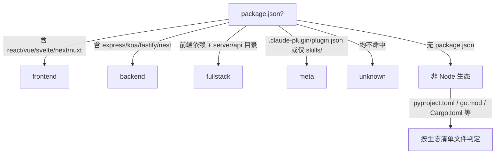

# rui-init 初始化管线

> 项目初始化的六步管线规则，独立于实现细节。

## 六步管线

```
detect → explore → generate → arch → setup → verify → trigger
```

### 1. detect — 探测信号

抽取 profile 为后续阶段提供事实基线：

- **项目身份** — 仓库目录名 → 分支前缀
- **项目类型** — frontend / backend / fullstack / meta / unknown
- **项目清单** — 依赖 + 构建/测试命令 + 框架版本
- **安全面** — 源码关键词扫描
- **测试框架** — vitest / jest / pytest / go-test / cargo-test
- **架构模式** — single / monorepo / microservice / plugin

### 2. explore — 深度探索

阅读核心源码，理解架构模式、代码规范、安全面。验证并补充 profile 判断。抽取模块地图。

### 3. generate — 生成内容

基于 profile + 探索发现直接编写文件：
- CLAUDE.md (含 rui:project-start/end 标记)
- .gitignore

### 4. arch — 架构设计

生成初始架构文档和故事基线。

### 5. setup — 环境搭建

配置开发环境、安装依赖、初始化工具链。

### 6. verify — 验证

验证所有生成文件的完整性和正确性。失败则终止，修复后重跑。

## 核心规则

| # | 规则 | 设计理由 |
|---|------|---------|
| 1 | 可重复运行，每次全量重生 rui 标记段 | L2 重生机制 |
| 2 | rui:project-start/end 标记段每次覆盖，段外保留 | 用户自定义内容不丢失 |
| 3 | verify 失败则终止，不继续后续步骤 | 验现实 |
| 4 | 项目类型判定基于生态文件，不猜测 | 事实基线 |
| 5 | 安全面探测不可跳过 | 安全基线不可绕过 |

## 项目类型判定



## 安全面探测

| 探测项 | 关键词/模式 | 风险级别 |
|--------|-----------|:---:|
| 用户输入 | `req.body`, `req.query`, `req.params`, `input`, `form` | High |
| API 端点 | `app.get`, `app.post`, `router`, `fetch`, `axios` | Medium |
| 数据存储 | `database`, `db.query`, `mongoose`, `prisma`, `redis` | High |
| 认证 | `auth`, `token`, `jwt`, `session`, `passport`, `oauth` | Critical |
| 第三方集成 | `webhook`, `callback`, `redirect_uri`, `api_key` | Medium |

## 验证清单

| 验证项 | 检查方式 | 通过条件 |
|--------|---------|---------|
| CLAUDE.md 生成 | 文件存在 + 含 rui 标记 | 两标记均存在 |
| README.md 生成 | 文件存在 + 含项目名 | 非空且 ≥ 200 字符 |
| docs/index.html 生成 | 文件存在且可渲染 | 含基本 HTML 结构 |
| 项目类型判定 | 与手动判断一致 | 类型匹配 |
| 安全面已扫描 | 安全面探测已执行 | 无跳过的高风险项 |

## 边界场景

| 场景 | 处置 |
|------|------|
| 空项目目录 | 跳过 explore，生成最小 CLAUDE.md |
| 非 Node 生态 | 按生态文件判定，标注 `non-node` |
| 已有 CLAUDE.md | 仅覆盖 rui 标记段，段外保留 |
| verify 失败 | 终止，输出失败项，修复后重跑 |
| 项目类型无法判定 | 标记为 unknown，人工确认 |