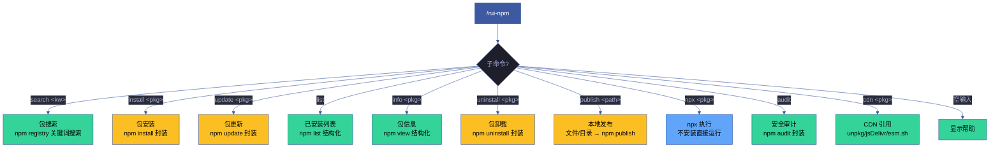
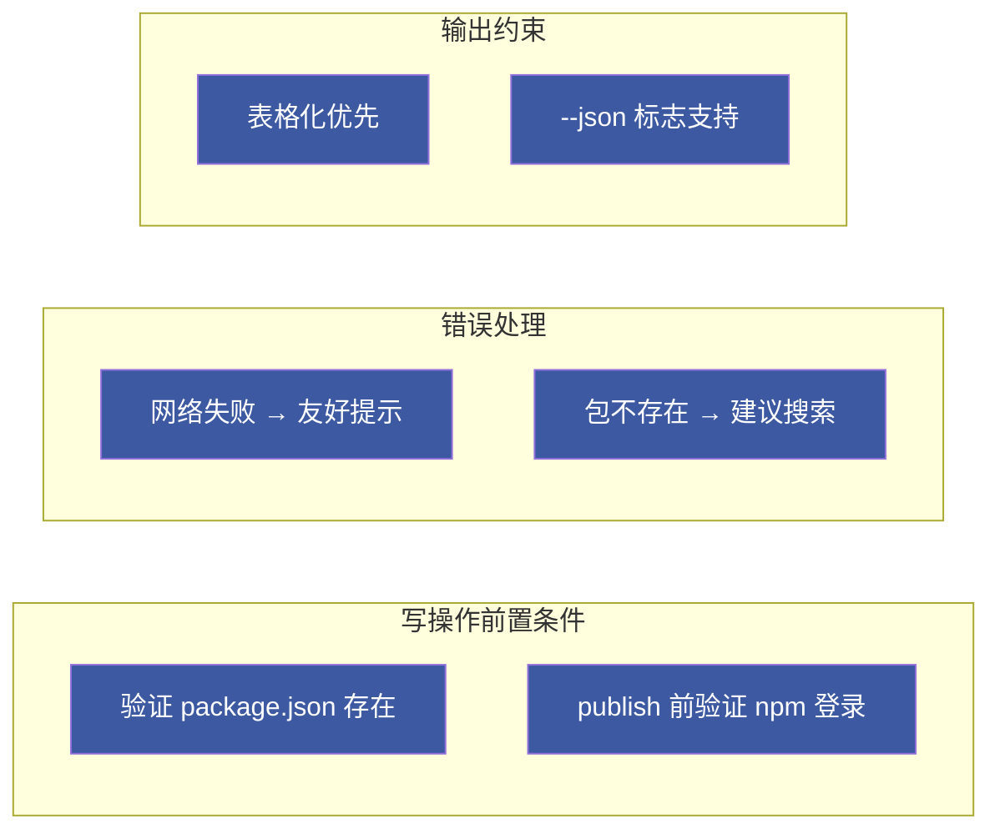
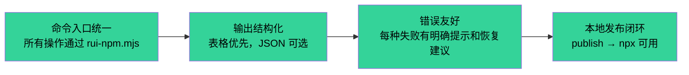

# rui-npm

> 个人 npm packages 管理器：搜索 · 安装 · 更新 · 列表 · 信息 · 卸载 · 本地发布 · npx 执行 · CDN 引用。
>
> **--help / -h**：执行 `node skills/rui-npm/help.mjs` 输出完整帮助（含命令族全景 + 场景示例）。用户输入 `/rui-npm --help` 或 `/rui-npm -h` 或 `/rui-npm help` 时，跳过逻辑，直接运行脚本。
>
> 哲学源自 [CLAUDE.md](../../CLAUDE.md)。

[命令族全景](#命令族全景) · [子命令](#子命令) · [search](#search) · [install](#install) · [update](#update) · [list](#list) · [info](#info) · [uninstall](#uninstall) · [publish](#publish) · [npx](#npx) · [audit](#audit) · [cdn](#cdn) · [核心规则](#核心规则) · [降级策略](#降级策略) · [生效标志](#生效标志)

## 命令族全景



| 命令 | 类型 | 作用 |
|------|------|------|
| `/rui-npm search <keyword>` | 只读 | 按关键词搜索 npm registry，结构化展示结果 |
| `/rui-npm install <pkg>[@version]` | 写入 | 安装包到当前项目 |
| `/rui-npm update <pkg>` | 写入 | 更新指定包到兼容最新版本 |
| `/rui-npm list [--depth N]` | 只读 | 列出当前项目已安装的包 |
| `/rui-npm info <pkg>` | 只读 | 查看包的完整元数据 |
| `/rui-npm uninstall <pkg>` | 写入 | 从当前项目卸载包 |
| `/rui-npm publish <path>` | 写入 | 发布本地文件或目录到 npm registry |
| `/rui-npm npx <pkg>[@version]` | 执行 | 通过 npx 直接运行 npm 包 |
| `/rui-npm audit` | 只读 | 审计已安装依赖的安全漏洞 |
| `/rui-npm cdn <pkg>[@version]` | 只读 | 查看包在 unpkg/jsDelivr/esm.sh 的 CDN 引用地址 |
| `/rui-npm --help` | 只读 | 显示完整帮助 |

## 子命令

### search — 包搜索

> 按关键词搜索 npm registry，返回结构化结果。

```
步骤 1: 验证关键词非空
步骤 2: npm search <keyword> --json --long
步骤 3: 按周下载量降序排列，取前 20 条
步骤 4: 格式化为表格输出（名称/描述/版本/周下载量/更新时间）
步骤 5: 附带搜索时间戳
```

**参数**：

| 参数 | 必需 | 说明 |
|------|------|------|
| `<keyword>` | 是 | 搜索关键词，1-64 字符 |
| `--json` | 否 | 输出 JSON 格式 |
| `--limit N` | 否 | 结果数量限制，默认 20 |

**输出格式**：

```markdown
## npm 搜索结果 — "{keyword}"（YYYY-MM-DD HH:MM）

| # | 包名 | 描述 | 版本 | 周下载量 | 更新 |
|---|------|------|------|---------|------|
| 1 | pkg-name | Short description | 2.1.0 | 1.2M/w | 2026-06-01 |
```

### install — 包安装

> 安装 npm 包到当前项目的 dependencies。

```
步骤 1: 验证当前目录有 package.json
步骤 2: 解析包名和可选版本号
步骤 3: npm install <pkg>[@version] --save
步骤 4: 输出安装结果和版本信息
```

**参数**：

| 参数 | 必需 | 说明 |
|------|------|------|
| `<pkg>[@version]` | 是 | 包名，可选版本号（如 `lodash@4.17.21`） |
| `--dev` / `-D` | 否 | 安装为 devDependency |
| `--global` / `-g` | 否 | 全局安装 |

**前置条件**：当前目录存在 `package.json`。

### update — 包更新

> 更新指定包到兼容最新版本。

```
步骤 1: 验证包已在 package.json 中声明
步骤 2: 记录更新前版本
步骤 3: npm update <pkg>
步骤 4: 对比更新前后版本，输出变更
```

### list — 已安装列表

> 列出当前项目已安装的依赖。

```
步骤 1: npm list --json [--depth N]
步骤 2: 解析 JSON 为平面列表
步骤 3: 格式化为表格（名称/声明版本/实际安装版本/层级）
```

**参数**：

| 参数 | 必需 | 说明 |
|------|------|------|
| `--depth N` | 否 | 依赖树深度，默认 0（仅直接依赖） |
| `--json` | 否 | 输出 JSON 格式 |

### info — 包信息

> 查看指定包的完整元数据。

```
步骤 1: npm view <pkg> --json
步骤 2: 提取关键字段：name/description/version/license/maintainers/keywords/dependencies/homepage/repository
步骤 3: 格式化为分区展示
```

**输出分区**：

| 分区 | 内容 |
|------|------|
| 基本信息 | 名称/描述/最新版本/许可证 |
| 版本历史 | 最近 10 个版本及发布时间 |
| 维护信息 | 维护者/主页/仓库链接 |
| 依赖 | 自身依赖列表 |
| 下载统计 | 周下载量（如可获取） |

### uninstall — 包卸载

> 从当前项目移除指定包。

```
步骤 1: 验证包已在 package.json 中声明
步骤 2: npm uninstall <pkg>
步骤 3: 输出卸载确认
```

### publish — 本地发布

> 将本地文件或目录发布为 npm 包。支持单文件和目录两种模式。

```
步骤 1: 验证路径存在（文件或目录）
步骤 2: 验证 npm 登录状态（npm whoami）
步骤 3a（文件）: 创建临时目录 → 复制文件为 index.js → 交互式生成 package.json
步骤 3b（目录）: 验证 package.json 存在，缺失时交互式生成
步骤 4: 检查 npm registry 是否存在同名包（冲突检测）
步骤 5: npm publish [--access public]
步骤 6: 输出包名 + 版本 + 发布确认
步骤 7: 清理临时目录（文件模式）
```

**参数**：

| 参数 | 必需 | 说明 |
|------|------|------|
| `<path>` | 是 | 本地文件路径或目录路径 |
| `--name <name>` | 否 | 指定包名（默认从目录名/文件名推导） |
| `--version <ver>` | 否 | 指定版本号（默认 1.0.0） |
| `--description <desc>` | 否 | 包描述 |
| `--access public` | 否 | 发布为公开包（scope 包默认 private） |
| `--dry-run` | 否 | 模拟发布，不实际上传 |

**前置条件**：`npm whoami` 成功（已登录 npm）。

**自动生成 package.json（文件模式）**：

```json
{
  "name": "<derived-or-specified>",
  "version": "1.0.0",
  "description": "<user-provided-or-auto>",
  "main": "index.js",
  "bin": { "<name>": "./index.js" },
  "license": "MIT"
}
```

### npx — npx 执行

> 通过 npx 直接运行 npm 包，无需安装。

```
步骤 1: 验证包名非空
步骤 2: npx <pkg>[@version] [-- args...]
步骤 3: 流式输出 stdout/stderr
步骤 4: 返回执行结果的退出码
```

**参数**：

| 参数 | 必需 | 说明 |
|------|------|------|
| `<pkg>[@version]` | 是 | 要执行的 npm 包名，可选版本 |
| `-- args...` | 否 | 传递给包的命令行参数（`--` 之后） |

### audit — 安全审计

> 审计当前项目已安装依赖的已知安全漏洞。

```
步骤 1: npm audit --json
步骤 2: 解析漏洞数据
步骤 3: 按严重级别分组（critical/high/moderate/low）
步骤 4: 格式化摘要表格 + 修复建议
```

**输出格式**：

```markdown
## 安全审计结果 — YYYY-MM-DD HH:MM

| 严重级别 | 数量 |
|---------|------|
| 💀 Critical | 0 |
| 🔴 High | 2 |
| 🟡 Moderate | 5 |
| 🟢 Low | 3 |

### 修复建议
- `npm audit fix` — 自动修复兼容的漏洞
- `npm audit fix --force` — 强制修复（可能包含破坏性变更）
```

### cdn — CDN 引用

> 查看 npm 包在主流 CDN 的引用地址，方便直接在浏览器中通过 `<script>` 或 `import` 使用。

```
步骤 1: 验证包名非空
步骤 2: 解析包名和可选版本号（无版本则使用 latest）
步骤 3: npm view <pkg> version 验证包存在
步骤 4: 生成 unpkg / jsDelivr / esm.sh 三条 CDN 地址
步骤 5: 格式化为表格输出
```

**参数**：

| 参数 | 必需 | 说明 |
|------|------|------|
| `<pkg>[@version]` | 是 | 包名，可选版本号（如 `react@18.2.0`） |
| `--json` | 否 | 输出 JSON 格式 |

**输出格式**：

```markdown
## react@18.2.0 — CDN 引用地址

| CDN | URL |
|-----|-----|
| unpkg    | https://unpkg.com/react@18.2.0/ |
| jsDelivr | https://cdn.jsdelivr.net/npm/react@18.2.0/ |
| esm.sh   | https://esm.sh/react@18.2.0 |
```

**CDN 选用指南**：

| CDN | 特点 | 适用场景 |
|-----|------|---------|
| unpkg | 原始 npm 文件直出，URL 即 npm 路径 | 查看包内文件、调试 |
| jsDelivr | 全球 CDN 加速，支持多文件合并 | 生产环境 `<script>` 引用 |
| esm.sh | 自动转 ESM 格式，支持 TypeScript/JSX | `<script type="module">` 或 `import` |

## 核心规则



| # | 规则 | 违反行为 |
|---|------|---------|
| 1 | install/uninstall/update/list/audit 前验证 package.json 存在 | 提示用户先执行 `npm init` |
| 2 | publish 前验证 `npm whoami` 成功 | 提示用户先执行 `npm login` |
| 3 | 网络不可达时输出友好提示和手动 URL | 标注 `网络不可达` |
| 4 | 包不存在 registry 时建议搜索确认拼写 | 输出 `包不存在，建议 /rui-npm search <kw>` |
| 5 | 查询结果默认表格化输出，`--json` 标志输出原始 JSON | — |
| 6 | publish 时检查 registry 同名冲突 | 提示用户改名或使用 `--access` |

## 降级策略

| 情况 | 降级行为 |
|------|---------|
| npm CLI 不可用 | 输出 `未检测到 npm，请先安装 Node.js` |
| npm 版本 < 7.0.0 | 警告 `npm 版本过旧，建议升级至 7.x+`，降级使用兼容参数 |
| npm registry 不可达 | 输出错误详情 + 手动访问 `https://www.npmjs.com/` 引导 |
| npm 未登录（publish） | 提示 `请先执行 npm login 登录 npm 账户` |
| package.json 不存在（写操作） | 提示 `当前目录无 package.json，请先执行 npm init` |
| 目录无 package.json（publish 目录模式） | 交互式生成 package.json 后继续 |
| npm audit 无网络 | 跳过审计，标注 `无网络连接，跳过安全审计` |
| cdn 包不存在 registry | 输出 `包不存在，请检查包名或先执行 search` |
| cdn 无网络 | 输出错误详情 + 引导手动访问 `https://www.npmjs.com/package/<pkg>` 确认包名 |

## 生效标志



| 标志 | 未达标的处置 |
|------|------------|
| 全部子命令可通过 `node skills/rui-npm/rui-npm.mjs <cmd>` 执行 | 检查脚本入口和参数解析 |
| help.mjs 输出覆盖全部子命令和场景 | 补全缺失的文档段 |
| publish 后立即可通过 npx 执行 | 检查 npm registry 同步延迟 |
| 所有错误路径有明确提示 | 补充错误处理分支 |
