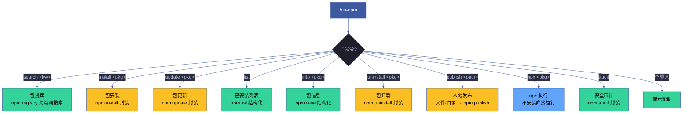
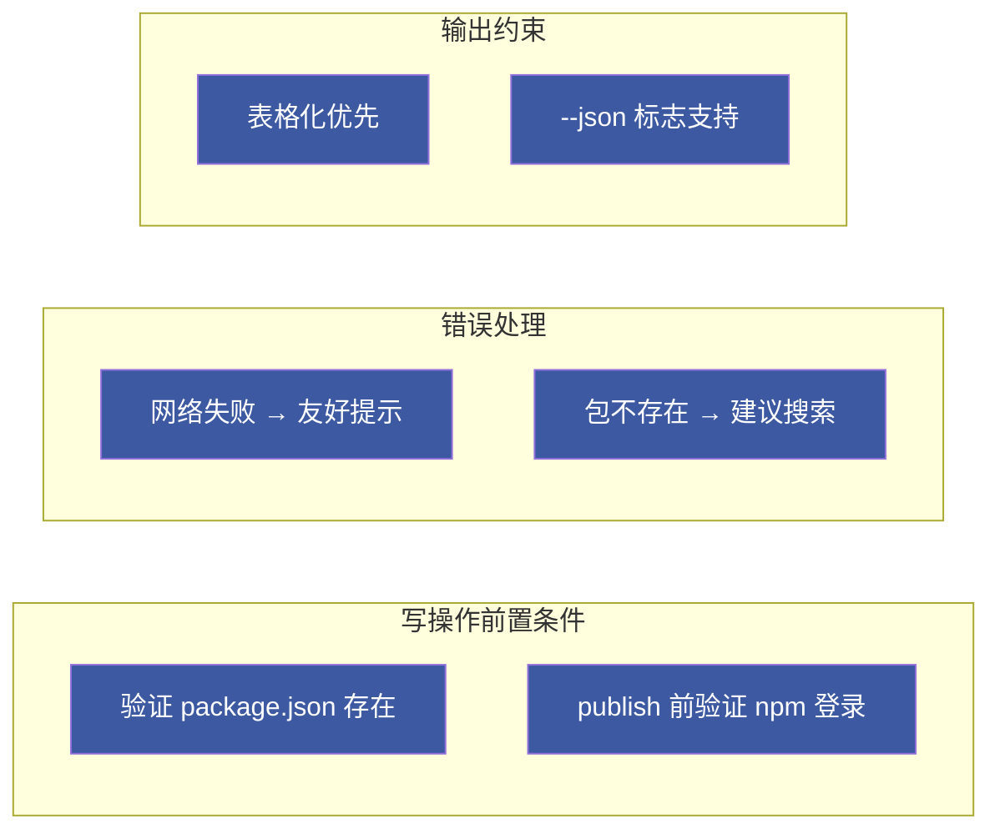
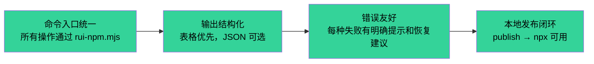

# rui-npm

> 个人 npm packages 管理器：搜索 · 安装 · 更新 · 列表 · 信息 · 卸载 · 本地发布 · npx 执行。
>
> **--help / -h**：执行 `node skills/rui-npm/help.mjs` 输出完整帮助（含命令族全景 + 场景示例）。用户输入 `/rui-npm --help` 或 `/rui-npm -h` 或 `/rui-npm help` 时，跳过逻辑，直接运行脚本。
>
> 哲学源自 [CLAUDE.md](../../CLAUDE.md)。

[命令族全景](#命令族全景) · [子命令](#子命令) · [search](#search) · [install](#install) · [update](#update) · [list](#list) · [info](#info) · [uninstall](#uninstall) · [publish](#publish) · [npx](#npx) · [audit](#audit) · [场景](#场景) · [核心规则](#核心规则) · [降级策略](#降级策略) · [生效标志](#生效标志)

## 命令族全景



| 命令 | 类型 | 作用 |
|------|------|------|
| `/rui-npm search <keyword>` | 只读 | 按关键词搜索 npm registry，结构化展示结果 |
| `/rui-npm install <pkg>[@version]` | 写入 | 安装包到当前项目 |
| `/rui-npm update <pkg>` | 写入 | 更新指定包到兼容最新版本 |
| `/rui-npm list [--depth N]` | 只读 | 列出当前项目已安装的包 |
| `/rui-npm info <pkg>` | 只读 | 查看包的完整元数据 |
| `/rui-npm uninstall <pkg>` | 写入 | 从当前项目卸载包 |
| `/rui-npm publish <path>` | 写入 | 发布本地文件或目录到 npm registry |
| `/rui-npm npx <pkg>[@version]` | 执行 | 通过 npx 直接运行 npm 包 |
| `/rui-npm audit` | 只读 | 审计已安装依赖的安全漏洞 |
| `/rui-npm --help` | 只读 | 显示完整帮助 |

## 子命令

### search — 包搜索

> 按关键词搜索 npm registry，返回结构化结果。

```
步骤 1: 验证关键词非空
步骤 2: npm search <keyword> --json --long
步骤 3: 按周下载量降序排列，取前 20 条
步骤 4: 格式化为表格输出（名称/描述/版本/周下载量/更新时间）
步骤 5: 附带搜索时间戳
```

**参数**：

| 参数 | 必需 | 说明 |
|------|------|------|
| `<keyword>` | 是 | 搜索关键词，1-64 字符 |
| `--json` | 否 | 输出 JSON 格式 |
| `--limit N` | 否 | 结果数量限制，默认 20 |

**输出格式**：

```markdown
## npm 搜索结果 — "{keyword}"（YYYY-MM-DD HH:MM）

| # | 包名 | 描述 | 版本 | 周下载量 | 更新 |
|---|------|------|------|---------|------|
| 1 | pkg-name | Short description | 2.1.0 | 1.2M/w | 2026-06-01 |
```

**错误处理**：

| 情况 | 行为 |
|------|------|
| 关键词为空 | 提示用法 + 示例 |
| registry 不可达 | 输出手动访问 `https://www.npmjs.com/search?q=...` 引导 |
| 搜索结果为空 | 提示 `未找到与 "{keyword}" 相关的包` |
| JSON 解析失败 | 输出 `解析搜索结果失败` |

### install — 包安装

> 安装 npm 包到当前项目的 dependencies。

```
步骤 1: 验证当前目录有 package.json
步骤 2: 解析包名和可选版本号
步骤 3: npm install <pkg>[@version] --save
步骤 4: 输出安装结果和版本信息
```

**参数**：

| 参数 | 必需 | 说明 |
|------|------|------|
| `<pkg>[@version]` | 是 | 包名，可选版本号（如 `lodash@4.17.21`） |
| `--dev` / `-D` | 否 | 安装为 devDependency |
| `--global` / `-g` | 否 | 全局安装 |

**前置条件**：当前目录存在 `package.json`。

**输出格式**：

```markdown
📦 安装 lodash@4.17.21 ...
✅ lodash@4.17.21 安装完成
```

**错误处理**：

| 情况 | 行为 |
|------|------|
| 包名未提供 | 提示用法 + 示例 |
| package.json 不存在 | 提示先执行 `npm init`（`--global` 除外） |
| 安装失败（网络/包不存在） | 输出退出码 + 建议搜索确认拼写 |

### update — 包更新

> 更新指定包到兼容最新版本。

```
步骤 1: 验证包已在 package.json 中声明
步骤 2: 记录更新前版本
步骤 3: npm update <pkg>
步骤 4: 对比更新前后版本，输出变更
```

**参数**：

| 参数 | 必需 | 说明 |
|------|------|------|
| `<pkg>` | 是 | 要更新的包名（必须在 package.json 依赖中已声明） |

**输出格式**：

```markdown
⬆️  更新 lodash (当前: 4.17.20) ...
✅ lodash: 4.17.20 → 4.17.21
```

> 若已为最新兼容版本：`✅ lodash@4.17.21 已是最新兼容版本`

**错误处理**：

| 情况 | 行为 |
|------|------|
| 包名未提供 | 提示用法 |
| package.json 不存在 | 提示先执行 `npm init` |
| 更新失败 | 输出退出码 |

### list — 已安装列表

> 列出当前项目已安装的依赖。

```
步骤 1: npm list --json [--depth N]
步骤 2: 解析 JSON 为平面列表
步骤 3: 格式化为表格（名称/声明版本/实际安装版本/层级）
```

**参数**：

| 参数 | 必需 | 说明 |
|------|------|------|
| `--depth N` | 否 | 依赖树深度，默认 0（仅直接依赖） |
| `--json` | 否 | 输出 JSON 格式 |

**输出格式**：

```markdown
## 已安装依赖（42 个包）

| 包名 | 版本 | 层级 |
|------|------|------|
| react | 18.3.1 | 0 |
| lodash | 4.17.21 | 0 |
```

**错误处理**：

| 情况 | 行为 |
|------|------|
| package.json 不存在 | 提示先执行 `npm init` |
| 列出失败 | 输出 `列出依赖失败` |
| JSON 解析失败 | 输出 `解析依赖数据失败` |

### info — 包信息

> 查看指定包的完整元数据。

```
步骤 1: npm view <pkg> --json
步骤 2: 提取关键字段：name/description/version/license/maintainers/keywords/dependencies/homepage/repository
步骤 3: 格式化为分区展示
```

**输出分区**：

| 分区 | 内容 |
|------|------|
| 基本信息 | 名称/描述/最新版本/许可证 |
| 版本历史 | 最近 10 个版本及发布时间 |
| 维护信息 | 维护者/主页/仓库链接 |
| 依赖 | 自身依赖列表 |
| 下载统计 | 周下载量（如可获取） |

**错误处理**：

| 情况 | 行为 |
|------|------|
| 包名未提供 | 提示用法 |
| 包不存在于 registry | 输出 `包不存在` + 建议搜索确认拼写 |
| 网络不可达 | 输出错误详情 |
| JSON 解析失败 | 输出 `解析包信息失败` |

### uninstall — 包卸载

> 从当前项目移除指定包。

```
步骤 1: 验证包已在 package.json 中声明
步骤 2: npm uninstall <pkg>
步骤 3: 输出卸载确认
```

**参数**：

| 参数 | 必需 | 说明 |
|------|------|------|
| `<pkg>` | 是 | 要卸载的包名（必须在 package.json 依赖中已声明） |

**输出格式**：

```markdown
🗑️  卸载 moment ...
✅ moment 已卸载
```

**错误处理**：

| 情况 | 行为 |
|------|------|
| 包名未提供 | 提示用法 |
| package.json 不存在 | 提示先执行 `npm init` |
| 卸载失败（包未安装） | 输出退出码 + 提示确认包名 |

### publish — 本地发布

> 将本地文件或目录发布为 npm 包。支持单文件和目录两种模式。

```
步骤 1: 验证路径存在（文件或目录）
步骤 2: 验证 npm 登录状态（npm whoami）
步骤 3a（文件）: 创建临时目录 → 复制文件为 index.js → 交互式生成 package.json
步骤 3b（目录）: 验证 package.json 存在，缺失时交互式生成
步骤 4: 检查 npm registry 是否存在同名包（冲突检测）
步骤 5: npm publish [--access public]
步骤 6: 输出包名 + 版本 + 发布确认
步骤 7: 清理临时目录（文件模式）
```

**参数**：

| 参数 | 必需 | 说明 |
|------|------|------|
| `<path>` | 是 | 本地文件路径或目录路径 |
| `--name <name>` | 否 | 指定包名（默认从目录名/文件名推导） |
| `--version <ver>` | 否 | 指定版本号（默认 1.0.0） |
| `--description <desc>` | 否 | 包描述 |
| `--access public` | 否 | 发布为公开包（scope 包默认 private） |
| `--dry-run` | 否 | 模拟发布，不实际上传 |

**前置条件**：`npm whoami` 成功（已登录 npm）。

**输出格式**：

```markdown
👤 已登录 npm: yourname
📝 自动生成 package.json (name: my-util) ...
   包名: my-util
   版本: 1.0.0
🔍 检查 registry 是否存在同名包 "my-util" ...
🚀 发布中 ...
✅ my-util@1.0.0 发布成功
   安装: npm install my-util
   运行: npx my-util
```

**错误处理**：

| 情况 | 行为 |
|------|------|
| 路径不存在 | 输出错误 + 退出 |
| npm 未登录 | 提示执行 `npm login` + 注册链接 |
| registry 同名冲突 | 提示使用 `--name` 改名或 `npm deprecate` 废弃旧版 |
| package.json 格式无效 | 提示修正后重试（目录模式）；自动清理临时目录（文件模式） |
| 发布失败（网络/权限） | 输出退出码；临时目录自动清理 |

**自动生成 package.json（文件模式）**：

```json
{
  "name": "<derived-or-specified>",
  "version": "1.0.0",
  "description": "<user-provided-or-auto>",
  "main": "index.js",
  "bin": { "<name>": "./index.js" },
  "license": "MIT"
}
```

### npx — npx 执行

> 通过 npx 直接运行 npm 包，无需安装。

```
步骤 1: 验证包名非空
步骤 2: npx <pkg>[@version] [-- args...]
步骤 3: 流式输出 stdout/stderr
步骤 4: 返回执行结果的退出码
```

**参数**：

| 参数 | 必需 | 说明 |
|------|------|------|
| `<pkg>[@version]` | 是 | 要执行的 npm 包名，可选版本 |
| `-- args...` | 否 | 传递给包的命令行参数（`--` 之后） |

**输出格式**：

```markdown
▶️  npx create-react-app my-app
...（包自身的 stdout/stderr 流式输出）
```

> npx 通过 `--yes` 自动确认安装提示，流式透传包的标准输出/错误，退出码透传。

**错误处理**：

| 情况 | 行为 |
|------|------|
| 包名未提供 | 提示用法 + 示例 |
| npx 执行失败（ spawn 错误） | 输出错误消息 + 退出码 1 |
| 包运行返回非零退出码 | 透传退出码 |

### audit — 安全审计

> 审计当前项目已安装依赖的已知安全漏洞。

```
步骤 1: npm audit --json
步骤 2: 解析漏洞数据
步骤 3: 按严重级别分组（critical/high/moderate/low）
步骤 4: 格式化摘要表格 + 修复建议
```

**参数**：

| 参数 | 必需 | 说明 |
|------|------|------|
| `--json` | 否 | 输出 JSON 格式漏洞数据 |

**前置条件**：当前目录存在 `package.json`。

**输出格式**：

```markdown
## 安全审计结果 — YYYY-MM-DD HH:MM

| 严重级别 | 数量 |
|---------|------|
| 💀 Critical | 0 |
| 🔴 High | 2 |
| 🟡 Moderate | 5 |
| 🟢 Low | 3 |

### 修复建议
- `npm audit fix` — 自动修复兼容的漏洞
- `npm audit fix --force` — 强制修复（可能包含破坏性变更）
```

**错误处理**：

| 情况 | 行为 |
|------|------|
| package.json 不存在 | 提示先执行 `npm init` |
| registry 不可达 | 输出 `安全审计失败` + 手动链接引导 |
| JSON 解析失败 | 尝试回退解析 stderr，最终标错 |

## 场景

> 端到端使用模式，覆盖典型工作流。各命令独立用法见 [子命令](#子命令)。

### 场景 1 — 搜索并安装包

> 从发现到安装的典型工作流：搜索 → 确认 → 安装。

| 步骤 | 命令 | 说明 |
|------|------|------|
| 1 | `/rui-npm search react` | 按关键词搜索 npm registry，结果按周下载量降序 |
| 2 | `/rui-npm info react` | 查看 react 的许可证、维护者、依赖详情，确认兼容性 |
| 3 | `/rui-npm install react` | 安装 react 到当前项目 dependencies |

**决策点**：搜索结果中根据下载量、更新时间、描述筛选候选包。不确定时用 `info` 确认许可证和依赖健康度。需要特定版本用 `install react@18.2.0`。

**变体 — devDependency**：
```
/rui-npm install prettier --dev
```

### 场景 2 — 本地脚本即发即用（文件模式）

> 将单个 JS/MJS 文件发布为 npm 包，即刻通过 npx 运行。

| 步骤 | 命令 | 说明 |
|------|------|------|
| 1 | `/rui-npm publish ./my-cli.mjs --name my-util` | 自动生成 package.json 并发布单文件为 npm 包 |
| 2 | `/rui-npm npx my-util` | 通过 npx 直接运行（无需安装） |
| 3 | `/rui-npm npx my-util@1.0.0 -- --flag value` | 指定版本 + 传递命令行参数 |

**决策点**：
- **文件 vs 目录**：单文件 CLI 工具用文件模式（自动生成 package.json），多文件或含依赖的项目用目录模式（场景 3）
- **包名冲突**：publish 自动检测 registry 同名冲突，冲突时用 `--name` 指定新包名
- **版本迭代**：更新文件后重新 publish，`--version` 指定新版本号

### 场景 3 — 本地项目发布（目录模式）

> 将含 package.json 的目录发布为 npm 包。适用多文件库、含依赖的项目。

| 步骤 | 命令 | 说明 |
|------|------|------|
| 1 | `/rui-npm publish ./my-lib --dry-run` | 先模拟发布，预览上传内容，不实际上传 |
| 2 | `/rui-npm publish ./my-lib` | 确认无误后正式发布 |
| 3 | `/rui-npm install my-lib` | 在消费项目中安装验证 |

**决策点**：
- `--dry-run` 预览发布内容，避免泄露密钥/敏感文件（检查 `.npmignore` 或 `files` 字段）
- scope 包（如 `@scope/pkg`）默认为 private，需 `--access public` 公开
- 目录模式保留原有 package.json，不自动生成

### 场景 4 — 依赖安全审计与修复

> 定期检查依赖漏洞并更新。CI/CD 中建议集成。

| 步骤 | 命令 | 说明 |
|------|------|------|
| 1 | `/rui-npm audit` | 审计当前项目所有依赖的已知漏洞，按严重级别分组 |
| 2 | `/rui-npm update lodash` | 更新有漏洞的包到兼容最新版 |
| 3 | `/rui-npm list --depth 0` | 确认最终依赖版本状态 |

**决策点**：
- audit 输出按 `critical → high → moderate → low` 排序。优先处理 critical/high
- `npm audit fix` 自动修复兼容漏洞（不破坏 semver）；`--force` 可能引入 breaking changes
- 不可自动修复的漏洞需手动评估影响范围后决定升级/替换/接受

### 场景 5 — 依赖清理

> 定期审查并移除不再需要的包，保持依赖树精简。

| 步骤 | 命令 | 说明 |
|------|------|------|
| 1 | `/rui-npm list` | 列出所有直接依赖及安装版本 |
| 2 | `/rui-npm info moment` | 查看待清理包的详情：许可证、维护状态、最后更新时间 |
| 3 | `/rui-npm uninstall moment` | 从 package.json 和 node_modules 移除 |

**决策点**：
- `list` 展示当前依赖全景，识别未使用或过时的包
- 不确定包是否还在使用时，先在项目中 grep 引用再决定
- `uninstall` 不可逆（git 可恢复），确认后再执行

### 场景 6 — 全局工具安装

> 安装开发辅助工具到全局环境，跨项目复用。

| 步骤 | 命令 | 说明 |
|------|------|------|
| 1 | `/rui-npm search typescript` | 搜索确认准确包名 |
| 2 | `/rui-npm install typescript --global` | 全局安装 TypeScript |
| 3 | `tsc --version` | 验证全局命令可用（脱离 rui-npm，直接调 CLI） |

**决策点**：
- 全局安装不检查 package.json，可在任意目录执行
- 项目内工具建议用 `--dev` 安装为 devDependency，保证团队环境一致（`npm ci` 可复现）
- 全局工具适用于个人辅助工具（如 `nodemon`、`ts-node`、脚手架 CLI）

### 场景 7 — JSON 模式集成

> 通过 `--json` 标志获取结构化数据，供脚本/管线/CI 消费。

| 步骤 | 命令 | 说明 |
|------|------|------|
| 1 | `/rui-npm search react --json --limit 5` | JSON 格式搜索结果，供脚本解析 |
| 2 | `/rui-npm list --json --depth 1` | JSON 格式依赖树，供依赖分析工具消费 |
| 3 | `/rui-npm audit --json` | JSON 格式漏洞数据，供 CI 流程判断阻断 |

**决策点**：
- 所有只读命令（search/list/info/audit）均支持 `--json`，跳过表格格式化输出原始 JSON
- CI 中用 `audit --json` 解析漏洞数量，critical > 0 时阻断 pipeline
- `info --json` 返回完整 npm view 数据，可用于自动化许可证合规检查

## 核心规则



| # | 规则 | 违反行为 |
|---|------|---------|
| 1 | install/uninstall/update/list/audit 前验证 package.json 存在 | 提示用户先执行 `npm init` |
| 2 | publish 前验证 `npm whoami` 成功 | 提示用户先执行 `npm login` |
| 3 | 网络不可达时输出友好提示和手动 URL | 标注 `网络不可达` |
| 4 | 包不存在 registry 时建议搜索确认拼写 | 输出 `包不存在，建议 /rui-npm search <kw>` |
| 5 | 查询结果默认表格化输出，`--json` 标志输出原始 JSON | — |
| 6 | publish 时检查 registry 同名冲突 | 提示用户改名或使用 `--access` |

## 降级策略

| 情况 | 降级行为 |
|------|---------|
| npm CLI 不可用 | 输出 `未检测到 npm，请先安装 Node.js` |
| npm 版本 < 7.0.0 | 警告 `npm 版本过旧，建议升级至 7.x+`，降级使用兼容参数 |
| npm registry 不可达 | 输出错误详情 + 手动访问 `https://www.npmjs.com/` 引导 |
| npm 未登录（publish） | 提示 `请先执行 npm login 登录 npm 账户` |
| package.json 不存在（写操作） | 提示 `当前目录无 package.json，请先执行 npm init` |
| 目录无 package.json（publish 目录模式） | 交互式生成 package.json 后继续 |
| npm audit 无网络 | 跳过审计，标注 `无网络连接，跳过安全审计` |

## 生效标志



| 标志 | 未达标的处置 |
|------|------------|
| 全部子命令可通过 `node skills/rui-npm/rui-npm.mjs <cmd>` 执行 | 检查脚本入口和参数解析 |
| help.mjs 输出覆盖全部子命令和场景 | 补全缺失的文档段 |
| publish 后立即可通过 npx 执行 | 检查 npm registry 同步延迟 |
| 所有错误路径有明确提示 | 补充错误处理分支 |
