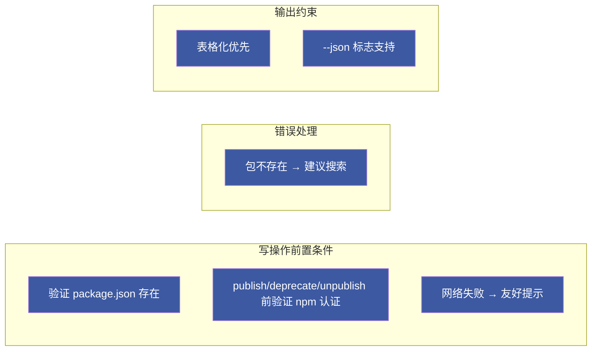
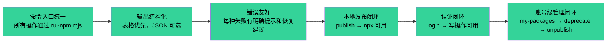

# rui-npm

> 个人 npm packages 管理器：搜索 · 安装 · 更新 · 列表 · 信息 · 卸载 · 本地发布 · npx 执行 · CDN 引用 · 账号级管理。
>
> **--help / -h**：执行 `node skills/rui-npm/help.mjs` 输出完整帮助（含命令族全景 + 场景示例）。用户输入 `/rui-npm --help` 或 `/rui-npm -h` 或 `/rui-npm help` 时，跳过逻辑，直接运行脚本。
>
> 哲学源自 [CLAUDE.md](../../CLAUDE.md)。

[命令族全景](#命令族全景) · [子命令](#子命令) · [核心规则](#核心规则) · [降级策略](#降级策略) · [生效标志](#生效标志)

## 命令族全景

```mermaid
%%{init: {'theme': 'base', 'themeVariables': {
  'primaryColor': '#1e1f2b',
  'primaryTextColor': '#a9b1d6',
  'primaryBorderColor': '#3d59a1',
  'lineColor': '#3d59a1',
  'secondaryColor': '#2b2d3b',
  'tertiaryColor': '#21232f'
}}}%%
flowchart TD
    ENTRY["/rui-npm"]:::entry --> Q1{"子命令?"}

    Q1 -->|"search &lt;kw&gt;"| SEARCH["包搜索<br/>npm registry 关键词搜索"]:::read
    Q1 -->|"install &lt;pkg&gt;"| INSTALL["包安装<br/>npm install 封装"]:::write
    Q1 -->|"update &lt;pkg&gt;"| UPDATE["包更新<br/>npm update 封装"]:::write
    Q1 -->|"list"| LIST["已安装列表<br/>npm list 结构化"]:::read
    Q1 -->|"info &lt;pkg&gt;"| INFO["包信息<br/>npm view 结构化"]:::read
    Q1 -->|"uninstall &lt;pkg&gt;"| UNINSTALL["包卸载<br/>npm uninstall 封装"]:::write
    Q1 -->|"publish &lt;path&gt;"| PUBLISH["本地发布<br/>文件/目录 → npm publish"]:::write
    Q1 -->|"npx &lt;pkg&gt;"| NPX["npx 执行<br/>不安装直接运行"]:::run
    Q1 -->|"audit"| AUDIT["安全审计<br/>npm audit 封装"]:::read
    Q1 -->|"cdn &lt;pkg&gt;"| CDN["CDN 引用<br/>unpkg/jsDelivr/esm.sh"]:::read
    Q1 -->|"login"| LOGIN["登录认证<br/>Access Token 配置"]:::write
    Q1 -->|"my-packages"| MY_PKGS["我的包列表<br/>账号级包管理"]:::read
    Q1 -->|"deprecate &lt;pkg&gt;"| DEPRECATE["废弃版本<br/>标记 deprecated"]:::write
    Q1 -->|"unpublish &lt;pkg&gt;"| UNPUBLISH["删除包/版本<br/>从 registry 移除"]:::write
    Q1 -->|"空输入"| HELP["显示帮助"]:::read

    classDef entry fill:#3d59a1,color:#fff
    classDef read fill:#34d399,color:#000
    classDef write fill:#fbbf24,color:#000
    classDef run fill:#60a5fa,color:#000
```

| 命令 | 类型 | 作用 | 详情 |
|------|------|------|------|
| `/rui-npm search <keyword>` | 只读 | 按关键词搜索 npm registry | [read](commands/read.md#search) |
| `/rui-npm install <pkg>[@version]` | 写入 | 安装包到当前项目 | [write](commands/write.md#install) |
| `/rui-npm update <pkg>` | 写入 | 更新指定包 | [write](commands/write.md#update) |
| `/rui-npm list [--depth N]` | 只读 | 列出已安装的包 | [read](commands/read.md#list) |
| `/rui-npm info <pkg>` | 只读 | 查看包元数据 | [read](commands/read.md#info) |
| `/rui-npm uninstall <pkg>` | 写入 | 卸载包 | [write](commands/write.md#uninstall) |
| `/rui-npm publish <path>` | 写入 | 发布本地文件/目录 | [publish](commands/publish.md) |
| `/rui-npm npx <pkg>[@version]` | 执行 | npx 运行包 | [tools](commands/tools.md#npx) |
| `/rui-npm audit` | 只读 | 安全漏洞审计 | [tools](commands/tools.md#audit) |
| `/rui-npm cdn <pkg>[@version]` | 只读 | CDN 引用地址 | [tools](commands/tools.md#cdn) |
| `/rui-npm login [--token <token>]` | 写入 | npm 认证 | [account](commands/account.md#login) |
| `/rui-npm my-packages [--limit N]` | 只读 | 我的包列表 | [account](commands/account.md#my-packages) |
| `/rui-npm deprecate <pkg> "<msg>"` | 写入 | 标记废弃 | [account](commands/account.md#deprecate) |
| `/rui-npm unpublish <pkg> [--force]` | 写入 | 删除包/版本 | [account](commands/account.md#unpublish) |
| `/rui-npm --help` | 只读 | 显示完整帮助 | — |

## 职责分组

| 组 | 子命令 | 职责域 | 代码 | 文档 |
|----|--------|--------|------|------|
| 包管理（读） | search, list, info | npm registry 包发现 | `lib/read.mjs` | [commands/read.md](commands/read.md) |
| 包管理（写） | install, update, uninstall | 包生命周期管理 | `lib/write.mjs` | [commands/write.md](commands/write.md) |
| 发布 | publish | 本地发布 | `lib/publish.mjs` | [commands/publish.md](commands/publish.md) |
| 账号 | login, my-packages, deprecate, unpublish | 认证与包所有权管理 | `lib/auth.mjs` + `lib/account.mjs` | [commands/account.md](commands/account.md) |
| 工具 | npx, audit, cdn | 执行、安全、CDN | `lib/tools.mjs` | [commands/tools.md](commands/tools.md) |

## 子命令

子命令详细规约已按职责分组提取到 `commands/` 目录：

- **[commands/read.md](commands/read.md)** — search, list, info
- **[commands/write.md](commands/write.md)** — install, update, uninstall
- **[commands/publish.md](commands/publish.md)** — publish
- **[commands/account.md](commands/account.md)** — login, my-packages, deprecate, unpublish
- **[commands/tools.md](commands/tools.md)** — npx, audit, cdn

## 核心规则

| # | 规则 | 违反行为 |
|---|------|---------|
| 1 | install/uninstall/update/list/audit 前验证 package.json 存在 | 提示用户先执行 `npm init` |
| 2 | publish/deprecate/unpublish 前验证 `npm whoami` 成功 | 提示用户先执行 `rui-npm login --token <token>` |
| 3 | deprecate/unpublish 前验证当前用户是包所有者 | 提示用户非所有者无法操作，展示当前维护者列表 |
| 4 | 网络不可达时输出友好提示和手动 URL | 标注 `网络不可达` |
| 5 | 包不存在 registry 时建议搜索确认拼写 | 输出 `包不存在，建议 /rui-npm search <kw>` |
| 6 | 查询结果默认表格化输出，`--json` 标志输出原始 JSON | — |
| 7 | publish 时检查 registry 同名冲突 | 提示用户改名或使用 `--access` |
| 8 | unpublish 执行前展示安全警告（不可逆操作） | 提示用户优先使用 deprecate |

## 降级策略

| 情况 | 降级行为 |
|------|---------|
| npm CLI 不可用 | 输出 `未检测到 npm，请先安装 Node.js` |
| npm 版本 < 7.0.0 | 警告 `npm 版本过旧，建议升级至 7.x+` |
| npm registry 不可达 | 输出错误详情 + 手动访问 `https://www.npmjs.com/` 引导 |
| npm 未认证（写操作） | 提示 `请先执行 rui-npm login --token <token>` |
| package.json 不存在（写操作） | 提示 `当前目录无 package.json，请先执行 npm init` |
| 目录无 package.json（publish 目录模式） | 交互式生成 package.json 后继续 |
| npm audit 无网络 | 跳过审计，标注 `无网络连接，跳过安全审计` |
| deprecate/unpublish 非包所有者 | 展示当前维护者列表，拒绝操作 |
| unpublish 超 72 小时无 --force | 提示需 --force 标志，引导使用 deprecate |
| my-packages registry API 不可达 | 降级使用 `npm access ls-packages` |

## 生效标志

| 标志 | 未达标的处置 |
|------|------------|
| 全部子命令可通过 `node skills/rui-npm/rui-npm.mjs <cmd>` 执行 | 检查脚本入口和参数解析 |
| help.mjs 输出覆盖全部子命令和场景 | 补全缺失的文档段 |
| publish 后立即可通过 npx 执行 | 检查 npm registry 同步延迟 |
| login 成功后写操作可直接使用 | 验证 npm whoami 返回正确用户名 |
| deprecate/unpublish 前所有权验证不绕过 | 验证非所有者操作被正确拒绝 |
| 所有错误路径有明确提示 | 补充错误处理分支 |

## 自循环

> 依赖健康看门狗。Agent 可按间隔周期性审计依赖安全漏洞和版本过期。

| 属性 | 值 |
|------|-----|
| 推荐间隔 | `0 8 * * 1`（每周一早 8 点） |
| 触发条件 | 当前目录存在 package.json |
| 终止条件 | 连续 2 次 audit 无新增漏洞 |
| 迭代动作 | `npm audit` → 对比上次结果 → 有新增漏洞时告警 |
| 收敛判定 | 无 Critical/High 新增漏洞 |
