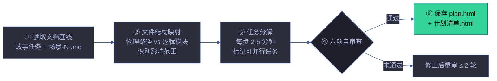

# rui-plan

> doc 阶段完成后，planner agent 读取故事文档基线，生成实施计划。计划是 doc 和 code 之间的桥梁——无计划不实现。
>
> `/rui plan <name>`（通过 rui 编排器调用）或 `/rui-plan <name>`
>
> **产出**：plan.html（故事级计划总览）· 计划清单.html（每场景任务清单）
>
> 详见 [plan-execution.md](./rules/plan-execution.md) · [planner.md](./planner.md)。
>
> **单一职责**：文档基线 → 实施计划。不负责文档生成（[rui-doc](../rui-doc/)），不负责代码实现（[rui-code](../rui-code/)），不负责版本管理（[rui-version](../rui-version/)）。

[计划管线](#计划管线) · [计划结构](#计划结构) · [任务分解方法论](#任务分解方法论) · [六项自审查](#六项自审查) · [执行模式](#执行模式) · [核心规则](#核心规则) · [降级策略](#降级策略) · [生效标志](#生效标志) · [自循环](#自循环)

## 计划管线



| 步骤 | 操作 | 输入 | 输出 | 关键决策 |
|------|------|------|------|---------|
| ① 读取基线 | 读取故事任务.md + 场景-N-<slug>.md | 故事目录路径 | 结构化故事上下文 | 识别项目类型，裁剪技术评审章节 |
| ② 文件映射 | 将 AC/FP 映射到物理文件路径 | 源码目录树 | 文件结构图 + 影响范围 | 区分新增/修改/删除文件 |
| ③ 任务分解 | 每步 2-5 分钟可执行粒度 | 文件映射 + AC | 任务清单（含依赖） | 确定任务顺序和可并行标记 |
| ④ 自审查 | 六项检查 | 任务清单 | 审查结果 | 通过/不通过 + 修正建议 |
| ⑤ 保存 | 写入 plan.html + 计划清单.html | 审查通过的任务清单 | HTML 文件 | 覆盖已有（需 `--force`） |

## 计划结构

### plan.html 内容

| 区块 | 内容 | 数据源 |
|------|------|--------|
| **故事概览** | 故事名、版本、FP# 统计、场景数 | 故事任务.md |
| **文件映射图** | 物理文件路径 → 逻辑模块的映射关系 | 源码目录树 |
| **任务依赖图** | 任务间的依赖关系（mermaid flowchart） | 任务清单 |
| **执行顺序** | 推荐的任务执行顺序（含并行标记） | 依赖图拓扑排序 |
| **风险标注** | 高风险任务标记（复杂度高/影响面大/新人不宜） | 复杂度分析 + 影响链 |
| **预估工时** | 总工时 + 每任务工时 | 任务粒度 × 历史速度 |

### 计划清单.html 内容

| 字段 | 说明 | 示例 |
|------|------|------|
| 任务 ID | 唯一标识 | `T-1.2.3` |
| 场景 | 所属场景 | 场景-1-用户登录 |
| FP# | 对应功能点 | FP-1.2 |
| 描述 | 可执行的任务描述 | 实现 `verifyToken()` 函数 |
| 文件 | 涉及的文件路径 | `src/auth/token.ts` |
| 类型 | add / modify / delete | modify |
| 预估 | 预估时间（分钟） | 15min |
| 依赖 | 前置任务 ID | T-1.1.2 |
| 可并行 | 是否可与其他任务并行 | ✓ (与 T-1.2.4) |
| 验证 | 完成标准 | 单元测试通过 + 类型检查通过 |

## 任务分解方法论

### 粒度原则

| 原则 | 说明 | 反例 |
|------|------|------|
| **2-5 分钟可执行** | 每步可在 2-5 分钟内完成 | "实现整个认证模块"（太粗） |
| **单一职责** | 每步只做一件事 | "重构 + 新增功能"（混合） |
| **可独立验证** | 每步有明确的完成标准 | "优化代码"（模糊） |
| **有可观测产出** | 每步产出可被检查 | "思考架构设计"（无产出） |

### 分解策略

```
1. 按 FP# 分解：每个 FP# → 一组任务
2. 按文件分解：每个文件 → 一组任务（新增/修改/删除）
3. 按层次分解：类型定义 → 接口 → 实现 → 测试
4. 标注依赖：A 的产出是 B 的输入 → B 依赖 A
5. 标注并行：A 和 B 无共享文件 → 可并行
```

### 任务类型

| 类型 | 标识 | 说明 | 示例 |
|------|------|------|------|
| **add** | 🆕 | 新增文件/函数/类型 | 创建 `src/auth/token.ts` |
| **modify** | ✏️ | 修改已有文件 | 修改 `src/api/routes.ts` |
| **delete** | 🗑️ | 删除文件/函数/导出 | 移除废弃的 `src/old-auth.ts` |
| **test** | 🧪 | 编写/修改测试 | 为 `verifyToken` 添加单元测试 |
| **doc** | 📝 | 文档更新 | 更新场景 §2 实施报告 |

### 工时估算方法论

> 基于历史速度和复杂度因子的三点估算法。

#### 估算公式

```
预估工时 = (乐观 + 4×最可能 + 悲观) / 6 × 复杂度因子
```

| 复杂度因子 | 条件 | 乘数 |
|:---:|------|:---:|
| 1.0 | 简单 CRUD、配置修改、纯文档 | 标准 |
| 1.5 | 涉及状态管理、异步流程、跨模块调用 | 中等 |
| 2.0 | 涉及安全边界、数据迁移、协议变更、D0-D8 诊断修复 | 复杂 |
| 3.0 | 架构重构、跨故事变更、破坏性 API 变更 | 极高 |

#### 历史速度校准

| 项目阶段 | 典型速度 (min/FP#) | 说明 |
|---------|:---:|------|
| 初期 | 15-20 | 基础设施搭建期，速度较慢 |
| 稳定期 | 8-12 | 模块化成熟，可复用 lib |
| 优化期 | 5-8 | 纯增量修改，影响面小 |

#### 估算精度预期

| 偏差 | 评级 | 处置 |
|------|:---:|------|
| ≤ 20% | 精准 | 维持当前估算方法 |
| 20-50% | 可接受 | 记录偏差原因，下轮校准 |
| > 50% | 需改进 | 分析根因，调整复杂度因子或速度基线 |

### 依赖图分析方法

#### 拓扑排序

```
1. 构建 DAG：节点 = 任务，边 = 产出→消费依赖
2. Kahn 算法：入度为 0 的节点入队，逐层出队
3. 同层节点 = 可并行执行
4. 层数 = 最小串行步数
```

#### 关键路径

```
关键路径 = DAG 中最长路径（按预估工时加权）
总工期 ≥ 关键路径长度（串行部分）
并行度 = 总任务数 / 关键路径节点数
```

| 并行度 | 评级 | 建议 |
|:---:|:---:|------|
| ≥ 3.0 | 高并行 | 适当增加子 Agent 并发 |
| 1.5-3.0 | 中并行 | 关注关键路径瓶颈 |
| < 1.5 | 低并行 | 检查是否过度串行，考虑合并小任务 |

## 六项自审查

| # | 审查项 | 检查方法 | 不通过信号 | 修正方式 |
|---|--------|---------|-----------|---------|
| 1 | **无占位符** | grep TODO/TBD/待定/FIXME | 存在占位符 | 替换为具体内容或标注 Level C |
| 2 | **粒度合适** | 检查每步预估时间 | 单步 > 30min | 继续分解 |
| 3 | **覆盖完整** | AC ↔ 任务 对照表 | AC 无对应任务 | 补任务 |
| 4 | **依赖清晰** | 依赖图无环检测 | 循环依赖 | 打破循环 |
| 5 | **可并行标记** | 检查无共享文件的任务对 | 可并行但串行排 | 标注并行 |
| 6 | **可验证** | 每步有完成标准 | 无可观测产出 | 补验证标准 |

### 审查流程

```
自审查:
  1. 自动检查（1-4 可由脚本自动检查）
  2. 人工审查（5-6 需 planner 判断）
  3. 不通过 → 修正 → 重审（≤ 2 轮）
  4. 2 轮不通过 → plan-placeholder 阻断
```

## 执行模式

| 条件 | 模式 | 说明 | 优势 |
|------|------|------|------|
| ≤ 5 个任务 | **内联** | 当前 agent 直接执行 | 无上下文切换 |
| > 5 个任务 | **子 Agent 驱动** | 并行处理独立任务，逐任务提交 | 并行加速 |
| 跨场景任务 | **子 Agent 驱动** | 每场景独立 Agent | 上下文隔离 |

### 子 Agent 驱动模式

```
1. planner 拆分为 N 个独立任务组
2. 每组分配给独立 coder agent
3. 各组并行执行，互不干扰
4. 每组完成后提交结果
5. planner 汇总验证
```

## 核心规则

| # | 规则 | 阻断标识 | 设计理由 |
|---|------|---------|---------|
| 1 | 无计划不进 code — plan.html 缺失时 `/rui code` 阻断 | `no-plan` | 计划是实现的必要前提 |
| 2 | plan.html 不含占位符 — TODO/TBD 标记为阻断 | `plan-placeholder` | 占位符意味着计划不完整 |
| 3 | 计划清单项与场景 FP# 一一对应 — 缺失项阻断 | `plan-placeholder` | 确保全覆盖 |
| 4 | 计划必须可并行标记 — 无标记的并行任务串行执行 | — | 并行机会不浪费 |
| 5 | 计划审查 ≤ 2 轮 — 超限阻断 | `plan-placeholder` | 防止无限修正 |

## 参数

| 参数 | 必需 | 说明 |
|------|------|------|
| `<name>` | 是 | 故事名（kebab-case） |
| `--force` | 否 | 覆盖已有 plan.html |

## 降级策略

| 情况 | 降级行为 | 恢复方式 |
|------|---------|---------|
| 故事目录不存在 | 提示目录不存在，终止 | 先执行 `/rui doc` |
| 文档基线不完整（缺少 §0/§1） | 提示先完成 doc 阶段 | 补全文档基线 |
| 六项自审查未通过 | 标注未通过项，修正后重审 | 修正后重新审查 |
| 无 planner agent 可用 | pm 代为执行，标注 `pm-fallback` | 后续由 planner 复核 |
| 源码目录无法访问 | 跳过文件映射，仅基于文档生成计划 | 标注 Level C |

## 生效标志

| 标志 | 验证方式 | 预期行为 |
|------|---------|---------|
| plan.html 生成且无占位符 | grep TODO/TBD/待定 返回空 | 所有条目为具体内容 |
| 计划清单每项有估计时间 | 清单项含 `⏱️` 标记 | 每项 2-30min |
| 六项自审查全部通过 | 审查清单全 ✅ | 无阻塞项 |
| FP# 全覆盖 | 每个 FP# 有对应任务 | 无遗漏功能点 |
| 依赖图无环 | 拓扑排序成功 | 任务可顺序执行 |

## 自循环

> 计划新鲜度检查。Agent 可按间隔检测计划是否过期。

| 属性 | 值 |
|------|-----|
| 推荐间隔 | `0 8 * * 1-5`（工作日早 8 点） |
| 触发条件 | 故事文档已更新但 plan.html 未重新生成 |
| 终止条件 | 所有活跃故事的 plan.html 均为最新 |
| 迭代动作 | ① 扫描活跃故事 → ② 对比文档 mtime vs plan.html mtime → ③ 列出过期计划 → ④ 生成重新规划建议 |
| 告警条件 | plan.html mtime < 文档 mtime > 3 天 |
| 收敛判定 | 无过期计划（全部 plan.html mtime ≥ 文档 mtime） |

> 本技能 `checkMode: "slash"`——无独立 CLI，由 `/rui-plan` 在 Claude Code 会话内触发。6 字段契约与调度规则详见 [rules/loop-engineering.md](../rui/rules/loop-engineering.md)。

## 测试

> 计划生成的六项自审查、任务分解粒度、依赖图无环检测和 plan.html 完整性的自动化验证。

### 运行测试

```bash
npx vitest run skills/rui-plan/tests/          # 全量运行
npx vitest skills/rui-plan/tests/              # 监听模式
npx vitest run --coverage skills/rui-plan/tests/  # 覆盖率报告
```

### 测试文件

| 文件 | 测试范围 | 类型 |
|------|---------|:---:|
| `tests/rui-plan.test.mjs` | 六项自审查、任务分解、依赖图、plan.html 生成 | 单元 |

### 测试策略

| 层级 | 范围 | 要求 |
|------|------|------|
| **自审查测试** | 6 项审查每项的正反例 | 通过/不通过双路径 |
| **粒度测试** | 2-5 分钟可执行、>30min 拒绝 | 边界值测试 |
| **依赖图测试** | 循环依赖检测、拓扑排序、可并行标记 | 已知图结构 → 预期结果 |
| **输出格式测试** | plan.html 结构、计划清单.html 字段完整性 | 模板字段全覆盖 |

### 覆盖要求

| 维度 | 最低阈值 | 目标 |
|------|:---:|:---:|
| 六项自审查 | 100% | 每项审查有正反例测试 |
| 任务类型 | 100% | 5 种任务类型各有测试 |
| 核心规则 | 100% | 5 条规则各有验证 |
| 降级路径 | ≥ 80% | 每种降级情况有测试 |

## 规则

- [plan-execution.md](./rules/plan-execution.md) — 计划创建、审查、执行、验证的完整规则

## 与 rui 的关系

`/rui plan` 由 rui 编排器在 `/rui code` 前自动触发。用户也可独立调用 `/rui-plan <name>` 预览计划。