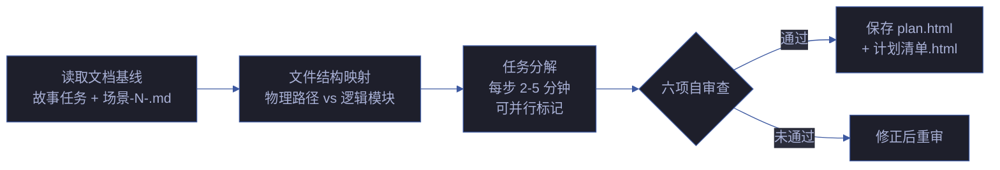

# rui-plan

> doc 阶段完成后，planner agent 读取故事文档基线，生成实施计划。计划是 doc 和 code 之间的桥梁——无计划不实现。
>
> `/rui plan <name>`（通过 rui 编排器调用）或 `/rui-plan <name>`
>
> **产出**：plan.html（故事级计划总览）· 计划清单.html（每场景任务清单）
>
> 详见 [plan-execution.md](./rules/plan-execution.md) · [planner.md](./planner.md)。

## 计划管线

| 步骤 | 操作 | 输入 | 输出 |
|------|------|------|------|
| ① 读取基线 | 读取故事任务.md + 场景-N-<slug>.md | 故事目录路径 | 结构化故事上下文 |
| ② 文件映射 | 将 AC/FP 映射到物理文件路径 | 源码目录树 | 文件结构图 |
| ③ 任务分解 | 每步 2-5 分钟可执行粒度 | 文件映射 + AC | 任务清单 |
| ④ 自审查 | 六项检查（占位符/粒度/覆盖/依赖/可并行/可验证） | 任务清单 | 审查结果 |
| ⑤ 保存 | 写入 plan.html + 计划清单.html | 审查通过的任务清单 | HTML 文件 |

### 执行模式

| 条件 | 模式 | 说明 |
|------|------|------|
| ≤ 5 个任务 | 内联 | 当前 agent 直接执行 |
| > 5 个任务 | 子 Agent 驱动 | 并行处理独立任务，逐任务提交 |

### 六项自审查

| # | 审查项 | 不通过信号 |
|---|--------|-----------|
| 1 | 无占位符 | TODO / TBD / 待定 |
| 2 | 粒度合适 | 单步 > 30min |
| 3 | 覆盖完整 | AC 无对应任务 |
| 4 | 依赖清晰 | 循环依赖 |
| 5 | 可并行标记 | 可并行但串行排 |
| 6 | 可验证 | 无可观测产出 |

## 核心规则

| # | 规则 |
|---|------|
| 1 | 无计划不进 code — plan.html 缺失时 `/rui code` 阻断 |
| 2 | plan.html 不含占位符 — TODO/TBD 标记为 `plan-placeholder` 阻断 |
| 3 | 计划清单项与场景 FP# —— 对应 — 缺失项阻断 |
| 4 | 计划必须可并行标记 — 无标记的并行任务串行执行 |

## 参数

| 参数 | 必需 | 说明 |
|------|------|------|
| `<name>` | 是 | 故事名（kebab-case） |
| `--force` | 否 | 覆盖已有 plan.html |

## 降级策略

| 情况 | 降级行为 |
|------|---------|
| 故事目录不存在 | 提示目录不存在，终止 |
| 文档基线不完整（缺少 §0/§1） | 提示先完成 doc 阶段 |
| 六项自审查未通过 | 标注未通过项，修正后重审 |
| 无 planner agent 可用 | pm 代为执行，标注 `pm-fallback` |

## 自循环

> 计划新鲜度检查。Agent 可按间隔检测计划是否过期。

| 属性 | 值 |
|------|-----|
| 推荐间隔 | `0 8 * * 1-5`（工作日早 8 点） |
| 触发条件 | 故事文档已更新但 plan.html 未重新生成 |
| 终止条件 | 所有活跃故事的 plan.html 均为最新 |
| 迭代动作 | 扫描活跃故事 → 对比文档 mtime vs plan.html mtime → 列出过期计划 |
| 收敛判定 | 无过期计划 |

## 生效标志

| 标志 | 验证方式 |
|------|---------|
| plan.html 生成且无占位符 | grep TODO/TBD/待定 |
| 计划清单每项有估计时间 | 清单项无 `⏱️` 标记视为不完整 |
| 六项自审查全部通过 | 审查清单全 ✅ |

## 与 rui 的关系

`/rui plan` 由 rui 编排器在 `/rui code` 前自动触发。用户也可独立调用 `/rui-plan <name>` 预览计划。
