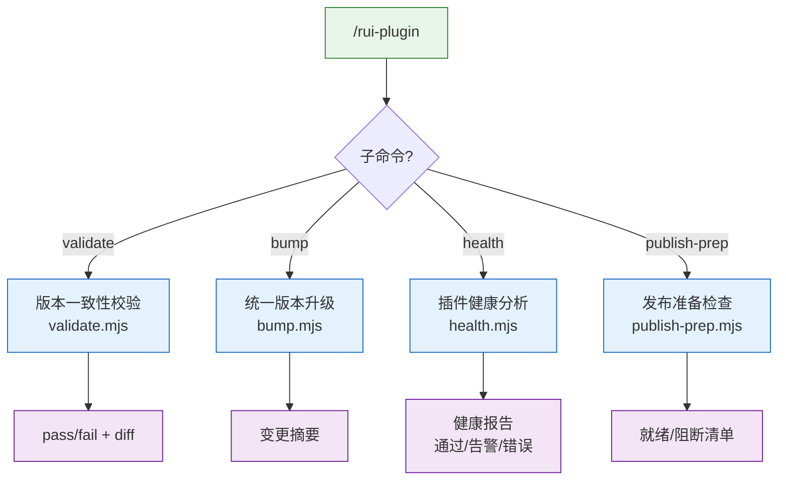
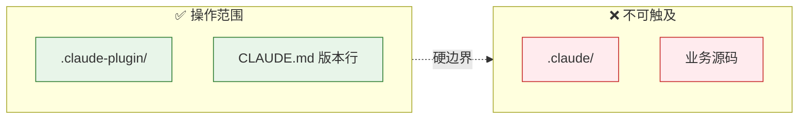
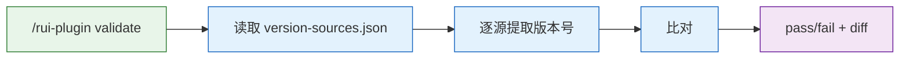
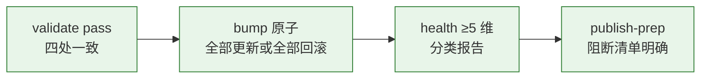

# rui-plugin

> `.claude-plugin/` 目录的生命周期管理命令族。与 `/rui-claude`（管理 `.claude/`）互补，构成完整插件管理拼图。

作用范围：`.claude-plugin/` 目录 + CLAUDE.md 版本声明。不触达 `.claude/`。

## 命令族全景

| 命令 | 流程 | 产出 |
|------|------|------|
| `validate` | 读取 version-sources.json → 逐项提取版本 → 比对 | pass/fail + 每处版本号 |
| `bump <ver>` | 校验格式 → 前置检查 → 原子更新四处 | 变更摘要 |
| `health` | 加载 checker 集 → 逐项执行 → 分类汇总 | 健康报告 |
| `publish-prep` | 串联 validate + checker 集 → 输出清单 | 就绪/阻断清单 |

## 操作边界

## validate — 版本一致性校验

| 项目 | 说明 |
|------|------|
| 数据源 | `version-sources.json` 定义的 4 处版本声明 |
| 行为 | 只读，不修改任何文件 |
| 退出码 | 0 = 一致，1 = 不一致或读取失败 |

## bump — 统一版本升级

| 项目 | 说明 |
|------|------|
| 前置条件 | 工作区干净（无未提交变更）；目标版本号符合 semver |
| 行为 | 原子更新 version-sources.json 定义的所有位置 |
| 回滚 | 任一写入失败 → 回滚已更新文件 |
| 退出码 | 0 = 成功，1 = 格式非法，2 = dirty state，3 = 写入失败 |

## health — 插件健康分析

检查维度：
1. plugin.json 必填字段完整性（name, description, version, author.name, repository, keywords, license）
2. marketplace.json 存在性与一致性（metadata.version === plugins[0].version）
3. 版本一致性（委托 validate）
4. 必需目录存在（skills/, agents/, rules/）
5. marketplace.json plugins[].path 指向有效目录

## publish-prep — 发布准备检查

串联 validate + 健康检查 + 必需文档检查（README.md, CLAUDE.md），输出就绪或阻断清单。

## 核心规则

| # | 规则 | 违反标识 |
|---|------|---------|
| 1 | 操作范围仅限 `.claude-plugin/` + CLAUDE.md 版本行 | — |
| 2 | validate 只读不写 | — |
| 3 | bump 原子化 — 全部更新或全部回滚 | — |
| 4 | 版本号格式严格 semver（`/^\d+\.\d+\.\d+$/`） | — |
| 5 | 密钥不落盘 — 脚本不含 token | — |

## 生效标志

| 标志 | 未达标的处置 |
|------|------------|
| validate 返回 pass | 检查不一致位置，执行 bump 修复 |
| bump 后 validate 仍 pass | 检查 bump 日志排查遗漏 |
| health 报告覆盖 ≥ 5 维 | 补充缺失检查维度 |
