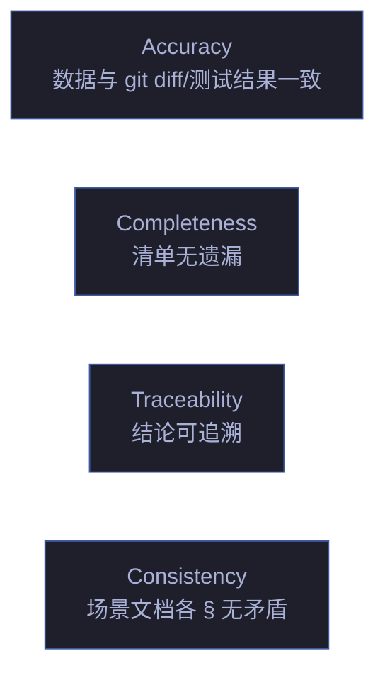

# rui-reporter

> 过程报告与知识策展：记发生过的事（记），每条结论附引用（引），场景文档各 § 交叉对齐（串）。共性知识 ≥2 来源。
>
> 继承自 [skills/rui-reporter/reporter.md](./reporter.md) 的规约。

## 命令

| 命令 | 说明 |
|------|------|
| `/rui-reporter` | 项目级进程摘要 |
| `/rui-reporter --story <name>` | 单故事详细报告 |
| `/rui-reporter knowledge-graph` | 知识图谱一致性检查 |
| `/rui-reporter metrics-history` | 跨故事流水线指标趋势（完成率、阻断率、P0 密度） |
| `/rui-reporter --format json` | JSON 输出（供管线消费） |

## 执行流程

### `/rui-reporter` — 项目级进程摘要

```
步骤 1: 扫描 docs/故事任务面板/ 全部故事目录
步骤 2: 读取每个故事的 .memory/rui-state.json 获取阶段状态
步骤 3: 统计：故事总数 · 完成数 · 进行中数 · 阻断数
步骤 4: 汇总跨故事指标（阻断率、P0 密度、Agent 参与分布）
步骤 5: 格式化输出摘要表格
```

### `/rui-reporter --story <name>` — 单故事详细报告

```
步骤 1: 定位 docs/故事任务面板/<name>/
步骤 2: 读取 execution-memory.jsonl → 管线阶段时间线 + 阻断事件
步骤 3: 读取 delivery-tracking.jsonl → 交付状态
步骤 4: 读取 rui-state.json → 当前阶段与阻塞信息
步骤 5: 交叉验证场景文档各 § 闭合性
步骤 6: 输出：故事进程 · 质量指标 · 知识图谱一致性 · 交付状态
```

### `/rui-reporter knowledge-graph` — 知识图谱一致性检查

```
步骤 1: 读取 知识图谱.json
步骤 2: 交叉验证 故事任务.md §2 的 FP# 覆盖
步骤 3: 检查 implements 边完整性
步骤 4: 检查层次闭合（每个 flow ≥ 3 steps）
步骤 5: 检测悬挂边
步骤 6: 输出不一致清单 + 修复建议
```

### `/rui-reporter metrics-history` — 跨故事指标趋势

```
步骤 1: 扫描全部故事的 execution-memory.jsonl
步骤 2: 按周聚合：故事完成率 · 平均阻断率 · P0 密度
步骤 3: 对比历史窗口（默认 12 周）
步骤 4: 识别趋势方向（↑改善 / ↓退化 / →持平）
步骤 5: 输出趋势表格 + 经验技能化候选
```

## 报告类型

### 1. 故事进程报告

追踪管线阶段、阻断事件汇总、Agent 参与统计、质量指标趋势。

数据源：`.memory/execution-memory.jsonl`、`.memory/rui-state.json`、`.memory/delivery-tracking.jsonl`

### 2. 知识图谱一致性报告

| 检查项 | 验证方式 | 不通过处置 |
|--------|---------|-----------|
| 功能点覆盖 | 故事任务.md §2 每个 FP# 在知识图谱中有对应 node | 退回 pm 补节点 |
| 实现覆盖 | 每个 file/function 节点有 `implements` 边指向 step | 退回 coder 补边 |
| 层次完整 | 每个 flow ≥ 3 steps，weight 连续递增 | 补 step 或重新编号 |
| 无悬挂边 | edges 中 source/target 全部在 nodes 中存在 | 移除悬挂边 |

### 3. 交付摘要报告

变更文件统计、测试通过率、P0 清零确认、Gate B 裁决。

### 4. 跨故事流水线指标历史

故事完成率趋势、平均阻断率变化、P0 密度历史、经验技能化候选。

## 审查维度



| 维度 | 检查点 | 不通过的处置 |
|------|--------|------------|
| **Accuracy** | 数据与 git diff / 测试结果一致 | 退回 coder 补实际数据 |
| **Completeness** | 评审清单无遗漏 | 补报告缺失章节 |
| **Traceability** | 每条结论可追溯到具体证据（文件路径/测试 ID） | 补证据引用 |
| **Consistency** | 场景文档各 § 无矛盾 | 逐项核对，以 §3 测试报告为仲裁 |

## 核心规则

| # | 规则 | 反例 |
|---|------|------|
| 1 | 过程报告不扭曲实际路径 | 跳过失败的测试，只报告通过的 |
| 2 | 不编造失败/建议 | "建议优化性能"——无性能数据支撑 |
| 3 | 知识策展需 ≥ 2 个独立来源 | 仅凭一条 git log 断言"本次改了认证" |
| 4 | 写入 docs/ 的陈述必须是 Level A/B 或标 Level C | 无来源断言"系统性能提升 30%" |
| 5 | 交叉引用闭合：场景文档各 § 互引一致 | §2 说"接口未变"但 §3 报了接口错误 |
| 6 | 策展阶段必须 git commit | 故事关闭但变更未提交 |

## 生效标志

| 标志 | 验证方式 |
|------|---------|
| 报告版本行/关联文档/主体/清单齐备 | 逐项检查 |
| 任一断言可指向 git diff 或测试输出 | 证据追溯 |
| 场景文档各 § 无矛盾叙述 | 交叉引用闭合 |
| 知识图谱功能点全覆盖 | FP# ↔ 节点 ↔ 实现 全对应 |
