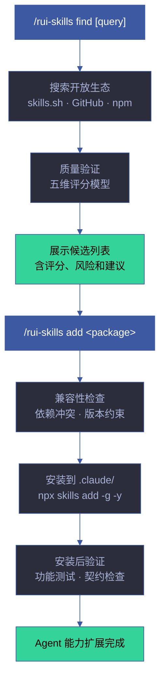
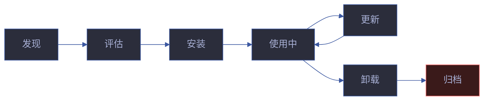

# rui-skills

> Agent 技能生态发现：搜索开放生态中的 Agent 技能包，验证质量，协助安装。
>
> 本技能从 [rui-trends](../rui-trends/SKILL.md) 提取，原 `find-skills` 子命令与「技术趋势发现」职责正交。
>
> **单一职责**：技能包发现、评估与生命周期管理。不负责技术趋势分析（那是 [rui-trends](../rui-trends/) 的职责），不负责技能内容开发（那是各技能自身 SKILL.md 的职责）。

[命令](#命令) · [工作流](#工作流) · [质量验证模型](#质量验证模型) · [技能生命周期](#技能生命周期) · [核心规则](#核心规则) · [降级策略](#降级策略) · [生效标志](#生效标志) · [决策流](#决策流) · [边界场景](#边界场景) · [自循环](#自循环)

## 全景



## 命令

| 输入 | 行为 | 场景 |
|------|------|------|
| `/rui-skills` | 展示已安装技能列表 + 推荐热门技能 | 查看当前技能生态 |
| `/rui-skills find [query]` | 搜索开放生态中的 Agent 技能 | 发现可安装的技能扩展 |
| `/rui-skills add <package>` | 安装指定的技能包 | 扩展 Agent 能力 |
| `/rui-skills remove <package>` | 卸载已安装的技能包 | 清理不再需要的技能 |
| `/rui-skills update` | 检查并更新已安装技能 | 保持技能版本最新 |
| `/rui-skills info <package>` | 查看技能包详细信息 | 评估安装前了解 |
| `/rui-skills --help` | 显示完整帮助 | — |

## 工作流

### find — 技能发现

> 搜索开放 Agent 技能生态，发现可安装的技能包。适用场景：用户询问"有没有 X 技能"、希望扩展 Agent 能力。

```
步骤 1: 理解需求 — 识别领域（前端/后端/DevOps/数据/AI）、任务类型（生成/检查/部署/监控）
步骤 2: 查阅 https://skills.sh/ 确认知名技能
步骤 3: 运行 npx skills find <query> 搜索（无匹配则告知用户）
步骤 4: 质量验证 — 五维评分模型评估（见下方）
步骤 5: 呈现选项 — 表格含技能名称、功能、评分、安装量、来源、风险提示
步骤 6: 协助安装 — npx skills add <owner/repo@skill> -g -y
```

**关键命令**：

| 命令 | 用途 |
|------|------|
| `npx skills find [query]` | 交互式或关键词搜索 |
| `npx skills add <package>` | 从 GitHub 或其他源安装 |
| `npx skills check` | 检查技能更新 |
| `npx skills update` | 更新所有已安装技能 |
| `npx skills list` | 列出已安装技能 |

**搜索技巧**：

| 技巧 | 示例 |
|------|------|
| 使用具体关键词 | "react testing" 优于 "testing" |
| 尝试替代术语 | "deploy" → "deployment" / "ci-cd" |
| 关注热门来源 | `vercel-labs/agent-skills`、`ComposioHQ/awesome-claude-skills` |
| 按领域过滤 | "frontend"、"backend"、"devops"、"data" |

**未找到时**：明确告知 → 提供直接协助 → 建议 `npx skills init` 自建技能。

### add — 技能安装

```
步骤 1: 验证包名格式 — owner/repo@skill 或 package-name
步骤 2: 兼容性检查 — 依赖冲突检测、版本约束验证
步骤 3: npx skills add <package> -g -y
步骤 4: 安装后验证 — npx skills list 确认 + 功能冒烟测试
步骤 5: 输出安装确认和使用说明
```

### remove — 技能卸载

```
步骤 1: 确认技能已安装（npx skills list）
步骤 2: 检查依赖关系 — 是否有其他技能依赖此技能
步骤 3: npx skills remove <package>
步骤 4: 清理残留配置
```

### update — 技能更新

```
步骤 1: npx skills check — 检查所有已安装技能的更新
步骤 2: 逐技能审查变更日志（CHANGELOG/Release Notes）
步骤 3: 评估破坏性变更风险 — 检查 API 兼容性
步骤 4: npx skills update — 批量更新
步骤 5: 更新后冒烟测试 — 验证核心功能正常
```

### info — 技能详情

```
步骤 1: 确定技能包名（owner/repo 或 package-name）
步骤 2: 获取元数据 — GitHub API（stars/issues/license） + npm registry（版本/依赖/下载量）
步骤 3: 五维评分评估
步骤 4: 输出结构化详情：描述 · 版本 · 许可证 · 依赖 · 评分 · 风险 · 安装命令
```

## 质量验证模型

### 五维评分体系

| 维度 | 权重 | 评估标准 | 数据来源 |
|------|:---:|---------|---------|
| **来源信誉** | 30% | GitHub stars ≥ 1000 (满分) / ≥ 100 (及格) / < 100 (警告) | GitHub API |
| **社区活跃度** | 25% | 安装量 ≥ 10K (满分) / ≥ 1K (及格) / < 1K (警告) | npm/skills.sh |
| **维护健康度** | 20% | 最近更新 ≤ 30 天 (满分) / ≤ 90 天 (及格) / > 180 天 (警告) | GitHub API |
| **依赖安全性** | 15% | 无已知 CVE (满分) / 低危 CVE (及格) / 中高危 CVE (拒绝) | npm audit |
| **兼容性** | 10% | 与现有技能无冲突 (满分) / 有可选冲突 (警告) / 有强制冲突 (拒绝) | 本地检查 |

### 评分等级

| 等级 | 分数 | 建议 |
|------|:---:|------|
| **A** | ≥ 80 | 推荐安装，无需警告 |
| **B** | ≥ 60 | 可以安装，标注注意事项 |
| **C** | ≥ 40 | 谨慎安装，明确告知风险 |
| **D** | < 40 | 强烈不建议安装，需用户明确确认 |

### 风险标注

| 风险类型 | 标识 | 示例 |
|---------|------|------|
| 低信誉 | ⚠️ Low Reputation | GitHub stars < 100 |
| 长期未维护 | ⚠️ Unmaintained | 最近更新 > 180 天 |
| 安全漏洞 | 🚫 CVE Found | 存在中高危 CVE |
| 依赖冲突 | ⚠️ Dep Conflict | 与已安装技能共享依赖版本冲突 |

## 技能生命周期



| 阶段 | 操作 | 检查点 |
|------|------|--------|
| 发现 | `/rui-skills find` | 搜索覆盖度、结果相关性 |
| 评估 | 五维评分 + 风险标注 | 评分 ≥ 60、无阻断风险 |
| 安装 | `/rui-skills add` | 兼容性检查、安装成功 |
| 使用中 | 日常调用 | 功能正常、无性能退化 |
| 更新 | `/rui-skills update` | 变更日志审查、回归测试 |
| 卸载 | `/rui-skills remove` | 依赖检查、残留清理 |

## 核心规则

| # | 规则 | 设计理由 |
|---|------|---------|
| 1 | 安装前验证来源信誉（GitHub stars ≥ 100，安装量 ≥ 1K） | 防止恶意或低质量技能包 |
| 2 | 低信誉来源需明确警告用户，标注具体风险 | 知情决策，用户承担风险 |
| 3 | 安全漏洞（中高危 CVE）为阻断条件，拒绝安装 | 供应链安全不可妥协 |
| 4 | 安装失败时提供诊断信息和手动安装路径 | 不阻塞用户，提供替代方案 |
| 5 | 不自动安装未经用户确认的技能包 | 尊重用户自主权 |
| 6 | 安装后验证技能可用性（冒烟测试） | 确保安装质量 |
| 7 | 技能更新前审查变更日志 | 避免破坏性变更意外引入 |

## 与 rui 的关系

本技能是独立工具技能，不属于 rui 编排管线（init → doc → plan → code → update → yry）。用户按需手动调用，用于扩展 Agent 能力。


## 测试

> 技能发现的质量验证模型、五维评分、安装流程和生命周期管理的自动化验证。

### 运行测试

```bash
npx vitest run skills/rui-skills/tests/          # 全量运行
npx vitest skills/rui-skills/tests/              # 监听模式
npx vitest run --coverage skills/rui-skills/tests/  # 覆盖率报告
```

### 测试文件

| 文件 | 测试范围 | 类型 |
|------|---------|:---:|
| `tests/rui-skills.test.mjs` | 五维评分、质量验证、安装流程、生命周期 | 单元 |

### 测试策略

| 层级 | 范围 | 要求 |
|------|------|------|
| **评分模型测试** | 五维评分计算、权重分配、等级判定 | 已知输入 → 预期分数 |
| **质量验证测试** | 来源信誉、社区活跃度、维护健康度、依赖安全、兼容性 | 每维度独立测试 |
| **安装流程测试** | 兼容性检查、冒烟测试、安装后验证 | 成功/失败双路径 |
| **风险标注测试** | 低信誉、未维护、CVE、依赖冲突 | 每种风险类型有测试 |

### 覆盖要求

| 维度 | 最低阈值 | 目标 |
|------|:---:|:---:|
| 五维评分 | 100% | 每维度有独立评分测试 |
| 质量等级 | 100% | A/B/C/D 四级边界值 |
| 核心规则 | 100% | 7 条规则各有验证 |
| 边界场景 | 100% | 6 种边界场景各有测试 |

## 降级策略

| 情况 | 降级行为 | 恢复方式 |
|------|---------|---------|
| GitHub API 不可达 | 使用缓存评分，标注 `stale` | 联网后刷新 |
| npm registry 不可达 | 跳过安装量检查，仅用 GitHub 数据 | 联网后重试 |
| 技能安装失败 | 给出诊断和手动安装路径 | 手动安装或修复后重试 |
| 网络超时 | 使用本地缓存，标注 `offline` | 检查网络后重试 |
| 安全审计超时 | 标注 `audit-timeout`，建议手动审计 | 手动运行 npm audit |
## 规则

- [skill-quality.md](./rules/skill-quality.md) — Agent 技能生态发现的质量验证规则
## 生效标志

| 标志 | 验证方式 | 预期行为 |
|------|---------|---------|
| find 返回结构化结果 | 表格含技能名、功能、评分、安装量、来源 | 每项技能含五维评分 |
| 质量验证不绕过 | 低信誉来源有明确警告 | C/D 级技能标注风险 |
| add 安装后技能可用 | `npx skills list` 含新技能 | 冒烟测试通过 |
| remove 无残留 | `npx skills list` 不含已卸载技能 | 配置文件已清理 |
| update 无破坏 | 更新后已有功能正常 | 变更日志已审查 |

## 决策流

```
用户输入 /rui-skills [command]
  │
  ├─ 无参数 → 展示已安装技能列表 + 推荐热门技能
  │
  ├─ find [query] → 搜索开放生态
  │   ├─ 有结果 → 五维评分 → 展示候选列表
  │   └─ 无结果 → 建议 npx skills init 自建
  │
  ├─ add <package> → 安装技能
  │   ├─ 评分 ≥ 60 → 安装 + 冒烟测试
  │   ├─ 评分 40-59 → 警告风险 + 用户确认后安装
  │   ├─ 评分 < 40 → 强烈不建议 + 需明确确认
  │   └─ 有 CVE → 阻断安装
  │
  ├─ remove <package> → 卸载技能
  │   └─ 依赖检查 → 卸载 + 清理残留
  │
  └─ update → 检查更新 + 审查变更日志 → 更新
```

## 边界场景

| 场景 | 处置 |
|------|------|
| 搜索无结果 | 告知用户，建议替代关键词或 `npx skills init` 自建 |
| 安装失败 | 诊断原因 (网络/权限/冲突)，给出修复建议 |
| 技能已安装 | 提示已安装版本，询问是否更新 |
| 其他技能依赖此技能 | 警告依赖关系，阻止卸载 |
| 评分边界 (59/60) | 从严处理，标注为 C 级 |
| GitHub API 限流 | 使用缓存数据，标注 `stale` |

## 自循环

> 技能生态健康巡检。Agent 可按间隔检查已安装技能的更新和安全性。

| 属性 | 值 |
|------|-----|
| 推荐间隔 | `0 9 * * 1`（每周一早 9 点） |
| 触发条件 | 有已安装技能（`npx skills list` 非空） |
| 终止条件 | 所有技能为最新版本且无新 CVE |
| 迭代动作 | ① `npx skills check` → ② `npm audit` 已安装技能 → ③ 有更新时审查变更日志 → ④ 有 CVE 时告警 → ⑤ 生成更新建议 |
| 告警条件 | 技能落后 ≥ 1 major / 新增 CVE / 技能仓库归档或删除 |
| 收敛判定 | 无可用更新且无安全漏洞 |

> 本技能 `checkMode: "cli"`——由 dispatcher 按 `0 9 * * 1` 自动调度（`npx skills check`）。6 字段契约与调度规则详见 [rules/loop-engineering.md](../rui/rules/loop-engineering.md)。