# rui-story

> 故事任务面板管理：查 · 同步。数据源为远端 API，默认远端模式，不读本地文件系统。
>
> **--help / -h / help — 本地脚本，零网络请求**
>
> 用户输入含 `--help`、`-h` 或 `help` 时，**无条件执行以下操作**：
> 1. 运行 `node skills/rui-story/help.mjs`，将输出原样展示给用户
> 2. 立即停止，不得执行任何其他逻辑
> 3. 禁止：API 调用 · 网络请求 · 读取远端数据 · 管线处理 · 文件系统操作
>
> 哲学源自 [CLAUDE.md](../../CLAUDE.md)。本文件定义命令面与操作规约。

## 命令族全景

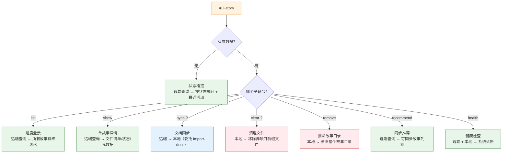

| 命令 | 类型 | 数据源 | 作用 |
|------|------|--------|------|
| `/rui-story` | 只读 | 远端 API | 状态概览：按状态统计 + 最近活动 |
| `/rui-story list` | 只读 | 远端 API | 进度全景：所有故事详细表格（状态/文件数/最后修改/分支） |
| `/rui-story show <name>` | 只读 | 远端 API | 单故事详情：文件清单/状态/元数据 |
| `/rui-story sync [<name>]` | 写入 | 远端 API | 从远端拉取文档到本地；未指定名称时展示推荐提示 |
| `/rui-story clear [<name>]` | 写入 | 本地文件系统 | 仅保留 `{project}-` 前缀文件，其余一律删除；未指定名称时扫描所有故事目录 |
| `/rui-story remove <name>` | 写入 | 本地文件系统 | 删除指定故事的整个本地目录；`<name>` 必填 |
| `/rui-story recommend` | 只读 | 远端 API | 列出远端可同步的故事及推荐 sync 命令 |
| `/rui-story health` | 只读 | 远端 API + 本地 | 系统健康检查：凭据、API 可达性、配置、数据完整性 |

`<name>` 为纯语义 kebab-case（如 `user-login`），不加项目名前缀。

## 数据源

> **默认且唯一模式：远端 API**。所有查询操作（概览/list/show）直接查询远端 API，不读本地文件系统。
> `sync` 命令涉及本地写入（从远端拉取到本地）；`clear` 和 `remove` 命令仅操作本地文件系统，不触碰远端。

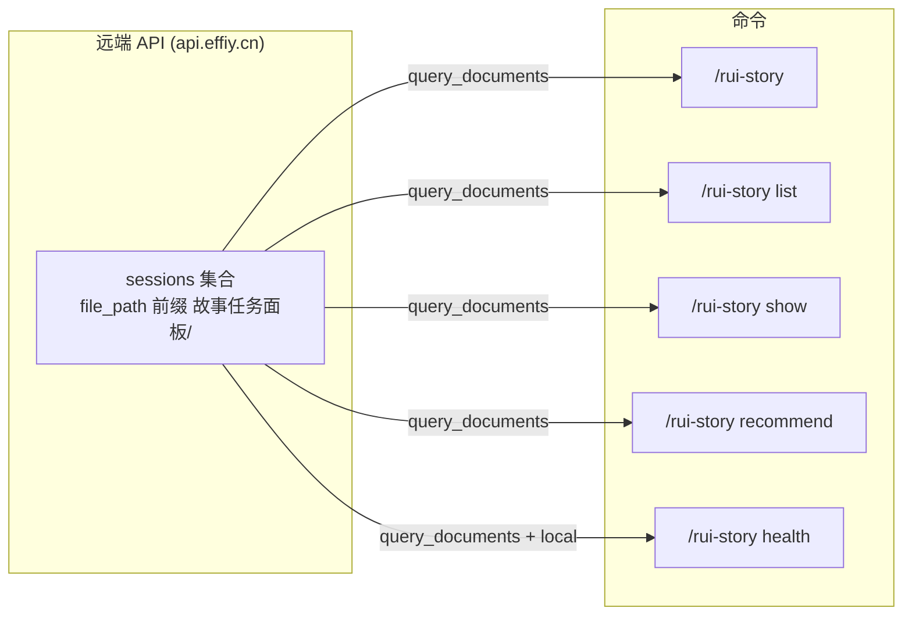

**API 调用方式**：
```
POST <apiUrl>/
{
  "module_name": "services.database.data_service",
  "method_name": "query_documents",
  "parameters": { "cname": "sessions", "limit": 10000 }
}
```

从响应的 `data.list` 中筛选 `file_path` 以 `故事任务面板/` 开头的记录。每条记录包含 `file_path`、`title`、`tags`、`createdAt`、`updatedAt` 等字段。

## 操作边界

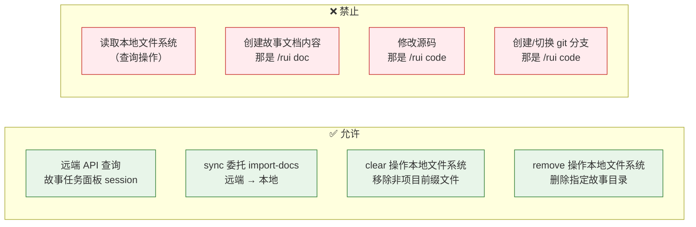

## 状态判定

> 按远端 sessions 的 `file_path` 存在性 + `.memory/rui-state.json`（仅 blocked 标记查本地）判定故事状态。

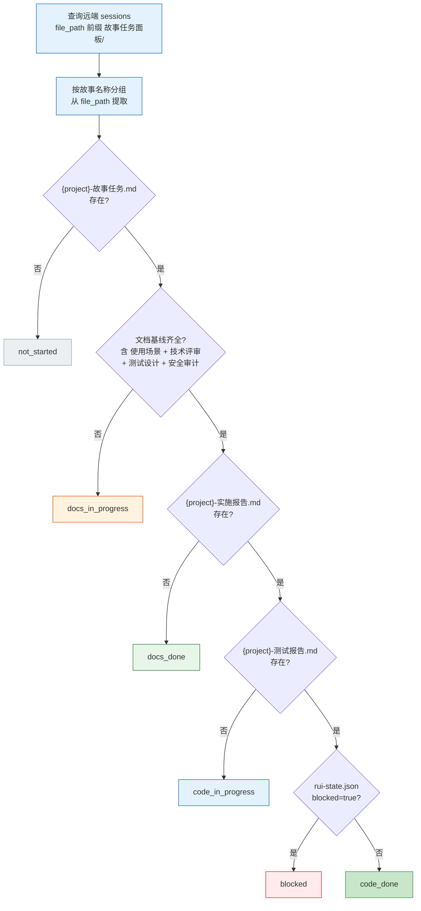

| 状态 | 条件 | 含义 |
|------|------|------|
| `not_started` | {project}-故事任务.md 不存在于远端 | 目录空或仅有元数据 |
| `docs_in_progress` | 故事任务存在于远端，文档基线不完整 | 文档生成进行中 |
| `docs_done` | 远端文档基线齐全，实施报告不存在 | 等待编码 |
| `code_in_progress` | 实施报告存在于远端，测试报告不存在 | 实现验证中 |
| `code_done` | 测试报告存在于远端，未阻断 | 可交付 |
| `blocked` | `.memory/rui-state.json` 含 `blocked=true`（本地例外） | 管线阻断 |

项目类型按远端文件推断：技术评审含后端章节(API/数据) = 含后端；技术评审含前端章节(组件/交互/样式) = 含前端；两者均有 = fullstack；均无或无法判定 = meta。

## `/rui-story` — 状态概览

> 无参数入口。查询远端 API，按状态聚合，输出摘要 + 最近活动。零本地文件系统读取。

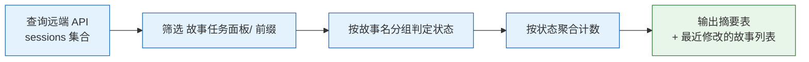

**输出**：

```
故事任务面板 · 状态概览
─────────────────────────────
  code_done        0
  code_in_progress  0
  docs_done         0
  docs_in_progress  0
  not_started       0
  blocked           0
─────────────────────────────
  合计             0 个故事

最近活动：无
```

## `/rui-story list` — 进度全景

> 查询远端 API 获取全部故事面板 session，输出详情表格。零本地文件系统读取。

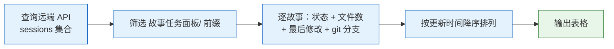

**输出列**：`Story | Status | Files | Last Modified | Type | Branch`

- **Files**：远端该故事下的 session 数量
- **Last Modified**：远端 sessions 中最晚 `updatedAt`
- **Type**：按远端文件推断（backend / frontend / fullstack / meta）
- **Branch**：`git branch --list "feat/<name>"` — 有则显示分支名，无则为 `—`

## `/rui-story show <name>` — 单故事详情

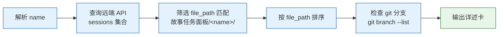

**输出结构**：

```
<name> · <status badge>

📂 远端路径: 故事任务面板/<name>/
📋 类型: <type>
📄 文件: <N> 个

  文件清单:
  YrY-故事任务.md         2026-05-17 10:30
  YrY-使用场景.md      2026-05-17 10:35
  ...

🔀 Git 分支: feat/<name>  (或 —)

📊 元数据:
  状态: <status>
  阻断原因: <block_reason 或 —>
```

## `/rui-story recommend` — 同步推荐

> 查询远端 API，列出所有可同步的故事及推荐命令。零本地文件系统读取。

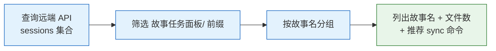

**输出**：

```
远端可同步故事

  rui-story       (34 个文件)
  aicr            (7 个文件)
  ...

推荐命令

  /rui-story sync rui-story
  /rui-story sync aicr
  ...
```

- 方向：仅查询远端，不写本地。用户根据推荐自行选择 sync 目标
- 实现：`node skills/rui-story/rui-story.mjs recommend`

## `/rui-story health` — 健康检查

> 系统诊断：检查凭据、API 可达性、项目配置、远端数据完整性。

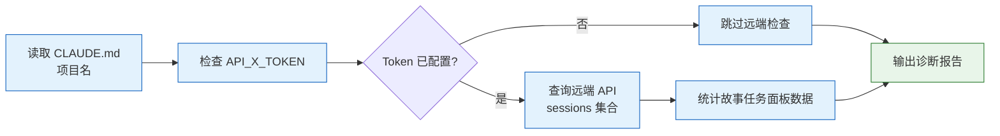

**检查维度**：

| 维度 | 检查项 | 数据源 |
|------|--------|--------|
| API 凭据 | API_X_TOKEN 是否配置 | 环境变量 |
| 远端可达性 | API 是否可达，sessions 总数 | 远端 API |
| 故事面板数据 | 故事任务面板 sessions 数量、故事数 | 远端 API |
| 项目配置 | CLAUDE.md 项目名解析、故事目录存在性 | 本地文件系统 |

**输出**：

```
rui-story 健康检查
══════════════════

── API 凭据
  ✅ API_X_TOKEN: 已配置

── 远端可达性
  ✅ API 可达 (effiy.cn): 查询到 158 个 sessions
  ✅ 故事任务面板 sessions: 96 个 (10 个故事)

── 项目配置
  ✅ CLAUDE.md: 项目名 = YrY
  ✅ 故事目录: docs/故事任务面板/ 存在

Summary: 5 pass, 0 warn, 0 error
```

- 实现：`node skills/rui-story/rui-story.mjs health`
- 非阻塞：任何检查失败不影响管线，仅报告状态

## `/rui-story sync [<name>]` — 从远端同步文档

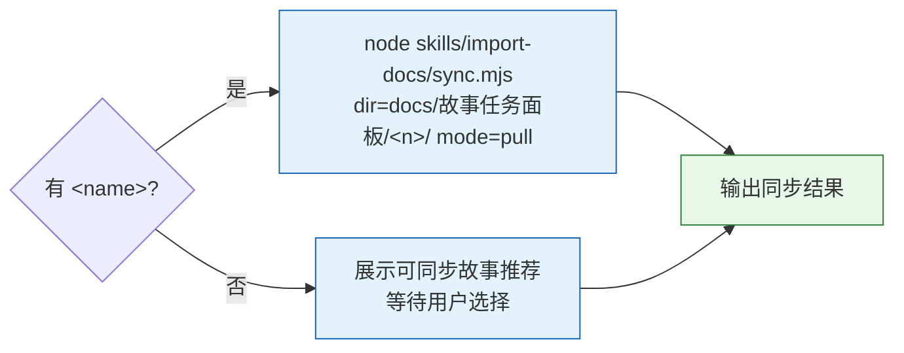

- 方向：从远端同步文档到本地，完全委托 import-docs（`mode=pull`），不自行实现同步逻辑
- 指定故事：`dir=docs/故事任务面板/<name>/ mode=pull` → 远端下载覆盖本地
- 未指定：展示可同步故事推荐提示，等待用户选择后再同步

## `/rui-story clear [<name>]` — 仅保留当前项目前缀文档

> **唯一保留规则：文件名以当前项目名前缀（如 `YrY-`）开头的文档。其余一律删除。**
>
> 项目名前缀从 `CLAUDE.md` 的 `项目名` 字段读取，不可硬编码、不可推测、不可通过其他途径覆盖。
> **破坏性操作，执行前需确认。**
>
> **数据边界：clear 仅操作本地文件系统（`docs/故事任务面板/`），不查询远端 API、不删除远端文档、不触发任何网络请求。远端数据不受 clear 任何影响。**

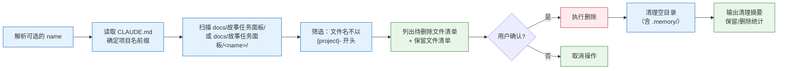

**执行流程**：

1. **确定项目前缀** — 读取 `CLAUDE.md` 中 `项目名` 字段（如 `YrY`），拼接 `-` 得到匹配前缀（如 `YrY-`）。此项为唯一保留依据，不可覆写
2. **确定范围（仅本地）** — 有 `<name>` 则扫描 `docs/故事任务面板/<name>/`；无则扫描 `docs/故事任务面板/` 下所有故事目录。**不发起网络请求，不查询远端 API，不触碰远端数据**
3. **筛选文件** — 所有文件名不以 `{project}-` 开头的一律标记为待删除。仅普通文件参与筛选，目录递归进入
4. **展示清单** — 同时列出待删除文件和保留文件两份清单（路径 + 大小），明确告知用户哪些会删、哪些会留
5. **等待确认** — 用户明确确认后才执行删除，不可跳过，不可默认 yes
6. **执行清理** — 逐个删除文件。文件清空后递归删除空目录（含 `.memory/`）。若目录在清理后仅含 `{project}-` 前缀文件则保留该目录及剩余文件
7. **输出摘要** — 已删除文件数 + 释放空间 + 保留文件数 + 删除的空目录数

**保留规则（唯一且不可协商）**：

| 条件 | 处置 | 说明 |
|------|------|------|
| 文件名以 `{project}-` 开头 | **保留** | 唯一放行条件，无例外 |
| 文件名不以 `{project}-` 开头 | **删除** | 无论内容、来源、时间戳、文件大小 |
| 目录（含 `.memory/`） | 文件清空后目录为空则**删除** | 仅含 `{project}-` 文件的目录保留 |
| 整个故事目录无 `{project}-` 文件 | 删除该故事目录 | `{project}-` 文件数为 0 则该目录无保留价值 |

> **项目名前缀是唯一的保留判断依据。** 不存在"重要文件除外"、"历史文件除外"、".memory 目录除外"等豁免路径。

**输出示例**：

```
🔍 扫描 docs/故事任务面板/rui-story/...
📋 项目名前缀: YrY-（来源: CLAUDE.md）

待删除文件 (8):
  YiAi-故事任务.md           (3.2K)
  YiAi-使用场景.md        (4.1K)
  YiAi-技术评审.md        (5.8K)
  YiAi-测试设计.md        (2.9K)
  YiAi-实施报告.md        (6.3K)
  YiAi-测试报告.md        (3.7K)
  YiAi-自改进复盘.md          (4.5K)
  YiAi-交互日志.md            (1.8K)

保留文件 (9):
  YrY-故事任务.md             (20.2K)
  YrY-使用场景.md          (16.5K)
  YrY-技术评审.md          (12.8K)
  YrY-测试设计.md          (10.9K)
  YrY-实施报告.md          (7.3K)
  YrY-测试报告.md          (4.7K)
  YrY-自改进复盘.md            (7.7K)
  YrY-交互日志.md              (5.7K)
  YrY-消息通知列表.md          (1.2K)

⚠️  即将删除 8 个文件，释放约 32K。确认？(y/n)

✅ 已删除 8 个文件，释放 32K。
📂 保留 9 个文件 (YrY-*)，0 个空目录已清理
```

## `/rui-story remove <name>` — 删除故事本地目录

> **仅操作本地文件系统。`<name>` 必填。**
>
> 删除 `docs/故事任务面板/<name>/` 整个目录及其所有内容。不查询远端 API、不删除远端文档、不触发任何网络请求。
> **破坏性操作，执行前需确认。远端数据不受 remove 任何影响。**

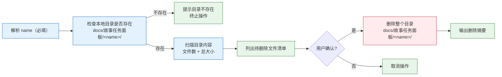

**执行流程**：

1. **解析 name（必填）** — `<name>` 为纯语义 kebab-case，不加项目名前缀。无 name 时提示用法后终止
2. **检查本地目录** — 确认 `docs/故事任务面板/<name>/` 存在。不存在则提示并终止，**不查询远端**
3. **扫描内容** — 统计目录内文件数、总大小，列出所有文件清单
4. **展示清单** — 列出待删除的全部文件（路径 + 大小）+ 目录本身
5. **等待确认** — 用户明确确认后才执行删除，不可跳过，不可默认 yes
6. **执行删除** — `rm -rf docs/故事任务面板/<name>/`，删除整个目录及所有内容（含 `.memory/`）
7. **输出摘要** — 已删除文件数、释放空间、删除的目录路径

**与 clear 的区别**：

| 维度 | `clear` | `remove` |
|------|---------|----------|
| 操作对象 | 目录内非 `{project}-` 前缀文件 | 整个故事目录 |
| name 参数 | 可选 | **必填** |
| 保留规则 | 保留 `{project}-` 前缀文件 | 不保留任何文件 |
| 结果 | 目录可能保留（含 `{project}-` 文件） | 目录完全删除 |
| 用例 | 清理混入的其他项目文件 | 彻底清除某故事的本地副本 |

> **数据边界：remove 仅操作本地文件系统。不查询远端 API、不删除远端文档、不同步任何变更到远端。远端该故事的文档完全不受影响，后续可通过 `sync` 重新拉取。**

**输出示例**：

```
🔍 检查 docs/故事任务面板/rui-story/...

待删除目录:
  docs/故事任务面板/rui-story/

目录内容 (9 个文件，约 87K):
  YrY-故事任务.md             (20.2K)
  YrY-使用场景.md          (16.5K)
  YrY-技术评审.md          (12.8K)
  YrY-测试设计.md          (10.9K)
  YrY-实施报告.md          (7.3K)
  YrY-测试报告.md          (4.7K)
  YrY-自改进复盘.md            (7.7K)
  YrY-交互日志.md              (5.7K)
  YrY-消息通知列表.md          (1.2K)

⚠️  即将删除整个目录及 9 个文件，释放约 87K。此操作不可撤销。确认？(y/n)

✅ 已删除 docs/故事任务面板/rui-story/，释放 87K。
💡 远端文档不受影响，可通过 /rui-story sync rui-story 重新拉取。
```

## 核心规则

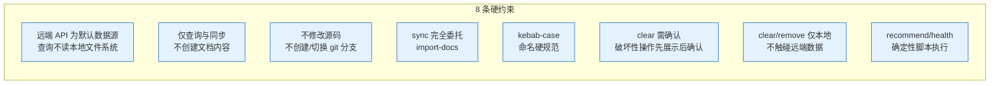

| # | 规则 | 违反处置 |
|---|------|---------|
| 1 | 所有查询操作使用远端 API，不读本地文件系统（sync 写入除外） | 修正为远端查询 |
| 2 | 仅查询故事面板状态和同步文档，不创建故事文档内容（那是 `/rui doc`） | 撤销误创建的文件 |
| 3 | 不修改源码，不创建/切换 git 分支（那是 `/rui code`） | — |
| 4 | sync 完全委托 import-docs，不自行实现同步 | 修正命令重试 |
| 5 | `<name>` = kebab-case | 拒绝执行 |
| 6 | clear 仅操作本地文件系统，不触碰远端；仅保留 `{project}-` 前缀文件；先展示双重清单，用户确认后才执行 | 终止操作 |
| 7 | remove 仅操作本地文件系统，不触碰远端；`<name>` 必填；先展示清单，用户确认后才执行删除 | 终止操作 |
| 8 | recommend/health 由 rui-story.mjs 确定性执行，不依赖 agent 解读 SKILL.md 流程 | 修正为脚本执行 |

## 生效标志

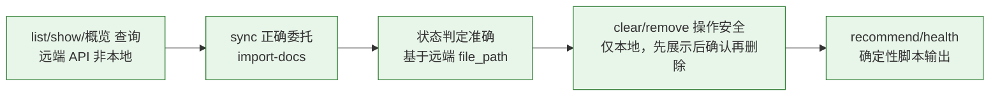

| 标志 | 未达标的处置 |
|------|------------|
| list/show/概览查询远端 API，非本地文件系统 | 修正为远端查询 |
| sync 正确委托 import-docs | 修正命令参数重试 |
| 状态判定基于远端 file_path 准确 | 修正判定逻辑 |
| clear 从 CLAUDE.md 读取项目名前缀，展示双重清单，确认后执行，仅 `{project}-` 文件幸存 | 修正为展示后确认 |
| remove 仅操作本地，name 必填，展示清单后确认再删除，远端数据零影响 | 修正为展示后确认 |
| recommend/health 由 rui-story.mjs 确定性输出，不依赖 agent 手动执行 SKILL.md 流程 | 修正为脚本执行 |

## 与 rui 的关系

> rui-story 从 rui 接管了 `list` 命令。其余所有管线阶段（doc / code / update）仍由 rui 编排。

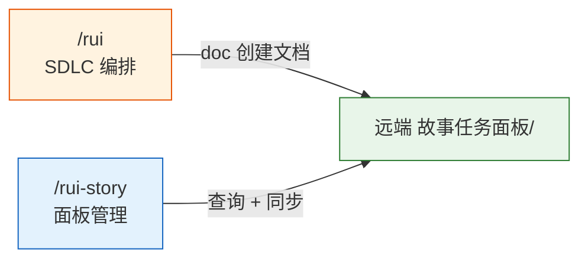
