# rui-story

> 故事任务面板管理：查 · 同步。数据源为远端 API，默认远端模式，不读本地文件系统。
>
> **--help / -h**：执行 `node skills/rui-story/help.mjs` 输出完整帮助（含命令表 + 场景示例）。用户输入 `/rui-story --help` 或 `/rui-story -h` 或 `/rui-story help` 时，跳过管线逻辑，直接运行脚本。
>
> 哲学源自 [CLAUDE.md](../../CLAUDE.md)。本文件定义命令面与操作规约。

[命令族全景](#命令族全景) · [数据源](#数据源) · [操作边界](#操作边界) · [状态判定](#状态判定) · [/rui-story](#rui-story) · [/rui-story list](#rui-story-list) · [/rui-story health](#rui-story-health) · [/rui-story sync](#rui-story-sync) · [/rui-story remove](#rui-story-remove) · [/rui-story &lt;需求&gt;](#rui-story-需求) · [核心规则](#核心规则) · [生效标志](#生效标志) · [与 rui 的关系](#与-rui-的关系)

## 命令族全景

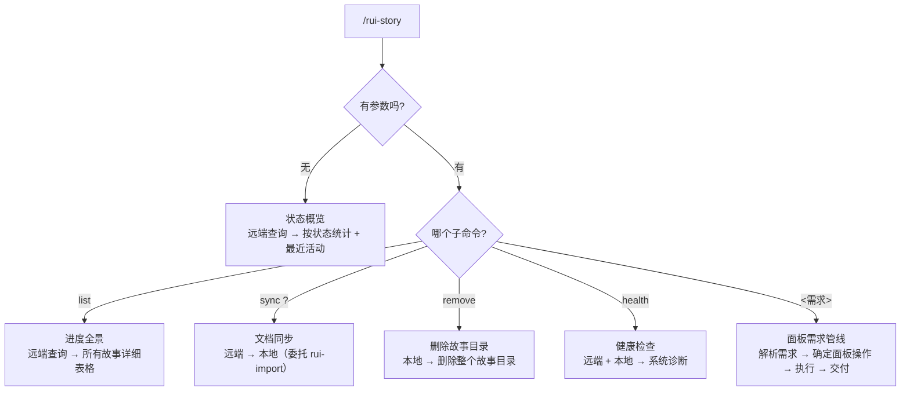

| 命令 | 类型 | 数据源 | 作用 |
|------|------|--------|------|
| `/rui-story` | 只读 | 远端 API | 状态概览：按状态统计 + 最近活动 |
| `/rui-story list` | 只读 | 远端 API | 进度全景：所有故事详细表格（状态/文件数/最后修改/分支） |
| `/rui-story sync [<name>]` | 写入 | 远端 API | 从远端拉取文档到本地；未指定名称时展示推荐提示 |
| `/rui-story remove <name>` | 写入 | 本地文件系统 | 删除指定故事的整个本地目录；`<name>` 必填 |
| `/rui-story health` | 只读 | 远端 API + 本地 | 系统健康检查：凭据、API 可达性、配置、数据完整性 |
| `/rui-story <需求>` | 写入 | 远端 API + 本地 | 面板需求管线：解析需求 → 确定面板操作 → 执行 → 交付，仅限故事面板管理操作 |

`<name>` 为纯语义 kebab-case（如 `user-login`），不加项目名前缀。

## 数据源

> **默认且唯一模式：远端 API**。所有查询操作（概览/list）直接查询远端 API，不读本地文件系统。
> `sync` 命令涉及本地写入（从远端拉取到本地）；`remove` 命令仅操作本地文件系统，不触碰远端。

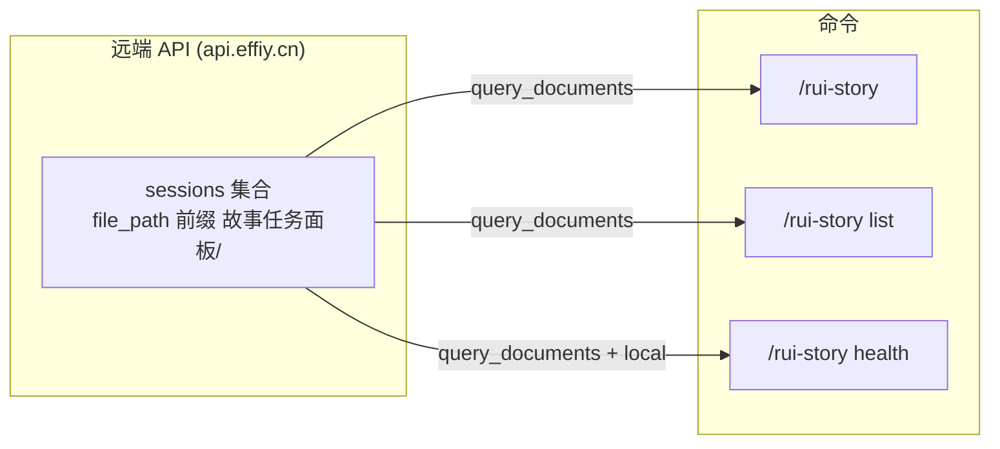

**API 调用方式**：
```
POST <apiUrl>/
{
  "module_name": "services.database.data_service",
  "method_name": "query_documents",
  "parameters": { "cname": "sessions", "limit": 10000 }
}
```

从响应的 `data.list` 中筛选 `file_path` 以 `故事任务面板/` 开头的记录。每条记录包含 `file_path`、`title`、`tags`、`createdAt`、`updatedAt` 等字段。

## 操作边界

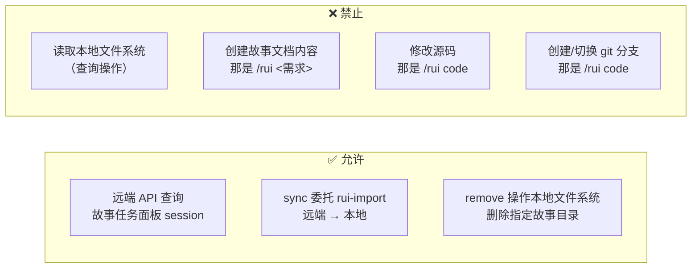

## 状态判定

> 按远端 sessions 的 `file_path` 存在性判定故事状态。

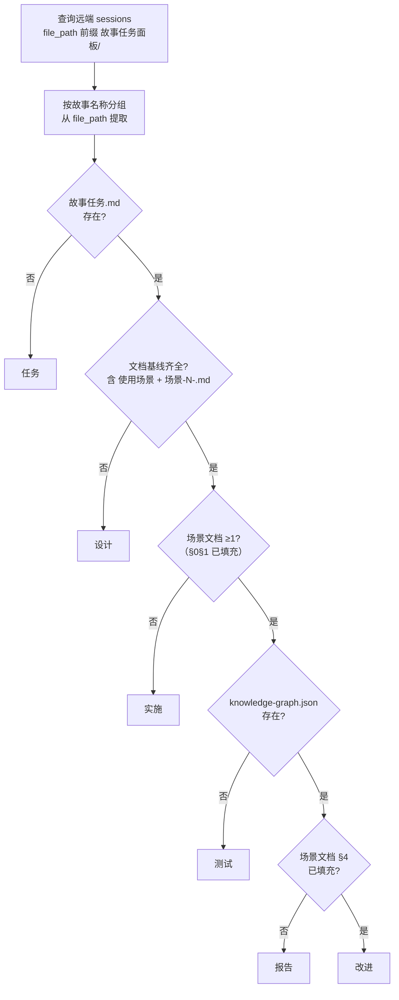

| 状态 | 条件 | 含义 |
|------|------|------|
| `任务` | 故事任务.md 不存在于远端 | 目录空或仅有元数据 |
| `设计` | 故事任务存在于远端，文档基线不完整 | 文档生成进行中 |
| `实施` | 双基线齐全，场景文档缺失 | 等待编码 |
| `测试` | 场景文档存在于远端，代码映射不存在 | 实现验证中 |
| `报告` | 代码映射存在于远端，§4 未填充 | 可交付 |
| `改进` | 场景文档 §4 已填充 | 持续改进中 |

项目类型按远端文件推断：场景文档 §0 含后端章节(API/数据) = 含后端；场景文档 §0 含前端章节(组件/交互/样式) = 含前端；两者均有 = fullstack；均无或无法判定 = meta。

## `/rui-story` — 状态概览

> 无参数入口。查询远端 API，按状态聚合，输出摘要 + 最近活动。零本地文件系统读取。

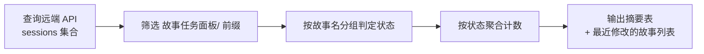

**输出**：

```
故事任务面板 · 状态概览
─────────────────────────────
  改进        0
  报告        0
  测试        0
  实施        0
  设计        0
  任务        0
─────────────────────────────
  合计             0 个故事

最近活动：无
```

## `/rui-story list` — 进度全景

> 查询远端 API 获取全部故事面板 session，输出详情表格。零本地文件系统读取。

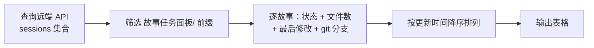

**输出列**：`Story | Status | Files | Last Modified | Type | Branch`

- **Files**：远端该故事下的 session 数量
- **Last Modified**：远端 sessions 中最晚 `updatedAt`
- **Type**：按远端文件推断（backend / frontend / fullstack / meta）
- **Branch**：`git branch --list "feat/<name>"` — 有则显示分支名，无则为 `—`

## `/rui-story health` — 健康检查

> 系统诊断：检查凭据、API 可达性、项目配置、远端数据完整性。

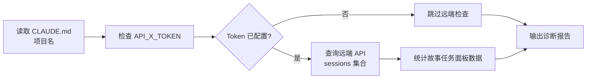

**检查维度**：

| 维度 | 检查项 | 数据源 |
|------|--------|--------|
| API 凭据 | API_X_TOKEN 是否配置 | 环境变量 |
| 远端可达性 | API 是否可达，sessions 总数 | 远端 API |
| 故事面板数据 | 故事任务面板 sessions 数量、故事数 | 远端 API |
| 项目配置 | CLAUDE.md 项目名解析、故事目录存在性 | 本地文件系统 |

**输出**：

```
rui-story 健康检查
══════════════════

── API 凭据
  ✅ API_X_TOKEN: 已配置

── 远端可达性
  ✅ API 可达 (effiy.cn): 查询到 158 个 sessions
  ✅ 故事任务面板 sessions: 96 个 (10 个故事)

── 项目配置
  ✅ CLAUDE.md: 项目名 = YrY
  ✅ 故事目录: docs/故事任务面板/ 存在

Summary: 5 pass, 0 warn, 0 error
```

- 实现：`node skills/rui-story/rui-story.mjs health`
- 非阻塞：任何检查失败不影响管线，仅报告状态

## `/rui-story sync [<name>]` — 从远端同步文档

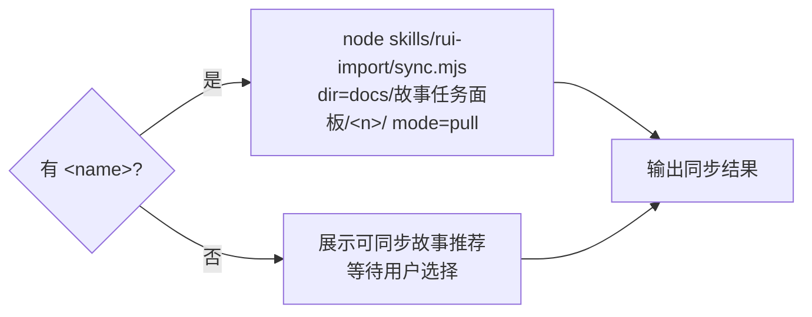

- 方向：从远端同步文档到本地，完全委托 rui-import（`mode=pull`），不自行实现同步逻辑
- 指定故事：`dir=docs/故事任务面板/<name>/ mode=pull` → 远端下载覆盖本地
- 未指定：展示可同步故事推荐提示，等待用户选择后再同步

## `/rui-story remove <name>` — 删除故事本地目录

> **仅操作本地文件系统。`<name>` 必填。**
>
> 删除 `docs/故事任务面板/<name>/` 整个目录及其所有内容。不查询远端 API、不删除远端文档、不触发任何网络请求。
> **破坏性操作，执行前需确认。远端数据不受 remove 任何影响。**

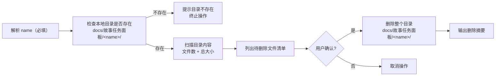

**执行流程**：

1. **解析 name（必填）** — `<name>` 为纯语义 kebab-case，不加项目名前缀。无 name 时提示用法后终止
2. **检查本地目录** — 确认 `docs/故事任务面板/<name>/` 存在。不存在则提示并终止，**不查询远端**
3. **扫描内容** — 统计目录内文件数、总大小，列出所有文件清单
4. **展示清单** — 列出待删除的全部文件（路径 + 大小）+ 目录本身
5. **等待确认** — 用户明确确认后才执行删除，不可跳过，不可默认 yes
6. **执行删除** — `rm -rf docs/故事任务面板/<name>/`，删除整个目录及所有内容
7. **输出摘要** — 已删除文件数、释放空间、删除的目录路径

**输出示例**：

```
🔍 检查 docs/故事任务面板/rui-story/...

待删除目录:
  docs/故事任务面板/rui-story/

目录内容 (4 个文件，约 58K):
  故事任务.md             (20.2K)
  场景-1-<slug>.md       (24.5K)
  knowledge-graph.json       (12.8K)

⚠️  即将删除整个目录及 3 个文件，释放约 58K。此操作不可撤销。确认？(y/n)

✅ 已删除 docs/故事任务面板/rui-story/，释放 87K。
💡 远端文档不受影响，可通过 /rui-story sync rui-story 重新拉取。
```

## `/rui-story <需求>` — 面板需求管线

> 故事面板管理需求入口。解析需求 → 确定面板操作 → 执行 → 交付。仅限故事面板管理操作（sync/remove/health/merge/split），不创建故事文档内容。

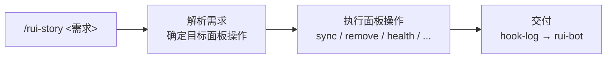

| 项目 | 说明 |
|------|------|
| 触发方式 | `/rui-story <需求>`，自然语言需求 |
| 操作范围 | 仅限故事面板管理：sync（远端→本地）、remove（删除本地目录）、health（健康检查）、merge（合并重复故事）、split（拆分过大故事） |
| 禁止 | 不创建故事文档内容（那是 `/rui <需求>`），不修改源码，不创建/切换 git 分支 |
| 交付 | 末端 hook-log → rui-bot 通知 |

## 核心规则

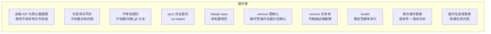

| # | 规则 | 违反处置 |
|---|------|---------|
| 1 | 所有查询操作使用远端 API，不读本地文件系统（sync 写入除外） | 修正为远端查询 |
| 2 | 仅查询故事面板状态和同步文档，不创建故事文档内容（那是 `/rui <需求>`） | 撤销误创建的文件 |
| 3 | 不修改源码，不创建/切换 git 分支（那是 `/rui code`） | — |
| 4 | sync 完全委托 rui-import，不自行实现同步 | 修正命令重试 |
| 5 | `<name>` = kebab-case | 拒绝执行 |
| 6 | remove 破坏性操作先展示清单后确认，不默认 yes | 补确认 |
| 7 | remove 仅操作本地文件系统，不触碰远端数据 | 撤销远端操作 |
| 8 | health 由 rui-story.mjs 确定性执行，不依赖 agent 解读 SKILL.md 流程 | 修正为脚本执行 |
| 9 | 每次 rui/rui-story 写入操作必须更新故事版本号，追加 version_history 记录 | 操作无效 |
| 10 | 每次 rui 操作（doc/code/update/yry）必须生成或更新对应故事的任务内容 | 操作不完整 |

## 生效标志

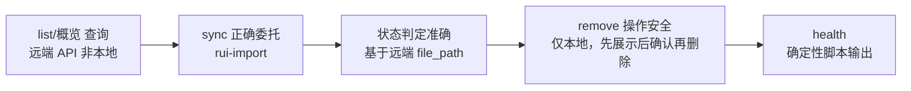

| 标志 | 未达标的处置 |
|------|------------|
| list/概览查询远端 API，非本地文件系统 | 修正为远端查询 |
| sync 正确委托 rui-import | 修正命令参数重试 |
| 状态判定基于远端 file_path 准确 | 修正判定逻辑 |
| remove 仅操作本地，name 必填，展示清单后确认再删除，远端数据零影响 | 修正为展示后确认 |
| health 由 rui-story.mjs 确定性输出，不依赖 agent 手动执行 SKILL.md 流程 | 修正为脚本执行 |

## 与 rui 的关系

> rui-story 从 rui 接管了 `list` 命令。其余所有管线阶段（doc / code / update）仍由 rui 编排。

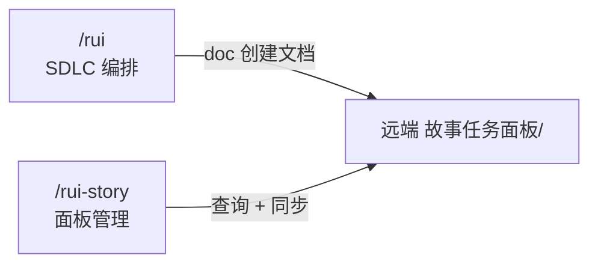
