# rui-story

> 故事任务面板管理：查 · 同步。数据源为远端 API，默认远端模式，不读本地文件系统。
>
> **--help / -h**：执行 `node skills/rui-story/help.mjs` 输出完整帮助（含场景示例）。用户输入 `/rui-story --help` 或 `/rui-story -h` 或 `/rui-story help` 时，跳过管线逻辑，直接运行脚本并将输出展示给用户。
>
> 哲学源自 [CLAUDE.md](../../CLAUDE.md)。本文件定义命令面与操作规约。

## 命令族全景

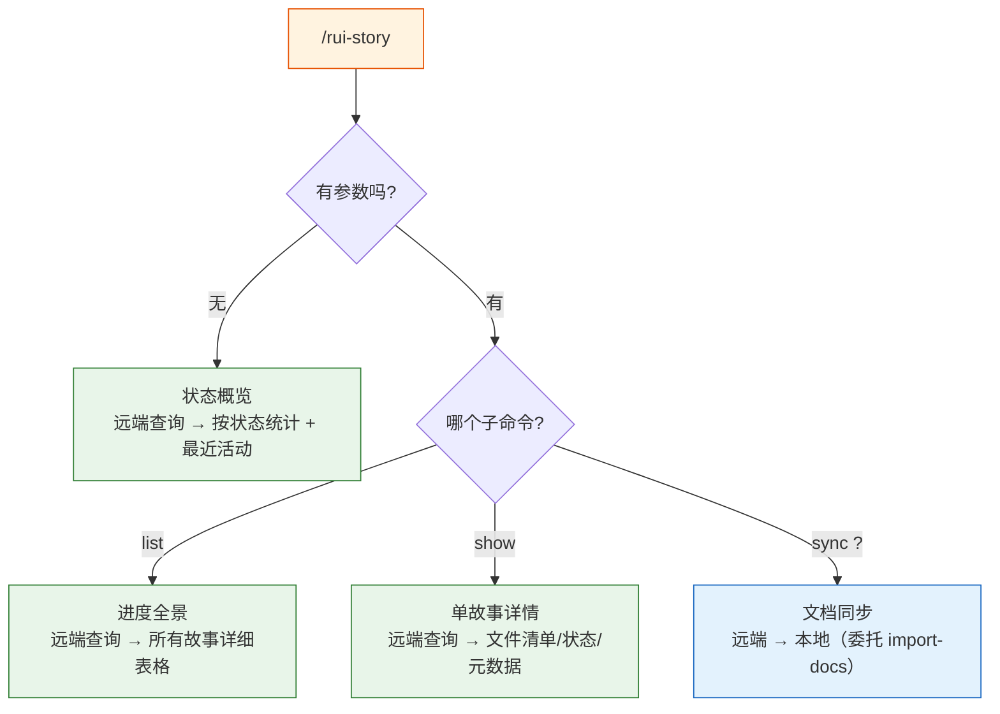

| 命令 | 类型 | 数据源 | 作用 |
|------|------|--------|------|
| `/rui-story` | 只读 | 远端 API | 状态概览：按状态统计 + 最近活动 |
| `/rui-story list` | 只读 | 远端 API | 进度全景：所有故事详细表格（状态/文件数/最后修改/分支） |
| `/rui-story show <name>` | 只读 | 远端 API | 单故事详情：文件清单/状态/元数据 |
| `/rui-story sync [<name>]` | 写入 | 远端 API | 从远端拉取文档到本地；未指定名称时展示推荐提示 |

`<name>` 为 kebab-case（如 `user-login`）。

## 数据源

> **默认且唯一模式：远端 API**。所有查询操作（概览/list/show）直接查询远端 API，不读本地文件系统。
> 仅 `sync` 命令涉及本地写入（从远端拉取到本地），其余命令零本地文件系统访问。

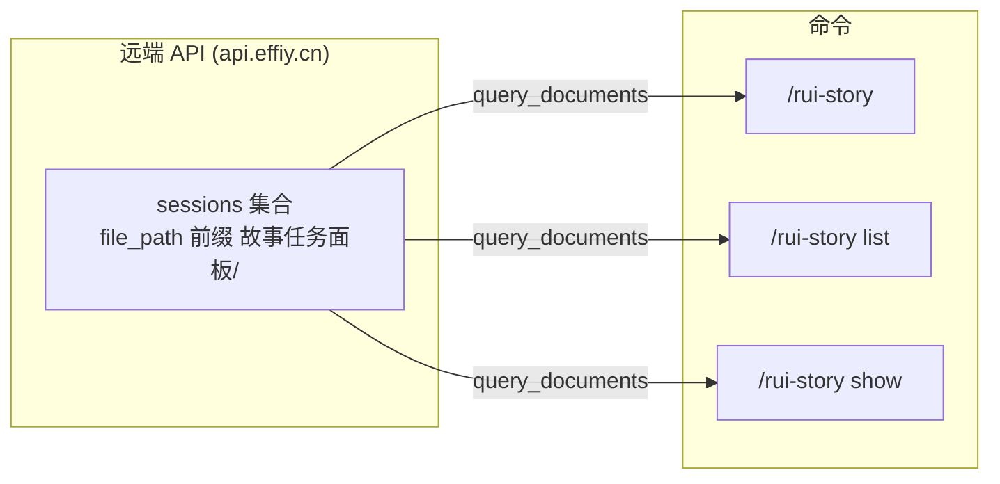

**API 调用方式**：
```
POST <apiUrl>/
{
  "module_name": "services.database.data_service",
  "method_name": "query_documents",
  "parameters": { "cname": "sessions", "limit": 10000 }
}
```

从响应的 `data.list` 中筛选 `file_path` 以 `故事任务面板/` 开头的记录。每条记录包含 `file_path`、`title`、`tags`、`createdAt`、`updatedAt` 等字段。

## 操作边界

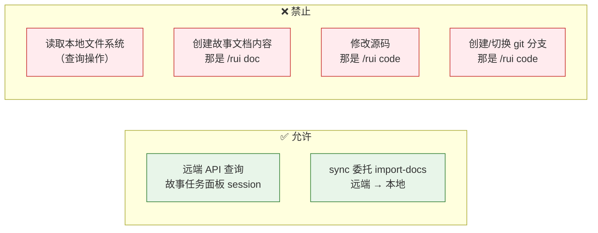

## 状态判定

> 按远端 sessions 的 `file_path` 存在性 + `.memory/rui-state.json`（仅 blocked 标记查本地）判定故事状态。

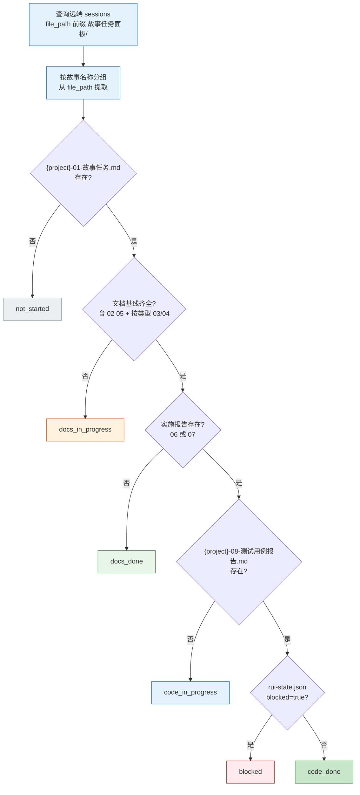

| 状态 | 条件 | 含义 |
|------|------|------|
| `not_started` | {project}-01-故事任务.md 不存在于远端 | 目录空或仅有元数据 |
| `docs_in_progress` | 01 存在于远端，文档基线不完整 | 文档生成进行中 |
| `docs_done` | 远端文档基线齐全，实施报告不存在 | 等待编码 |
| `code_in_progress` | 06 或 07 存在于远端，08 不存在 | 实现验证中 |
| `code_done` | 08 存在于远端，未阻断 | 可交付 |
| `blocked` | `.memory/rui-state.json` 含 `blocked=true`（本地例外） | 管线阻断 |

项目类型按远端文件推断：有 03/06 = 含后端；有 04/07 = 含前端；两者均有 = fullstack；均无 = meta。

## `/rui-story` — 状态概览

> 无参数入口。查询远端 API，按状态聚合，输出摘要 + 最近活动。零本地文件系统读取。

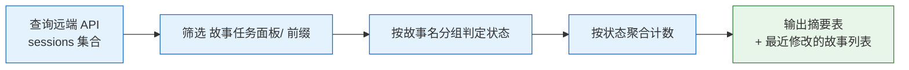

**输出**：

```
故事任务面板 · 状态概览
─────────────────────────────
  code_done        0
  code_in_progress  0
  docs_done         0
  docs_in_progress  0
  not_started       0
  blocked           0
─────────────────────────────
  合计             0 个故事

最近活动：无
```

## `/rui-story list` — 进度全景

> 查询远端 API 获取全部故事面板 session，输出详情表格。零本地文件系统读取。

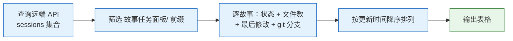

**输出列**：`Story | Status | Files | Last Modified | Type | Branch`

- **Files**：远端该故事下的 session 数量
- **Last Modified**：远端 sessions 中最晚 `updatedAt`
- **Type**：按远端文件推断（backend / frontend / fullstack / meta）
- **Branch**：`git branch --list "feat/<name>"` — 有则显示分支名，无则为 `—`

## `/rui-story show <name>` — 单故事详情

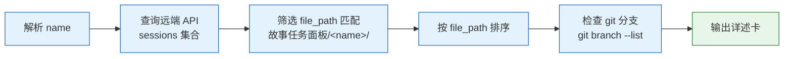

**输出结构**：

```
<name> · <status badge>

📂 远端路径: 故事任务面板/<name>/
📋 类型: <type>
📄 文件: <N> 个

  文件清单:
  YrY-01-故事任务.md         2026-05-17 10:30
  YrY-02-用户使用场景.md      2026-05-17 10:35
  ...

🔀 Git 分支: feat/<name>  (或 —)

📊 元数据:
  状态: <status>
  阻断原因: <block_reason 或 —>
```

## `/rui-story sync [<name>]` — 从远端同步文档

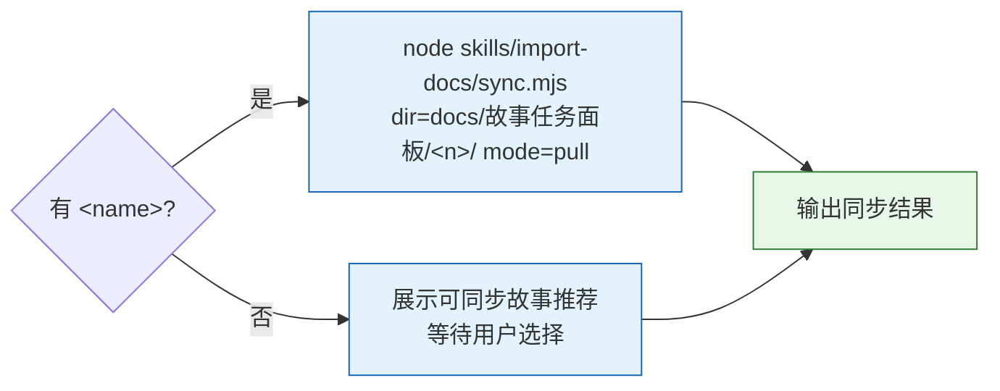

- 方向：从远端同步文档到本地，完全委托 import-docs（`mode=pull`），不自行实现同步逻辑
- 指定故事：`dir=docs/故事任务面板/<name>/ mode=pull` → 远端下载覆盖本地
- 未指定：展示可同步故事推荐提示，等待用户选择后再同步

## 核心规则

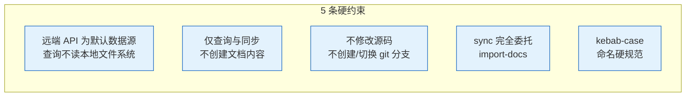

| # | 规则 | 违反处置 |
|---|------|---------|
| 1 | 所有查询操作使用远端 API，不读本地文件系统（sync 写入除外） | 修正为远端查询 |
| 2 | 仅查询故事面板状态和同步文档，不创建故事文档内容（那是 `/rui doc`） | 撤销误创建的文件 |
| 3 | 不修改源码，不创建/切换 git 分支（那是 `/rui code`） | — |
| 4 | sync 完全委托 import-docs，不自行实现同步 | 修正命令重试 |
| 5 | `<name>` = kebab-case | 拒绝执行 |

## 生效标志

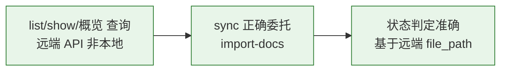

| 标志 | 未达标的处置 |
|------|------------|
| list/show/概览查询远端 API，非本地文件系统 | 修正为远端查询 |
| sync 正确委托 import-docs | 修正命令参数重试 |
| 状态判定基于远端 file_path 准确 | 修正判定逻辑 |

## 与 rui 的关系

> rui-story 从 rui 接管了 `list` 命令。其余所有管线阶段（doc / code / update）仍由 rui 编排。

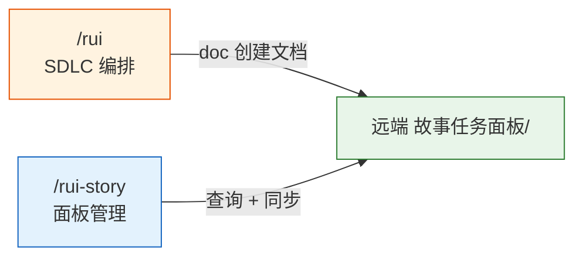
