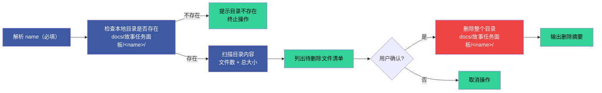

# /rui-story remove — 删除故事本地目录

> **仅操作本地文件系统。`<name>` 必填。**
>
> 删除 `docs/故事任务面板/<name>/` 整个目录及其所有内容。不查询远端 API、不删除远端文档、不触发任何网络请求。
> **破坏性操作，执行前需确认。远端数据不受 remove 任何影响。**



**执行流程**：

1. **解析 name（必填）** — `<name>` 为纯语义 kebab-case，不加项目名前缀。无 name 时提示用法后终止
2. **检查本地目录** — 确认 `docs/故事任务面板/<name>/` 存在。不存在则提示并终止，**不查询远端**
3. **扫描内容** — 统计目录内文件数、总大小，列出所有文件清单
4. **展示清单** — 列出待删除的全部文件（路径 + 大小）+ 目录本身
5. **等待确认** — 用户明确确认后才执行删除，不可跳过，不可默认 yes
6. **执行删除** — `rm -rf docs/故事任务面板/<name>/`，删除整个目录及所有内容
7. **输出摘要** — 已删除文件数、释放空间、删除的目录路径

**输出示例**：

```
🔍 检查 docs/故事任务面板/rui-story/...

待删除目录:
  docs/故事任务面板/rui-story/

目录内容 (5 个文件，约 87K):
  故事任务.md             (20.2K)
  场景-1-登录流程/index.md        (16.5K)
  场景-1-登录流程.html      (12.8K)
  知识图谱.json           (10.9K)
  知识图谱.html           (7.3K)

⚠️  即将删除整个目录及 5 个文件，释放约 87K。此操作不可撤销。确认？(y/n)

✅ 已删除 docs/故事任务面板/rui-story/，释放 87K。
💡 远端文档不受影响，可通过 /rui-story sync rui-story 重新拉取。
```
