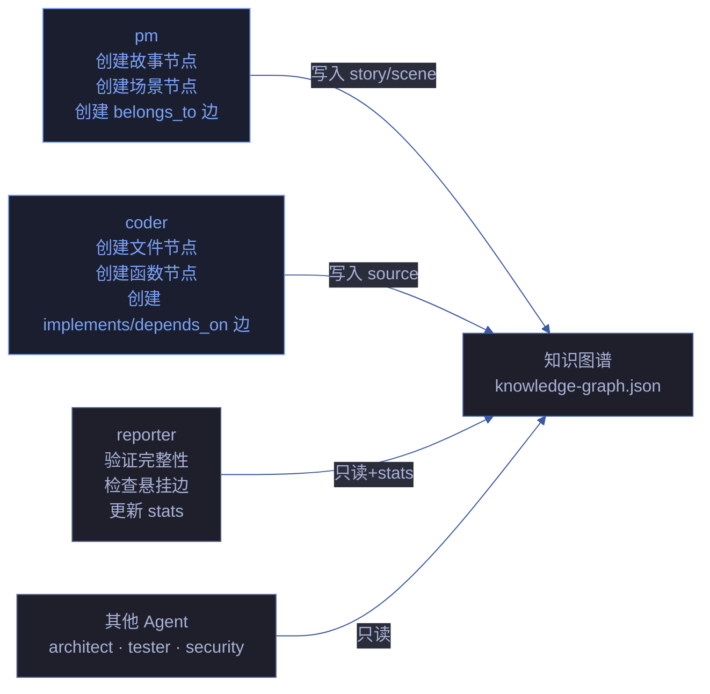

# knowledge-graph-ownership — 知识图谱所有权

> 解决知识图谱的三方耦合问题（pm 创建 · coder 更新 · reporter 验证）。单点写入，多点只读。

[所有权模型](#所有权模型) · [节点生命周期](#节点生命周期) · [边完整性](#边完整性) · [冲突解决](#冲突解决) · [阻断条件](#阻断条件) · [规则](#规则)

---

## 所有权模型

> 每个节点/边只有一个写入者。写入者负责完整性，读取者负责验证。



### 所有权矩阵

| 节点/边类型 | 写入者 | 创建时机 | 修改权限 | 只读者 |
|-----------|--------|---------|---------|--------|
| `story` 节点 | pm | 故事拆分完成 | 仅 pm 可修改故事级属性 | coder, reporter, 其他 |
| `scene` 节点 | pm | 场景拆分完成 | 仅 pm 可修改场景级属性 | coder, reporter, 其他 |
| `file` 节点 | coder | 逐模块实现时 | coder 创建，pm 不可写 | pm, reporter, 其他 |
| `function` 节点 | coder | 逐模块实现时 | coder 创建，pm 不可写 | pm, reporter, 其他 |
| `concept` 节点 | pm 或 coder | 需要抽象概念时 | 创建者可修改 | 其他 |
| `orchestrates` 边 | pm | 故事→场景关联时 | pm 创建 | coder, reporter |
| `delegates` 边 | pm | 委派任务时 | pm 创建 | coder, reporter |
| `implements` 边 | coder | 实现功能点时 | coder 创建，链接 file/function → step | pm, reporter |
| `depends_on` 边 | coder | 模块间有依赖时 | coder 创建 | pm, reporter |
| `imports` 边 | coder | 文件间有导入时 | coder 创建 | pm, reporter |
| `belongs_to` 边 | pm | 场景归属故事时 | pm 创建 | coder, reporter |
| `constrained_by` 边 | security | 安全约束注入时 | security 创建 | coder, reporter |
| `forbidden` 边 | reporter | 架构违规检测时 | reporter 创建（只读发现） | pm, coder |
| `stats` 对象 | reporter | 每次策展时 | reporter 更新统计 | pm, coder |

---

## 节点生命周期

### story 节点

```
pm 创建 → pm 补充 name/description → coder 补充 status → reporter 验证
```

| 阶段 | 操作者 | 动作 | 验证 |
|------|--------|------|------|
| 创建 | pm | `nodes.push({type:"story", id, name, status:"planned"})` | id 唯一 |
| 补充 | pm | 添加 description, goal, acceptance_criteria | 字段非空 |
| 关联 | coder | 添加 scenes 数组引用 | 每个 scene 存在 |
| 更新 | coder | 更新 status（planned → in_progress → completed） | status 值合法 |
| 验证 | reporter | 检查 story 节点的 scene 引用是否完整 | edges 中每个 scene 有 belongs_to 边 |

### scene 节点

```
pm 创建 → coder 关联文件 → tester 关联测试 → reporter 验证
```

| 阶段 | 操作者 | 动作 | 验证 |
|------|--------|------|------|
| 创建 | pm | `nodes.push({type:"scene", id:"scene:N", name})` | id 格式 `scene:N` |
| 补充 | pm | 添加 description, goal | 字段非空 |
| 关联文件 | coder | 添加 sourceFiles 引用 | 每个文件路径存在 |
| 关联测试 | tester | 添加 testFiles 引用 | 测试文件存在 |
| 验证 | reporter | 检查 scene 节点的文件引用完整性 | 无悬挂引用 |

### file / function 节点

```
coder 创建 → coder 添加 implements 边 → reporter 验证 FP 覆盖
```

| 阶段 | 操作者 | 动作 | 验证 |
|------|--------|------|------|
| 创建 | coder | `nodes.push({type:"source", id:"file:path", ...})` | id 格式 `file:<path>` |
| 关联 | coder | 添加 implements 边指向对应 step | 边 target 存在 |
| 更新 | coder | 修改 keyContent, summary, risk | 字段合法 |
| 验证 | reporter | 检查 FP# 覆盖率 | 100% 覆盖 |

**coder 在逐模块实现时必须同步更新**：每创建一个文件 → 添加 file 节点；每实现一个功能点 → 添加 function 节点 + implements 边指向对应 step。

---

## 边完整性

### 检查矩阵

| 检查项 | 执行者 | 时机 | 验证方式 | 严重度 |
|--------|--------|------|---------|:---:|
| 每个 FP# 有对应 node | reporter | Gate B 验证 | 故事任务.md §2 的 FP# 全量在 KG 中 | P0 |
| 每个 file/function 有 implements 边 | reporter | Gate B 验证 | edges 无悬挂 source/target | P0 |
| flow 完整（≥3 steps，weight 连续） | reporter | Gate B 验证 | flow.steps 检查 | P1 |
| 无悬挂边（source/target 全在 nodes 中） | reporter | 每次策展 | 遍历 edges 验证 | P0 |
| stats 与实际一致 | reporter | 每次策展 | nodeCount/edgeCount 对比 | P1 |
| 层次合规（无边违反层次间约束） | reporter | 每次策展 | 检查跨层反向边 | P1 |

### 验证命令

```bash
# 知识图谱完整性检查
node lib/arch-check.mjs --kg-validate <story-name>

# 输出示例
# ✅ FP# 全覆盖 (12/12)
# ✅ 无悬挂边
# ✅ flow 完整 (3/3 scenes)
# ⚠️ stats 不一致: nodeCount=45 vs 实际=47
```

---

## 冲突解决

### 写入冲突

| 冲突场景 | 检测方式 | 解决 |
|---------|---------|------|
| pm 和 coder 同时修改同一节点 | git diff 冲突 | 以所有权规则为准，非所有者回退 |
| 同一节点被多次创建 | id 重复检测 | 保留首次创建，丢弃重复 |
| reporter 试图修改节点 | 审计日志 | 阻断，`kg-multi-writer` |

### 所有权违规

| 违规 | 检测 | 示例 |
|------|------|------|
| coder 修改 story 节点 | git diff 检查 | coder 修改了 pm 创建的 story 节点的 description |
| pm 修改 file 节点 | git diff 检查 | pm 修改了 coder 创建的 file 节点的 keyContent |
| reporter 添加节点 | 审计日志 | reporter 自己补节点来通过验证 |

---

## 阻断条件

| 阻断标识 | 触发条件 | 严重度 | 处置 |
|---------|---------|:---:|------|
| `kg-no-node` | FP# 无对应 KG 节点 | P0 | 退回 coder 补节点 |
| `kg-no-edge` | file/function 节点无 implements 边 | P0 | 退回 coder 补边 |
| `kg-dangling` | edge 的 source 或 target 不在 nodes 中 | P0 | 退回 coder 修正 |
| `kg-broken-flow` | flow < 3 steps 或 weight 不连续 | P1 | 退回 pm 补 step |
| `kg-multi-writer` | 同一节点被多个 Agent 写入 | P0 | 阻断，确定唯一写入者 |
| `kg-stats-mismatch` | stats 与实际 node/edge 数量不一致 | P1 | reporter 更新 stats |
| `kg-layer-violation` | 边违反层次间约束（如 source → scene） | P0 | 修正边方向 |

---

## 规则

| # | 规则 | 反例 | 设计理由 |
|---|------|------|---------|
| 1 | 一个节点只有唯一写入者 | pm 和 coder 都修改同一个 story 节点 | 单点写入避免冲突 |
| 2 | coder 创建节点后立即添加 implements 边 | 创建 file 节点后不连 implements 边 | 确保图谱闭合 |
| 3 | reporter 只读验证，不修改 KG（stats 除外） | reporter 自己补节点来通过验证 | 验证与写入分离 |
| 4 | 策展前必须通过 KG 完整性检查 | git commit 时 KG 有悬挂边 | 不完整不提交 |
| 5 | FP# 覆盖率 100%，无遗漏 | 5 个 FP 只有 3 个有对应 node | 功能点全覆盖 |
| 6 | 所有权违规立即阻断，非所有者回退 | pm 修改了 coder 的 file 节点 | 所有权不可绕过 |
| 7 | stats 每次策展时更新，确保与实际一致 | stats 长期不更新 | 统计数据准确 |