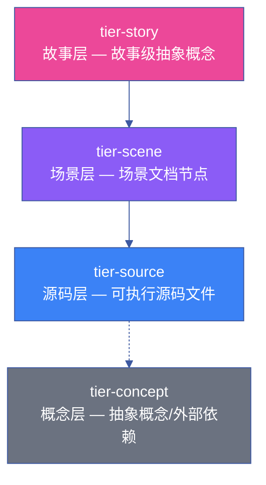

---
paths:
  - "docs/故事任务面板/**/知识图谱.json"
---

# knowledge-graph

> 每个故事目录一个 `知识图谱.json`（v2.0.0），描述该故事的业务领域、场景、源码节点及其关系。三层层次：story → scene → source。
>
> **Iron Law — 违反字母即是违反精神：**
> - 知识图谱节点与功能点一一对应。功能点无对应节点 = 图谱未闭合。
> - 表达优先：知识图谱.html 可视化优先于裸 JSON。

模板参考：[rui-npm/scenes/知识图谱.json](../../rui-npm/scenes/知识图谱.json)

[Schema](#schema) · [节点类型](#节点类型) · [边类型](#边类型) · [层次结构](#层次结构) · [场景关联](#场景关联) · [生成时机](#生成时机) · [所有权](#所有权) · [验证规则](#验证规则) · [查询模式](#查询模式) · [生效标志](#生效标志)

## Schema

```json
{
  "version": "2.0.0",
  "kind": "knowledge-graph",
  "project": { "name", "description", "analyzedAt", "version" },
  "story": { "name", "description", "scenarios": [...] },
  "scenes": { "<scene-key>": { "name", "description", "nodes": [...] } },
  "graph": { "nodes": [...], "edges": [...] },
  "layers": [{ "id", "name", "description", "nodeIds": [...] }],
  "architectureLayers": ["<层名>", ...],
  "layerTiers": { "tiers": [...], "layerToTier": {} },
  "stats": { "nodeCount", "edgeCount", "layerCount", "sceneCount", "storyCount" }
}
```

### 版本兼容

| 版本 | 变更 | 迁移 |
|------|------|------|
| 1.0.0 | 初始版本 | — |
| 2.0.0 | 新增 `scenes` 字段、`layerTiers`、`storyRef`、`scenarioRef` | 自动迁移脚本 |

## 节点类型

### 三层层次



### 节点类型表

| 类型 | Tier | 颜色 | 说明 | ID 格式 | 示例 |
|------|------|------|------|---------|------|
| `story` | story | `#EC4899` | 故事级抽象概念和治理原则 | `<story-name>/<concept>` | `user-login/auth-flow` |
| `scene` | scene | `#8B5CF6` | 场景文档节点，关联 场景-N-xxx.md | `scene:<N>` | `scene:1` |
| `source` | source | `#3B82F6` | 可执行源码文件节点 | `file:<relative-path>` | `file:src/auth/login.ts` |
| `source`(test) | source | `#3B82F6` | 测试文件节点 | `test:<relative-path>` | `test:src/auth/__tests__/login.test.ts` |
| `source`(config) | source | `#3B82F6` | 配置文件节点 | `config:<relative-path>` | `config:.env.example` |
| `source`(external) | source | `#3B82F6` | 外部依赖/API 节点 | `external:<name>` | `external:auth0` |
| `source`(concept) | concept | `#6B7280` | 抽象概念节点 | `concept:<name>` | `concept:oauth-flow` |

### 节点数据字段

| 字段 | 类型 | 必填 | 说明 | 示例 |
|------|------|:---:|------|------|
| `id` | string | ✓ | 唯一标识 | `file:src/auth/login.ts` |
| `type` | string | ✓ | `story` / `scene` / `source` | `source` |
| `label` | string | ✓ | 显示名称 | `login.ts` |
| `keyContent` | string | ✓ | 关键标识符（反引号包裹） | `` `verifyToken()` `` |
| `summary` | string | ✓ | 1-2 句摘要 | `JWT 令牌验证函数，处理登录态校验` |
| `risk` | string | — | `🔴` / `🟡` / `⚠️` / `null` | `🔴` |
| `tags` | string[] | ✓ | `[type, layer, keyword]` | `["source", "auth", "jwt"]` |
| `complexity` | string | ✓ | `simple` / `moderate` / `complex` | `moderate` |
| `description` | string | ✓ | ≥ 30 字符详细描述 | `处理用户登录请求，验证凭据...` |
| `layer` | string | ✓ | 所属架构层名称 | `auth` |
| `entryFile` | string | — | 入口文件路径 | `src/auth/login.ts` |
| `consumers` | string[] | — | 消费者列表 | `["src/api/routes.ts"]` |
| `storyRef` | object[] | — | 关联故事和功能点 | `[{story: "user-login", fp: "FP-1.2"}]` |
| `scenarioRef` | string[] | — | 关联场景 key | `["scene-1"]` |
| `mdFiles` | object[] | — | Markdown 文件引用 | `[{file: "场景-1/index.md", section: "§2"}]` |
| `relatedNodes` | string[] | — | 关联节点 ID | `["file:src/auth/jwt.ts"]` |

## 边类型

| 类型 | 颜色 | 含义 | 方向 | 示例 |
|------|------|------|------|------|
| `orchestrates` | `#1E40AF` | 编排调度（story → scene） | story → scene | pm orchestrates 场景-1 |
| `delegates` | `#166534` | 委派任务 | agent → agent | pm delegates → coder |
| `assigns` | `#854D0E` | 分配工作 | pm → coder | pm assigns FP-1.2 → coder |
| `hands_off` | `#9A3412` | 产出交接 | agent → agent | coder hands_off → tester |
| `feedback` | `#9D174D` | 反馈回路 | agent → agent | tester feedback → coder |
| `constrained_by` | `#7E22CE` | 规则约束 | source → rule | login.ts constrained_by security-guardrails |
| `depends_on` | `#64748B` | 依赖 | source → source | login.ts depends_on jwt.ts |
| `notifies` | `#0D9488` | 通知 | agent → external | reporter notifies → 企微 |
| `defines` | `#475569` | 定义 | source → concept | jwt.ts defines token-format |
| `governs` | `#B91C1C` | 治理约束 | rule → source | security-guardrails governs login.ts |
| `validates` | `#22C55E` | 验证 | tester → source | tester validates login.ts |
| `contains` | `#8B5CF6` | 包含定义 | scene → source | scene:1 contains login.ts |
| `references` | `#64748B` | 引用来源 | source → source | routes.ts references login.ts |
| `forbidden` | `#EF4444` | 架构违规 | source → source | utils.ts forbidden → pages/index.ts |
| `imports` | `#64748B` | 文件间导入 | source → source | login.ts imports jwt.ts |
| `shares` | `#0EA5E9` | 共享依赖 | source → source | login.ts shares constants.mjs |

### 边数据字段

| 字段 | 类型 | 必填 | 说明 | 示例 |
|------|------|:---:|------|------|
| `id` | string | ✓ | `e_<source>__<target>` | `e_file:src/auth/login.ts__file:src/auth/jwt.ts` |
| `source` / `target` | string | ✓ | 节点 ID | `file:src/auth/login.ts` |
| `type` | string | ✓ | 边类型（见上表） | `depends_on` |
| `label` | string | ✓ | 显示标签 | `依赖 JWT` |
| `description` | string | ✓ | ≥ 20 字符，描述关系语义、触发条件和影响范围 | `login.ts 调用 jwt.ts 的 verifyToken 进行令牌验证` |
| `direction` | string | ✓ | `forward` / `backward` / `bidirectional` | `forward` |
| `weight` | number | ✓ | 0.0–1.0 | `0.8` |
| `storyRef` | object[] | — | 关联故事和功能点 | `[{story: "user-login", fp: "FP-1.2"}]` |

## 层次结构

```json
{
  "layerTiers": {
    "tiers": [
      {"id": "tier-story", "name": "故事层", "order": 0},
      {"id": "tier-scene", "name": "场景层", "order": 1},
      {"id": "tier-source", "name": "源码层", "order": 2},
      {"id": "tier-concept", "name": "概念层", "order": 3}
    ],
    "layerToTier": {}
  }
}
```

### 层次间边约束

| 允许 | 禁止 |
|------|------|
| story → scene | scene → story |
| scene → source | source → scene |
| source → concept | concept → source |
| source → source（同层） | 跨层反向边 |

## 场景关联

每个场景通过 `story.scenarios[]` 关联到知识图谱节点：

```json
{
  "story": {
    "scenarios": [
      {
        "name": "场景1 · <场景名>",
        "description": "<场景流程描述>",
        "sourceFiles": [
          {
            "type": "skill|agent|rule|file|config|external|concept|test",
            "file": "<相对路径>",
            "keyContent": "`关键函数` `关键命令`",
            "description": "<此文件在本场景中的具体角色>",
            "risk": "🔴|🟡|⚠️|null"
          }
        ],
        "graphNodes": ["<node_id>"]
      }
    ]
  }
}
```

## 生成时机

| 阶段 | 动作 | Agent | 产出 |
|------|------|-------|------|
| 文档生成 | pm 分析需求 → 生成 story + scene 节点 + orchestrates 边 | pm | 知识图谱骨架 |
| 文档生成 | coder 识别源码文件 → 补充 source 节点 + imports/depends_on 边 | coder | 源码层节点 |
| 实现 | coder 逐模块编码 → 更新 source 节点 + 新增边 | coder | 实现节点更新 |
| 验证 | reporter 检查 stats 与实际一致 | reporter | 完整性校验 |

## 所有权

> 知识图谱所有权遵循 [knowledge-graph-ownership.md](./knowledge-graph-ownership.md)。单点写入，三方解耦。

| 角色 | 写入内容 | 写入时机 | 只读访问 |
|------|---------|---------|---------|
| pm | story + scene 节点、orchestrates/delegates 边 | doc 阶段 | 全部 |
| coder | source 节点、imports/depends_on/defines 边 | doc + code 阶段 | 全部 |
| reporter | stats 更新、一致性校验 | 验证阶段 | 全部 |

## 验证规则

### 结构完整性

| 检查项 | 验证方式 | 严重度 |
|--------|---------|:---:|
| 无悬挂边 | 每条 edge 的 source/target 在 nodes 中存在 | P0 |
| 功能点全覆盖 | 每个 FP# 在 graph.nodes 中有对应节点 | P0 |
| 场景全覆盖 | scenes keys ⊆ graph.nodes 中 type=scene 的节点 | P0 |
| stats 一致 | `stats.nodeCount` = graph.nodes 实际长度 | P1 |
| 层次合规 | 无边违反层次间边约束 | P1 |
| 场景文件存在 | 每个 scenario 的 `sourceFiles[].file` 路径可 Read 验证 | P1 |

### 验证命令

```bash
# 结构完整性检查
node lib/arch-check.mjs --kg-validate <story-name>

# 输出示例
# ✅ 无悬挂边
# ✅ FP# 全覆盖 (12/12)
# ✅ 场景全覆盖 (3/3)
# ⚠️ stats 不一致: nodeCount=45 vs 实际=47
```

## 查询模式

### 常用查询

| 查询意图 | 方法 | 示例 |
|---------|------|------|
| 某文件的所有依赖 | 从 source 节点出发，沿 depends_on/imports 边遍历 | `login.ts 依赖哪些文件？` |
| 某文件的所有消费者 | 从 source 节点出发，沿 depends_on/imports 边反向遍历 | `jwt.ts 被哪些文件依赖？` |
| 某场景的完整文件列表 | 从 scene 节点出发，沿 contains 边遍历 | `场景-1 涉及哪些文件？` |
| 架构违规列表 | 筛选 type=forbidden 的边 | `项目有哪些架构违规？` |
| 影响链分析 | 从变更节点出发，沿 depends_on 边 BFS 遍历 | `修改 jwt.ts 影响哪些文件？` |

## 生效标志

| 标志 | 验证方式 | 预期行为 |
|------|---------|---------|
| stats 与实际一致 | `stats.nodeCount` = graph.nodes 实际长度 | 数值精确匹配 |
| 每个场景有对应 scene 节点 | scenes keys ⊆ graph.nodes 中 type=scene 的节点 | 全包含 |
| 无悬挂边 | 每条 edge 的 source/target 在 nodes 中存在 | 零悬挂边 |
| 场景文件存在 | 每个 scenario 的 `sourceFiles[].file` 路径可 Read 验证 | 全部可访问 |
| 知识图谱.html 可渲染 | 浏览器打开 `知识图谱.html`，cytoscape.js 图正确显示 | 交互正常 |
| 功能点全覆盖 | 每个 FP# 在 graph.nodes 中有对应节点 | FP# 无遗漏 |