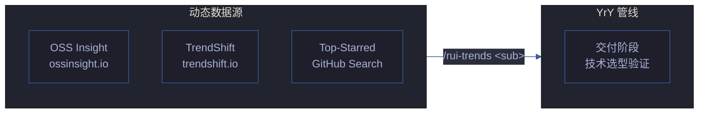
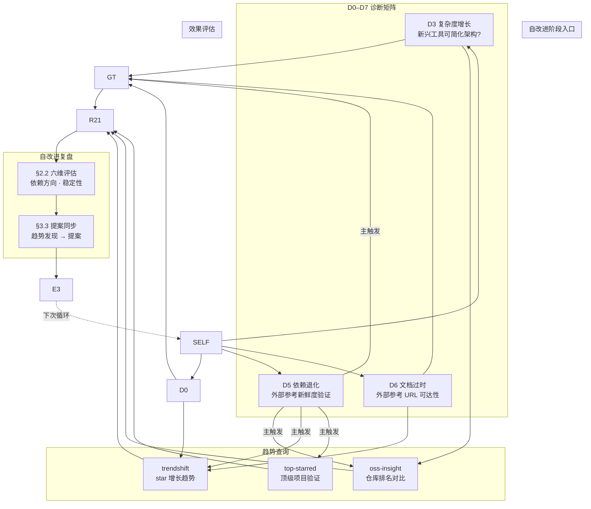
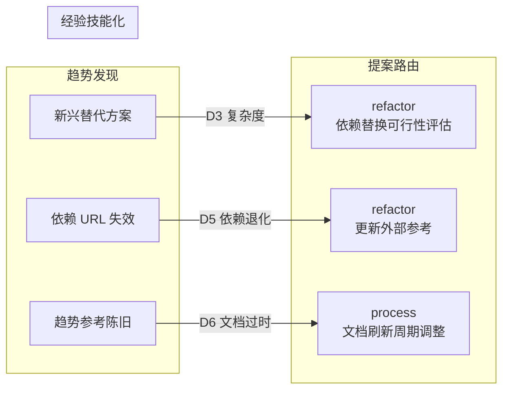
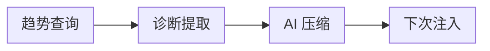
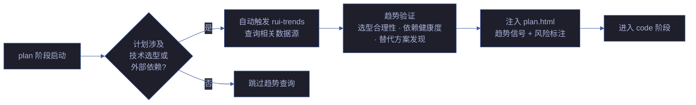

# rui-trends

> **--help / -h**：执行 `node skills/rui-trends/help.mjs` 输出完整帮助（含数据源全景 + 场景示例）。用户输入 `/rui-trends --help` 或 `/rui-trends -h` 或 `/rui-trends help` 时，跳过逻辑，直接运行脚本。

技术趋势发现。查询 GitHub Trending、OSS Insight、TrendShift、Top-Starred 四个数据源，输出结构化趋势报告。本技能为规约驱动（specification-only），由 implementing agent 执行 WebFetch + 结构化提取 + 格式化输出。

[数据源全景](#数据源全景) · [调用形态](#调用形态) · [各子命令工作流](#各子命令工作流) · [输出格式规约](#输出格式规约) · [自改进集成](#自改进集成) · [计划集成](#计划集成) · [降级策略](#降级策略) · [数据新鲜度](#数据新鲜度)

## 数据源全景



## 调用形态

| 输入 | 行为 | 场景 |
|------|------|------|
| `/rui-trends` 或 `/rui-trends status` | 状态检查：各数据源可达性 + 最近查询时间 | 探活 |
| `/rui-trends github-trending [--lang <L>] [--since daily\|weekly]` | 查询 GitHub Trending 当前榜单 | D5 诊断 · 新兴工具发现 |
| `/rui-trends oss-insight [--metric stars\|forks\|contributors] [--limit N]` | 查询 OSS Insight 仓库排名 | 技术选型数据支撑 |
| `/rui-trends trendshift [--range 7\|30\|90]` | 查询 TrendShift 趋势变化 | 识别快速上升项目 |
| `/rui-trends top-starred [--min-stars N]` | 查询 GitHub 高星项目 | 社区验证参照 |
| `/rui-trends all` | 依次查询全部四个数据源 | 全面趋势扫描 |

## 各子命令工作流

### github-trending

```
步骤 1: WebFetch https://github.com/trending(?since=daily|weekly&language=<L>)
步骤 2: 提取仓库名、描述、语言、今日/本周 star 数、总 star 数
步骤 3: 格式化为表格输出，标注趋势方向（↑ 上升 / ↓ 下降 / → 持平）
步骤 4: 附带来源 URL 和时间戳
```

### oss-insight

```
步骤 1: WebFetch https://ossinsight.io/ + 具体集合页面
步骤 2: 提取仓库排名、指标数据
步骤 3: 格式化为表格输出
步骤 4: 若页面为 JS 渲染无法提取，降级为引导用户直接访问
```

### trendshift

```
步骤 1: WebFetch https://trendshift.io/github-trending-repositories?trending-range=<N>
步骤 2: 提取趋势变化数据（star 增长量/率、排名变化）
步骤 3: 格式化为表格输出，标注快速上升/下降项目
步骤 4: 附带来源 URL
```

### top-starred

```
步骤 1: WebFetch https://github.com/search?q=stars:><N>&type=repositories&s=stars&o=desc
步骤 2: 提取仓库名、描述、语言、star 数
步骤 3: 格式化为表格输出
步骤 4: 附带来源 URL
```

## 输出格式规约

```markdown
## rui-trends 报告 — {YYYY-MM-DD HH:MM}

> 数据源：{source_name} | URL：{url} | 查询时间：{timestamp}

| 排名 | 仓库 | Stars | 语言 | 趋势 | 描述 |
|------|------|-------|------|------|------|
| 1 | owner/repo | ⭐ N.Nk | TypeScript | ↑ +500/d | Short description |

### 关键发现
- {finding 1}
- {finding 2}

### 与 YrY 的关联
- {relevance point}
```

## 自改进集成

> 本技能是自改进管线 D5 诊断的核心数据源，同时跨 D0/D3/D6 提供外部参照基线。趋势数据为实时快照，不替代基线文件判断——仅作为外部信号辅助诊断假设的证伪或支撑。
>
> 集成锚点：[rules/self-improve.md](../../rules/self-improve.md)（诊断规则 D0–D7 · 提案路由 · E1–E4）· [agents/self-improve.md](../../agents/self-improve.md)（数据源表 · 操作流程）

### 诊断覆盖全景



### 诊断 × 子命令映射

| 诊断 | 趋势信号 | 推荐子命令 | 假设示例 | 基线依据 |
|------|---------|-----------|---------|---------|
| **D0** 基线偏离 | 项目依赖的技术栈在社区趋势中持续下降 | `github-trending --lang <L>` + `trendshift --range 90` | "当前技术栈与社区方向背离，可能增加长期维护成本" | CLAUDE.md 技术选型约束 |
| **D3** 复杂度增长 | 存在更简洁的替代方案在快速崛起 | `github-trending` + `oss-insight` | "某新兴工具可替代当前 3 个依赖，降低架构复杂度" | agents/AGENT.md 深度模块原则 |
| **D5** 依赖退化 | 外部参考新鲜度验证 | `all`（四源全查） | "外部数据源有 2 个已变更域名" | rules/self-improve.md D5 规则 |
| **D6** 文档过时 | 连续窗口外部参考陈旧未更新 | `github-trending --since weekly` | "技术趋势参考连续 3 故事未刷新，可能遗漏关键变更" | CLAUDE.md 退化对策 L2 |

### 提案路由

> 趋势发现不直接生成提案——先写入诊断假设，由 self-improve Agent 综合其他数据源（执行记忆、Git diff、基线）判定是否触发提案。同一趋势信号连续 ≥2 故事触发 → 升级为规则。



| 趋势发现 | 诊断归属 | 提案类型 | 提案示例 | 升级条件 | 升级目标 |
|---------|---------|---------|---------|---------|---------|
| 核心技术栈在社区趋势下降 | D0 | `process` | "建议启动技术选型复审，评估替代方案" | 连续 2 故事触发 | `rules/code-pipeline.md` §技术选型 |
| 新兴工具可简化架构 | D3 | `refactor` | "评估 {tool} 替代 {current} 的可行性与风险" | 连续 2 故事触发 | 趋势参考新增对比条目 |
| 外部参考 URL 失效 | D5 | `refactor` | "更新失效链接，补充替代数据源" | 当前故事即修 | — |
| 趋势参考陈旧 | D6 | `process` | "建议每 N 故事自动刷新趋势参考" | 连续 2 故事触发 | `agents/self-improve.md` 数据源表 |

### §2.1 输出模板

> 以下模板由 rui-trends 查询结果填充，写入 `自改进复盘.md` §2.1 技术趋势验证。格式遵循 [F.story.retrospective](../../skills/rui/formulas.md) 的 §2 诊断章节约束。

```markdown
### §2.1 技术趋势验证

> 数据采集时间：{YYYY-MM-DD HH:MM} | 数据源：github-trending / oss-insight / trendshift / top-starred
> 查询命令：/rui-trends {sub} [{options}]

| 数据源 | 可达? | 关键发现 | 与当前技术栈关联 | 诊断触发 |
|--------|-------|---------|----------------|---------|
| GitHub Trending | ✅/❌ | {top 3 趋势关键词} | {关联分析} | D0/D3/D5/D6 / 无 |
| OSS Insight | ✅/❌ | {排名变化} | {关联分析} | D0/D3/D5/D6 / 无 |
| TrendShift | ✅/❌ | {上升最快项目} | {关联分析} | D0/D3/D5/D6 / 无 |
| Top-Starred | ✅/❌ | {高星项目概览} | {关联分析} | D0/D3/D5/D6 / 无 |

**诊断假设**：
- D5 依赖退化：{假设 + 置信度 + 基线依据}
- （若有 D0/D3/D6 触发，追加对应假设行）

**数据源原始报告**：
<details><summary>展开完整趋势报告</summary>

{rui-trends 原始输出}

</details>
```

### 触发条件全集

| 触发场景 | 触发方 | 子命令 | 数据用途 | 阻断? |
|---------|--------|--------|---------|-------|
| 自改进阶段 — D5 诊断 | self-improve Agent | `all` 或按诊断信号选择 | 填入 §2.1 诊断决策表 | 否（降级 `no-metrics`） |
| 自改进阶段 — D0 诊断 | self-improve Agent | `github-trending --lang <L>` + `trendshift --range 90` | 验证技术栈社区方向 | 否 |
| 自改进阶段 — D3 诊断 | self-improve Agent | `github-trending` + `oss-insight` | 评估架构简化机会 | 否 |
| 自改进阶段 — D6 诊断 | self-improve Agent | `github-trending --since weekly` | 验证外部参考新鲜度 | 否 |
| 交付阶段 — 技术选型验证 | pm / coder | `oss-insight` + `top-starred` | 选型依据附加到实施报告 | 否 |
| 按需 — 独立趋势探查 | 用户手动 | 任意子命令 | 探索性查询，不入自改进复盘 | 否 |
| 经验技能化 — 趋势刷新 | self-improve Agent | `all` | 连续 ≥2 故事触发后自动刷新趋势参考 | 否 |

### 记忆压缩与注入

> 趋势快照不缓存到本地文件（数据新鲜度约束），但**诊断结论**通过 self-improve 的记忆压缩管线持久化。



| 数据类型 | 压缩策略 | 保留窗口 | 注入触发 |
|---------|---------|---------|---------|
| 趋势原始数据 | **不落盘**，仅实时查询 | 0（会话级） | — |
| 诊断假设（§2.1） | 写入自改进复盘，跟随故事文档生命周期 | 故事文档保留期 | 同一技术栈再次出现在诊断中 |
| 趋势摘要 | AI 压缩为 ≤3 条关键发现 | 滚动 6 故事 | 技术选型或依赖替换决策时 |
| 趋势新鲜度标记 | 追加「最后验证」时间戳 | 每次 D5 诊断更新 | D5 诊断时检查距今是否 > 30 天 |

### 降级策略（自改进上下文）

> 在通用降级策略基础上，自改进阶段特有的降级处理。

| 情况 | 降级行为 | 对自改进的影响 |
|------|---------|--------------|
| 所有数据源不可达 | 输出 `> 待补充：趋势数据不可达`，标注 `no-metrics` | D5 诊断跳过，不计入退化窗口 |
| 部分数据源不可达 | 可用源正常输出，不可达源标注 `⚠️ 不可达` | D5 置信度降级，假设标记为 `低置信度` |
| 数据不足（仅 1 源可用） | 输出可用数据，标注 `数据不足，建议手动验证` | 跳过 E3 评估，仅生成观察记录 |
| 自改进阶段未触发 rui-trends | 不强制查询 | D5 诊断栏标注 `未查询趋势数据`，不视为偏差 |

## 计划集成

> rui-trends 的趋势信号在计划阶段提供技术选型验证、依赖健康度检查和架构决策支撑。计划生成前自动查询趋势数据，确保实施计划基于最新的技术现实。

### 计划阶段触发



### 计划趋势信号

| 趋势信号 | 数据源 | 计划注入位置 | 影响 |
|---------|--------|------------|------|
| 技术栈社区活跃度下降 | `github-trending --lang <L>` + `trendshift --range 90` | plan.html 风险表 | 标注「技术风险：社区趋势下降」 |
| 新兴替代方案快速崛起 | `github-trending` + `oss-insight` | plan.html 任务总览表 | 新增「技术选型评估」任务 |
| 依赖 URL 可达性验证 | `all`（四源全查） | plan.html 文件结构图 | 更新计划中的外部引用 URL |
| 高星项目提供参考实现 | `top-starred --min-stars N` | plan.html 任务总览表 | 补充「参考实现调研」子任务 |
| 趋势数据陈旧（超过 30 天未刷新） | 所有数据源 | plan.html 自审查清单 | 新增审查项「趋势参考已刷新」 |

### 计划 × 趋势路由表

| 计划场景 | 触发诊断 | 推荐子命令 | 计划产出影响 |
|---------|---------|-----------|------------|
| 新增第三方依赖 | D5 依赖退化 | `oss-insight` + `top-starred` | 依赖对比表 + 备选方案 |
| 架构重构（T3） | D3 复杂度增长 | `github-trending` + `trendshift` | 新兴架构模式参考 |
| 性能优化 | D3 复杂度增长 | `github-trending --lang <L>` | 高性能替代工具推荐 |
| 安全加固 | D5 依赖退化 | `github-trending --since weekly` | 安全补丁时效性标注 |
| 文档更新（T1/T2） | D6 文档过时 | `github-trending --since weekly` | 外部参考新鲜度标记 |

### 计划质量增强

> 趋势数据嵌入计划文档后，下游 Agent 在执行时可参考：

| Agent | 趋势数据用途 |
|-------|------------|
| coder | 实现时参考高星项目的设计模式和 API 设计 |
| tester | 测试框架选择时参考社区趋势 |
| security | 依赖安全审计时参考 CVE 数据库时效 |
| code-reviewer | 审查时检查是否存在社区公认的更优模式 |
| self-improve | 计划复盘时评估趋势信号预测准确性 |

## 降级策略

| 情况 | 降级行为 |
|------|---------|
| WebFetch 不可用（网络限制） | 输出 URL 引导用户手动访问，标注 `无网络访问` |
| 页面 JS 渲染无法提取 | 输出页面 title + meta description，标注 `内容为 JS 渲染，需手动访问` |
| API 限速 | 间隔 5s 重试，最多 2 次；仍失败则输出上次缓存 |
| 数据源完全不可达 | 输出 `数据源不可达，请稍后重试` |

## 数据新鲜度

趋势数据为实时动态内容，**不缓存到本地文件**。每次查询实时获取。如需持久化趋势快照，由调用方（自改进 Agent）决定是否写入 `自改进复盘.md`。
