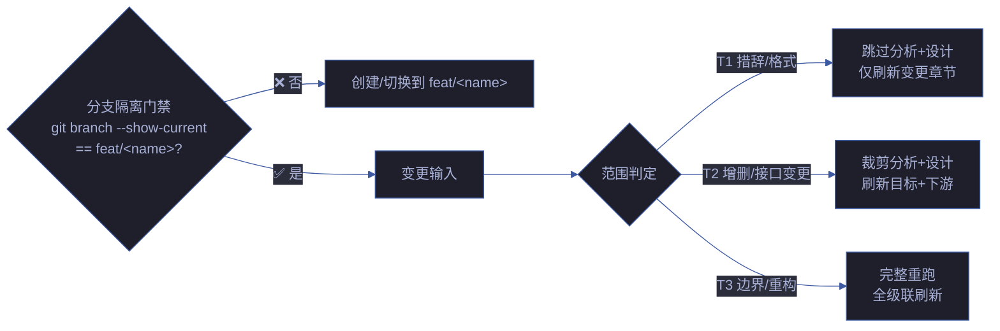

# rui-update

> 增量更新，按变更范围 T1/T2/T3 自动裁剪管线。`--no-code` 仅文档不改源码。
>
> **写入前先验证分支隔离。** 无论 T1/T2/T3，只要涉及 Edit/Write 就必须先在 `feat/<name>` 分支上。
>
> `/rui update <name> [ctx] [--no-code]`（通过 rui 编排器调用）或 `/rui-update <name> [ctx] [--no-code]`



| 级别 | 范围 | 影响分析 | 架构设计 | 文档刷新 |
|------|------|---------|---------|---------|
| T1 | 措辞修正/格式调整/注释补充 | 跳过 | 跳过 | 仅变更章节 |
| T2 | 增删故事/接口签名变更/新增依赖 | 裁剪（仅目标+下游） | 裁剪（仅变更模块） | 目标+下游 |
| T3 | 边界变更/跨故事重构/架构调整 | 完整重跑 | 完整重跑 | 全级联 |

## 核心规则

| # | 规则 |
|---|------|
| 1 | 写入前必须通过分支隔离门禁 |
| 2 | T1 不触发 Gate A/B（无代码变更） |
| 3 | T2/T3 涉及代码变更时必须走 Gate A → 逐模块 → Gate B |
| 4 | `--no-code` 限制为仅文档变更，不触发代码管线 |
| 5 | 更新后必须刷新版本号 + version_history |

## 执行流程

### T1 — 措辞修正/格式调整/注释补充

```
步骤 1: 分支隔离门禁 — node lib/branch-check.mjs
步骤 2: pm 定位变更章节（仅目标文档的受影响 section）
步骤 3: 就地修正措辞/格式/注释，不新增章节
步骤 4: 刷新 F.meta 版本行 + version_history
步骤 5: 跳过 Gate A/B（无代码变更），直接交付
```

| 约束 | 说明 |
|------|------|
| 不触发代码管线 | 无源码变更，不运行测试 |
| 不新增章节 | 仅修改已有章节内容 |
| 版本号必须刷新 | version_history 记录 T1 变更 |

### T2 — 增删故事/接口签名变更/新增依赖

```
步骤 1: 分支隔离门禁
步骤 2: pm 判定影响范围 → 裁剪影响分析（仅目标 + 直接下游）
步骤 3: pm 裁剪架构设计（仅变更模块）
步骤 4: coder 实现变更（走 Gate A → 逐模块 → Gate B）
步骤 5: 刷新目标文档 + 下游文档中的引用
步骤 6: 刷新版本号 + version_history
```

| 涉及代码 | 处置 |
|---------|------|
| 是 | 走完整 Gate A → 逐模块 P0 清零 → Gate B ≤ 2 轮 |
| 否（--no-code） | 仅文档变更，跳过代码管线 |

### T3 — 边界变更/跨故事重构/架构调整

```
步骤 1: 分支隔离门禁
步骤 2: pm 完整重跑影响分析（全项目范围）
步骤 3: pm 完整重跑架构设计
步骤 4: coder 全量实现（Gate A → 逐模块 → Gate B）
步骤 5: 全级联文档刷新（目标 + 全部下游）
步骤 6: 刷新版本号 + version_history，标注 T3 重构
```

| 约束 | 说明 |
|------|------|
| 不可跳过分析 | 边界变更影响范围不可裁剪 |
| 全级联刷新 | 所有引用该故事的文档均需同步 |

## 参数

| 参数 | 必需 | 说明 |
|------|------|------|
| `<name>` | 是 | 故事名（kebab-case） |
| `[ctx]` | 否 | 上下文描述，帮助定位变更范围 |
| `--no-code` | 否 | 仅文档不改源码 |

## 生效标志

| 标志 | 验证方式 |
|------|---------|
| 分支隔离通过 | `git branch --show-current` == `feat/<name>` |
| T1/T2/T3 范围判定正确 | 变更文件列表与判定级别一致 |
| 版本号已刷新 | version_history 有新条目 |
