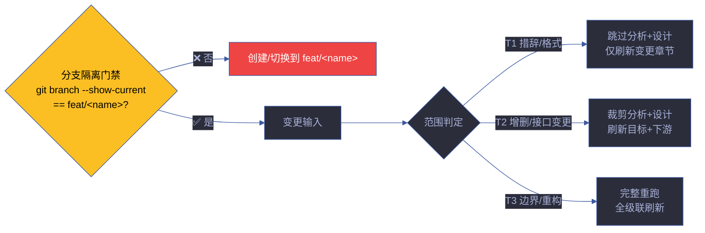

# rui-update

> 增量更新，按变更范围 T1/T2/T3 自动裁剪管线。`--no-code` 仅文档不改源码。
>
> **写入前先验证分支隔离。** 无论 T1/T2/T3，只要涉及 Edit/Write 就必须先在 `feat/<name>` 分支上。
>
> `/rui update <name> [ctx] [--no-code]`（通过 rui 编排器调用）或 `/rui-update <name> [ctx] [--no-code]`
>
> **单一职责**：已有故事的增量变更。按 T1/T2/T3 裁剪管线。不负责新建故事（[rui-doc](../rui-doc/)），不负责全量实现（[rui-code](../rui-code/)），不负责自改进闭环（[rui-yry](../rui-yry/)）。

[范围判定](#范围判定) · [T1 执行流程](#t1-执行流程) · [T2 执行流程](#t2-执行流程) · [T3 执行流程](#t3-执行流程) · [核心规则](#核心规则) · [降级策略](#降级策略) · [生效标志](#生效标志)

## 范围判定



### 判定矩阵

| 级别 | 范围 | 触发信号 | 影响分析 | 架构设计 | 文档刷新 | 代码管线 | 版本升级 |
|------|------|---------|:---:|:---:|:---:|:---:|:---:|
| **T1** | 措辞修正/格式调整/注释补充 | 仅 `.md` 变更，无逻辑变更 | 跳过 | 跳过 | 仅变更章节 | 跳过 | PATCH |
| **T2** | 增删故事/接口签名变更/新增依赖 | 新增/删除 export 或函数签名 | 裁剪（目标+下游） | 裁剪（变更模块） | 目标+下游 | Gate A→B | MINOR |
| **T3** | 边界变更/跨故事重构/架构调整 | 目录结构变更、跨故事影响 | 完整重跑 | 完整重跑 | 全级联 | Gate A→B | MAJOR |

### 自动判定逻辑

```
判定流程:
  1. 扫描变更文件列表
  2. 仅 .md 文件? → T1
  3. 新增/删除 export? → T2
  4. 变更涉及 > 3 个目录? → T3
  5. 跨故事引用变更? → T3
  6. 默认 → T2
```

## T1 执行流程

> 措辞修正/格式调整/注释补充 — 最轻量级更新。

```
步骤 1: 分支隔离门禁 — node lib/branch-check.mjs
步骤 2: pm 定位变更章节（仅目标文档的受影响 section）
步骤 3: 就地修正措辞/格式/注释，不新增章节
步骤 4: 刷新 F.meta 版本行 + version_history
步骤 5: 跳过 Gate A/B（无代码变更），直接交付
```

| 约束 | 说明 |
|------|------|
| 不触发代码管线 | 无源码变更，不运行测试 |
| 不新增章节 | 仅修改已有章节内容 |
| 版本号必须刷新 | version_history 记录 T1 变更 |
| 不修改 AC | 验收标准不可通过 T1 修改 |

### T1 典型场景

| 场景 | 示例 |
|------|------|
| 修正错别字 | "登入" → "登录" |
| 调整格式 | 修复表格对齐 |
| 补充注释 | 为复杂逻辑添加说明注释 |
| 更新元数据 | 修改日期、版本号 |

## T2 执行流程

> 增删故事/接口签名变更/新增依赖 — 中等更新。

```
步骤 1: 分支隔离门禁
步骤 2: pm 判定影响范围 → 裁剪影响分析（仅目标 + 直接下游）
步骤 3: pm 裁剪架构设计（仅变更模块）
步骤 4: coder 实现变更（走 Gate A → 逐模块 → Gate B）
步骤 5: 刷新目标文档 + 下游文档中的引用
步骤 6: 刷新版本号 + version_history，标注 T2
```

### 影响分析裁剪

| 范围 | 分析内容 |
|------|---------|
| 目标模块 | 完整影响链分析 |
| 直接下游（1 跳） | 接口兼容性检查 |
| 间接下游（2+ 跳） | 跳过（除非接口签名变更） |

### 涉及代码的处置

| 条件 | 处置 |
|------|------|
| 涉及代码变更 | 走完整 Gate A → 逐模块 P0 清零 → Gate B ≤ 2 轮 |
| 仅文档变更（`--no-code`） | 跳过代码管线，仅刷新文档 |

### T2 典型场景

| 场景 | 示例 |
|------|------|
| 新增功能点 | 新增 FP-2.3：支持手机号登录 |
| 接口签名变更 | `login(email)` → `login(email, options)` |
| 新增依赖 | 引入 `zod` 做输入校验 |
| 删除废弃功能 | 移除旧版 API 端点 |

## T3 执行流程

> 边界变更/跨故事重构/架构调整 — 最重量级更新。

```
步骤 1: 分支隔离门禁
步骤 2: pm 完整重跑影响分析（全项目范围）
步骤 3: pm 完整重跑架构设计
步骤 4: coder 全量实现（Gate A → 逐模块 → Gate B）
步骤 5: 全级联文档刷新（目标 + 全部下游）
步骤 6: 刷新版本号 + version_history，标注 T3 重构
```

| 约束 | 说明 |
|------|------|
| 不可跳过分析 | 边界变更影响范围不可裁剪 |
| 全级联刷新 | 所有引用该故事的文档均需同步 |
| 完整 Gate A/B | 不可跳过测试和验证 |
| 架构 ADR | 建议产出架构决策记录 |

### T3 典型场景

| 场景 | 示例 |
|------|------|
| 架构重构 | 从单体拆分为微服务 |
| 跨故事变更 | 认证机制从 JWT 改为 OAuth 2.0 |
| 目录结构重组 | `src/` → `packages/` monorepo |
| 破坏性 API 变更 | 删除公开 API，变更 Agent 契约 |

## 核心规则

| # | 规则 | 设计理由 |
|---|------|---------|
| 1 | 写入前必须通过分支隔离门禁 | 分支隔离不可绕过 |
| 2 | T1 不触发 Gate A/B（无代码变更） | 最小化流程开销 |
| 3 | T2/T3 涉及代码变更时必须走 Gate A → 逐模块 → Gate B | 质量门禁一致 |
| 4 | `--no-code` 限制为仅文档变更，不触发代码管线 | 明确意图 |
| 5 | 更新后必须刷新版本号 + version_history | 变更可追溯 |
| 6 | T1 不可修改 AC（验收标准） | AC 变更需走完整流程 |
| 7 | T3 建议产出 ADR | 重大决策需记录 |

## 参数

| 参数 | 必需 | 说明 |
|------|------|------|
| `<name>` | 是 | 故事名（kebab-case） |
| `[ctx]` | 否 | 上下文描述，帮助定位变更范围 |
| `--no-code` | 否 | 仅文档不改源码 |
| `--level T1\|T2\|T3` | 否 | 手动指定更新级别（覆盖自动判定） |

## 降级策略

| 情况 | 降级行为 | 恢复方式 |
|------|---------|---------|
| 故事目录不存在 | 提示目录不存在，终止 | 先执行 `/rui doc` |
| 分支隔离失败 | 创建/切换到 `feat/<name>` | 重试 |
| 自动判定不准确 | 使用 `--level` 手动指定 | 人工判定 |
| 影响分析无法裁剪 | 升级为 T3 完整重跑 | 接受完整流程 |
| 版本冲突 | 提示冲突，终止 | 手动解决冲突后重试 |

## 测试

> 增量更新的 T1/T2/T3 范围判定、管线裁剪、版本刷新和边界场景的自动化验证。

### 运行测试

```bash
npx vitest run skills/rui-update/tests/          # 全量运行
npx vitest skills/rui-update/tests/              # 监听模式
npx vitest run --coverage skills/rui-update/tests/  # 覆盖率报告
```

### 测试文件

| 文件 | 测试范围 | 类型 |
|------|---------|:---:|
| `tests/rui-update.test.mjs` | T1/T2/T3 判定、管线裁剪、版本刷新、边界场景 | 单元 |

### 测试策略

| 层级 | 范围 | 要求 |
|------|------|------|
| **范围判定测试** | T1/T2/T3 自动判定逻辑 | 每种变更模式有测试 |
| **管线裁剪测试** | T1 跳过代码管线、T2 裁剪分析、T3 完整重跑 | 三级管线各有测试 |
| **边界场景测试** | 仅修改注释、新增可选参数、删除公开 API、目录调整 | 8 种边界场景全覆盖 |
| **版本刷新测试** | version_history 追加、版本号递增 | 版本管理合规 |

### 覆盖要求

| 维度 | 最低阈值 | 目标 |
|------|:---:|:---:|
| T 级判定 | 100% | 自动判定 6 条规则各有测试 |
| T1/T2/T3 流程 | 100% | 三级管线各有测试 |
| 边界场景 | 100% | 8 种边界场景各有测试 |
| 核心规则 | 100% | 7 条规则各有验证 |

## 规则

- [update-pipeline.md](./rules/update-pipeline.md) — 增量更新的 T1/T2/T3 范围判定和执行规则
## 生效标志

| 标志 | 验证方式 | 预期行为 |
|------|---------|---------|
| 分支隔离通过 | `git branch --show-current` == `feat/<name>` | 所有写入在 feat 分支 |
| T1/T2/T3 范围判定正确 | 变更文件列表与判定级别一致 | 无过度裁剪或过度重跑 |
| 版本号已刷新 | version_history 有新条目 | 版本号严格递增 |
| 文档变更已同步 | 下游文档引用已更新 | 无断裂引用 |
| 代码变更已验证 | Gate B 通过（T2/T3） | 无 P0 残留 |

## 判定决策树

```
用户输入 /rui-update <name> [ctx] [--no-code] [--level T1|T2|T3]
  │
  ├─ 仅 .md 变更? → T1
  │   └─ 仅刷新变更章节，不触发代码管线
  │
  ├─ 新增/删除 export? → T2
  │   ├─ 涉及代码变更 → Gate A → 逐模块 → Gate B
  │   └─ --no-code → 跳过代码管线
  │
  ├─ > 3 个目录变更? → T3
  │   └─ 完整重跑，全级联刷新
  │
  ├─ 跨故事引用变更? → T3
  │   └─ 完整重跑，全级联刷新
  │
  └─ 默认 → T2

--level 手动覆盖: 用户明确知道变更范围时可跳过自动判定
```

## 边界场景

| 场景 | 判定 | 处置 |
|------|:---:|------|
| 仅修改注释 | T1 | 跳过分析+设计，仅刷新变更章节 |
| 新增可选参数 | T2 | 裁剪分析，检查下游兼容性 |
| 删除公开 API | T3 | 完整重跑，全级联刷新 |
| 重命名文件 | T2 | 裁剪分析，更新所有引用 |
| 目录结构调整 | T3 | 完整重跑，全级联刷新 |
| 仅修改 .md 中的 AC | T2 | AC 变更不可通过 T1 修改 |
| 同时修改 .md + .mjs | T2 | 按最高级别判定 |
| 不确定变更范围 | T2 | 保守判定，可升级为 T3 |

## 自循环

> 增量更新健康检查。Agent 可按间隔检测是否有遗漏的更新需求。

| 属性 | 值 |
|------|-----|
| 推荐间隔 | `0 8 * * 1,4`（周一/周四早 8 点） |
| 触发条件 | 有故事文档 mtime 落后于相关源码 commit |
| 终止条件 | 所有故事文档与源码同步 |
| 迭代动作 | ① 扫描故事面板 → ② 对比文档 mtime vs 源码 commit → ③ 自动判定 T 级别 → ④ 生成更新建议 → ⑤ 推送通知（如有 T3 需求） |
| 告警条件 | 文档落后源码 > 7 天 / 检测到 T3 级别变更需求 |
| 收敛判定 | 所有文档 mtime ≥ 源码最后 commit 时间 |

> 本技能 `checkMode: "slash"`——无独立 CLI，由 `/rui-update` 在 Claude Code 会话内触发。6 字段契约与调度规则详见 [rules/loop-engineering.md](../rui/rules/loop-engineering.md)。

## 与 rui 的关系

`/rui-update` 是 rui 编排管线的增量变更入口。由 `/rui update <name>` 路由触发。按 T1/T2/T3 裁剪管线，T2/T3 涉及代码时走 rui-code 的 Gate A/B 门禁。

