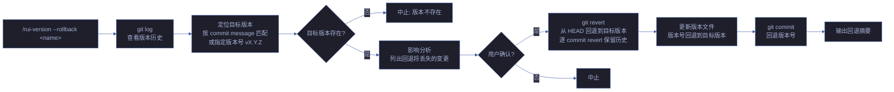
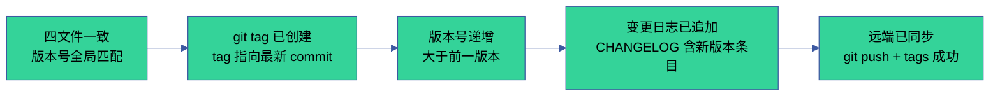
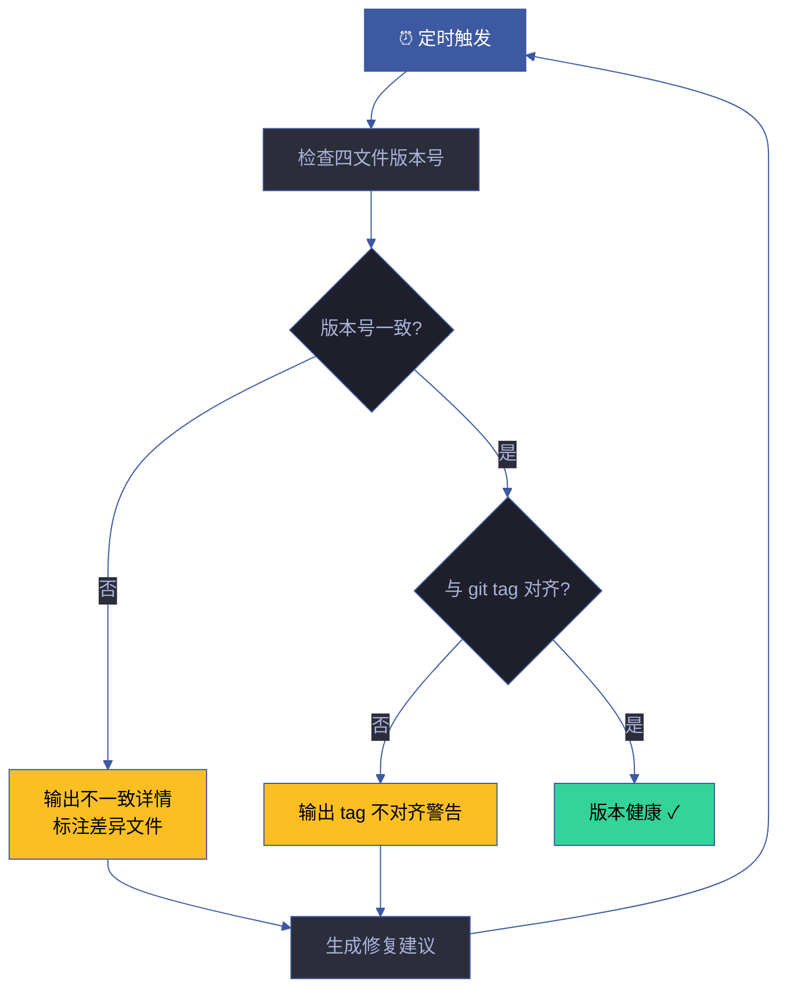
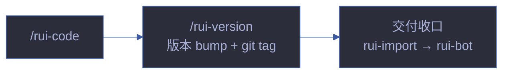

# rui-version

> 自主判定下一版本号，更新所有版本文件，git commit + auto-merge → main + push。
> **全自主操作，无需用户确认版本号。项目级和故事级统一入口。**
>
> `/rui version --up` 或 `/rui version --rollback <name>`（通过 rui 编排器调用）
> 或 `/rui-version --up` 或 `/rui-version --rollback <name>`
>
> **单一职责**：语义化版本号管理。判定版本号 → 同步版本文件 → git tag → 变更日志。不负责代码实现（[rui-code](../rui-code/)），不负责文档生成（[rui-doc](../rui-doc/)）。

[version --up](#version---up) · [版本判定方法论](#版本判定方法论) · [version --rollback](#version---rollback) · [版本文件同步](#版本文件同步) · [变更日志](#变更日志) · [冲突解决](#冲突解决) · [核心规则](#核心规则) · [生效标志](#生效标志) · [CI/CD 集成](#cicd-集成) · [自循环](#自循环)

## version --up

```mermaid
%%{init: {'theme': 'base', 'themeVariables': {
  'primaryColor': '#1e1f2b',
  'primaryTextColor': '#a9b1d6',
  'primaryBorderColor': '#3d59a1',
  'lineColor': '#3d59a1',
  'secondaryColor': '#2b2d3b',
  'tertiaryColor': '#21232f'
}}}%%
flowchart LR
    CMD["/rui-version --up"]:::src --> CHECK{"当前分支?"}
    CHECK -->|"非 main"| STASH["git stash → checkout main<br/>→ stash pop → 在 main 上操作"]:::op
    CHECK -->|"main"| CLEAN{"工作区干净?"}
    STASH --> CLEAN
    CLEAN -->|"否"| ABORT["中止: 有未提交变更"]:::abort
    CLEAN -->|"是"| ANALYZE["分析当前变更<br/>git diff HEAD~1 + 版本历史"]:::op
    ANALYZE --> DECIDE{"变更类型判定"}
    DECIDE -->|"PATCH"| PATCH["bump PATCH<br/>x.y.Z + 1"]:::op
    DECIDE -->|"MINOR"| MINOR["bump MINOR<br/>x.Y.0"]:::op
    DECIDE -->|"MAJOR"| MAJOR["bump MAJOR<br/>X.0.0"]:::op
    PATCH --> UPDATE["更新版本文件<br/>CLAUDE.md · README.md<br/>（插件项目额外同步 plugin.json）"]:::op
    MINOR --> UPDATE
    MAJOR --> UPDATE
    UPDATE --> CHANGELOG["生成变更日志<br/>从 git log 提取"]:::op
    CHANGELOG --> COMMIT["git commit<br/>含版本号 + 变更摘要"]:::op
    COMMIT --> TAG["git tag vX.Y.Z"]:::op
    TAG --> PUSH["git push origin main<br/>+ git push --tags"]:::op
    PUSH --> REPORT["输出升级摘要"]:::out
```



## 版本判定方法论

### SemVer 决策树

```
变更类型判定流程：
1. 扫描 git diff (HEAD~1..HEAD 或 staged changes)
2. 按以下规则分类变更：

   ┌─ 包含破坏性 API 变更? ───→ MAJOR (X.0.0)
   │  (删除/重命名公开接口、变更函数签名、修改 Agent 契约)
   │
   ├─ 包含新功能/新命令? ───→ MINOR (x.Y.0)
   │  (新增 skill/agent/rule/命令、新增公开函数、新增配置项)
   │
   └─ 仅修复/措辞/格式? ───→ PATCH (x.y.Z)
      (修复 bug、文档措辞调整、格式修正、内部重构)
```

### 变更信号矩阵

| 变更信号 | 版本升级 | 示例 | 检测方式 |
|---------|---------|------|---------|
| 仅文档措辞/格式调整 | PATCH | `1.30.0` → `1.30.1` | 仅 `.md` 文件变更 |
| 修复 bug（无接口变更） | PATCH | `1.30.0` → `1.30.1` | 仅 `.mjs` 内部逻辑变更 |
| 新增 skill/agent/rule | MINOR | `1.30.0` → `1.31.0` | 新增 `skills/rui-*/` 目录 |
| 新增命令/公开函数 | MINOR | `1.30.0` → `1.31.0` | 新增 export 或命令路由 |
| 新增配置项（向后兼容） | MINOR | `1.30.0` → `1.31.0` | 新增配置字段含默认值 |
| 删除/重命名命令或接口 | MAJOR | `1.30.0` → `2.0.0` | 删除 export 或命令路由 |
| 变更 Agent 契约/交接信号 | MAJOR | `1.30.0` → `2.0.0` | 变更 AGENT.md 或 handoff 规则 |
| 架构重构/破坏性变更 | MAJOR | `1.30.0` → `2.0.0` | 目录结构重大调整 |

### 边界情况处理

| 场景 | 处置 |
|------|------|
| 同时包含 PATCH 和 MINOR 变更 | 取最高级别 → MINOR |
| 同时包含 MINOR 和 MAJOR 变更 | 取最高级别 → MAJOR |
| 无法判定变更类型 | 保守策略 → PATCH，输出警告 |
| 首次发布（无 git history） | 从 `CLAUDE.md` 当前版本开始（插件项目从 `plugin.json`） |
| 预发布版本 | 追加 `-alpha.N` / `-beta.N` / `-rc.N` 后缀 |

### 预发布版本生命周期

```
alpha.N → beta.N → rc.N → 正式版
  │         │        │
  └─ 内部验证  └─ 有限灰度  └─ 全量预发布
```

| 阶段 | 标识 | 受众 | 门槛 | 下一阶段条件 |
|------|------|------|------|------------|
| **alpha** | `-alpha.N` | 开发团队 | Gate B ≥ 1 轮 | P0 清零 + 自测通过 |
| **beta** | `-beta.N` | 早期采用者 | Gate B 通过 | 0 阻断 + 反馈窗口 ≥ 3 天 |
| **rc** | `-rc.N` | 全量灰度 | 全量回归通过 | 0 新 issue ≥ 24h |
| **正式** | 无后缀 | 全部用户 | 架构 A/B 级 | rc 达标 |

### 版本号单调性保证

| 规则 | 验证方式 | 违反处置 |
|------|---------|---------|
| 严格递增 | semver 比较 `new > old` | 拒绝 |
| 不跳号 | `new = old + 1`（PATCH/MINOR）或 `(MAJOR+1).0.0` | 拒绝 |
| 版本文件一致 | `grep version` 交叉对比 CLAUDE.md + README.md（插件项目额外对比 plugin.json） | 以 CLAUDE.md 为准同步 |
| 与 git tag 对齐 | `git tag -l 'v*'` 含当前版本 | 缺失则补 tag |

## version --rollback



### 回退策略

| 回退深度 | 方法 | 风险 |
|---------|------|------|
| 1 个版本 | `git revert HEAD` | 低 |
| 2-5 个版本 | 逐 commit revert | 中，需检查冲突 |
| 5+ 个版本 | 建议重新发布而非回退 | 高，revert 冲突概率大 |

### 回退影响分析

回退前自动列出将丢失的变更：

```
回退 v1.31.0 → v1.30.0 影响分析:
├── 将丢失 3 个 commit:
│   ├── abc1234 feat: 新增 rui-foo 技能
│   ├── def5678 fix: 修复健康检查超时
│   └── ghi9012 docs: 更新 README
├── 将回退 4 个版本文件
└── 远端 tag v1.31.0 将保留（需手动删除）
```

## 版本文件同步

### 同步清单

| 文件 | 路径 | 字段 | 格式 | 适用条件 |
|------|------|------|------|---------|
| plugin.json | `.claude-plugin/plugin.json` | `.version` | `"X.Y.Z"` | 仅插件项目（YrY 纯规约形式无此文件） |
| marketplace.json | `.claude-plugin/marketplace.json` | `.metadata.version` + `.plugins[0].version` | `"X.Y.Z"` | 仅插件市场项目 |
| CLAUDE.md | `CLAUDE.md` | 项目画像表 `版本` 行 | `X.Y.Z` | 必同步 |
| README.md | `README.md` | 标题版本号 `<sub>vX.Y.Z</sub>` | `vX.Y.Z` | 必同步 |

> YrY 本身采用纯规约形式（无 `.claude-plugin/`），仅同步 CLAUDE.md + README.md。其他项目使用 YrY 作为框架时，若存在 `.claude-plugin/plugin.json` / `marketplace.json` 则一并同步。

### 同步验证

```bash
# 升级后自动执行一致性检查（YrY 纯规约形式仅检查 CLAUDE.md + README.md）
grep -E "version.*X\.Y\.Z" CLAUDE.md README.md
# 插件项目额外检查：
# grep -E "version.*X\.Y\.Z" .claude-plugin/plugin.json .claude-plugin/marketplace.json CLAUDE.md README.md
```

不一致时输出警告并列出差异文件。

## 变更日志

### 自动生成

从 git log 自动提取变更摘要：

```bash
git log --oneline --no-merges <previous_tag>..HEAD
```

### 日志格式

```markdown
## vX.Y.Z (YYYY-MM-DD)

### 新增
- feat: {描述} ({commit_short})

### 修复
- fix: {描述} ({commit_short})

### 文档
- docs: {描述} ({commit_short})

### 破坏性变更
- BREAKING: {描述} ({commit_short})
```

变更日志追加到 `cdn/CHANGELOG.md`。

## 冲突解决

### Git 冲突

| 冲突场景 | 解决方案 |
|---------|---------|
| stash pop 冲突 | 手动解决冲突后继续 |
| push 被拒绝（远端有新 commit） | `git pull --rebase` 后重新 push |
| tag 已存在 | 检查是否为同一 commit，是则跳过，否则报错 |
| 工作区不干净 | 中止，提示先提交或 stash |

### 版本号冲突

| 场景 | 处置 |
|------|------|
| 版本文件不一致 | 以 `CLAUDE.md` 为准，同步其余文件（插件项目以 `plugin.json` 为准） |
| 版本号低于当前 | 拒绝，版本号必须严格递增 |
| 版本号跳号 | 拒绝，必须连续递增 |

## 核心规则

| 约束 | 规则 | 验证方式 |
|------|------|---------|
| 不降级 | 新版本号必须 > 旧版本号 | semver 比较 |
| 版本文件同步 | CLAUDE.md / README.md 版本号一致（插件项目额外含 plugin.json / marketplace.json） | grep 交叉验证 |
| 不跳号 | 版本号严格递增，不允许跳过 | 对比 version_history |
| git 强制 | 必须产生 git commit + tag | `git log -1` + `git tag --list` |
| 仅 main | 在 main 分支上操作，推送目标为 origin/main | `git branch --show-current` |
| 工作区干净 | 执行前检查 `git status --porcelain`，有未提交变更时中止 | `git status --porcelain` |
| 回退需确认 | rollback 为破坏性操作，执行前必须用户确认 | 交互式确认提示 |
| 变更日志 | 每次升级自动追加 CHANGELOG | `cdn/CHANGELOG.md` 更新 |

## 测试

> 语义化版本管理的判定逻辑、四文件同步、git 操作和回退影响分析的自动化验证。

### 运行测试

```bash
npx vitest run skills/rui-version/tests/          # 全量运行
npx vitest skills/rui-version/tests/              # 监听模式
npx vitest run --coverage skills/rui-version/tests/  # 覆盖率报告
```

### 测试文件

| 文件 | 测试范围 | 类型 |
|------|---------|:---:|
| `tests/rui-version.test.mjs` | 版本判定、文件同步、变更日志、回退逻辑 | 单元 |

### 测试策略

| 层级 | 范围 | 要求 |
|------|------|------|
| **判定逻辑测试** | PATCH/MINOR/MAJOR 自动判定 | 每种变更信号有测试 |
| **同步测试** | 四文件版本号一致性检查 | 不一致检测和修复 |
| **边界测试** | 首次发布、预发布版本、无法判定类型 | 每种边界情况有测试 |
| **回退测试** | 影响分析、逐 commit revert、版本号回退 | 回退路径验证 |

### 覆盖要求

| 维度 | 最低阈值 | 目标 |
|------|:---:|:---:|
| 版本判定 | 100% | 8 种变更信号各有测试 |
| 四文件同步 | 100% | 每个文件版本字段验证 |
| 核心规则 | 100% | 8 条规则各有验证 |
| 边界情况 | 100% | 5 种边界场景各有测试 |

## 降级策略

| 情况 | 降级行为 | 恢复方式 |
|------|---------|---------|
| 工作区不干净 | 中止，提示先提交或 stash | 清理工作区后重试 |
| 不在 main 分支 | 自动 stash → checkout main → stash pop | 手动切到 main 后重试 |
| stash pop 冲突 | 中止，提示手动解决冲突 | 手动解决冲突后继续 |
| push 被拒绝 | `git pull --rebase` 后重新 push | 解决冲突后重推 |
| tag 已存在 | 同 commit 则跳过，否则报错 | 手动删除旧 tag 或跳过 |
| 版本文件不一致 | 以 `CLAUDE.md` 为准同步其余文件（插件项目以 `plugin.json` 为准） | 自动修复 |
| 版本号低于当前 | 拒绝，版本号必须严格递增 | 检查判定逻辑 |
| 无法判定变更类型 | 保守策略 → PATCH，输出警告 | 人工确认后可用 --level 覆盖 |

## 规则

- [version-policy.md](./rules/version-policy.md) — 语义化版本管理的规则和策略
## 生效标志



| 标志 | 验证方式 | 未达标的处置 |
|------|---------|------------|
| 四文件版本号一致 | `grep version` 四文件交叉对比 | 以 plugin.json 为准同步 |
| git tag 已创建 | `git tag --list 'v*'` 含新版本 | 手动 `git tag vX.Y.Z` |
| 版本号严格递增 | 对比 `version_history` 序列 | 检查判定逻辑，修正版本号 |
| 变更日志已追加 | `cdn/CHANGELOG.md` 含新版本 | 从 git log 重新生成 |
| 远端已同步 | `git ls-remote --tags origin` 含新 tag | `git push --tags` |

## CI/CD 集成

### Pre-commit 检查

```bash
# 在 commit 前验证版本一致性
node skills/rui-version/check-consistency.mjs
```

不一致时阻止 commit。

### 自动版本升级触发

```yaml
# 示例: GitHub Actions 工作流
on:
  push:
    branches: [main]
    paths:
      - 'skills/**'
      - 'lib/**'
      - '.claude-plugin/**'
```

### 发布流程

```
1. 功能分支合并到 main
2. 触发 /rui-version --up（自动判定版本号）
3. 四文件版本号同步
4. 变更日志自动生成
5. git commit + tag + push
6. 触发 CDN 部署（如有）
7. 企微通知发布成功
```

## 自循环

> 版本漂移检测。Agent 可按间隔检查全局版本一致性。

| 属性 | 值 |
|------|-----|
| 推荐间隔 | `0 9 * * 1`（每周一早 9 点） |
| 触发条件 | 有新的 git tag 或 commit 但 version_history 未更新 |
| 终止条件 | 四文件版本号一致且与 git tag 对齐 |
| 迭代动作 | ① 检查 plugin.json → ② 检查 CLAUDE.md → ③ 检查 README.md → ④ 检查 marketplace.json → ⑤ 对比版本号 → ⑥ 不一致时生成修复建议 |
| 告警条件 | 四文件版本号不一致 / 版本号与 git tag 不对齐 / 版本号出现跳号 |
| 收敛判定 | 全局版本号一致且无漂移 |

### 自循环工作流



> 本技能 `checkMode: "slash"`——无独立 CLI，由 `/rui-version` 在 Claude Code 会话内触发。6 字段契约与调度规则详见 [rules/loop-engineering.md](../rui/rules/loop-engineering.md)。

## 与 rui 的关系

`/rui-version` 是 rui 编排管线的版本管理收口。由 `/rui version --up` 路由触发，在交付阶段自动调用。管理项目级和故事级语义化版本号。

